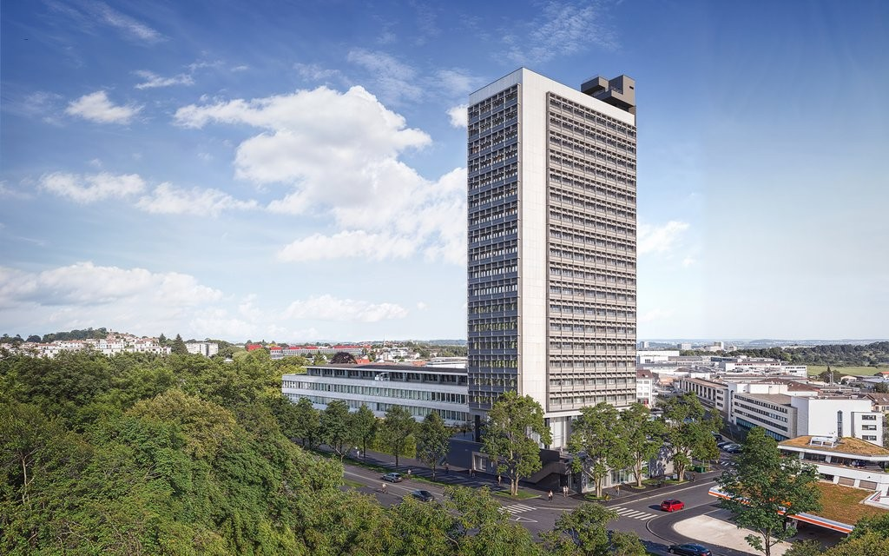
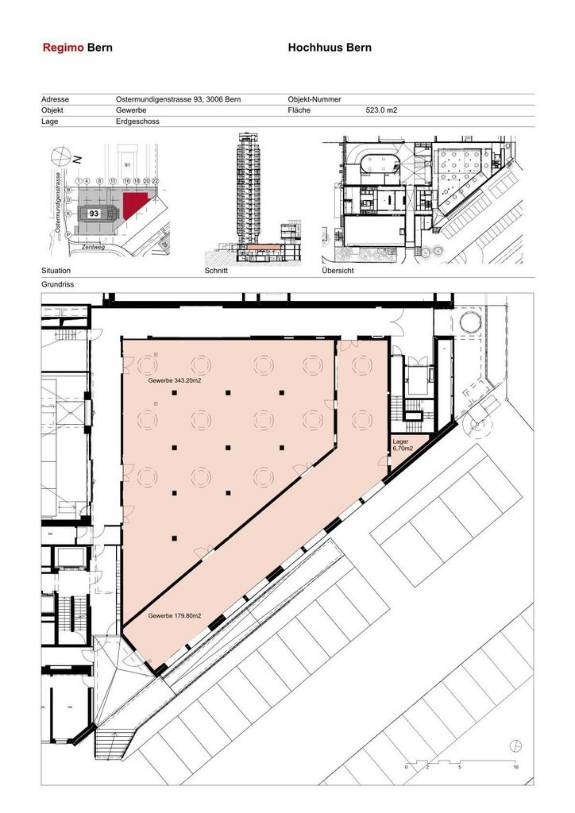

# Ostermundigenstr. 93a, 3006 Bern - auf Anfrage

> **Categorie:** `B_buero_gewerbe`  
> **Regiune:** Berna (oraș)  
> **Tip ofertă:** RENT / COMMERCIAL  
> **Relevant pentru praxis:** da (praxis)  
> **Sursă:** [flatfox.ch](https://flatfox.ch/de/wohnung/ostermundigenstr-93a-3006-bern/84896019/)  
> **Descărcat:** 2026-08-17 12:28

## Date obiect

| Câmp | Valoare |
|---|---|
| Adresă | Ostermundigenstr. 93a, 3006 Bern |
| Categorie obiect | INDUSTRY |
| Tip obiect | COMMERCIAL |
| Suprafață utilă | 522 m² |
| Etaj | 0 |
| Disponibil de la | agr |
| Referință | 26116.02.6002 |

## Texte originale (germană)

**Titlu public:** Ostermundigenstr. 93a, 3006 Bern - auf Anfrage

**Titlu scurt:** 522m² Gewerbe

**Pitch:** 522m² Gewerbe in Bern mieten

**Titlu descriere:** Hochhuus: Hier entsteht Raum für Erfolg

**Titlu chirie:** 522m² Gewerbe in Bern mieten

**Spațiu afișat:** 522

### Descriere completă

An der Ostermundigenstrasse 93a, am östlichen Stadteingang von Bern, erwartet Sie eine Gewerbefläche mit bester Erreichbarkeit. Der Bus hält direkt vor dem Gebäude, der Bahnhof Ostermundigen ist in wenigen Minuten zu Fuss erreichbar und auch die Autobahn liegt ganz in der Nähe. So gelangen Mitarbeitende, Kunden und Partner jederzeit bequem an Ihren Standort.   
  
Im Erdgeschoss des Hochhuus eröffnet sich Ihnen eine grosszügige Gewerbefläche von 522 m2, die den idealen Rahmen für Ihre Geschäftsidee bietet. Dank des Rohbau-Standards können Sie die Fläche frei nach Ihren Vorstellungen ausbauen und so ein Umfeld schaffen, das perfekt zu Ihrem Unternehmen passt.   
  
Das Angebot umfasst vielseitige Nutzungsmöglichkeiten, von modernen Büros über Praxis- und Dienstleistungsflächen bis zu Fitness oder innovativen Konzepten. Ergänzend können im 2. Untergeschoss Lagerflächen gemietet werden, die dank Warenlift und Anlieferungsrampe direkt erreichbar sind.   
**  
Gut fürs Geschäft: **   
\- flexible Nutzungsmöglichkeiten (Mieterausbau)   
\- auf Wunsch Abstellplatz für CHF 80.00 pro Monat   
  
**Ihre Vorteile mit Regimo Business:**   
1\. Individuelle Mietpreis- und Vertragsmodelle   
2\. Beratung und Unterstützung bei der Umbau- und Einrichtungsplanung durch ausgewiesene Spezialisten.   
3\. Persönliche Betreuung und hohe Flexibilität im Hinblick auf Mieterwünsche während der gesamten Vertragsdauer.   
  
Das Hochhuus ist ein architektonisches Wahrzeichen mit Geschichte. Es verleiht Ihrem Unternehmen eine repräsentative Adresse und verbindet Funktionalität mit Charakter. Mehr Informationen: [ **Hochhuus** ](https://navigator5.beyonity.ch/?id=2FE9C154&language=ch) .   
  
Haben wir Ihr Interesse geweckt? Dann zögern Sie nicht und kontaktieren Sie uns, um einen individuellen Besichtigungstermin zu vereinbaren.

## Dotări (attributes)

- accessiblewithwheelchair

## Ofertant

- **Nume:** Regimo Bern
- **Stradă:** Thunstrasse 32
- **NPA:** 3005
- **Localitate:** Bern

## Imagini (2)

*`01.jpg` — 1024x640 px — Visualisierung Gebäude*

*`02.jpg` — 724x1024 px — Grundrissplan*

## Media suplimentară

- **website_url:** http://www.hochhuus.ch
