# Bahnhofstrasse 4, 3073 Gümligen - CHF 240 exkl. NK pro m² / Jahr

> **Categorie:** `B_buero_gewerbe`  
> **Regiune:** Cantonul Berna  
> **Tip ofertă:** RENT / OFFICE  
> **Sursă:** [flatfox.ch](https://flatfox.ch/de/wohnung/bahnhofstrasse-4-3073-gumligen/85272860/)  
> **Descărcat:** 2026-08-17 12:38

## Date obiect

| Câmp | Valoare |
|---|---|
| Adresă | Bahnhofstrasse 4, 3073 Gümligen |
| Categorie obiect | INDUSTRY |
| Tip obiect | OFFICE |
| Chirie netă | CHF 240 |
| Preț afișat | CHF 240 |
| Suprafață utilă | 403 m² |
| Etaj | 3 |
| Disponibil de la | agr |

## Texte originale (germană)

**Titlu public:** Bahnhofstrasse 4, 3073 Gümligen - CHF 240 exkl. NK pro m² / Jahr

**Titlu scurt:** 403m² Büro

**Pitch:** 403m² Büro in Gümligen mieten

**Titlu descriere:** Helle Büro- und Arbeitsräume für höchste Ansprüche !

**Titlu chirie:** 403m² Büro in Gümligen mieten

**Spațiu afișat:** 403

### Descriere completă

Nach Vereinbarung vermieten wir diese sehr schönen Büroräume an bester Lage in Gümligen mit folgenden Vorzügen:  
  

*   Moderne helle Räumlichkeiten mit viel Gestaltungsmöglichkeiten
*   Raumlüftung mit Möglichkeit zur Klimatisierung
*   intelligente Beleuchtung bereits vorhanden
*   Verpflegungsmöglichkeiten im EG der Liegenschaft und in der direkten Umgebung
*   Gute Verkehrsinfrastruktur ÖV (S-Bahn / Bus / Tram => HB Bern 10 Min.)
*   Gute Verkehrsinfrastruktur motorisierter Individualverkehr (Autobahnauffahrt A6 => 5 Min.)
*   Parkmöglichkeiten nebst Einstellhalle in unmittelbarer Nähe vorhanden
*   Miete von Teilflächen möglich

Wir freuen uns auf Ihre Kontaktaufnahme und stehen für eine unverbindliche Präsentation und Beratung jederzeit sehr gerne zur Verfügung.

## Dotări (attributes)

- lift
- garage
- parkingspace
- accessiblewithwheelchair

## Ofertant

- **Nume:** Elron Immobilien AG
- **Stradă:** Worbstrasse 46
- **NPA:** 3074
- **Localitate:** Muri b. Bern

## Imagini (12)

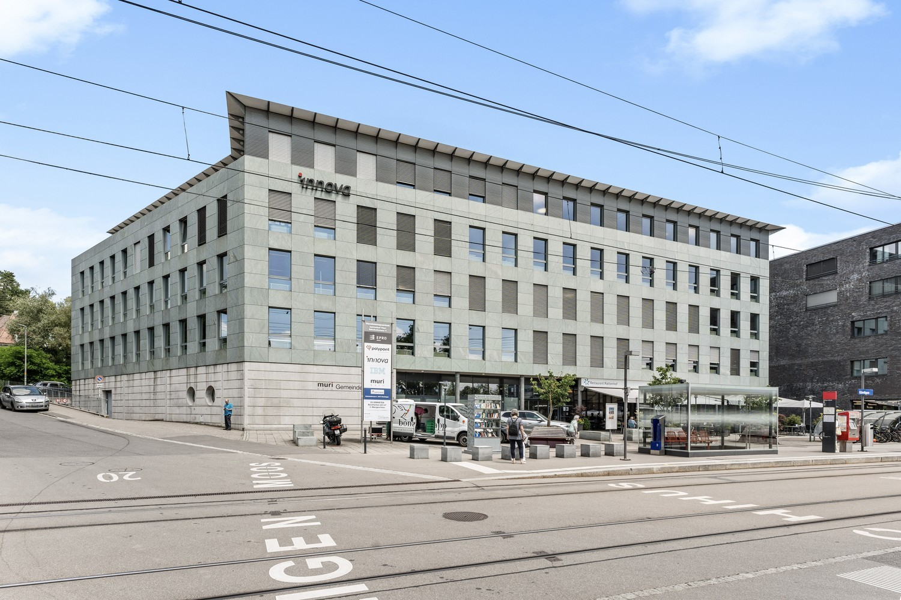
*`01.jpg` — 1500x1000 px*

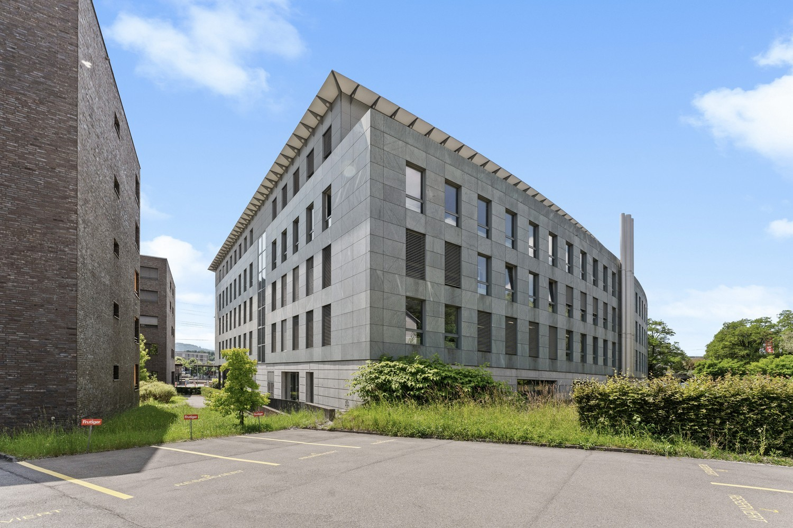
*`02.jpg` — 1500x1000 px*

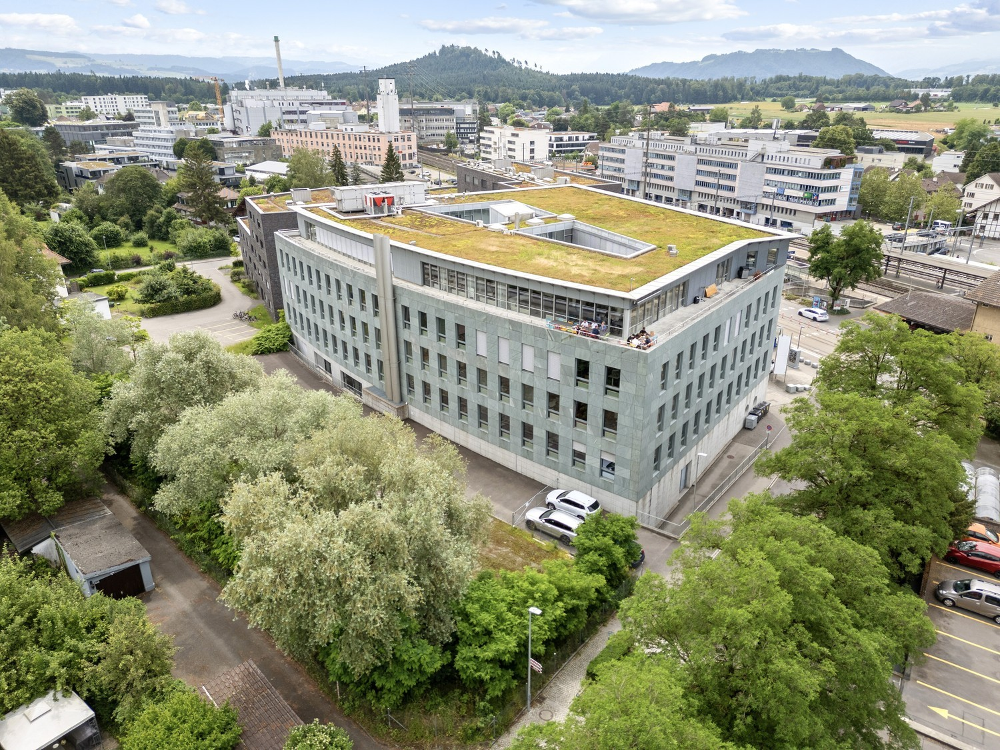
*`03.jpg` — 1500x1125 px*

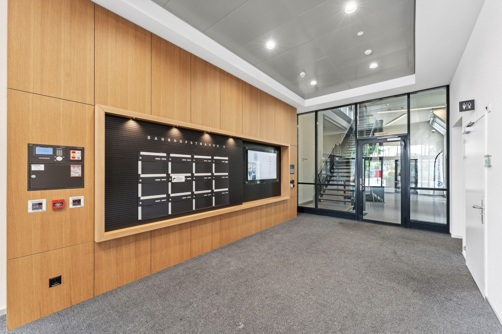
*`04.jpg` — 1500x1000 px*

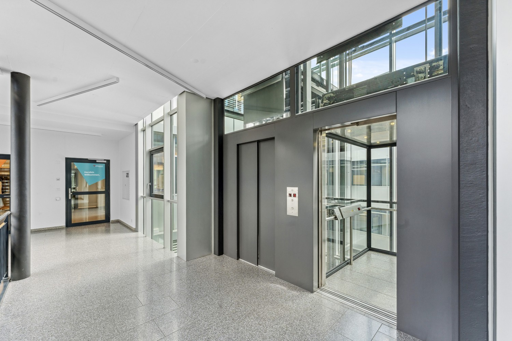
*`05.jpg` — 1500x1000 px*

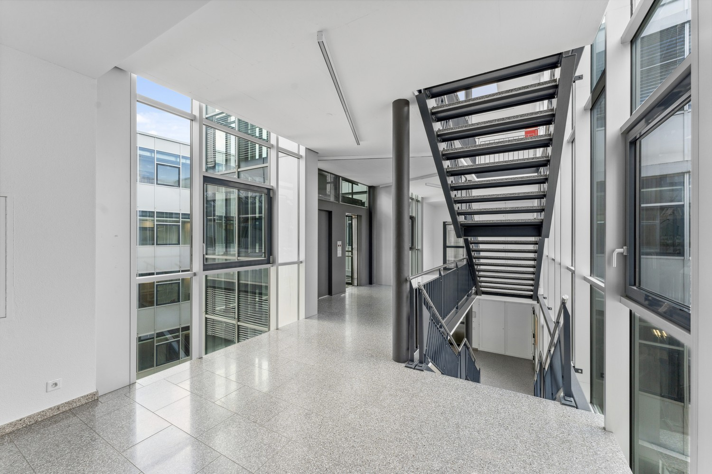
*`06.jpg` — 1500x1000 px*

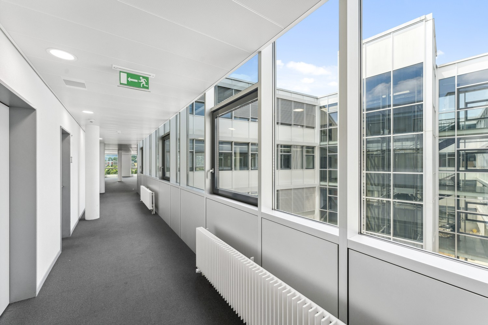
*`07.jpg` — 1500x1000 px*

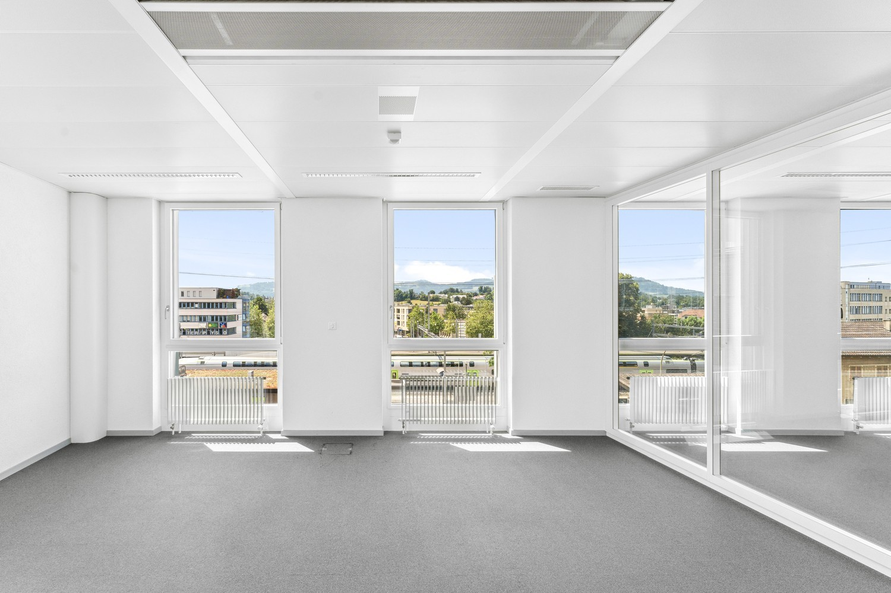
*`08.jpg` — 1500x1000 px*

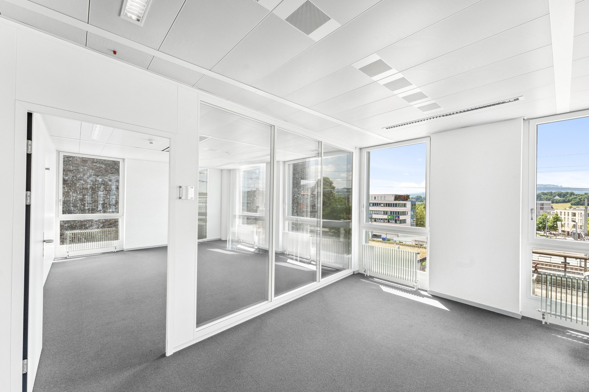
*`09.jpg` — 1500x1000 px*

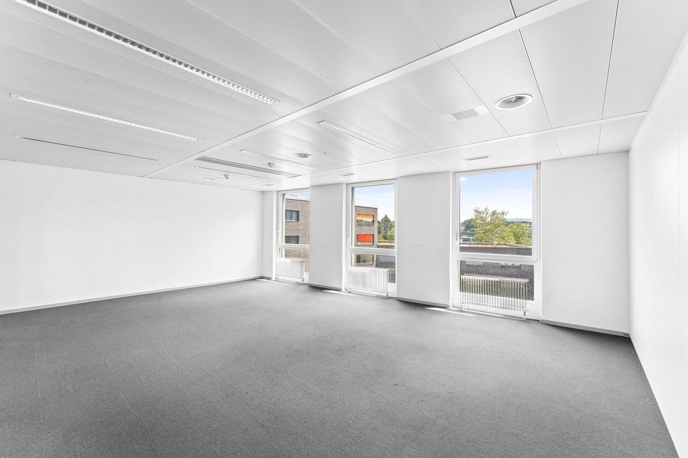
*`10.jpg` — 1500x1000 px*

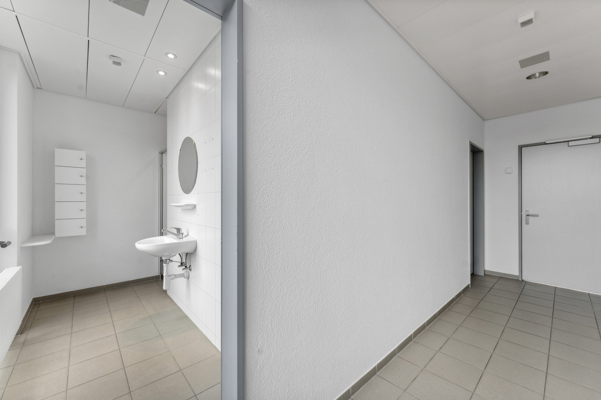
*`11.jpg` — 1500x1000 px*

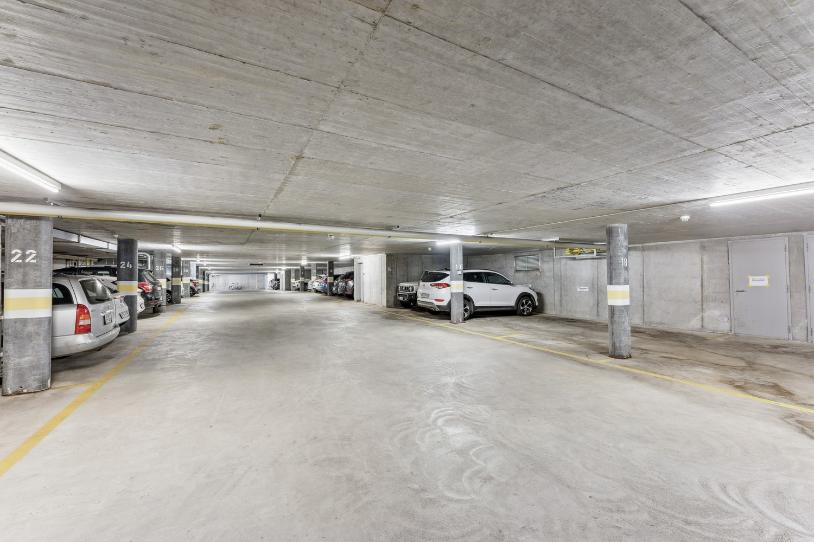
*`12.jpg` — 1500x1000 px*

## Media suplimentară

- **video_url:** https://youtu.be/lGR-qaHlMgw
