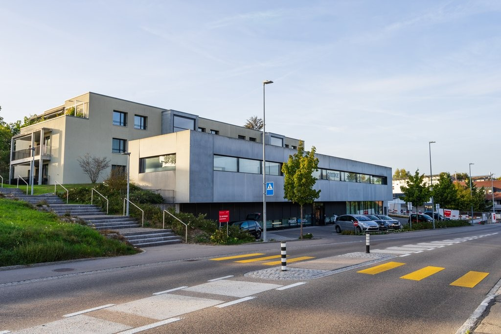
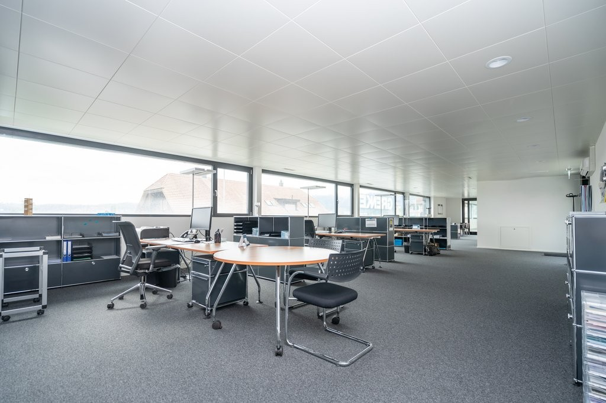
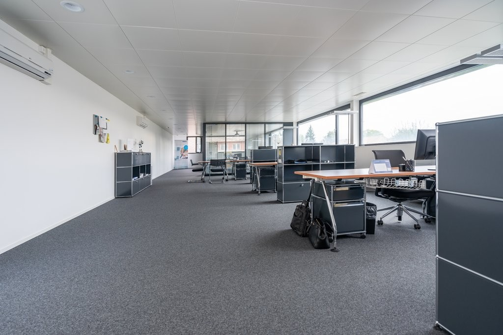
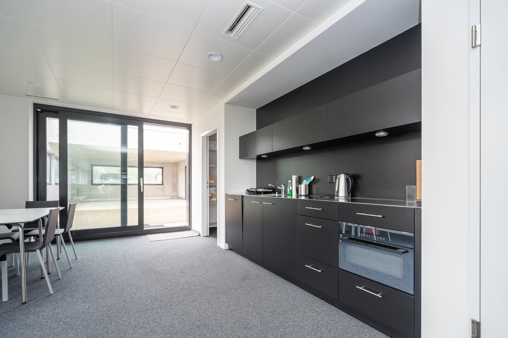
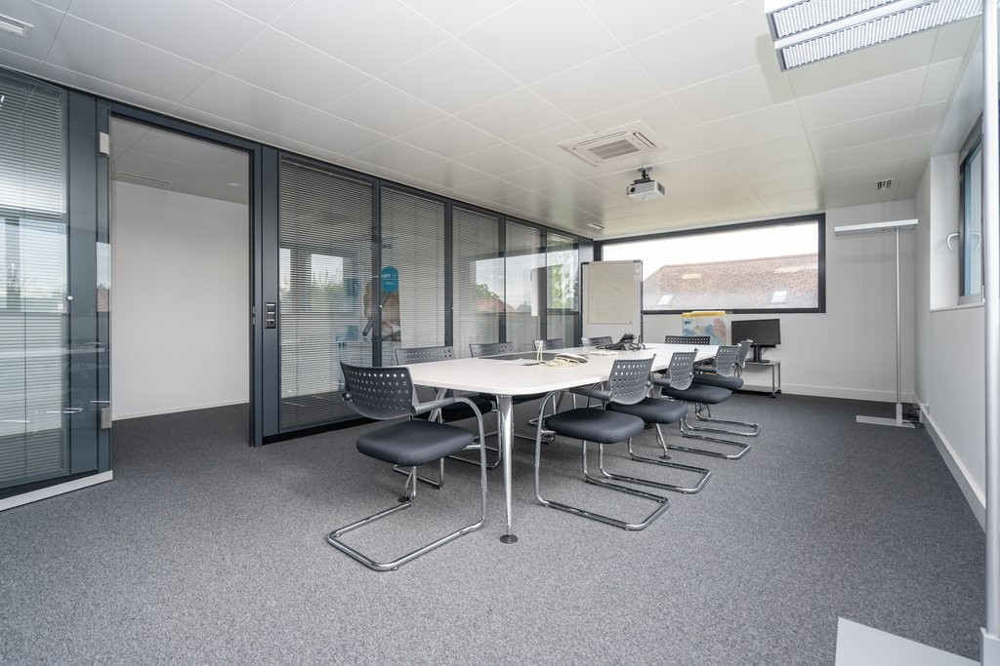
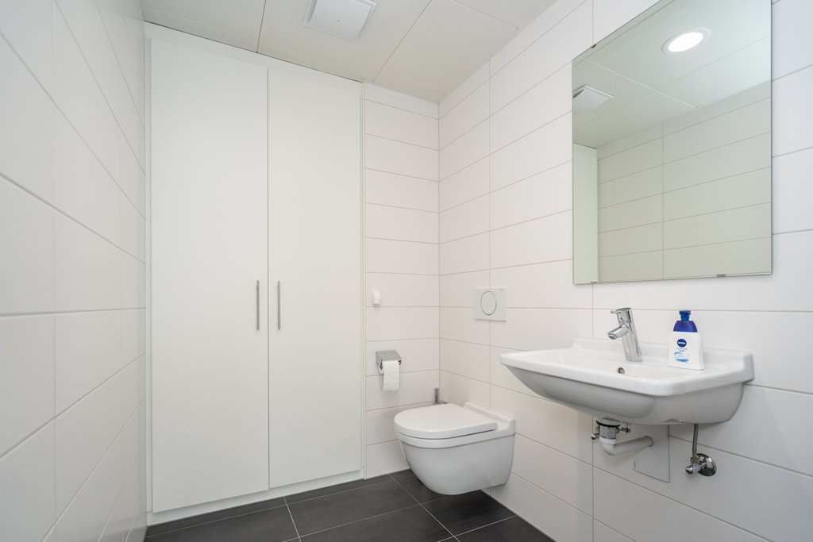
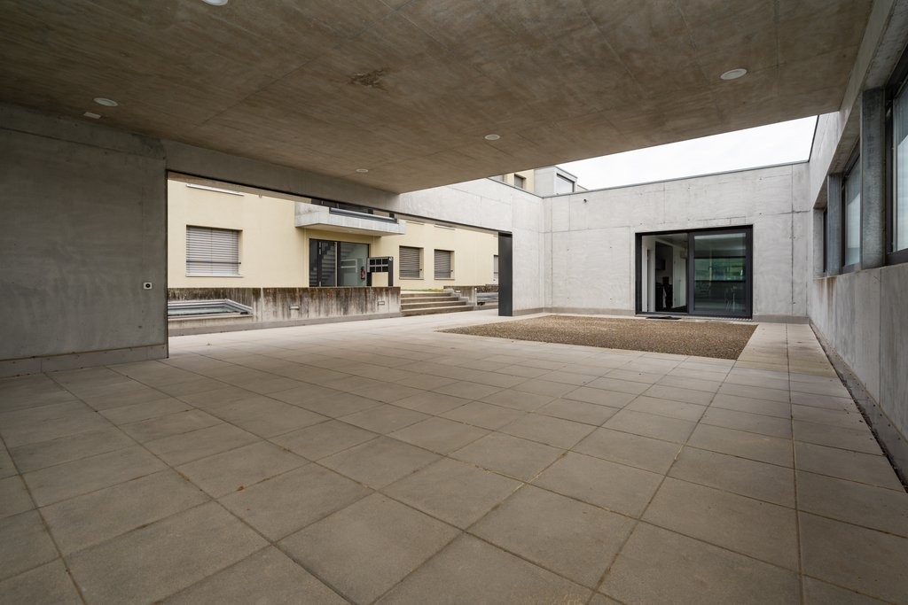

# Solothurnstrasse 43, 3322 Urtenen-Schönbühl - CHF 180 inkl. NK pro m² / Jahr

> **Categorie:** `B_buero_gewerbe`  
> **Regiune:** Cantonul Berna  
> **Tip ofertă:** RENT / OFFICE  
> **Relevant pentru praxis:** da (praxisfläche)  
> **Sursă:** [flatfox.ch](https://flatfox.ch/de/wohnung/solothurnstrasse-43-3322-urtenen-schonbuhl/85286523/)  
> **Descărcat:** 2026-08-17 12:34

## Date obiect

| Câmp | Valoare |
|---|---|
| Adresă | Solothurnstrasse 43, 3322 Urtenen-Schönbühl |
| Categorie obiect | INDUSTRY |
| Tip obiect | OFFICE |
| Chirie netă | CHF 150 |
| Nebenkosten | CHF 30 |
| Chirie brută | CHF 180 |
| Preț afișat | CHF 180 |
| Suprafață utilă | 175 m² |
| Etaj | 1 |
| Disponibil de la | agr |
| Referință | 1351.01.01001 |

## Texte originale (germană)

**Titlu public:** Solothurnstrasse 43, 3322 Urtenen-Schönbühl - CHF 180 inkl. NK pro m² / Jahr

**Titlu scurt:** 175m² Büro

**Pitch:** 175m² Büro in Urtenen-Schönbühl mieten

**Titlu descriere:** Ihre Suche endet hier - DIE Fläche für Ihren Erfolg!

**Titlu chirie:** 175m² Büro in Urtenen-Schönbühl mieten

**Spațiu afișat:** 175

### Descriere completă

Wir vermieten per sofort oder nach Vereinbarung eine attraktive und hochwertige Büro-/Praxisfläche im Herzen von Urtenen-Schönbühl. 

  

**Die Highlights in Kürze**

  * Neuwertiger, moderner Ausbau mit Teeküche, Sanitäranlagen und Klimatisierung 
  * Individuelle Raumgestaltung möglich 
  * Flexible Grundrissplanung 
  * Helle, lichtdurchflutete Flächen 
  * Einbauschränke und Archiv für zusätzlichen Stauraum 
  * Lift mit direktem Zugang zur Einstellhalle (Einstellplätze können dazu gemietet werden) 
  * Besucherparkplätze für Ihre Kunden 

**  
**

**Die Lage**

  * Der Bahnhof Urtenen befindet sich in Gehdistanz 
  * Der Autobahnanschluss Schönbühl (A6) liegt nur 5 Fahrminuten entfernt 
  * Diverse Einkaufs- und Verpflegungsmöglichkeiten befinden sich in nächster Nähe 
  * Das Shoppyland Schönbühl kann bequem mit dem Auto erreicht werden (rund 5 Fahrminuten) 

  

Sind Sie bereit für einen Neuanfang? Gerne stehen wir Ihnen für Fragen oder eine unverbindliche Besichtigung zur Verfügung. Wir freuen uns auf Sie. 

  

**Achtung. Eigenwerbung** : Sie ziehen in eine Mietwohnung und benötigen Unterstützung für den bestmöglichen Verkauf Ihrer Immobilie? Kontaktieren Sie die Dr.Meyer Immobilien AG für eine unverbindliche Offerte - **wir sind gut darin** .

## Dotări (attributes)

- balconygarden
- accessiblewithwheelchair

## Ofertant

- **Nume:** Dr.Meyer Immobilien AG
- **Stradă:** Morgenstrasse 83A
- **NPA:** 3018
- **Localitate:** Bern

## Imagini (7)

*`01.jpg` — 1024x683 px — 231009_174820_DM18185_bearbeitet.jpg*

*`02.jpg` — 1024x683 px — Bürofläche*

*`03.jpg` — 1024x683 px — _DM29657_bearbeitet.jpg*

*`04.jpg` — 1024x683 px — _DM29668_bearbeitet.jpg*

*`05.jpg` — 1024x683 px — _DM29646_bearbeitet.jpg*

*`06.jpg` — 1024x683 px — _DM29658_bearbeitet.jpg*

*`07.jpg` — 1024x683 px — _DM29673_bearbeitet.jpg*
