# Jurastrasse 63, 3013 Bern - CHF 2’530 inkl. NK pro Monat

> **Categorie:** `B_buero_gewerbe`  
> **Regiune:** Berna (oraș)  
> **Tip ofertă:** RENT / COMMERCIAL  
> **Sursă:** [flatfox.ch](https://flatfox.ch/de/wohnung/jurastrasse-63-3013-bern/85291953/)  
> **Descărcat:** 2026-08-17 12:35

## Date obiect

| Câmp | Valoare |
|---|---|
| Adresă | Jurastrasse 63, 3013 Bern |
| Categorie obiect | INDUSTRY |
| Tip obiect | COMMERCIAL |
| Chirie netă | CHF 2'180 |
| Nebenkosten | CHF 350 |
| Chirie brută | CHF 2'530 |
| Preț afișat | CHF 2'530 |
| Suprafață utilă | 130 m² |
| Etaj | 0 |
| An construcție | 1954 |
| Disponibil de la | agr |
| Referință | 40131..6001 |

## Texte originale (germană)

**Titlu public:** Jurastrasse 63, 3013 Bern - CHF 2’530 inkl. NK pro Monat

**Titlu scurt:** 130m² Gewerbe

**Pitch:** 130m² Gewerbe in Bern mieten

**Titlu descriere:** Gewerbefläche an TOP Lage à 130 m² / 1 Monat gratis Sommeraktion!

**Titlu chirie:** 130m² Gewerbe in Bern mieten

**Spațiu afișat:** 130

### Descriere completă

Wir vermieten ab sofort oder nach Vereinbarung im Lorraine-Quartier einen Gewerberaum an ca. 130 m², der sich unterhalb einer Wohnliegenschaft befindet. Die Liegenschaft wurde im Jahr 2023 totalsaniert. Folgende Eckdaten dazu:   
  
\- Eingangsbereich mit separatem Raum, Trennscheibe / Trennwand.   
\- Zwei grosse Nebenräume   
\- Grosse Garagenbox (im Mietzins inklusive)   
\- Nutzungszweck nach Absprache   
\- Separate Garagenbox für ein weiteres Fahrzeug kann dazu gemietet werden   
\- Zwei Toiletten vorhanden   
\- Dusche + Waschmaschine vorhanden   
  
In der ruhigen und naturnahen Umgebung an der Jurastrasse werden Sie sich bestimmt wohlfühlen. Nur ein Sprung von der Aare entfernt und direkt neben dem Zentrum von Bern werden Sie alles finden was Sie brauchen. Perfekt auch, um sich mit dem Velo oder dem ÖV auf den Weg zu machen.

## Dotări (attributes)

- parkingspace
- garage

## Ofertant

- **Nume:** Niederer AG
- **Stradă:** Unterdorfstrasse 5
- **NPA:** 3072
- **Localitate:** Ostermundigen

## Imagini (13)

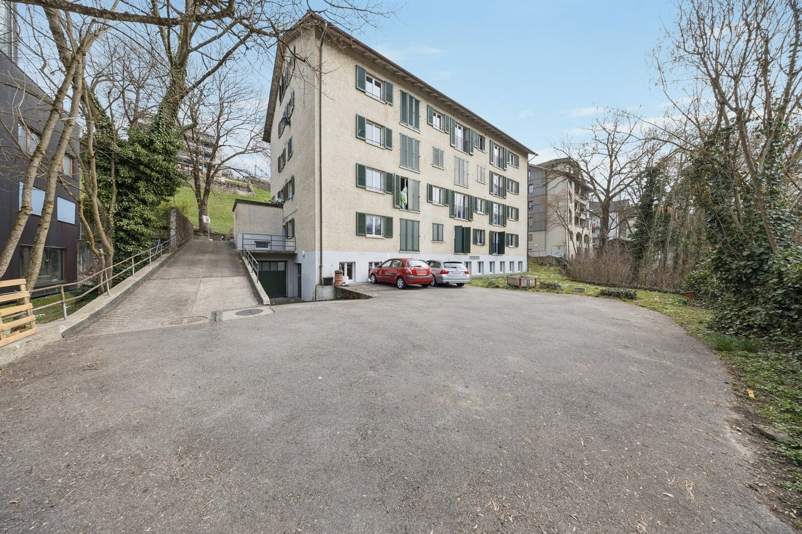
*`01.jpg` — 1500x1000 px — Liegenschaft*

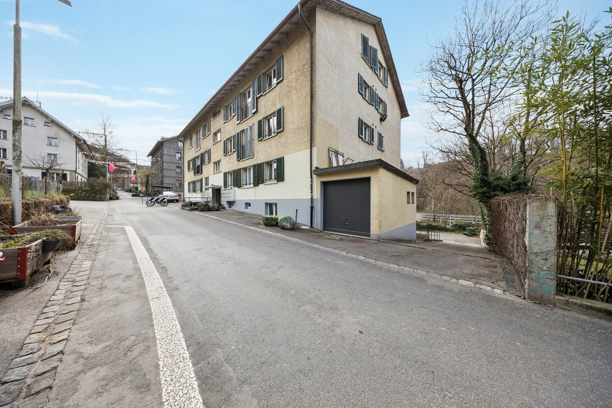
*`02.jpg` — 1500x1000 px — Liegenschaft*

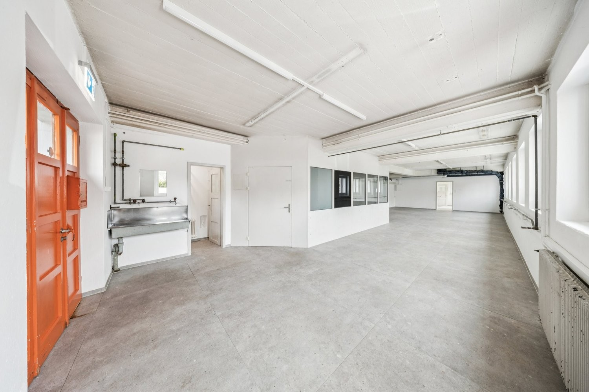
*`03.jpg` — 1500x1000 px — Gewerberaum*

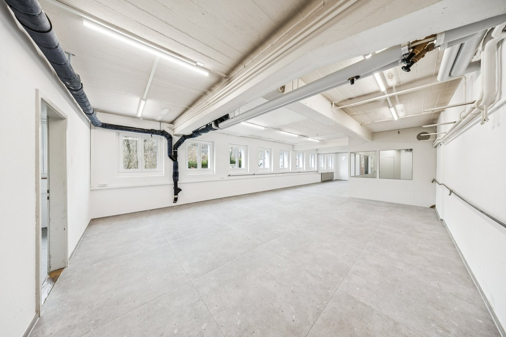
*`04.jpg` — 1500x1000 px — Gewerberaum*

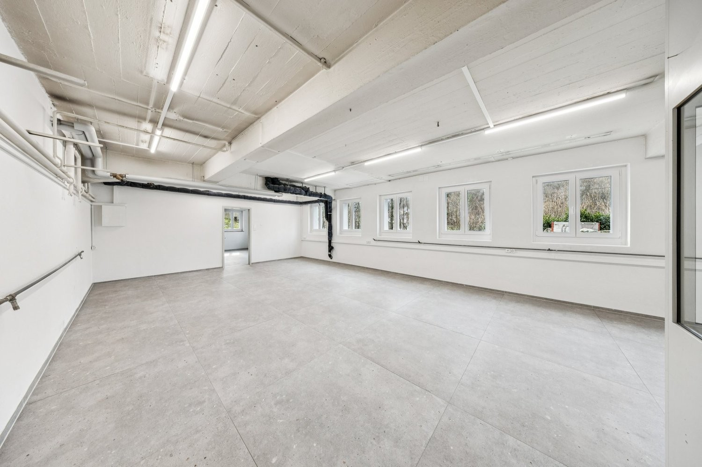
*`05.jpg` — 1500x1000 px — Gewerberaum*

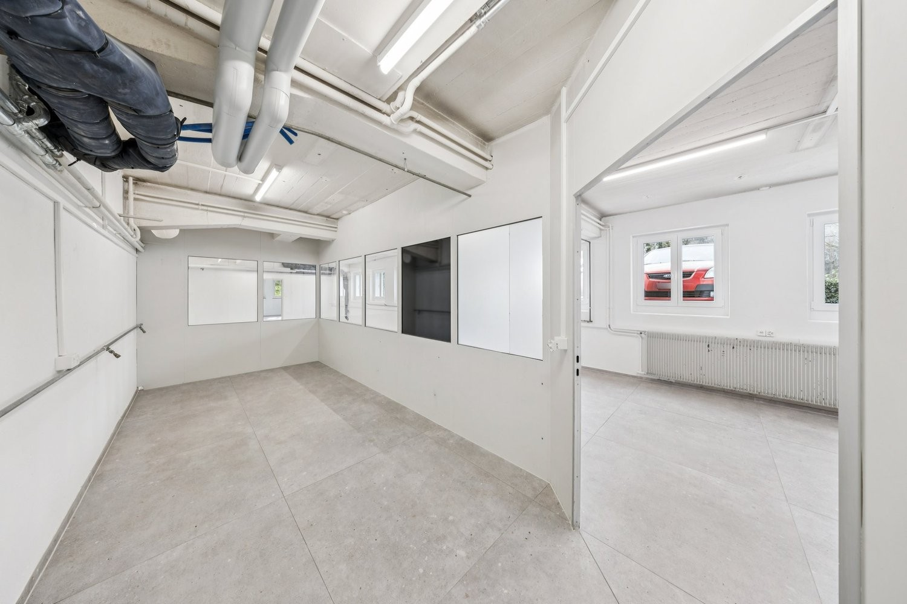
*`06.jpg` — 1500x1000 px — Büro*

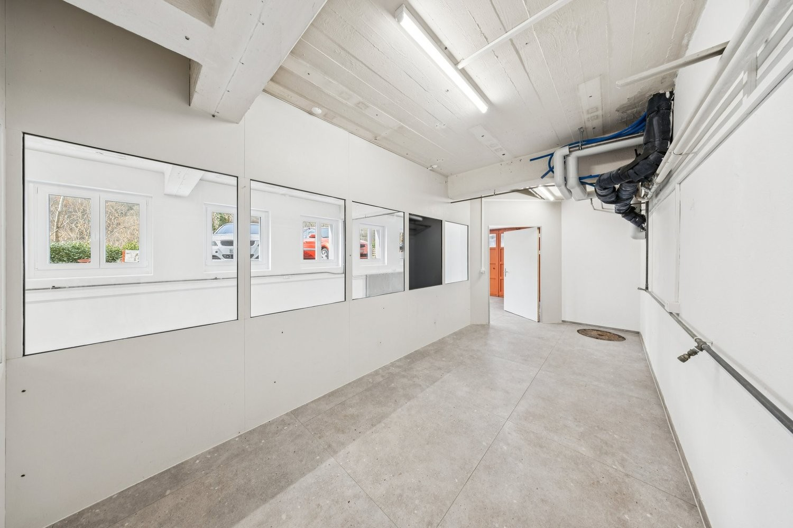
*`07.jpg` — 1500x1000 px — Büro*

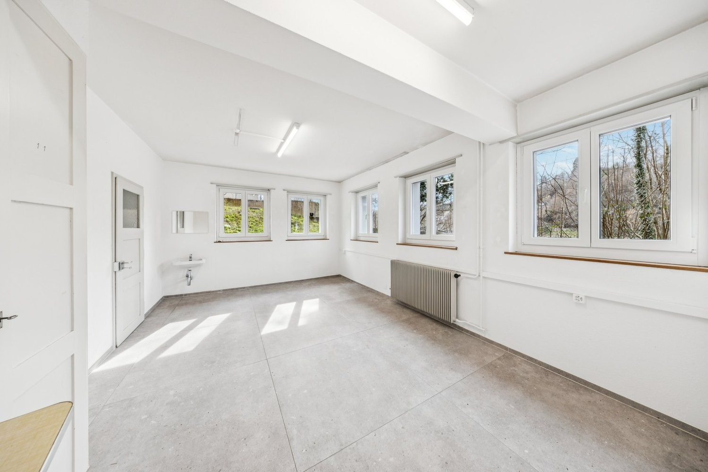
*`08.jpg` — 1500x1000 px — Nebenraum*

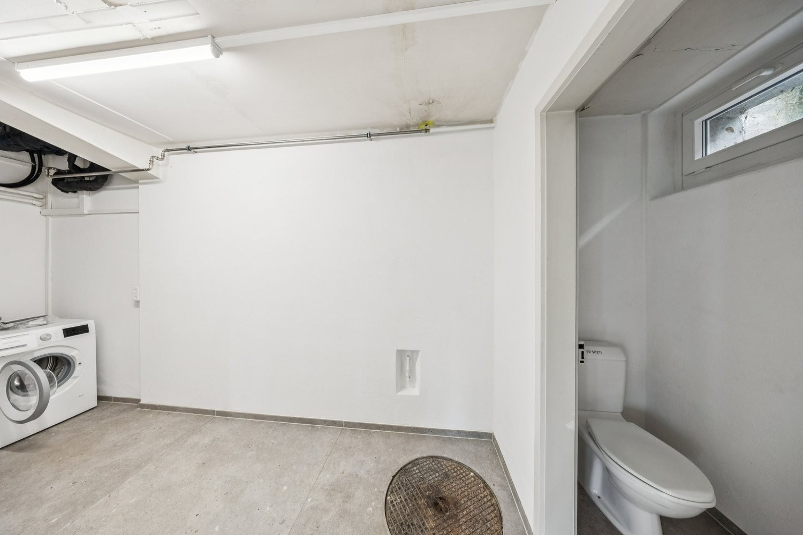
*`09.jpg` — 1500x1000 px — Sanitäre Räumlichkeiten*

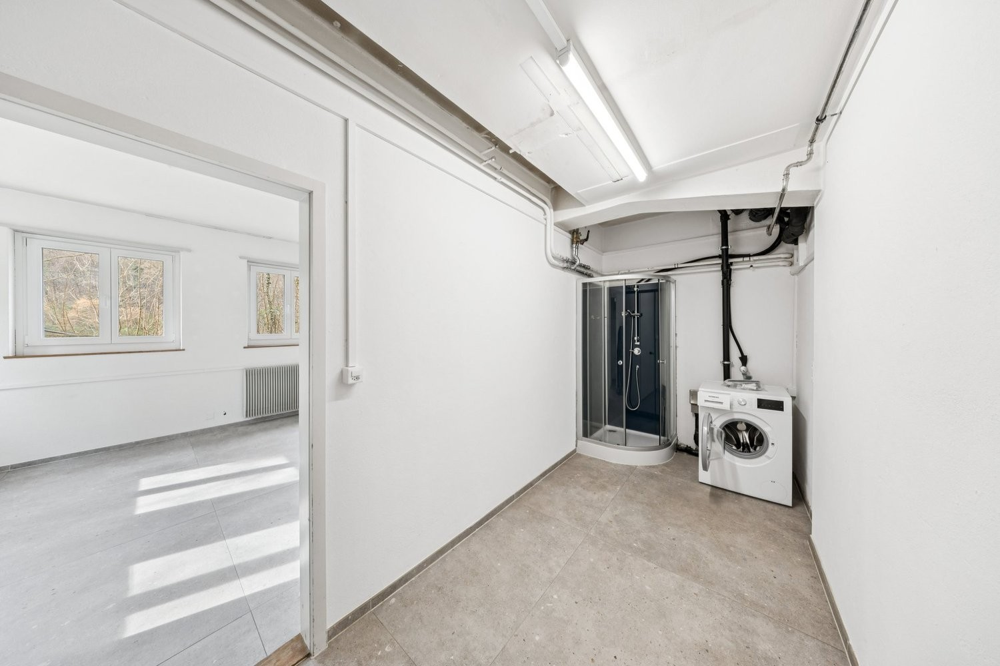
*`10.jpg` — 1500x1000 px — Sanitäre Räumlichkeiten*

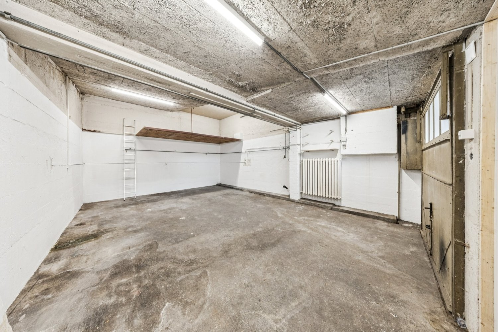
*`11.jpg` — 1500x1000 px — Garage*

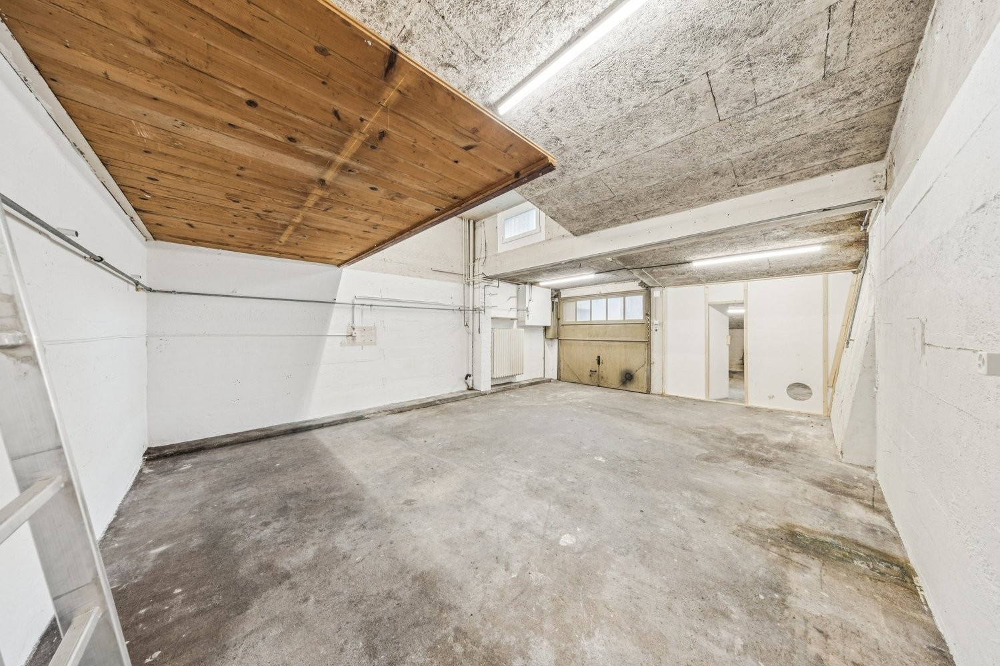
*`12.jpg` — 1500x1000 px — Garage*

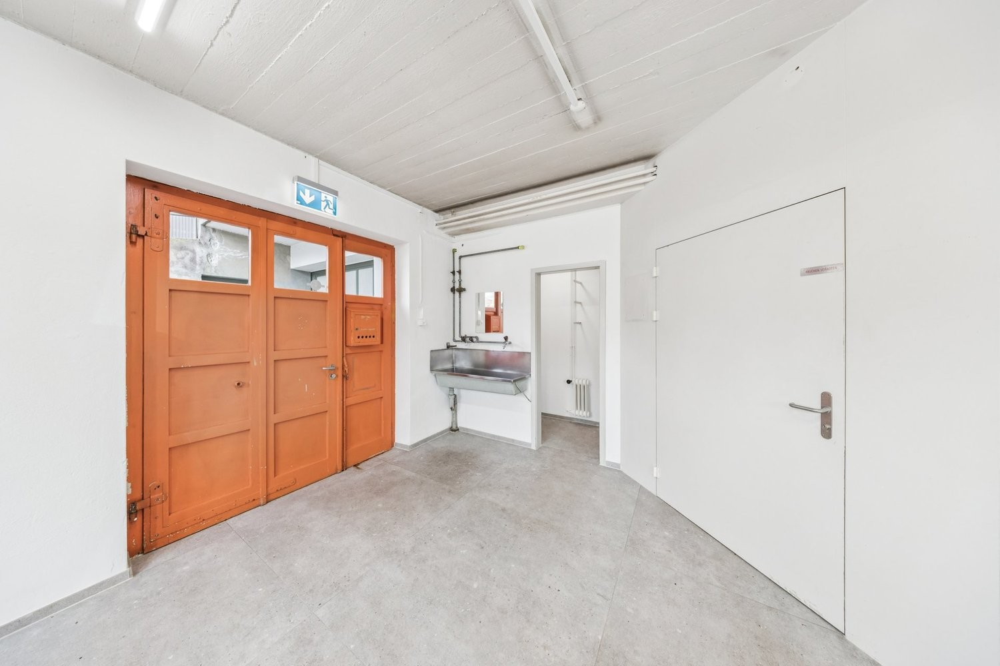
*`13.jpg` — 1500x1000 px — Eingangsbereich*
