# Hirschengraben 6, 3011 Bern - auf Anfrage

> **Categorie:** `B_buero_gewerbe`  
> **Regiune:** Berna (oraș)  
> **Tip ofertă:** RENT / OFFICE  
> **Relevant pentru praxis:** da (praxis)  
> **Sursă:** [flatfox.ch](https://flatfox.ch/de/wohnung/hirschengraben-6-3011-bern/85320694/)  
> **Descărcat:** 2026-08-17 12:29

## Date obiect

| Câmp | Valoare |
|---|---|
| Adresă | Hirschengraben 6, 3011 Bern |
| Categorie obiect | INDUSTRY |
| Tip obiect | OFFICE |
| Suprafață utilă | 172 m² |
| Etaj | 3 |
| An construcție | 1878 |
| An renovare | 1993 |
| Disponibil de la | agr |
| Referință | 8857.01.0302 |

## Texte originale (germană)

**Titlu public:** Hirschengraben 6, 3011 Bern - auf Anfrage

**Titlu scurt:** 172m² Büro

**Pitch:** 172m² Büro in Bern mieten

**Titlu descriere:** Ihre Kunden an Toplage bedienen?

**Titlu chirie:** 172m² Büro in Bern mieten

**Spațiu afișat:** 172

### Descriere completă

Sind Sie auf der Suche nach einem attraktiven Firmensitz?   
Wir haben die passenden Räume in einem repräsentativen Geschäftshaus im Herzen von Bern dazu.   
  
Die Räumlichkeiten eignen sich als Büro- oder Praxisnutzung und eine allfällige Vermietung erfolgt nach Vereinbarung.   
  
Haben wir Ihr Interesse geweckt? Zögern Sie nicht uns zu kontaktieren und sichern Sie sich Ihren Besichtigungstermin.   
  
Wir freuen uns auf Sie!

## Dotări (attributes)

- petsallowed
- cable

## Ofertant

- **Nume:** Apleona Schweiz AG
- **Stradă:** Kirchstrasse 24
- **NPA:** 3097
- **Localitate:** Liebefeld

## Imagini (12)

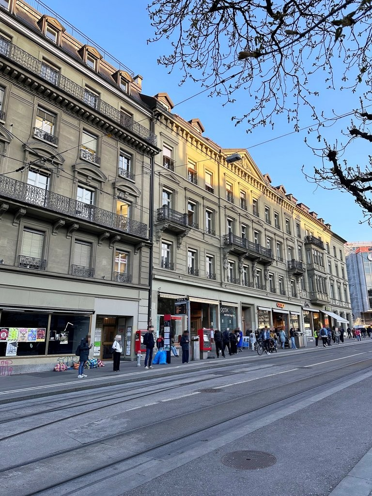
*`01.jpg` — 768x1024 px — Aussenansicht*

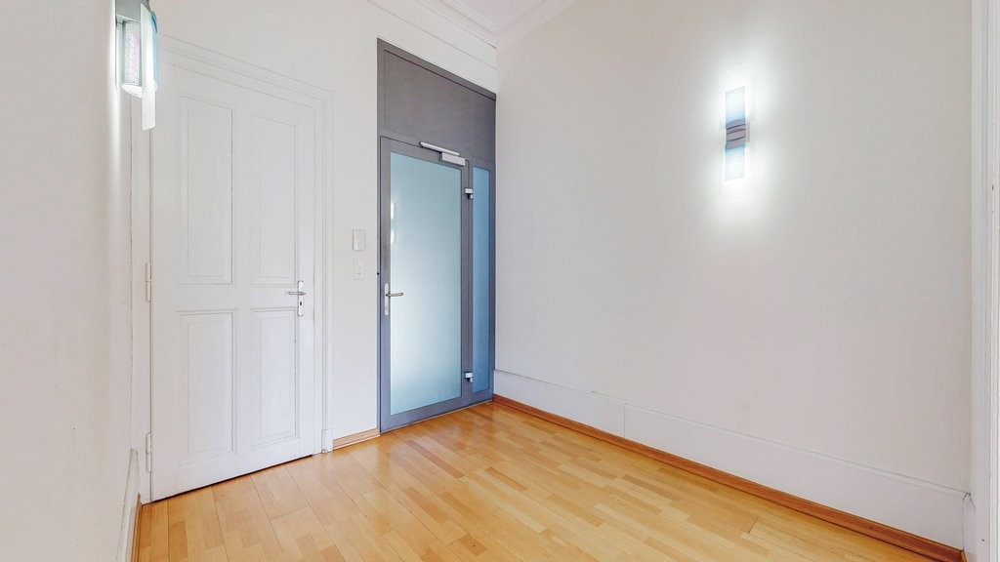
*`02.jpg` — 1024x576 px — Eingangsbereich*

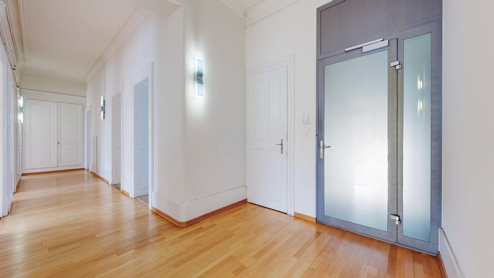
*`03.jpg` — 1024x576 px — Korridor*

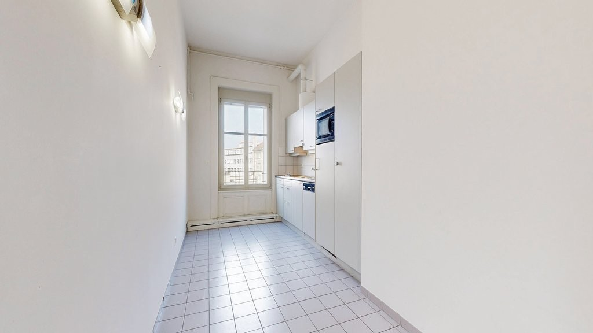
*`04.jpg` — 1024x576 px — Küche*

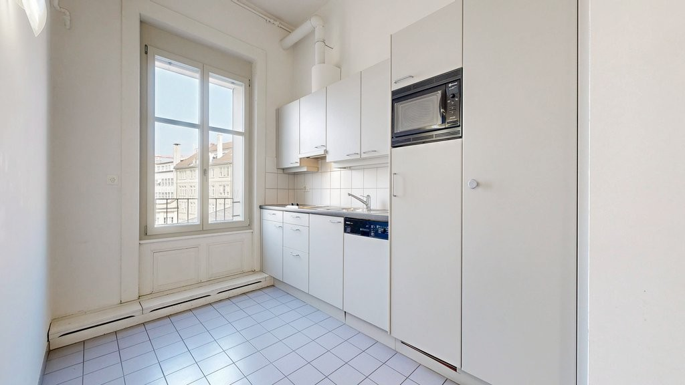
*`05.jpg` — 1024x576 px — Küche*

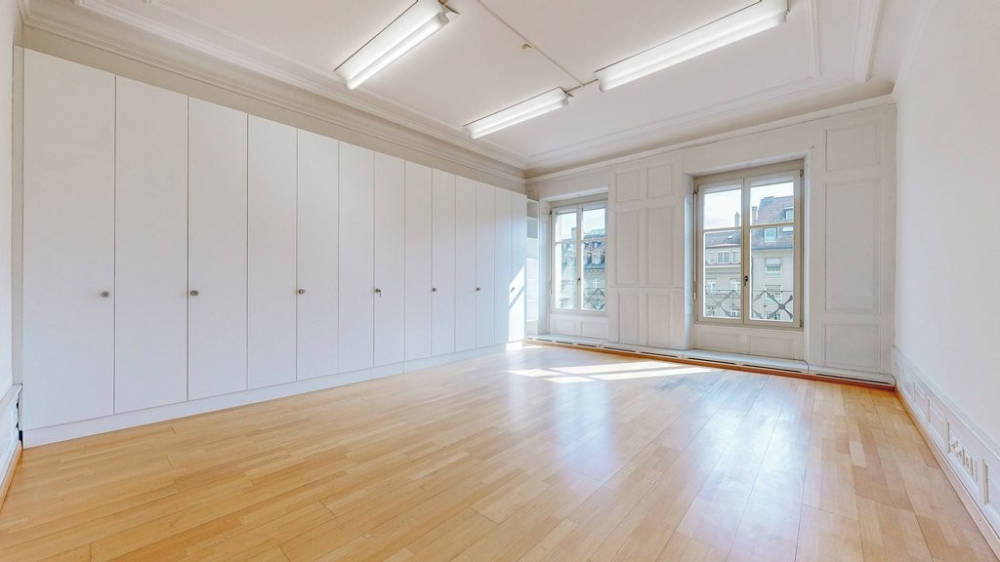
*`06.jpg` — 1024x576 px — Raum 1*

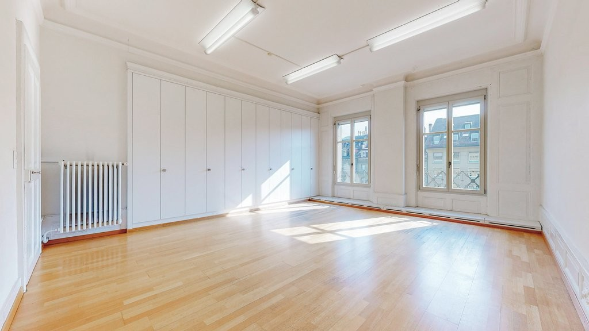
*`07.jpg` — 1024x576 px — Raum 2*

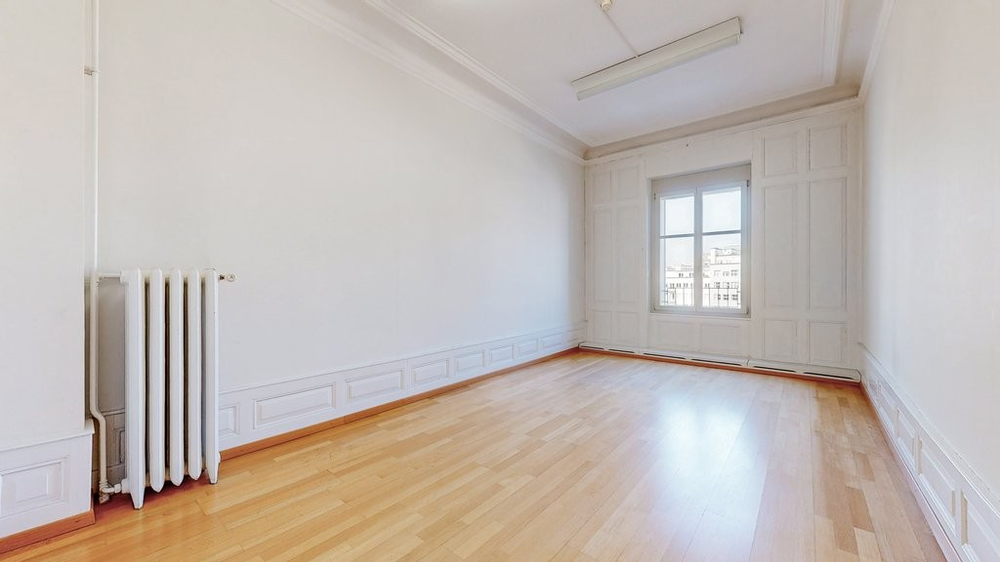
*`08.jpg` — 1024x576 px — Raum 3*

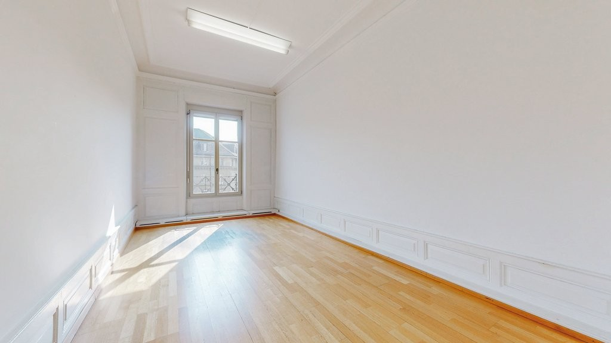
*`09.jpg` — 1024x576 px — Raum 4*

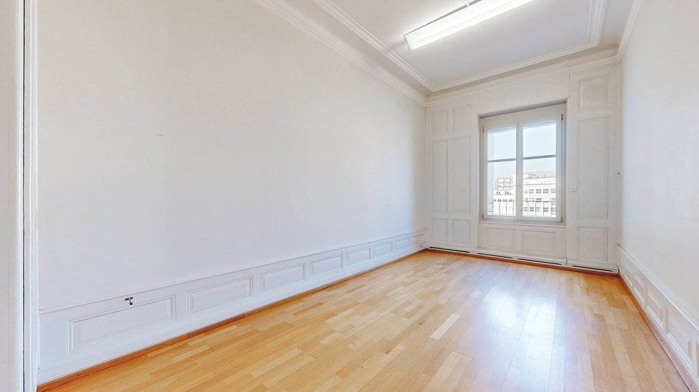
*`10.jpg` — 1024x576 px — Raum 5*

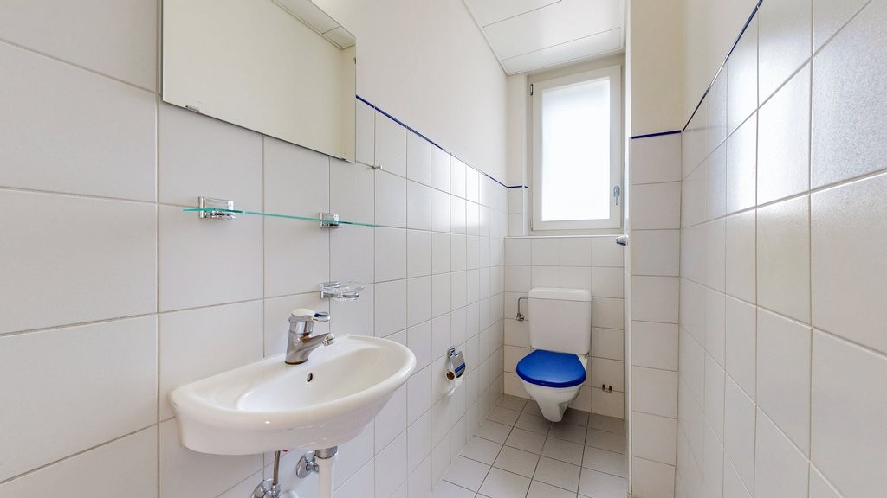
*`11.jpg` — 1024x576 px — WC*

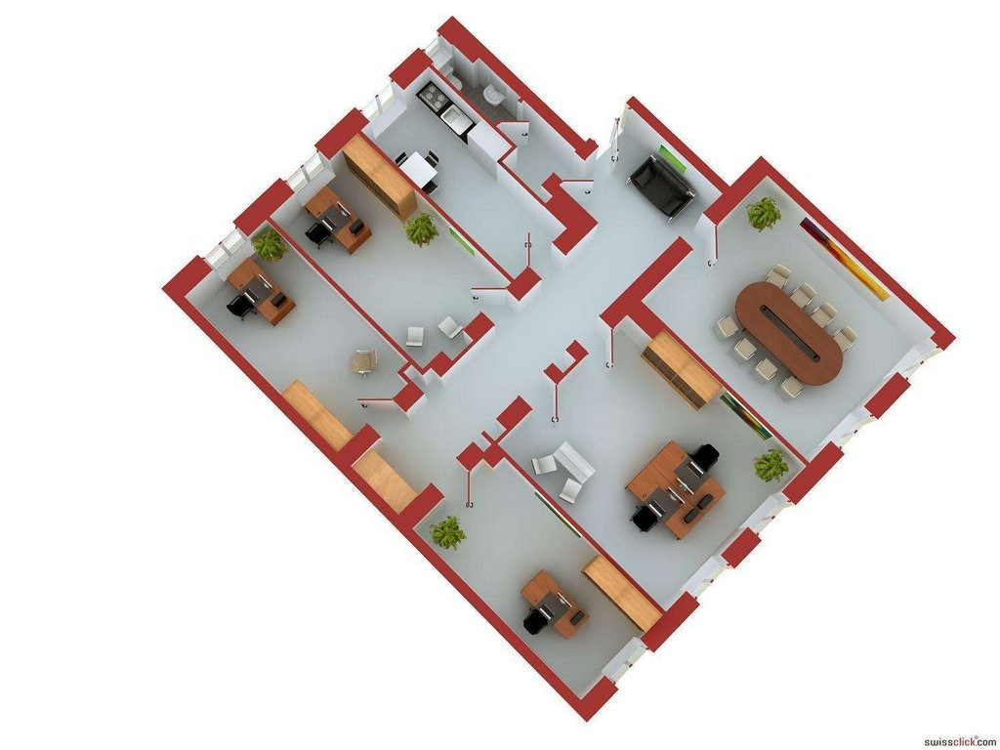
*`12.jpg` — 1024x768 px — Grundriss*
