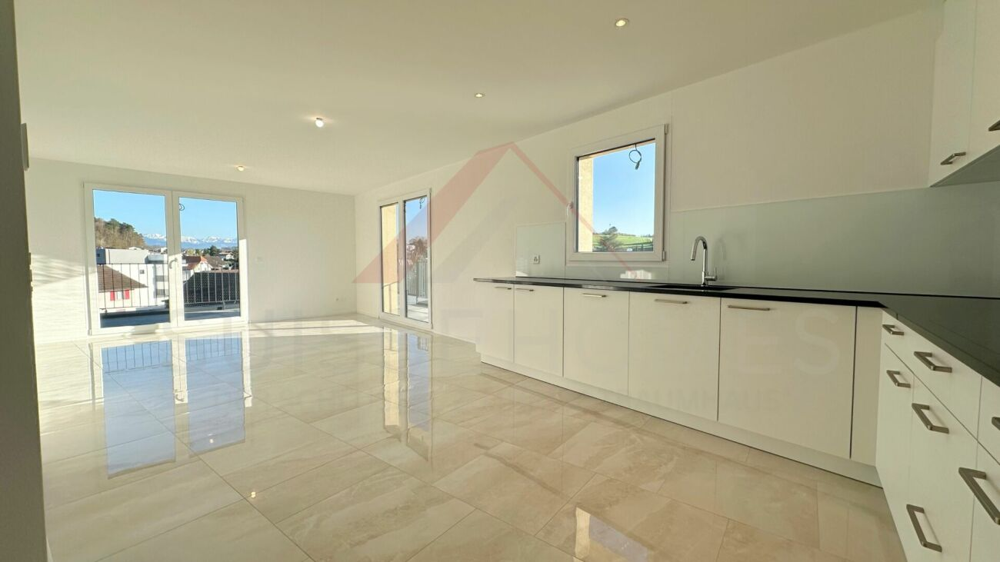
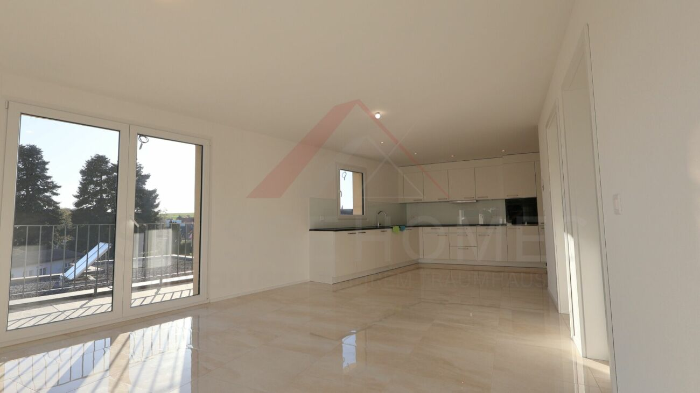
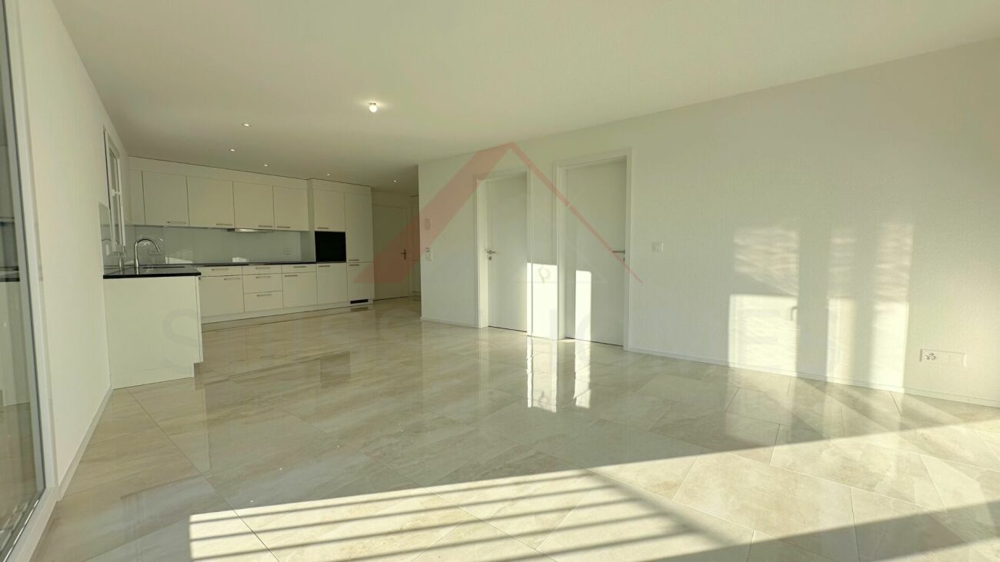
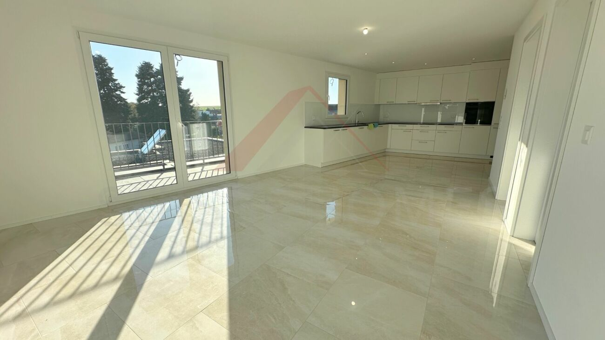
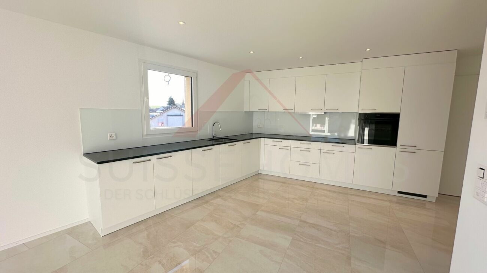
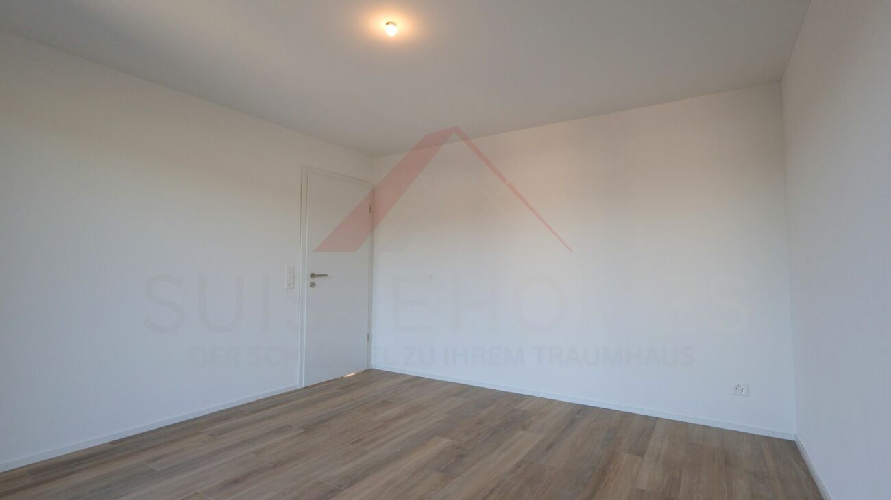
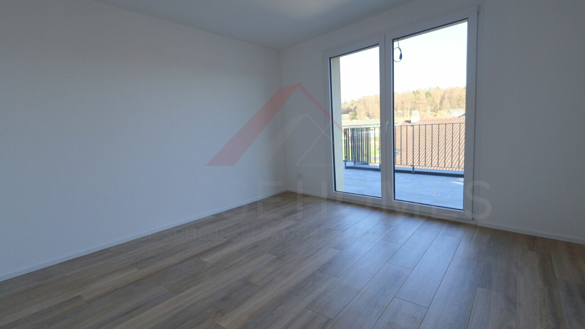
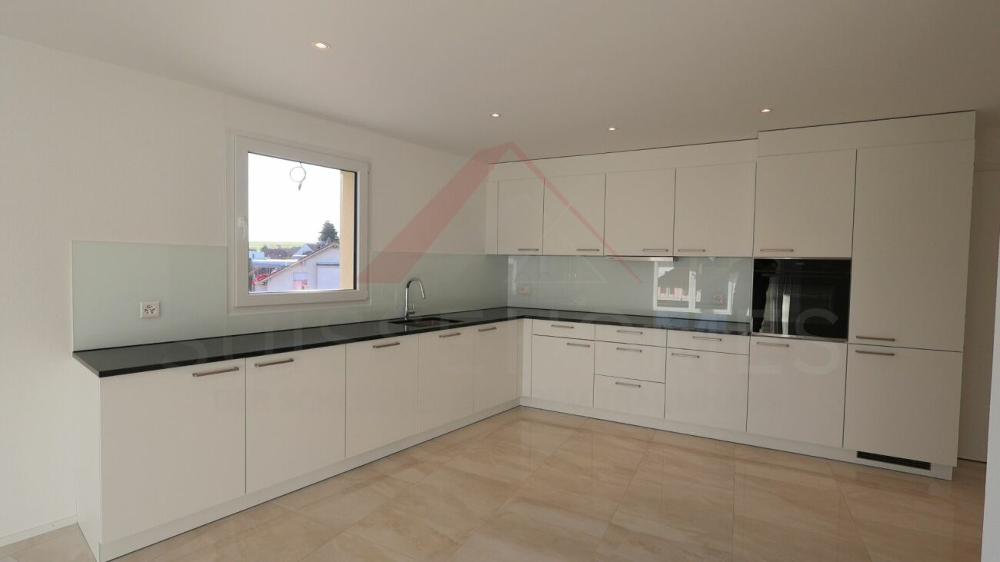
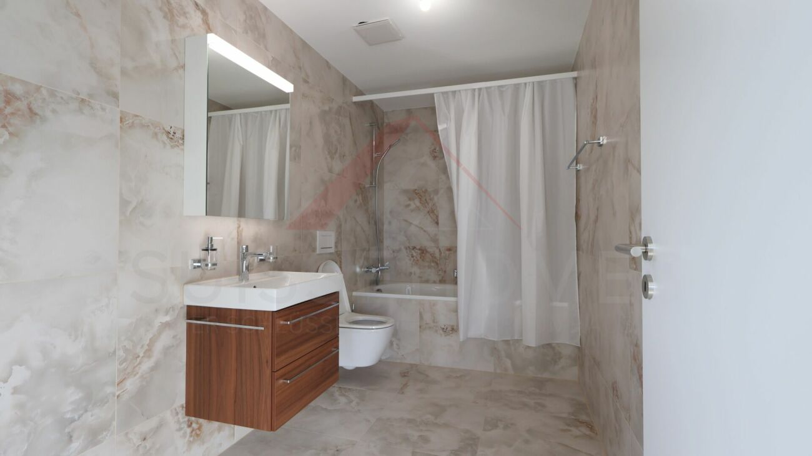

# 3212 Gurmels - CHF 1’650

> **Categorie:** `B_buero_gewerbe`  
> **Regiune:** Cantonul Berna  
> **Tip ofertă:** RENT / OFFICE  
> **Relevant pentru praxis:** da (apotheke)  
> **Sursă:** [flatfox.ch](https://flatfox.ch/de/wohnung/3212-gurmels/85321696/)  
> **Descărcat:** 2026-08-17 12:30

## Date obiect

| Câmp | Valoare |
|---|---|
| Adresă | 3212 Gurmels |
| Categorie obiect | INDUSTRY |
| Tip obiect | OFFICE |
| Chirie netă | CHF 1'400 |
| Nebenkosten | CHF 250 |
| Chirie brută | CHF 1'650 |
| Preț afișat | CHF 1'650 |
| Suprafață utilă | 123 m² |
| Etaj | 3 |
| An construcție | 2025 |
| Disponibil de la | agr |
| Referință | SHDSGewerbe 09.1647988.67f38377-93bc-11f0-9d93-069ae14c7a06 |

## Texte originale (germană)

**Titlu public:** 3212 Gurmels - CHF 1’650

**Titlu scurt:** 123m² Büro

**Pitch:** 123m² Büro in Gurmels mieten

**Titlu descriere:** Topmoderne Neubau-Büroflächen in Gurmels - Ihr neuer Standort im Zentrum

**Titlu chirie:** 123m² Büro in Gurmels mieten

**Spațiu afișat:** 123

### Descriere completă

Topmoderne Neubau-Büroflächen in Gurmels - Ihr neuer Standort im Zentrum 

DE: 

**Moderne Büroräume in Gurmels - Neubau mit Stil**

Hochwertige Büroeinheit im Neubau - ideal für moderne Arbeitskonzepte. 

**Highlights:**

  * 123 m² Bürofläche, 133 m² Gesamtfläche 

  * 4.5 Zimmer mit flexibler Nutzung 

  * Barrierefrei mit Aufzug 

  * Balkon mit schöner Aussicht 

  * Einstellhallenplatz (CHF 100.-/Monat) 

  * Moderne Infrastruktur (Kabel-TV, Wasser, Strom, Abwasser) 

**Lage:**

  * Ruhige, sonnige Umgebung 

  * Bushaltestelle ?Gurmels Dorf? in 3 Min. 

  * Apotheke in 4 Min., Schule in 9 Min. zu Fuss 

FR: 

**Bureaux modernes à Gurmels - Neuf et confortables**

Locaux professionnels spacieux dans un bâtiment neuf. 

**Points forts :**

  * 123 m² de surface de bureau, 133 m² au total 

  * 4,5 pièces modulables selon vos besoins 

  * Accès entièrement adapté (ascenseur) 

  * Balcon avec belle vue 

  * Place de parc en sous-sol (CHF 100.-/mois) 

  * Infrastructures modernes (TV câblée, eau, électricité, assainissement) 

**Emplacement :**

  * Quartier calme et bien ensoleillé 

  * Arrêt de bus « Gurmels Dorf » à 3 min à pied 

  * Pharmacie à 4 min, école primaire à 9 min à pied

## Dotări (attributes)

- garage
- lift
- accessiblewithwheelchair
- parkingspace
- balconygarden

## Ofertant

- **Nume:** Suisse-Homes.ch GmbH
- **Stradă:** Hinterbegrstrasse 28
- **NPA:** 6312
- **Localitate:** Steinhausen

## Imagini (9)

*`01.jpg` — 1300x731 px*

*`02.jpg` — 1300x731 px*

*`03.jpg` — 1300x731 px*

*`04.jpg` — 1300x731 px*

*`05.jpg` — 1300x731 px*

*`06.jpg` — 1300x731 px*

*`07.jpg` — 1300x731 px*

*`08.jpg` — 1300x731 px*

*`09.jpg` — 1300x731 px*
