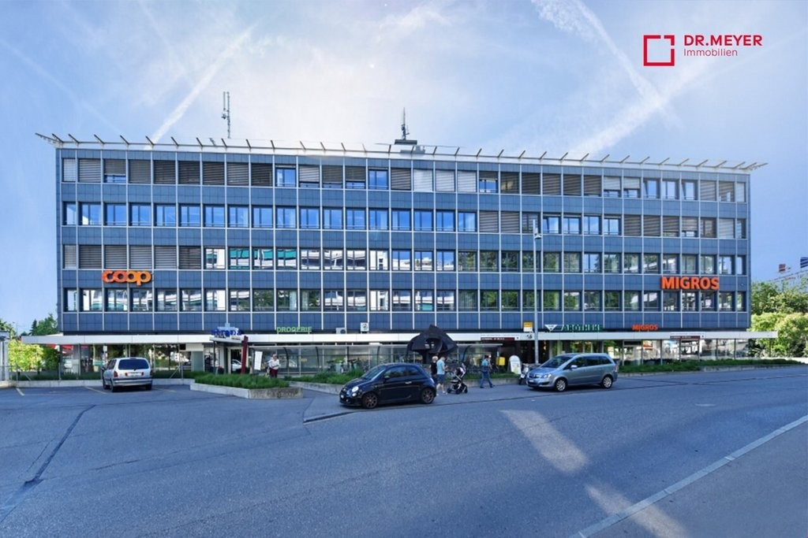
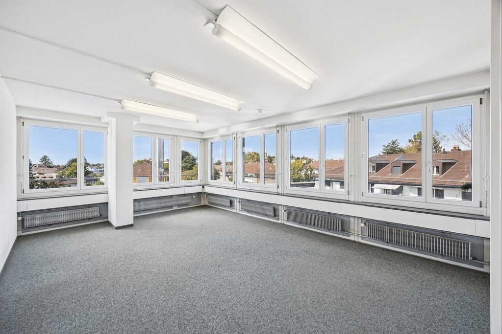
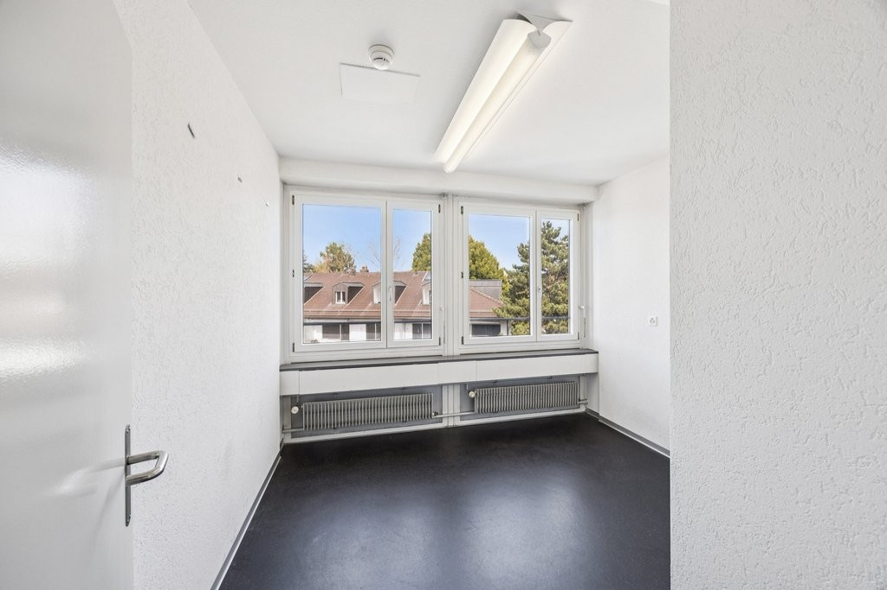
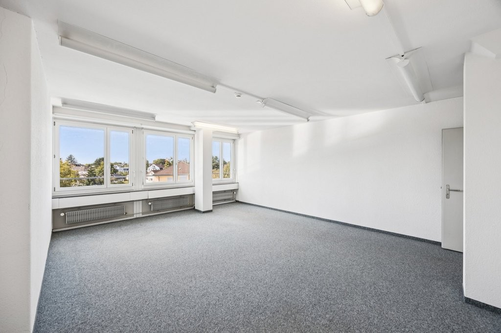
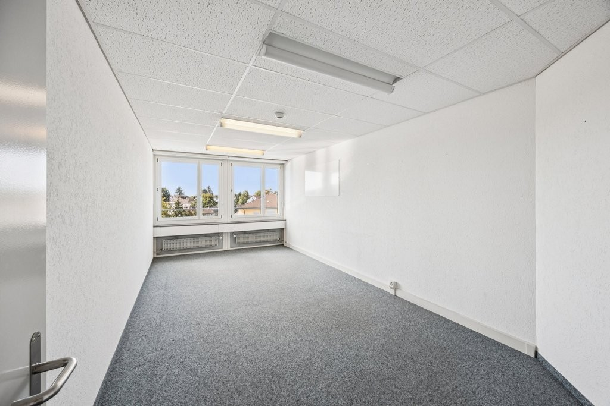
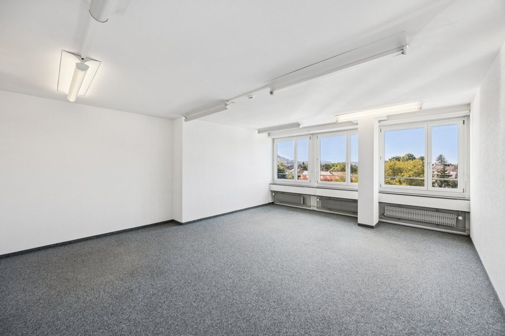
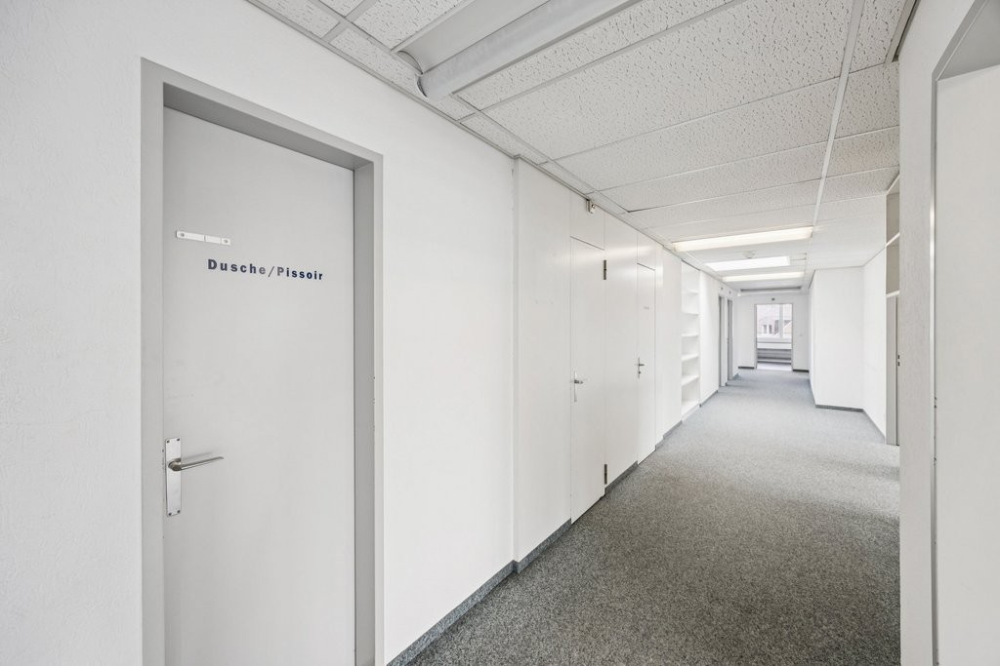
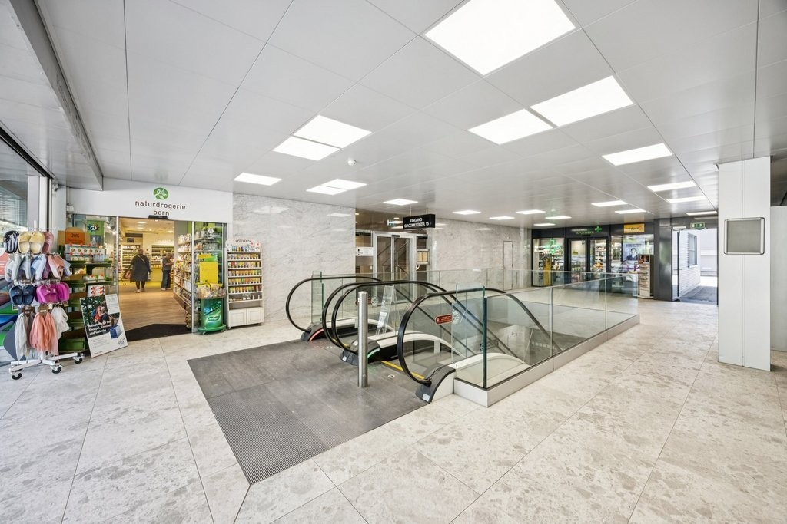
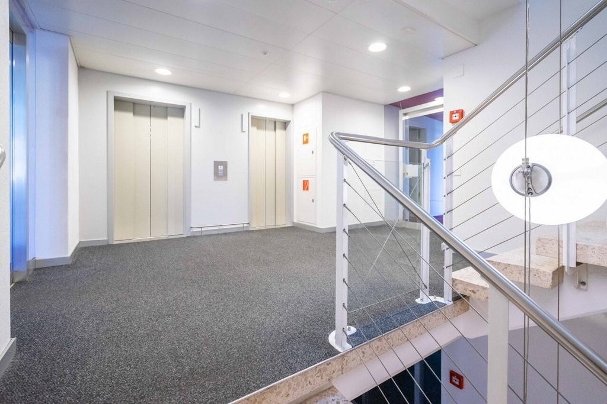
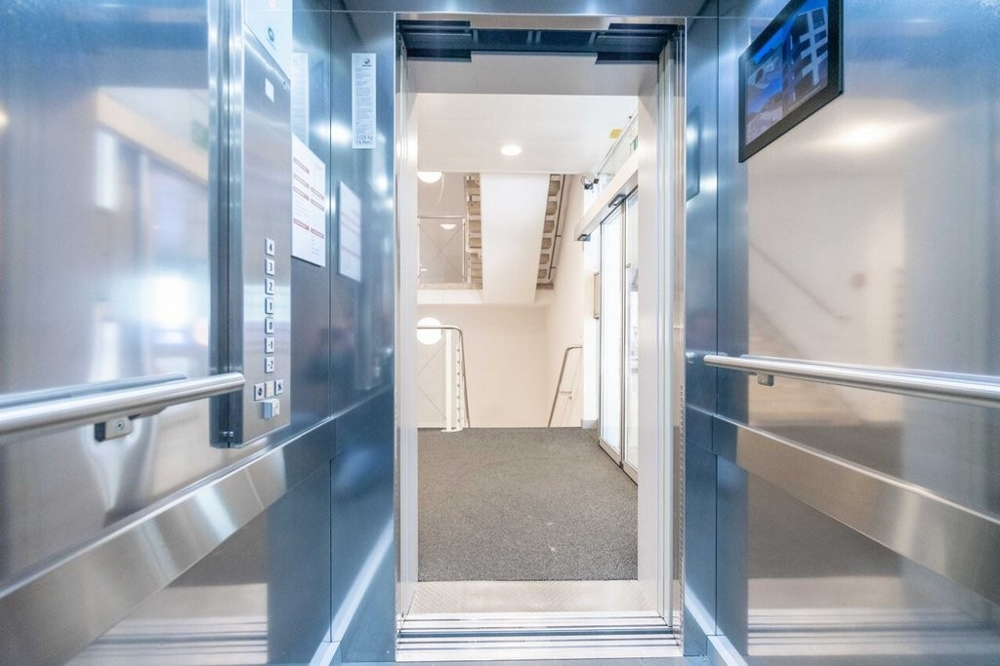

# Giacomettistrasse 15, 3006 Bern - auf Anfrage

> **Categorie:** `B_buero_gewerbe`  
> **Regiune:** Berna (oraș)  
> **Tip ofertă:** RENT / OFFICE  
> **Relevant pentru praxis:** da (praxis)  
> **Sursă:** [flatfox.ch](https://flatfox.ch/de/wohnung/giacomettistrasse-15-3006-bern/85330462/)  
> **Descărcat:** 2026-08-17 12:25

## Date obiect

| Câmp | Valoare |
|---|---|
| Adresă | Giacomettistrasse 15, 3006 Bern |
| Categorie obiect | INDUSTRY |
| Tip obiect | OFFICE |
| Suprafață utilă | 332 m² |
| Etaj | 4 |
| Disponibil de la | agr |
| Referință | ..1275.01.04003 |

## Texte originale (germană)

**Titlu public:** Giacomettistrasse 15, 3006 Bern - auf Anfrage

**Titlu scurt:** 332m² Büro

**Pitch:** 332m² Büro in Bern mieten

**Titlu descriere:** Herzlich willkommen im Zentrum Freudenberg - Ihre neue Erfolgsadresse!

**Titlu chirie:** 332m² Büro in Bern mieten

**Spațiu afișat:** 332

### Descriere completă

Nur einen Steinwurf von der Tramstation "Ostring" und dem Autobahnanschluss A6 entfernt, empfängt Sie das Zentrum Freudenberg mit exzellenter Lage. Im 4. Obergeschoss erwartet Sie eine helle, lichtdurchflutete Fläche - perfekt für Ihr Büro oder Ihre Praxis.   
  
Die Fläche besticht durch einen flexiblen Grundriss, der sich ideal an Ihre Vision anpassen lässt. Der bestehende Ausbau kann bei Bedarf übernommen werden. Sie haben andere Vorstellungen? Kein Problem! Gerne setzen wir den Grundausbau nach Ihren Wünschen um.   
  
**Die Highlights im Überblick**   

  * Beste Lage im Berner Ostring 
  * Optimale Anbindung an den öffentlichen Verkehr und die Autobahn A6 
  * Einkaufs- und Verpflegungsmöglichkeiten direkt im Zentrum 
  * Individuelle Grundriss- und Flächengestaltung 
  * Grundausbau nach Ihren Vorstellungen 
  * Einstellhalle für Ihre Kunden 

  
Haben wir Ihr Interesse geweckt? Gerne überzeugen wir Sie bei einer gemeinsamen Besichtigung.   
  
**Achtung. Eigenwerbung:** Sie ziehen in eine Mietwohnung oder benötigen Unterstützung für den bestmöglichen Verkauf Ihrer Immobilie? Kontaktieren Sie die Dr.Meyer Immobilien AG für eine unverbindliche Offerte -  **wir sind gut darin.**

## Dotări (attributes)

- garage
- parkingspace
- ramp
- accessiblewithwheelchair
- view
- lift

## Ofertant

- **Nume:** Dr.Meyer Immobilien AG
- **Stradă:** Morgenstrasse 83A
- **NPA:** 3018
- **Localitate:** Bern

## Imagini (10)

*`01.jpg` — 1024x683 px — Bild1.jpg*

*`02.jpg` — 1024x683 px — backbone_571865-B_084_WEB.jpg*

*`03.jpg` — 1024x683 px — backbone_571865-B_068_WEB.jpg*

*`04.jpg` — 1024x683 px — backbone_571865-B_053_WEB.jpg*

*`05.jpg` — 1024x683 px — backbone_571865-B_056_WEB.jpg*

*`06.jpg` — 1024x683 px — backbone_571865-B_085_WEB.jpg*

*`07.jpg` — 1024x683 px — backbone_571865-B_035_WEB.jpg*

*`08.jpg` — 1024x683 px — backbone_571865-B_081_WEB.jpg*

*`09.jpg` — 1024x683 px — Treppenhaus*

*`10.jpg` — 1024x683 px — Bild8.jpg*
