# Feldstrasse 32a, 3074 Muri b. Bern - CHF 267

> **Categorie:** `B_buero_gewerbe`  
> **Regiune:** Cantonul Berna  
> **Tip ofertă:** RENT / COMMERCIAL  
> **Relevant pentru praxis:** da (praxis)  
> **Sursă:** [flatfox.ch](https://flatfox.ch/de/wohnung/feldstrasse-32a-3074-muri-b-bern/85475286/)  
> **Descărcat:** 2026-08-17 12:26

## Date obiect

| Câmp | Valoare |
|---|---|
| Adresă | Feldstrasse 32a, 3074 Muri b. Bern |
| Categorie obiect | INDUSTRY |
| Tip obiect | COMMERCIAL |
| Chirie netă | CHF 242 |
| Nebenkosten | CHF 25 |
| Chirie brută | CHF 267 |
| Preț afișat | CHF 267 |
| Suprafață utilă | 983 m² |
| Etaj | 1 |
| An construcție | 2018 |
| Disponibil de la | imm |
| Referință | ..5629393 |

## Texte originale (germană)

**Titlu public:** Feldstrasse 32a, 3074 Muri b. Bern - CHF 267

**Titlu scurt:** 983m² Gewerbe

**Pitch:** 983m² Gewerbe in Muri b. Bern mieten

**Titlu descriere:** ATTRAKTIVE GEWERBEFLÄCHE IN MURI BEI BERN

**Titlu chirie:** 983m² Gewerbe in Muri b. Bern mieten

**Spațiu afișat:** 983

### Descriere completă

OBJEKTBESCHRIEB:   
An zentraler und gut frequentierter Lage in Muri bei Bern vermieten wir eine äusserst attraktive und flexibel nutzbare Gewerbefläche mit insgesamt 983m² Nutzfläche. Die Verkaufsräume von Petfriends überzeugen durch ihre moderne Infrastruktur, lichtdurchflutete Flächen, funktionale Logistik und vielseitige Nutzungsmöglichkeiten - sowohl für Verkaufs- als auch Dienstleistungs- oder Lagerkonzepte.   
  
Die Liegenschaft befindet sich an verkehrsgünstiger und gut sichtbarer Lage in Muri bei Bern - nur wenige Fahrminuten von der Stadt Bern entfernt. Der Standort bietet eine ausgezeichnete Erreichbarkeit über die Autobahn A6 sowie mit öffentlichen Verkehrsmitteln. Bushaltestellen und Einkaufsmöglichkeiten befinden sich in unmittelbarer Nähe - was die Lage auch für Mitarbeitende und Kundschaft äusserst attraktiv macht.   
  
Ob Fachgeschäft, Ausstellungsraum, Showroom, Praxis, Büroflächen oder eine Kombination aus Verkaufs- und Lagerfläche - diese Immobilie bietet Ihnen den idealen Rahmen, Ihre Geschäftsidee professionell umzusetzen.   
  
DAS WICHTIGSTE IN KÜRZE:   
  
\- Zwei separate Kundenzugänge - über das Erdgeschoss sowie direkt aus der Einstellhalle, bequem erreichbar via Treppe oder Lift   
\- LKW-Zufahrt mit separatem Anlieferungsbereich - ideal für Anlieferung und Logistik   
\- Separater Anlieferungslift - bietet Platz für palettengrosse Güter (mit Rolli befahrbar)   
\- Grosszügige, exklusive Dachterrasse - nur über die Mietfläche zugänglich; perfekt für Mitarbeitende, Events oder Kundenempfang   
\- Raumhöhen von 2.50m bis 2.80m - geeignet für unterschiedlichste Nutzungskonzepte   
\- Helle Gewerbeflächen mit moderner Ausstrahlung und idealer Tageslichtversorgung.   
\- Flexible Raumaufteilung - ideal für individuelle Anforderungen und kombinierte Nutzungen   
\- Kundenparkplätze vorhanden - im Aussenbereich sowie in der Einstellhalle im Untergeschoss   
\- Gepflegte Liegenschaft mit professionellem Erscheinungsbild   
\- Werbewirksame Lage mit hoher Sichtbarkeit   
\- Die Nebenkosten betragen 25.- pro m2/Jahr   
  
Nutzen Sie das Potenzial dieser Gewerbefläche an einem etablierten Standort mit Perspektive.   
  
Für weitere Auskünfte oder für eine Besichtigung vor Ort stehen wir Ihnen jederzeit gerne zur Verfügung.   
  
"Ihre Spezialisten für Gewerbe- und Wohn-Lifestyle"

## Dotări (attributes)

- balconygarden
- accessiblewithwheelchair
- lift

## Ofertant

- **Nume:** Lifestyle Company AG
- **Stradă:** Hallwylstrasse 48
- **NPA:** 3005
- **Localitate:** Bern

## Imagini (12)

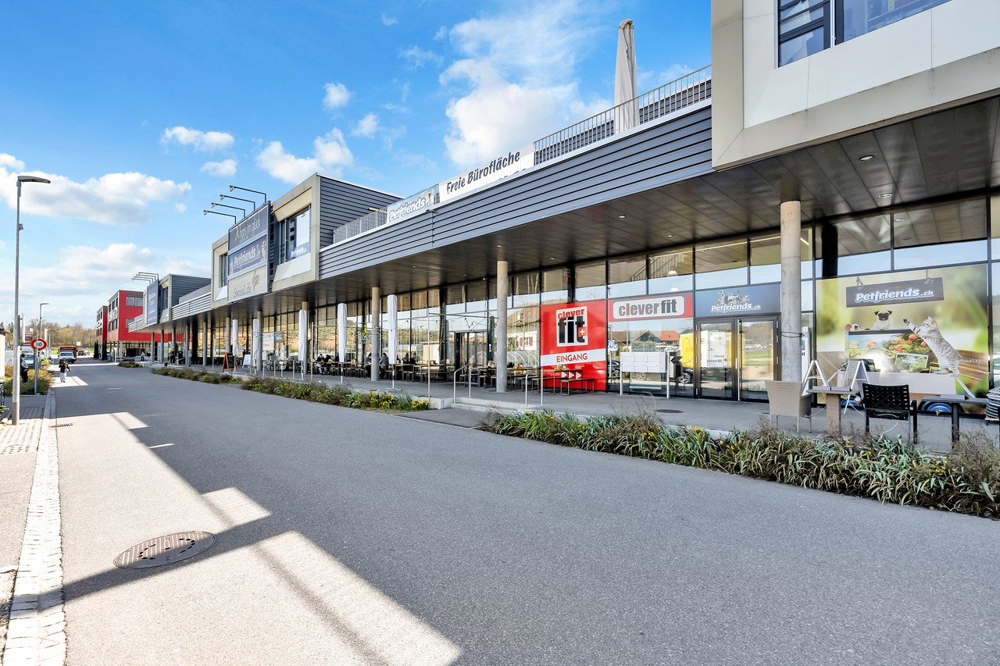
*`01.jpg`*

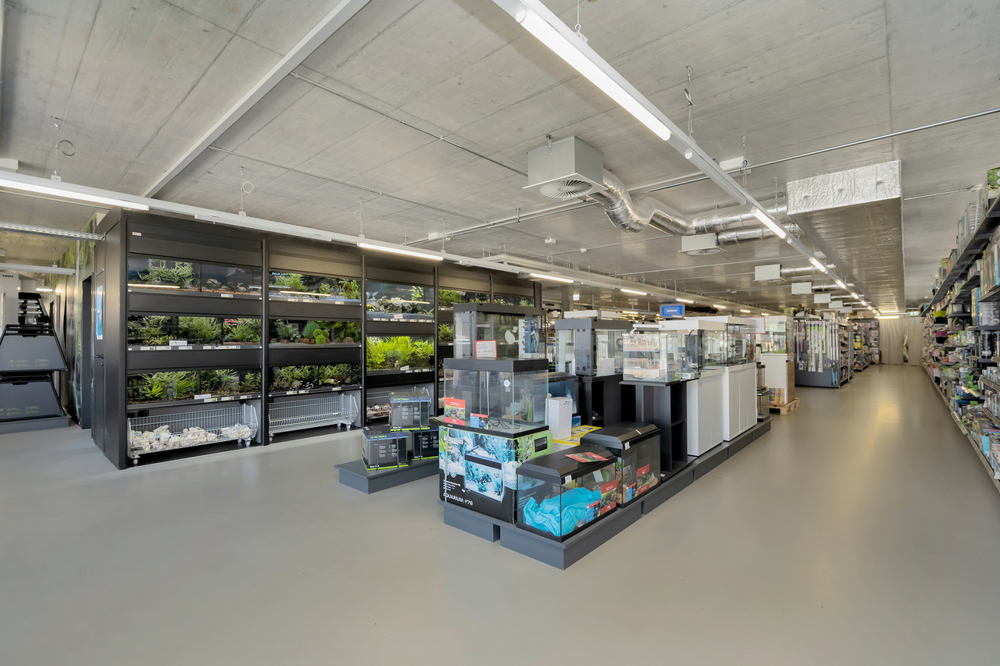
*`02.jpg`*

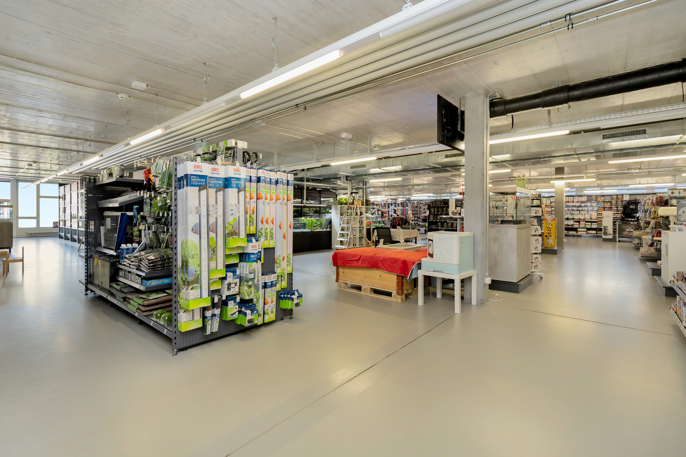
*`03.jpg`*

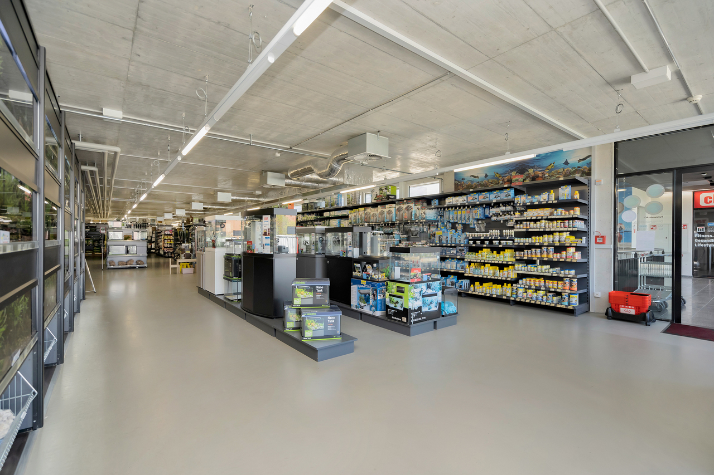
*`04.jpg`*

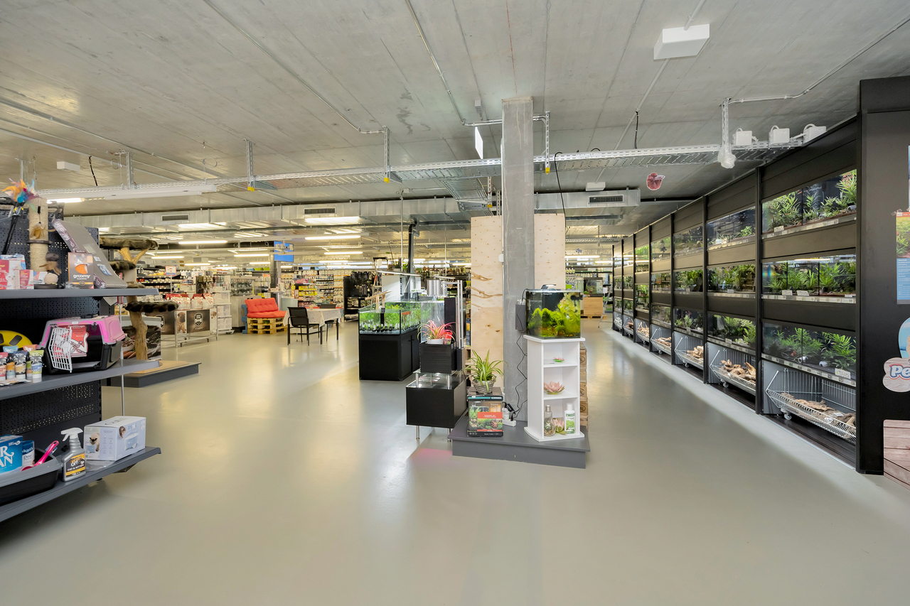
*`05.jpg`*

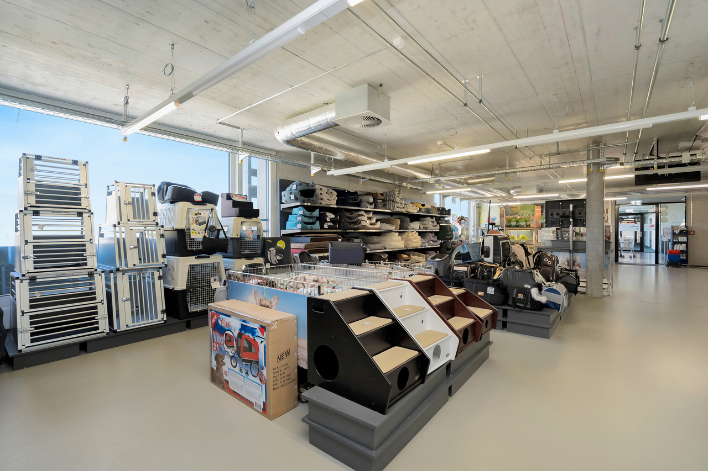
*`06.jpg`*

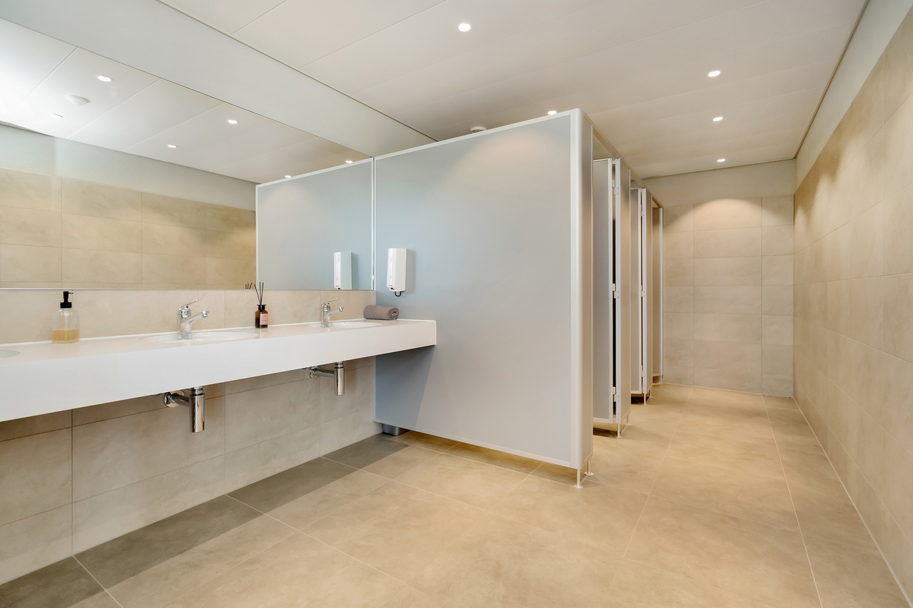
*`07.jpg`*

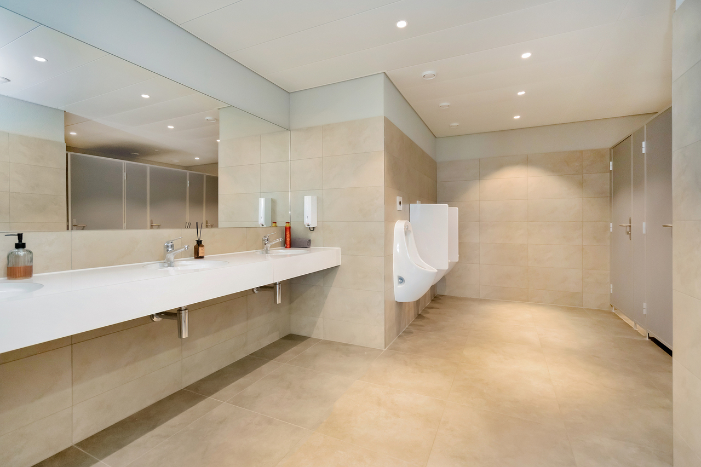
*`08.jpg`*

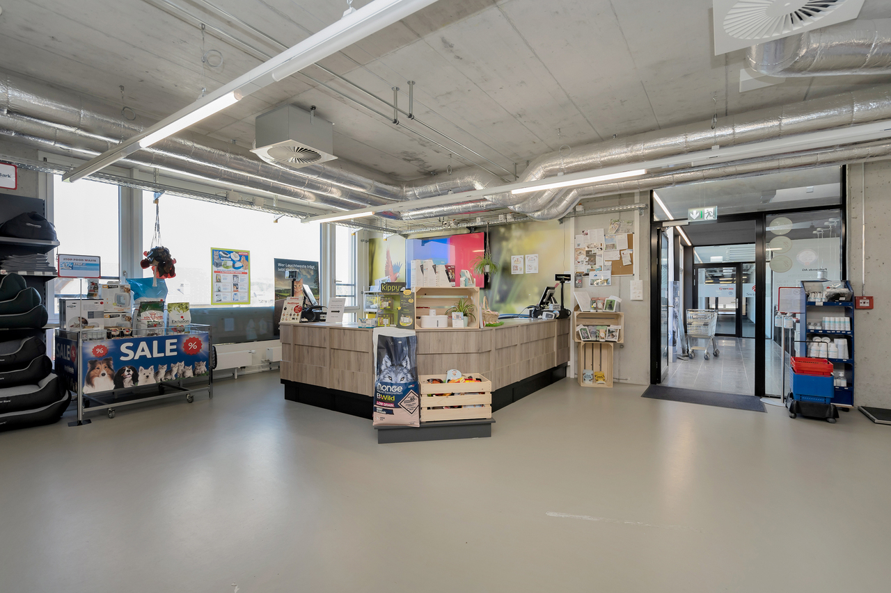
*`09.jpg`*

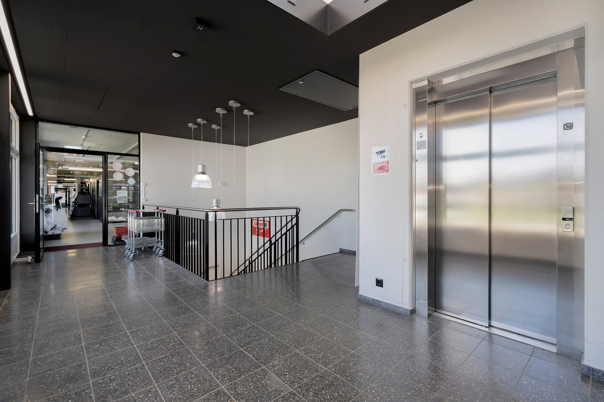
*`10.jpg`*

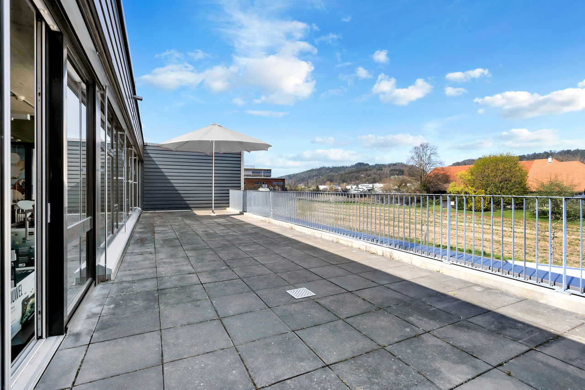
*`11.jpg`*

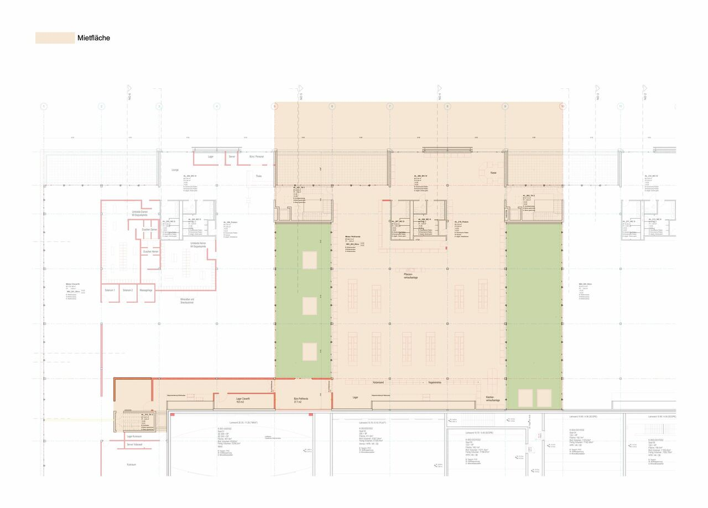
*`12.jpg`*
