# Grubenstrasse 1, 3123 Belp - CHF 8’560 inkl. NK pro Monat

> **Categorie:** `B_buero_gewerbe`  
> **Regiune:** Cantonul Berna  
> **Tip ofertă:** RENT / COMMERCIAL  
> **Sursă:** [flatfox.ch](https://flatfox.ch/de/wohnung/grubenstrasse-1-3123-belp/85501062/)  
> **Descărcat:** 2026-08-17 12:36

## Date obiect

| Câmp | Valoare |
|---|---|
| Adresă | Grubenstrasse 1, 3123 Belp |
| Categorie obiect | INDUSTRY |
| Tip obiect | COMMERCIAL |
| Chirie netă | CHF 7'460 |
| Nebenkosten | CHF 1'100 |
| Preț afișat | CHF 8'560 |
| Suprafață utilă | 532 m² |
| Etaj | 0 |
| Disponibil de la | agr |
| Referință | 22870.01.400012 |

## Texte originale (germană)

**Titlu public:** Grubenstrasse 1, 3123 Belp - CHF 8’560 inkl. NK pro Monat

**Titlu scurt:** 532m² Gewerbe

**Pitch:** 532m² Gewerbe in Belp mieten

**Titlu descriere:** Repräsentatives Büro mit Bahnhofsnähe und starker Präsenz

**Titlu chirie:** 532m² Gewerbe in Belp mieten

**Spațiu afișat:** 532

### Descriere completă

In Belp finden Sie hohe Lebens- und Arbeitsqualität: Wir bieten Ihnen ideale Rahmenbedingungen für Ihr Unternehmen. Suchen Sie ein modernes Umfeld, eine zentrale Lage mit guter Sichtbarkeit, unmittelbare Nähe zum Bahnhof, ideales Strassennetz bestehender Infrastruktur? Ihre Lösung könnte wie folgt aussehen:  
  
Wir bieten Ihnen ab sofort oder nach Vereinbarung:  
  

*   390m2 Alleinnutzung im EG _(gute Sichtbarkeit/Schaufester)_
*   142m2 (Anteilsmässig von Total 206m2) an Gemeinschaftsanlagen wie **Eingangsbereich** , **Sitzungszimmer** , **WC-Anlagen** auf beiden Stockwerken, **Cafeteria inkl. Küche** im Obergeschoss und einer **Terrasse** zur Mitbenutzung mit dem bestehendem Mieter (Anzeiger Region Bern - ein "Urbelper")
*   Einstellhallenplätze
*   Lagerraum UG von 43m2
*   Besucherparkplätze vorhanden
*   Naherholungsgebiete
*   Hervorragendes Netzwerk
*   Aktuell Glastrennwände und Teppichboden

Der Standort ist sowohl für Mitarbeitende als auch für Kunden ideal: Dank der guten ÖV-Anbindung ist eine unkomplizierte Anreise gewährleistet, während die vorhandenen Parkmöglichkeiten eine bequeme Erreichbarkeit mit dem Auto ermöglichen. Die gute Sichtbarkeit der Liegenschaft unterstützt zudem eine starke Präsenz Ihres Unternehmens. Einkaufsmöglichkeiten, Restaurants und diverse Dienstleistungsangebote befinden sich in unmittelbarer Umgebung und sorgen für zusätzlichen Komfort im Arbeitsalltag.  
  
Ist Ihr Interesse geweckt, freuen wir uns über Ihre Kontaktaufnahme. Über die Onlinekontaktanfrage-Funktion erhalten Sie Auskunft zu den Besichtigungsmöglichkeiten.

## Dotări (attributes)

- balconygarden
- lift

## Ofertant

- **Nume:** Von Graffenried AG Liegenschaften
- **Stradă:** Marktgass-Passage 3
- **NPA:** 3011
- **Localitate:** Bern

## Imagini (12)

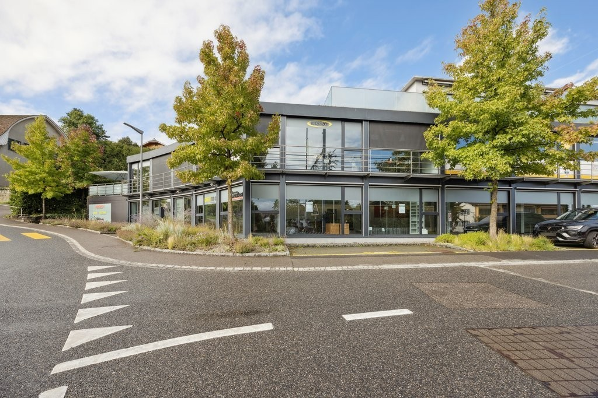
*`01.jpg` — 1024x683 px — Aussenansicht*

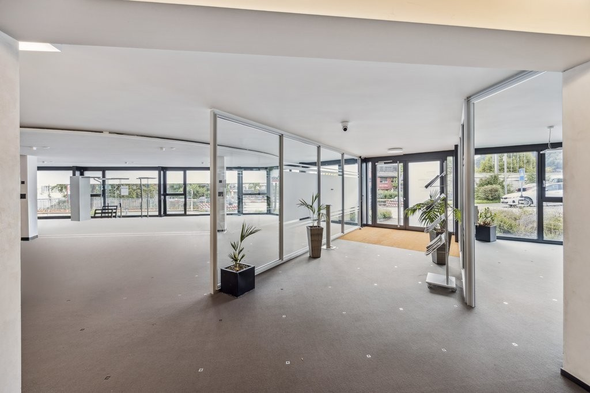
*`02.jpg` — 1024x683 px — Eingangsbereich*

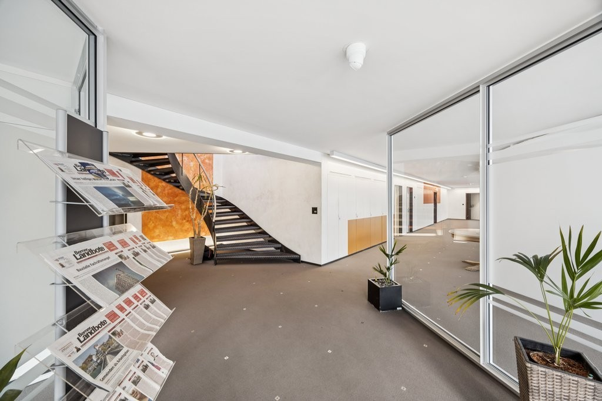
*`03.jpg` — 1024x683 px — Eingangsbereich*

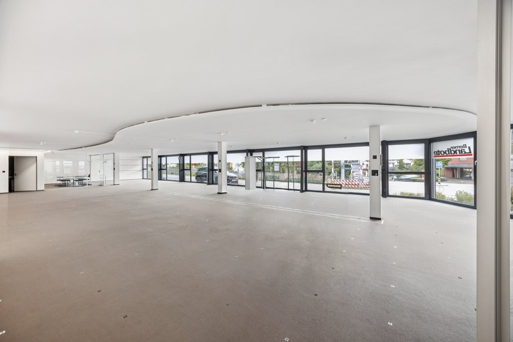
*`04.jpg` — 1024x683 px — Büroraum*

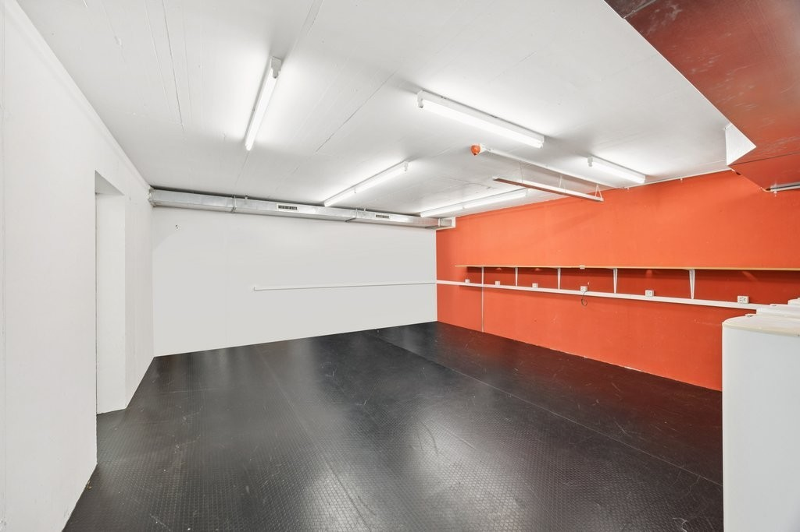
*`05.jpg` — 1024x683 px — Lagerraum*

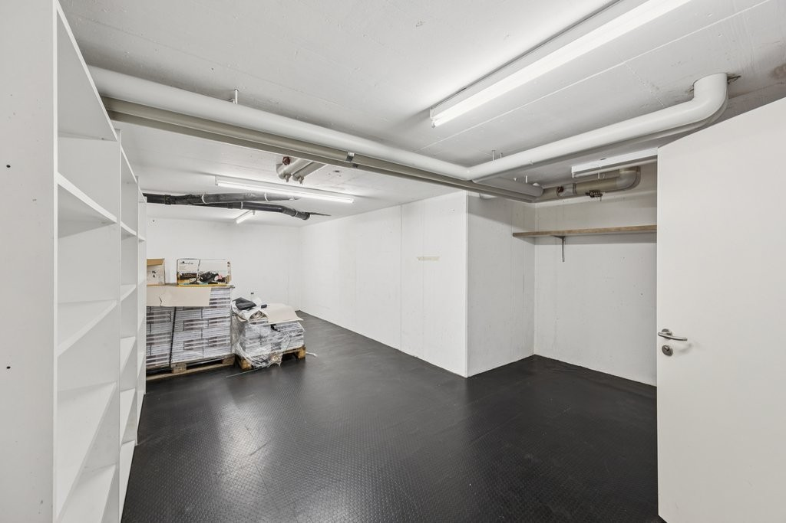
*`06.jpg` — 1024x683 px — Lagerraum 2*

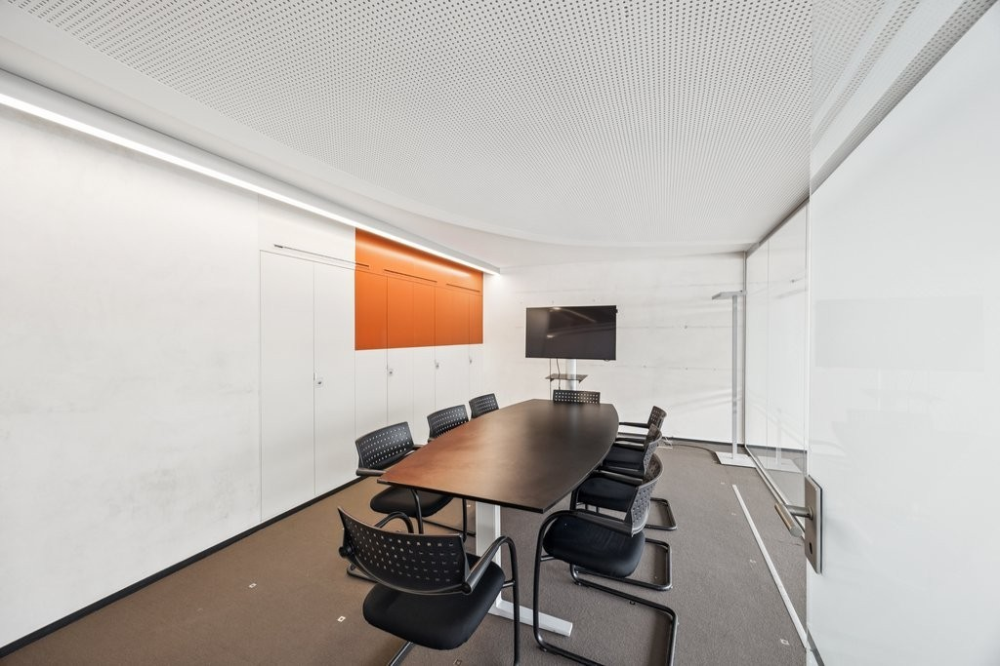
*`07.jpg` — 1024x683 px — Eigenes, mögliches Sitzungszimmer (bestehend)*

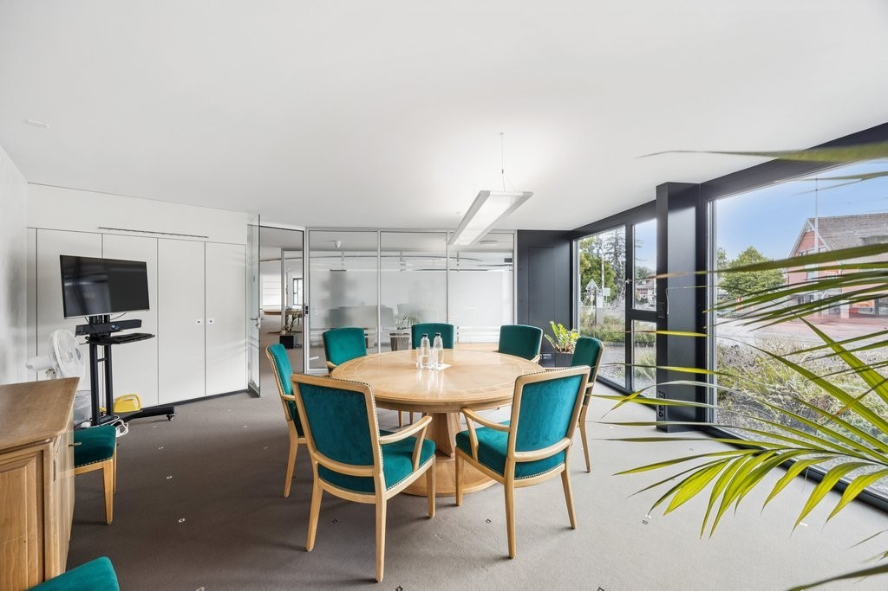
*`08.jpg` — 1024x683 px — Sitzungszimmer zur Mitbenutzung*

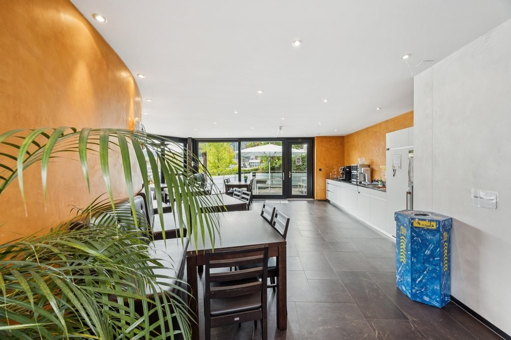
*`09.jpg` — 1024x683 px — Cafeteria zur Mitbenutzung*

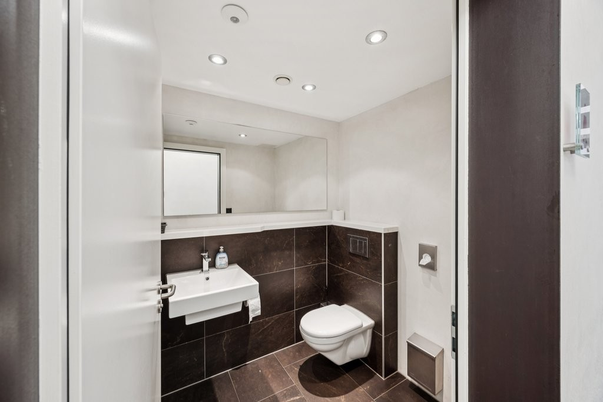
*`10.jpg` — 1024x683 px — Toilettenraum zur Mitbenutzung*

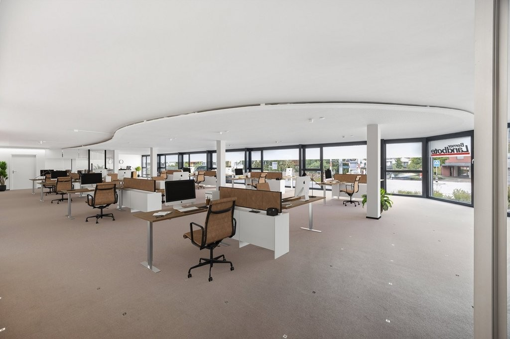
*`11.jpg` — 1024x683 px — Mögliche Nutzung (Büro)*

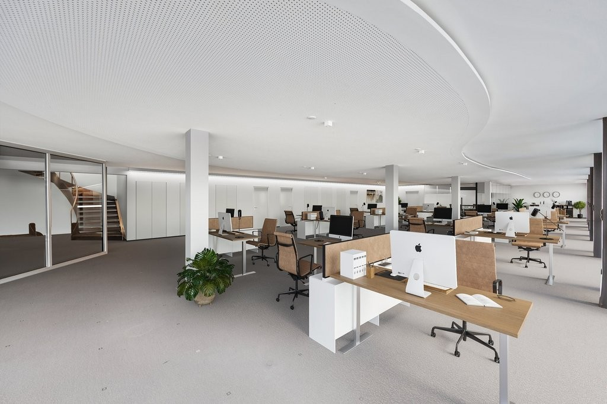
*`12.jpg` — 1024x683 px — Mögliche Nutzung (Büro)*
