# Waldeggstrasse 34, 3097 Köniz - auf Anfrage

> **Categorie:** `B_buero_gewerbe`  
> **Regiune:** Cantonul Berna  
> **Tip ofertă:** RENT / COMMERCIAL  
> **Relevant pentru praxis:** da (praxen)  
> **Sursă:** [flatfox.ch](https://flatfox.ch/de/wohnung/waldeggstrasse-34-3097-koniz/85588803/)  
> **Descărcat:** 2026-08-17 12:26

## Date obiect

| Câmp | Valoare |
|---|---|
| Adresă | Waldeggstrasse 34, 3097 Köniz |
| Categorie obiect | INDUSTRY |
| Tip obiect | COMMERCIAL |
| Suprafață utilă | 580 m² |
| Etaj | 0 |
| Disponibil de la | agr |
| Referință | 575..be8r9.e9d8i |

## Texte originale (germană)

**Titlu public:** Waldeggstrasse 34, 3097 Köniz - auf Anfrage

**Titlu scurt:** 580m² Gewerbe

**Pitch:** 580m² Gewerbe in Köniz mieten

**Titlu descriere:** Moderne Gewerberäume in Liebefeld

**Titlu chirie:** 580m² Gewerbe in Köniz mieten

**Spațiu afișat:** 580

### Descriere completă

Erleben Sie eine moderne und flexible Gewerbefläche von 580 m² im Erdgeschoss, die in Sachen Ausstattung und Nachhaltigkeit keine Wünsche offen lässt. Die Liegenschaft überzeugt mit einer zeitgemässen Architektur. 

Hier die Highlights kurz zusammengefasst: 

  * Offene und helle Räume bieten vielfältige Nutzungsmöglichkeiten. Ideal geeignet für Büros, Praxen oder andere gewerbliche Zwecke. Die Räume werden unmöbliert vermietet. 

  * Die lichtdurchfluteten Räume mit Glaswänden und die bodentiefen Fenster sorgen für ein angenehmes Arbeitsumfeld und optimierte Lichtverhältnisse. 

  * Die Mietfläche ist mit einer Teeküche sowie einer separaten Küche ausgestattet. 

  * Die Räumlichkeiten verfügen über eine barrierefreie Toilette sowie eine Toilette mit 2 WCs und einem Pissoir. 

  * Genügend Lagerflächen sind im Untergeschoss verfügbar. 

  * Die ansprechende Aussenfläche im Innenhof gehört teilweise zur Mietfläche und kann individuell genutzt werden. 

**Lage und Anbindung**

Die Gewerbefläche liegt in einer ruhigen und dennoch hervorragend erschlossenen Umgebung. Die Bushaltestellen „Liebefeld“ und „Sportweg“ sind in nur wenigen Minuten zu Fuss erreichbar. Supermärkte und Restaurants befinden sind nur wenige Gehminuten entfernt. Diese Lage garantiert eine schnelle Erreichbarkeit von Dienstleistern und eine ausgezeichnete Anbindung an öffentliche Verkehrsmittel. 

Diese Gewerbefläche eignet sich ideal für eine Vielzahl von Geschäftsmodellen. Die Kombination aus flexibler Raumaufteilung, modernster Ausstattung und der nachhaltigen Minergie-Bauweise ermöglicht Ihnen ein effizientes und zukunftsorientiertes Arbeiten in einem attraktiven Umfeld. 

Wir freuen uns auf Ihre Kontaktaufnahme.

## Dotări (attributes)

- minergie
- parkingspace
- view
- garage
- balconygarden
- lift

## Ofertant

- **Nume:** Zollinger Immobilien AG
- **Stradă:** Worbstrasse 237
- **NPA:** 3073
- **Localitate:** Gümligen

## Imagini (14)

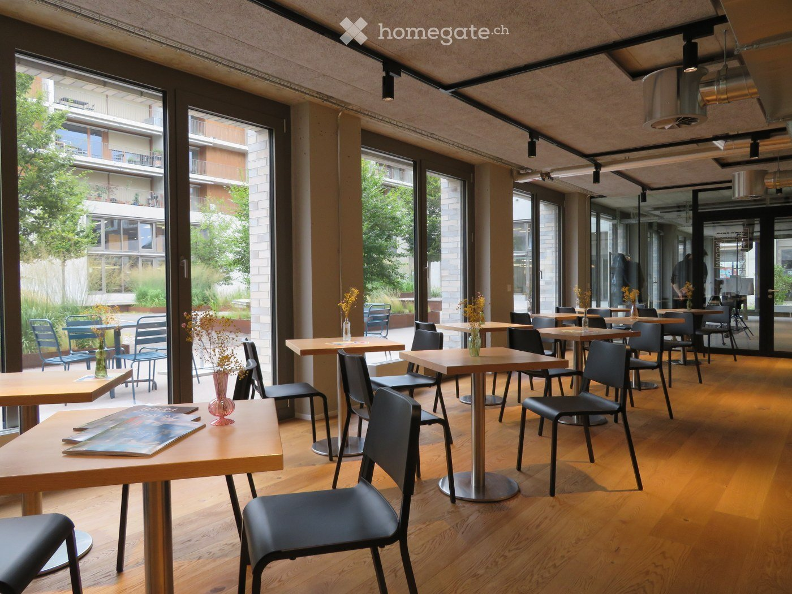
*`01.jpg` — 1400x1050 px — Wooden floor, modern chairs and tables, full length glass windows, plants outside*

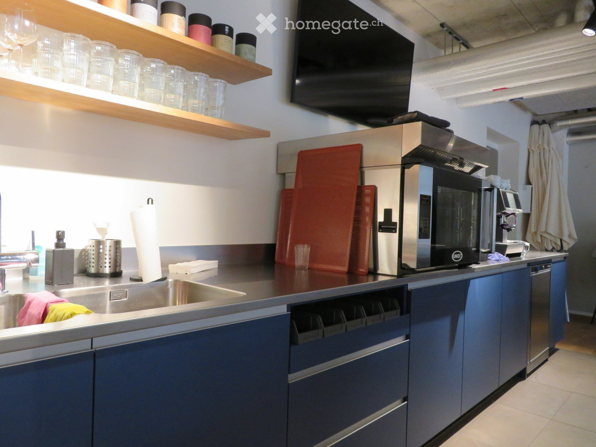
*`02.jpg` — 1400x1050 px — modern kitchen with a dishwasher, sink, cabinets, appliances, countertop*

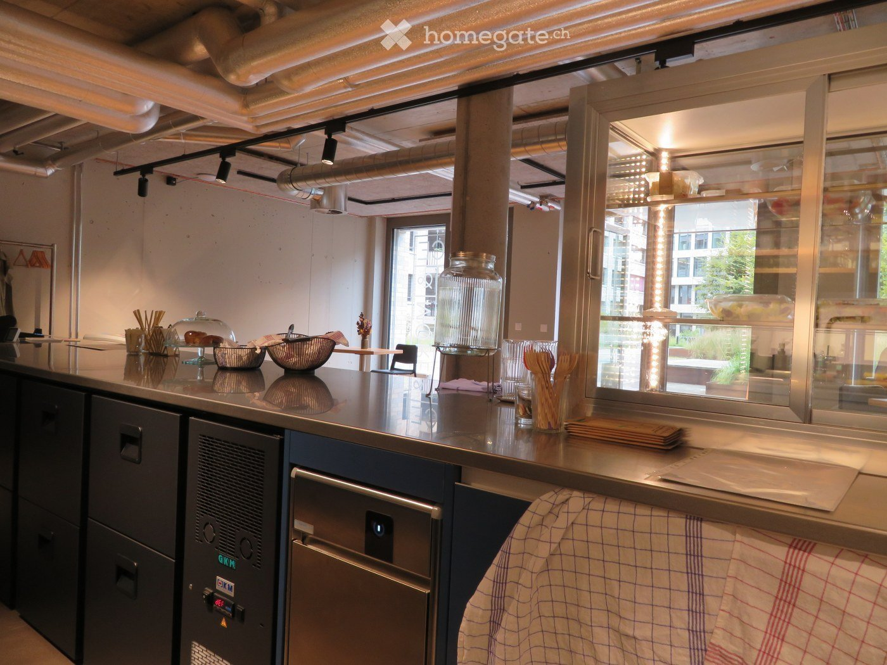
*`03.jpg` — 1400x1050 px — modern kitchen with stainless steel countertops, various kitchen utensils, cabinet drawers, a dishwasher, a large glass door with shelves, and a hanging rack.*

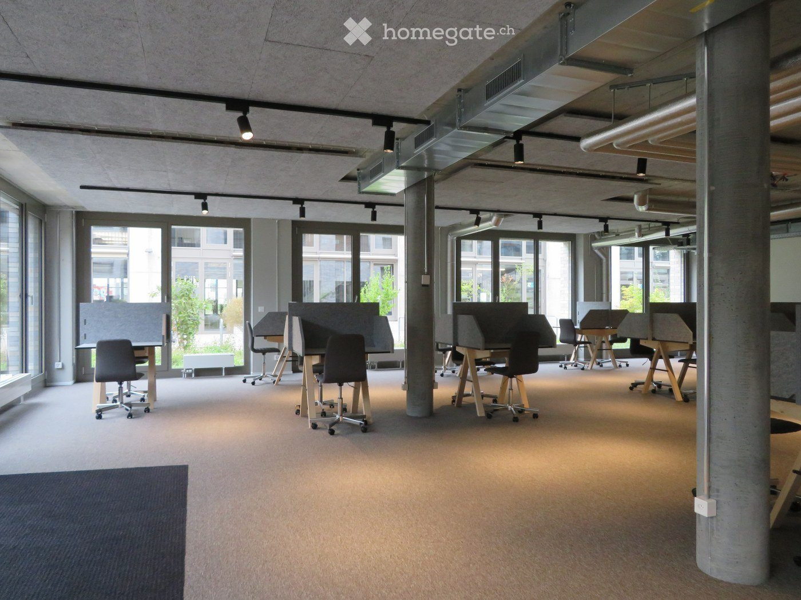
*`04.jpg` — 1400x1050 px — modern office design, carpeted floor, adjustable desks, metal columns, large windows*

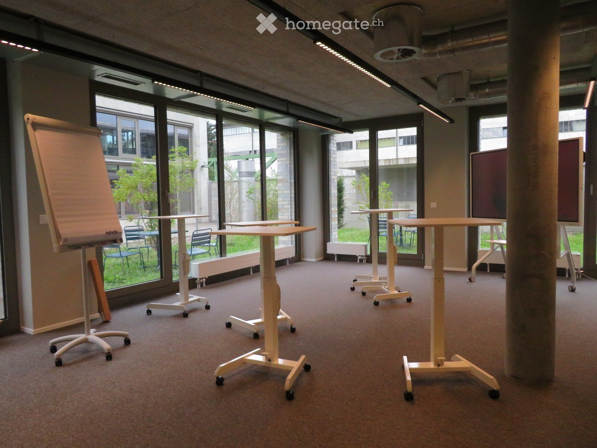
*`05.jpg` — 1400x1050 px — modern meeting room with adjustable height desks, large windows, whiteboard, projectors, movable chairs, carpet flooring*

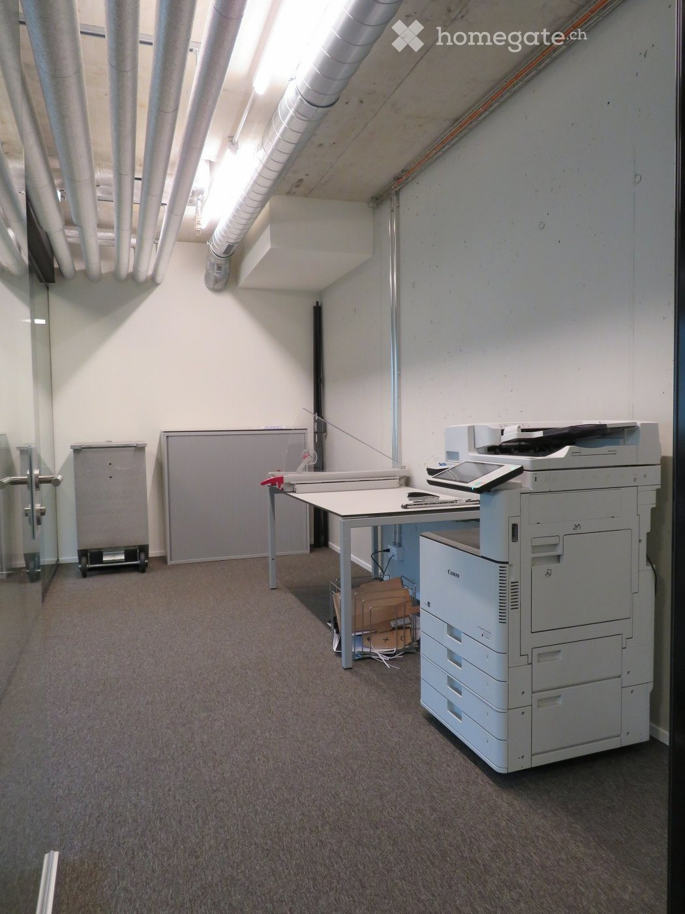
*`06.jpg` — 1050x1400 px — Empty office space with a printer, a desk, a storage box, and an industrial cart. White walls and ceiling with visible piping. Carpeted floor.*

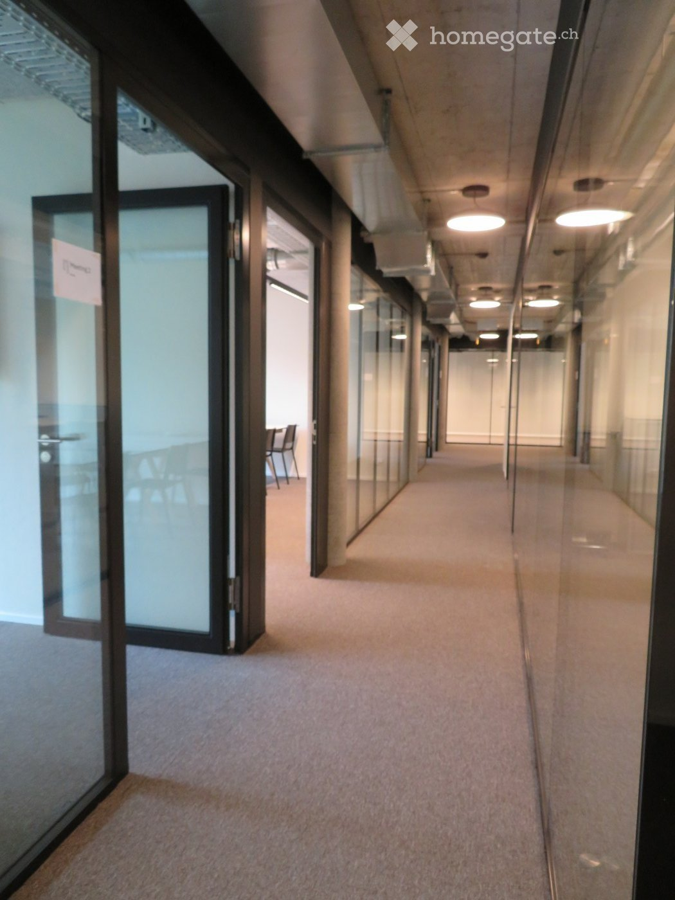
*`07.jpg` — 1050x1400 px — Empty hallway, glass walls, ceiling lights, carpeted floor, an open door.*

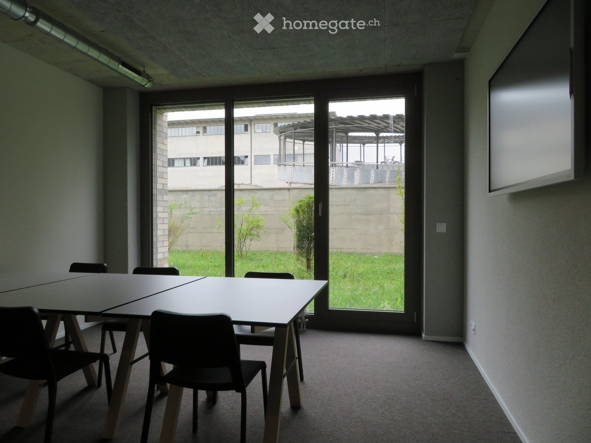
*`08.jpg` — 1400x1050 px — empty room with tables and chairs, large glass doors, view to garden and buildings*

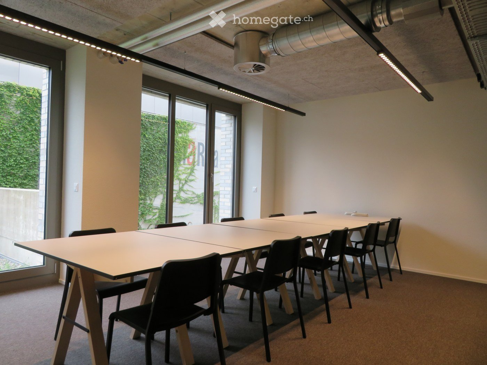
*`09.jpg` — 1400x1050 px — Empty meeting room, long table, white chairs, large windows, white walls, dark brown carpet, ceiling lighting*

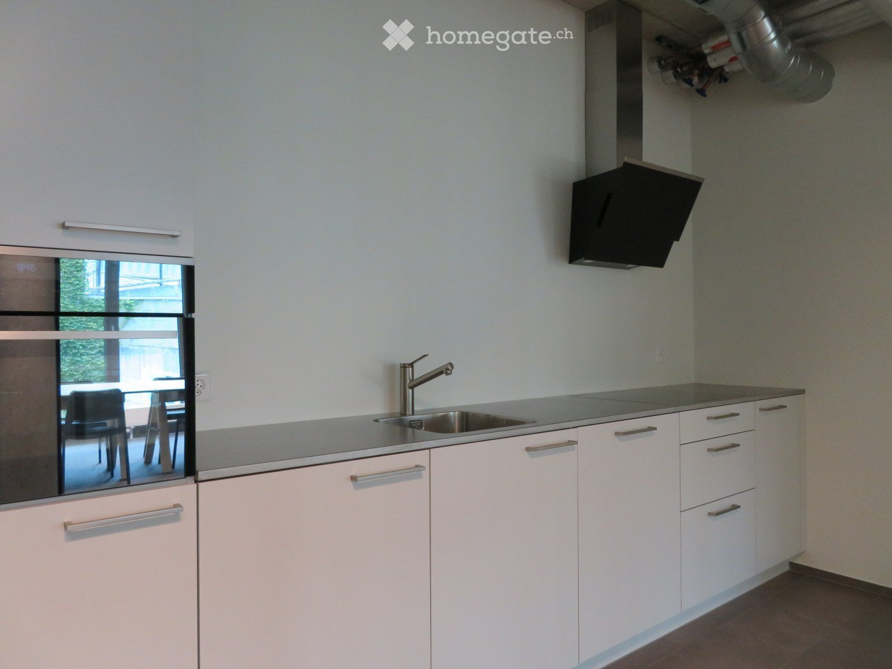
*`10.jpg` — 1400x1050 px — modern kitchen, white cabinets, stainless steel countertop, sink, gas stove, oven, dishwasher, extractor hood, floor lamp*

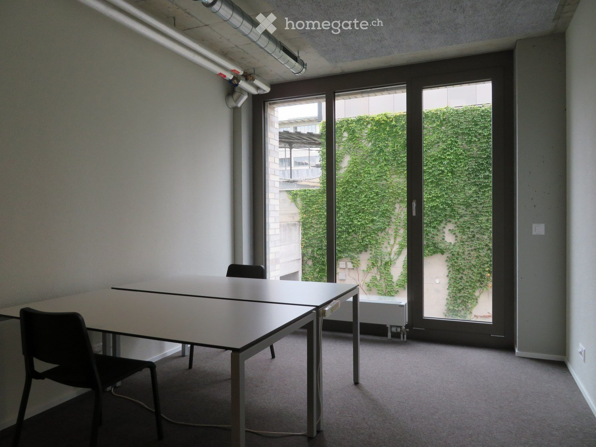
*`11.jpg` — 1400x1050 px — empty office with two tables, sliding door, ivy covered wall outside, power outlets on walls*

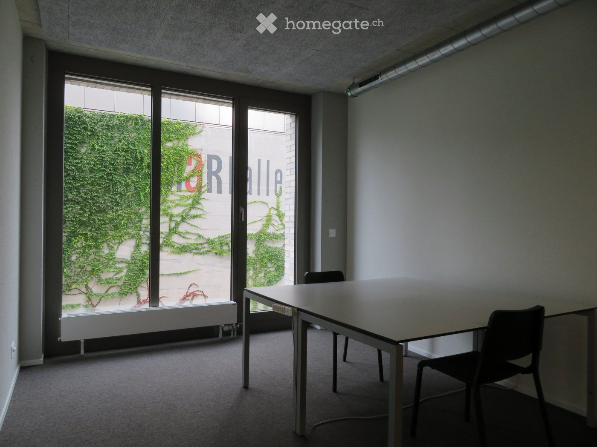
*`12.jpg` — 1400x1050 px — The room is empty, featuring a white desk and two chairs in front of the windows. There is also a white bench under the windows and a radiator is placed on the left side of the window.*

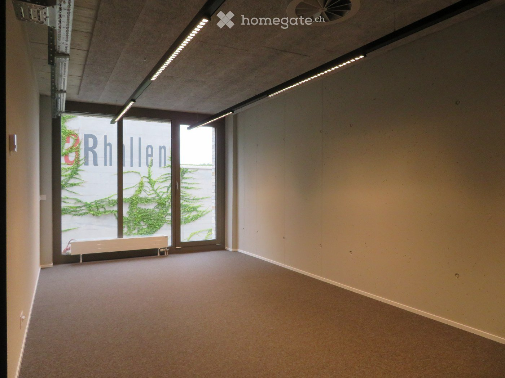
*`13.jpg` — 1400x1050 px — empty room, white walls, carpet floor, large windows, ceiling lights*

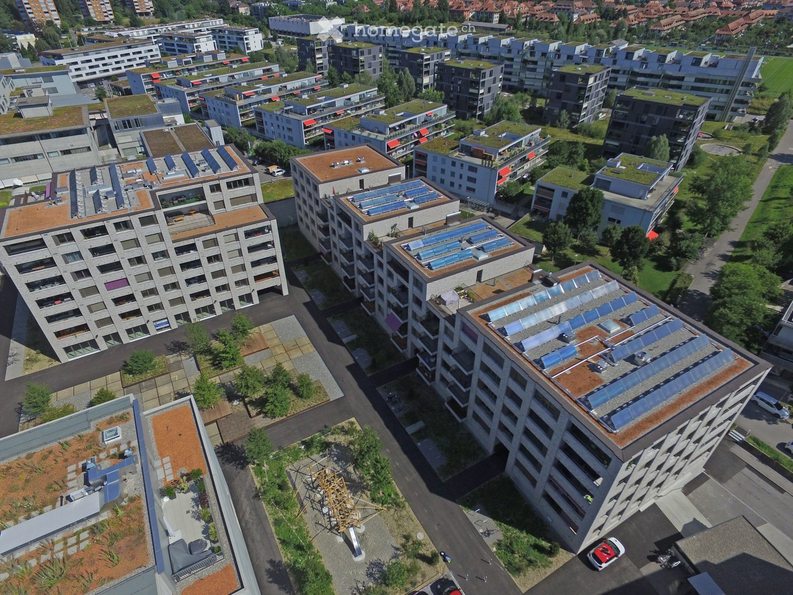
*`14.jpg` — 1500x1125 px — Several residential buildings, multiple solar panels on rooftops, green roofs, balconies, and terraces, large central garden, clear views of surrounding buildings*

## Media suplimentară

- **website_url:** https://www.livingandmore-liebefeld.ch/de/10035/?oid=10100&lang=de
