# Parkstrasse 11a, 3014 Bern - CHF 2’400 inkl. NK pro Monat

> **Categorie:** `B_buero_gewerbe`  
> **Regiune:** Berna (oraș)  
> **Tip ofertă:** RENT / SHOP  
> **Sursă:** [flatfox.ch](https://flatfox.ch/de/wohnung/parkstrasse-11a-3014-bern/85589720/)  
> **Descărcat:** 2026-08-17 12:28

## Date obiect

| Câmp | Valoare |
|---|---|
| Adresă | Parkstrasse 11a, 3014 Bern |
| Categorie obiect | INDUSTRY |
| Tip obiect | SHOP |
| Chirie netă | CHF 2'200 |
| Nebenkosten | CHF 200 |
| Chirie brută | CHF 2'400 |
| Preț afișat | CHF 2'400 |
| Suprafață utilă | 146 m² |
| Etaj | 0 |
| Disponibil de la | agr |
| Referință | 26027.01.6004 |

## Texte originale (germană)

**Titlu public:** Parkstrasse 11a, 3014 Bern - CHF 2’400 inkl. NK pro Monat

**Titlu scurt:** 146m² Ladenfläche

**Pitch:** 146m² Ladenfläche in Bern mieten

**Titlu descriere:** An bester Lage: 145.5m2 bezugsbereite Laden-/Bürofläche

**Titlu chirie:** 146m² Ladenfläche in Bern mieten

**Spațiu afișat:** 146

### Descriere completă

An gut frequentierter Zentrumslage in Bern steht diese vielseitig nutzbare Laden-/Bürofläche zum Bezug bereit. Viele Einkaufsmöglichkeiten in unmittelbarer Umgebung sowie eine gute ÖV-Anbindung zeichnen diesen Standort aus.   
  
Die Mietfläche eignet sich für die Nutzung durch Mieter unterschiedlichster Branchen im Dienstleistungssektor und auch als Verkaufsgeschäft. Die offene Raumgestaltung bietet die Möglichkeit die unterschiedlichsten Anpassungswünsche zu realisieren.   
  
Gut fürs Geschäft:   
\- Sämtliche Anschlüsse vorhanden   
\- Ausbau kann individuell gestaltet werden   
\- Zugang via Rodtmattstrasse   
\- helle und attraktive Gewerbefläche   
\- grosse Schaufensterfläche   
\- gemeinschaftliche Toilette   
\- Einstellhallenplätze können dazu gemietet werden   
  
Der Mietzins versteht sich zzgl. MwSt.   
  
**Ihre Vorteile mit Regimo Business:**   
1\. Individuelle Mietpreis- und Vertragsmodelle.   
2\. Beratung und Unterstützung beim Innenausbau.   
3\. Persönliche Betreuung und hohe Flexibilität im Hinblick auf Mieterwünsche während der gesamten Vertragsdauer.   
  
Haben wir Ihr Interesse geweckt? Dann zögern Sie nicht und kontaktieren Sie uns, um einen individuellen Besichtigungstermin zu vereinbaren.

## Dotări (attributes)

- lift

## Ofertant

- **Nume:** Regimo Bern
- **Stradă:** Thunstrasse 32
- **NPA:** 3005
- **Localitate:** Bern

## Imagini (11)

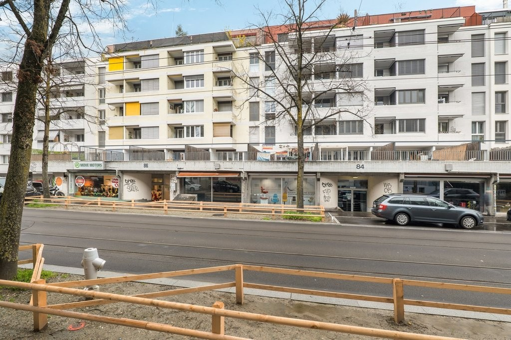
*`01.jpg` — 1024x683 px — Gebäude*

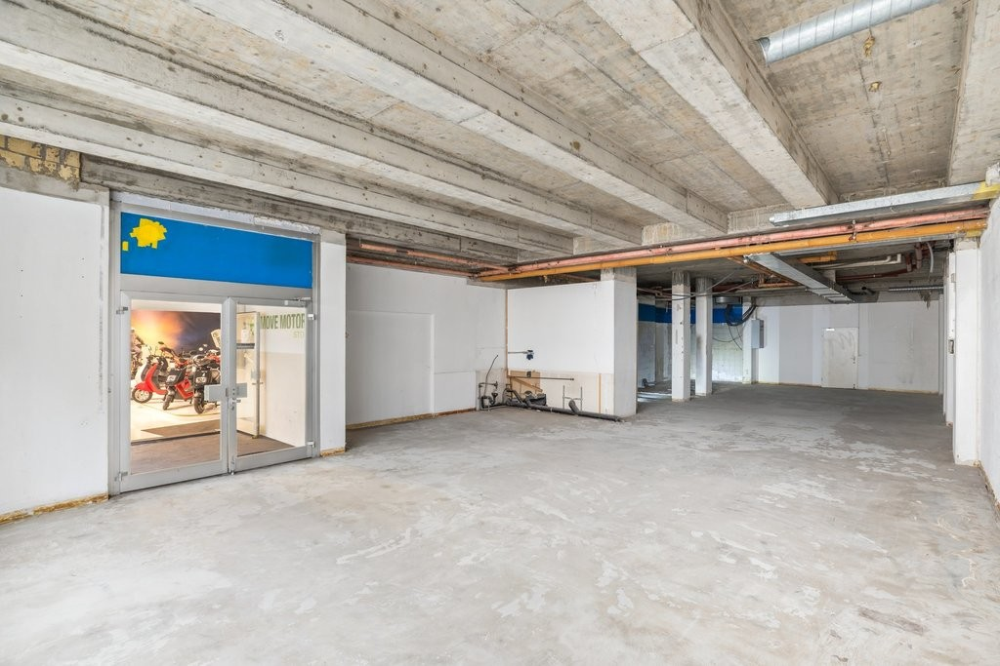
*`02.jpg` — 1024x683 px — Rohbau*

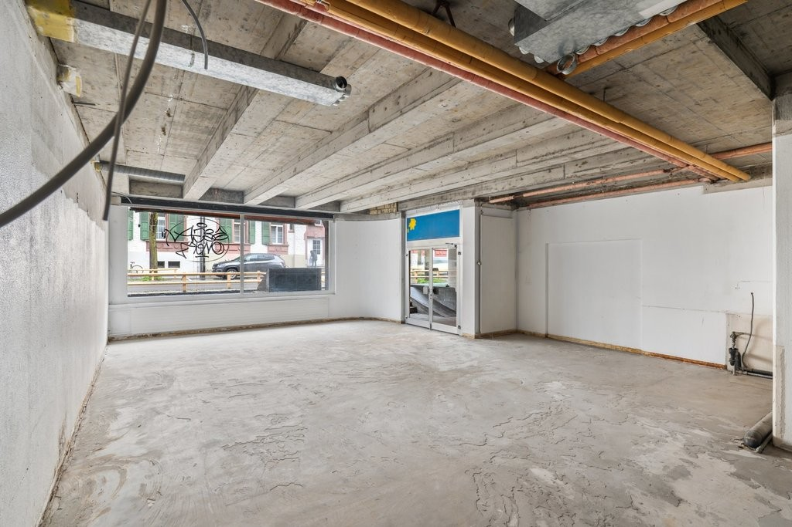
*`03.jpg` — 1024x683 px — Rohbau*

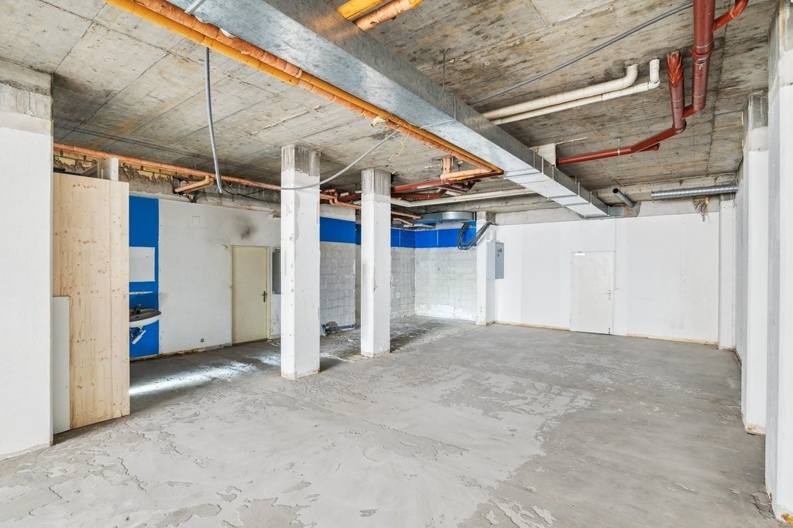
*`04.jpg` — 1024x683 px — Rohbau*

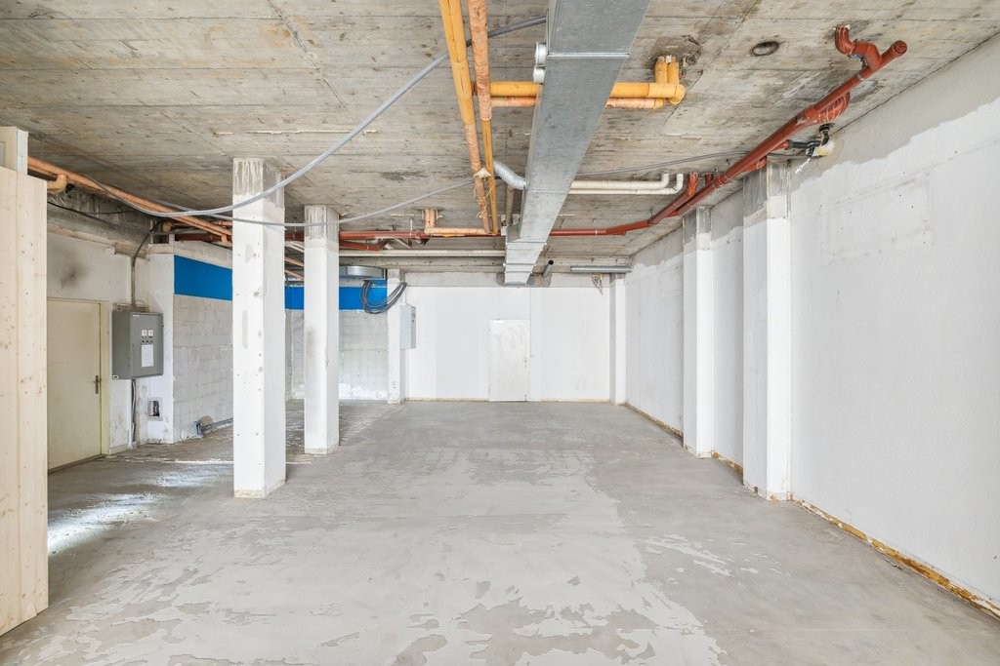
*`05.jpg` — 1024x683 px — Rohbau*

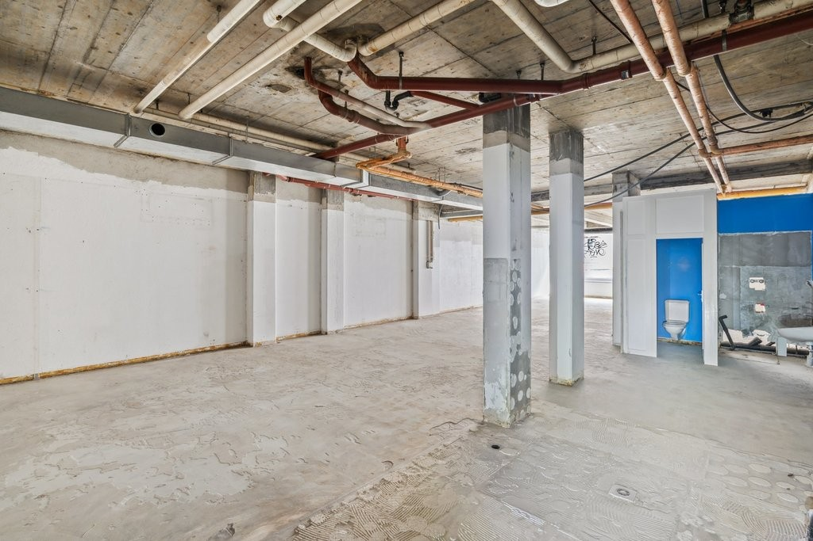
*`06.jpg` — 1024x683 px — Rohbau*

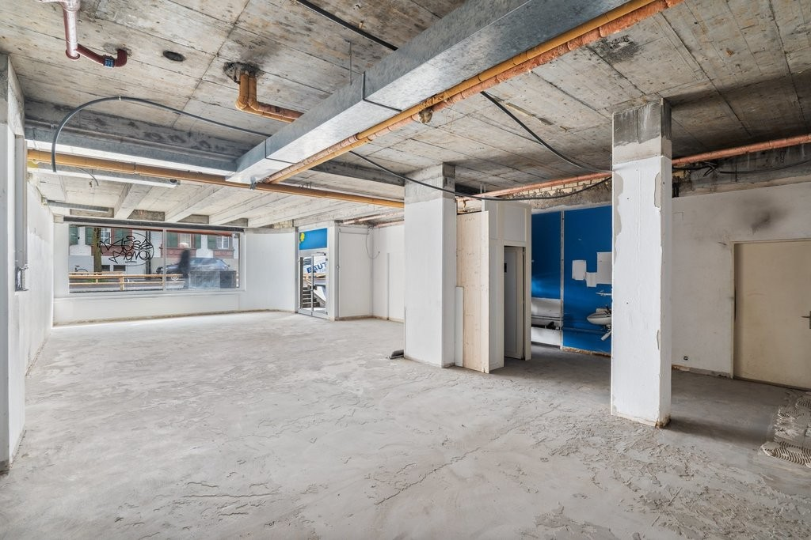
*`07.jpg` — 1024x683 px — Rohbau*

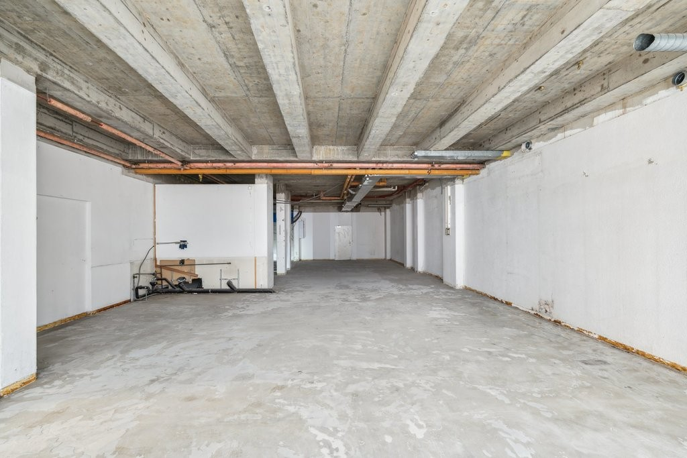
*`08.jpg` — 1024x683 px — Rohbau*

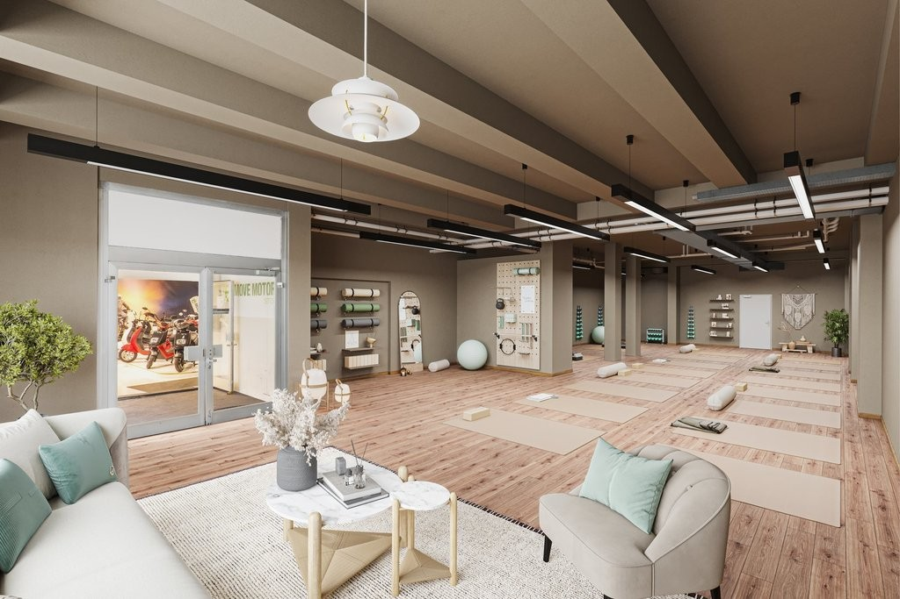
*`09.jpg` — 1024x683 px — Staging*

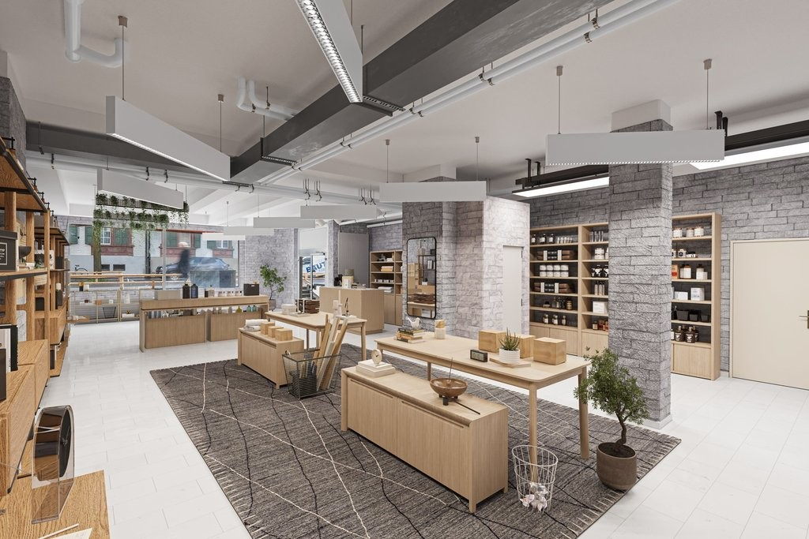
*`10.jpg` — 1024x683 px — Staging*

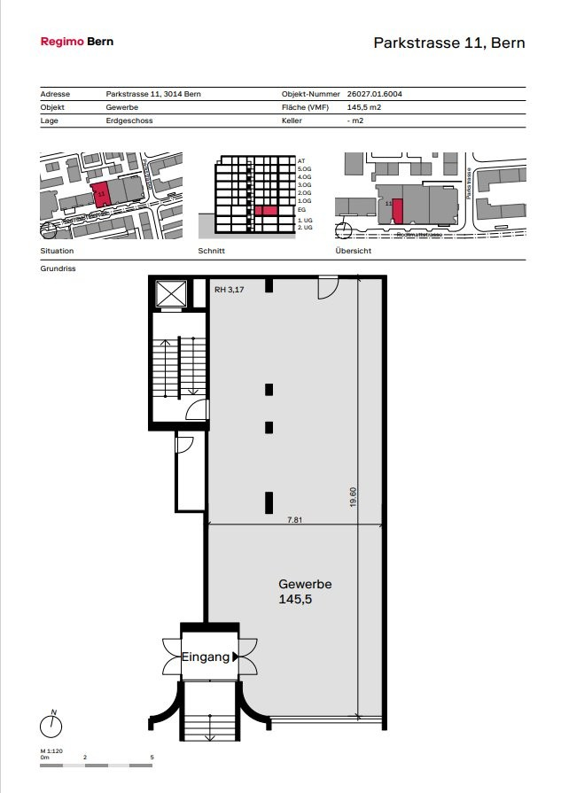
*`11.jpg` — 633x895 px — Vermietungsplan*
