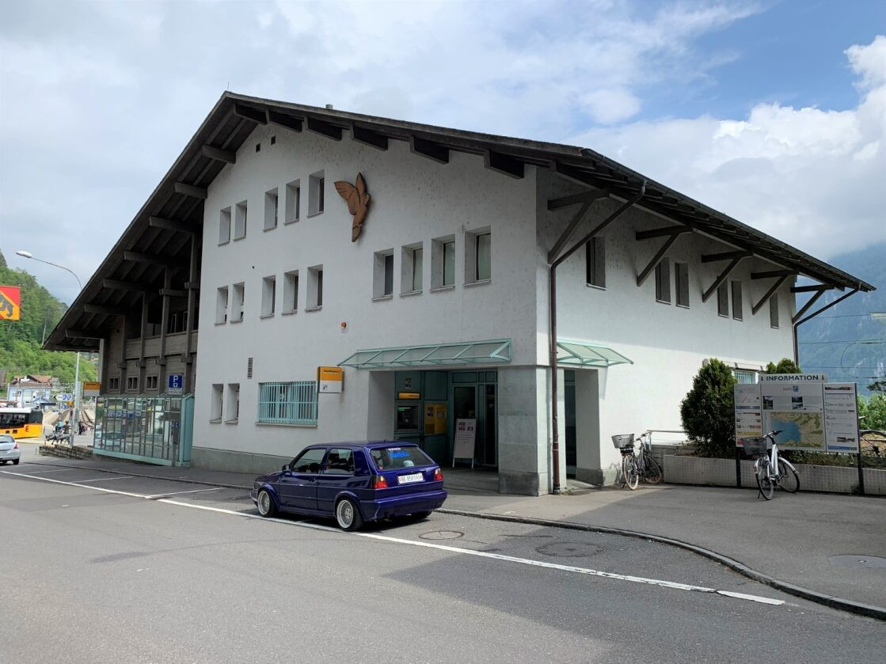
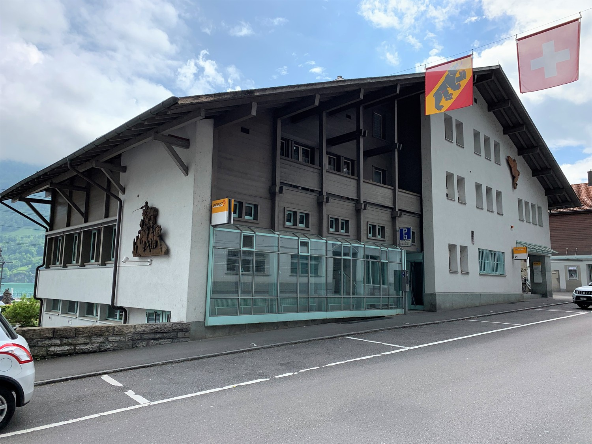
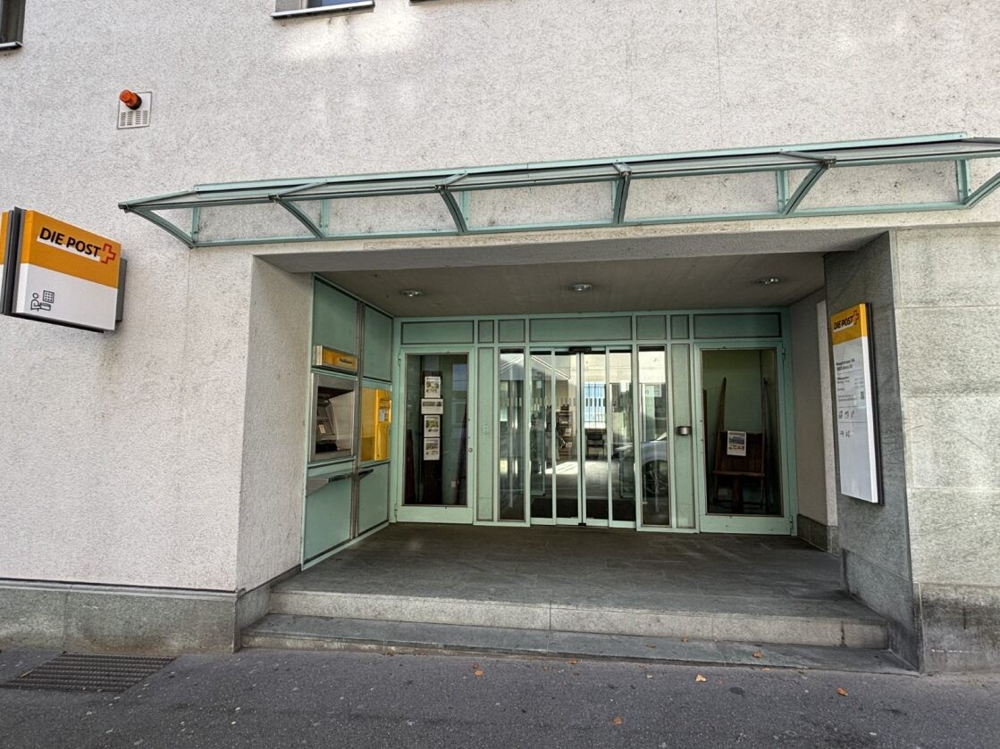
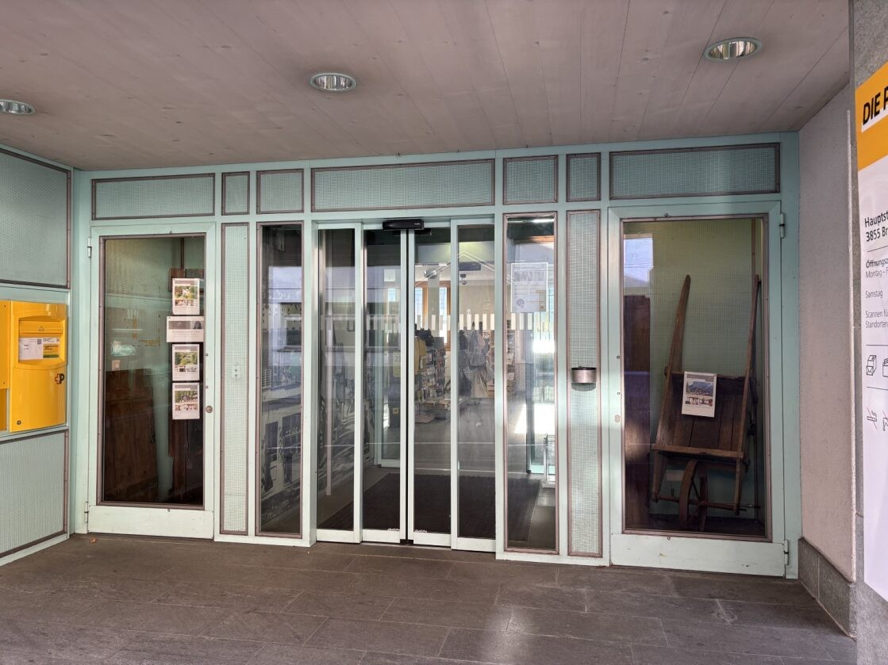
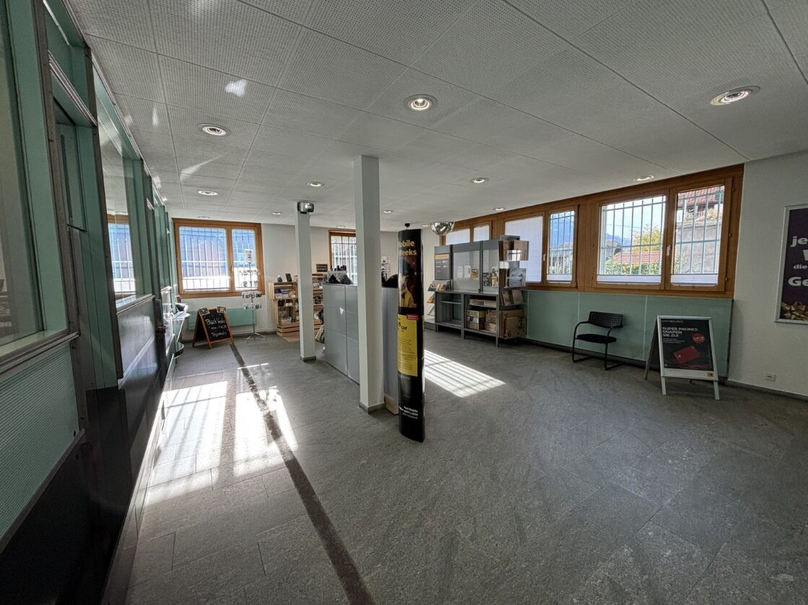
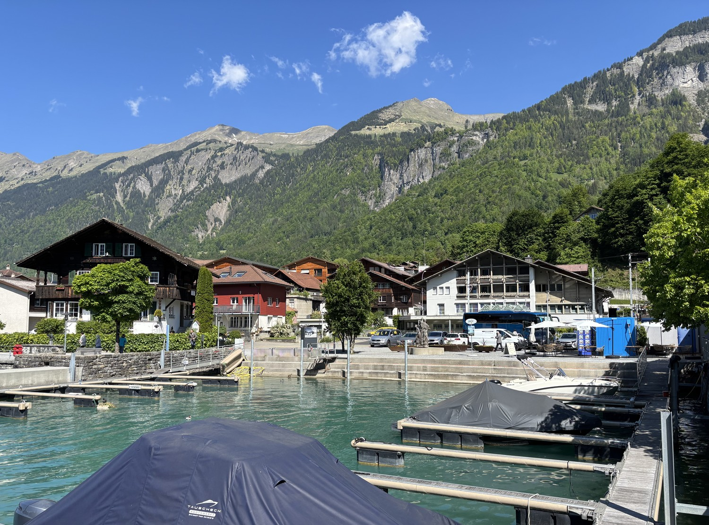
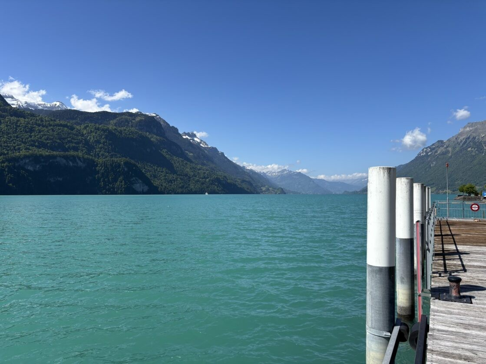

# Hauptstrasse 144, 3855 Brienz BE - CHF 189 inkl. NK pro m² / Jahr

> **Categorie:** `B_buero_gewerbe`  
> **Regiune:** Cantonul Berna  
> **Tip ofertă:** RENT / SHOP  
> **Relevant pentru praxis:** da (praxis)  
> **Sursă:** [flatfox.ch](https://flatfox.ch/de/wohnung/hauptstrasse-144-3855-brienz-be/85602999/)  
> **Descărcat:** 2026-08-17 12:33

## Date obiect

| Câmp | Valoare |
|---|---|
| Adresă | Hauptstrasse 144, 3855 Brienz BE |
| Categorie obiect | INDUSTRY |
| Tip obiect | SHOP |
| Chirie netă | CHF 170 |
| Nebenkosten | CHF 19 |
| Preț afișat | CHF 189 |
| Suprafață utilă | 185 m² |
| Etaj | 0 |
| An renovare | 2026 |
| Disponibil de la | 2026-12-01 |
| Referință | WE 890..Geschäft 185 m2 |

## Texte originale (germană)

**Titlu public:** Hauptstrasse 144, 3855 Brienz BE - CHF 189 inkl. NK pro m² / Jahr

**Titlu scurt:** 185m² Ladenfläche

**Pitch:** 185m² Ladenfläche in Brienz BE mieten

**Titlu descriere:** Beste Lage: Top Geschäftslokal in Brienz

**Titlu chirie:** 185m² Ladenfläche in Brienz BE mieten

**Spațiu afișat:** 185

### Descriere completă

Grosszügiges, helles und komplett ausgebautes Geschäftslokal von 185 m² im Erdgeschoss:  
  

*   Beste Lage direkt bei den Touristenströmen zwischen Bahnhof, Schiffländte, Brienzer Rothornbahn, Postautostation und Tourismusbüro.
*   Gute Passantenlage dank vielen Geschäftslokalen in unmittelbarer Umgebung (Post, Banken, Coop, diverse Detaillisten und Restaurants).
*   Ideale Fläche für Ihr Business: Verkauf, Souveniers, Dienstleistungen, Büro, IT, Schulungen, Praxis, Fitness, Therapien, etc.
*   Einladender Kundeneingang mit automatischer Schiebetüre
*   Helle Räume mit viel Tageslicht, rundherum Fenster mit prächtiger See- und Bergsicht (Gitter werden entfernt).
*   Grosszügige Fläche ohne Zwischenwände. Daher sind der Nutzung kaum Grenzen gesetzt.
*   WC-Anlage im EG
*   Sanft und frisch renoviert 2026
*   Kundenparkplätze direkt vor dem Eingang
*   Bei Bedarf können 1-2 Mitarbeiter-Parkplätze dazu gemietet werden

Attraktiver Mietzins!  
Mietzins: CHF 2'620.-/Monat  
Nebenkosten: CHF 300.-/Monat  
8.1% MWST: CHF 236.-/Monat  
Total: CHF 3'156.-/Monat  
  
Mietzins und Nebenkosten unterliegen der MWST. Diese kann von MWST-pflichtigen Mietern zurückgefordert werden und fällt somit wieder weg. Das Mietzinsdepot von 6 Monatsmieten kann auch als Bankgarantie geleistet werden.  
  
Für eine Besichtigung vor Ort stehen wir gerne zur Verfügung. Wir freuen uns auf Ihren Anruf.

## Dotări (attributes)

- parkingspace
- accessiblewithwheelchair
- view

## Ofertant

- **Nume:** Post Immobilien M&S AG
- **Stradă:** Wankdorfallee 4
- **NPA:** 3030
- **Localitate:** Bern

## Imagini (7)

*`01.jpg` — 1119x839 px*

*`02.jpg` — 1500x1125 px*

*`03.jpg` — 1119x839 px*

*`04.jpg` — 1119x839 px*

*`05.jpg` — 1119x839 px*

*`06.jpg` — 1500x1112 px*

*`07.jpg` — 1119x839 px*
