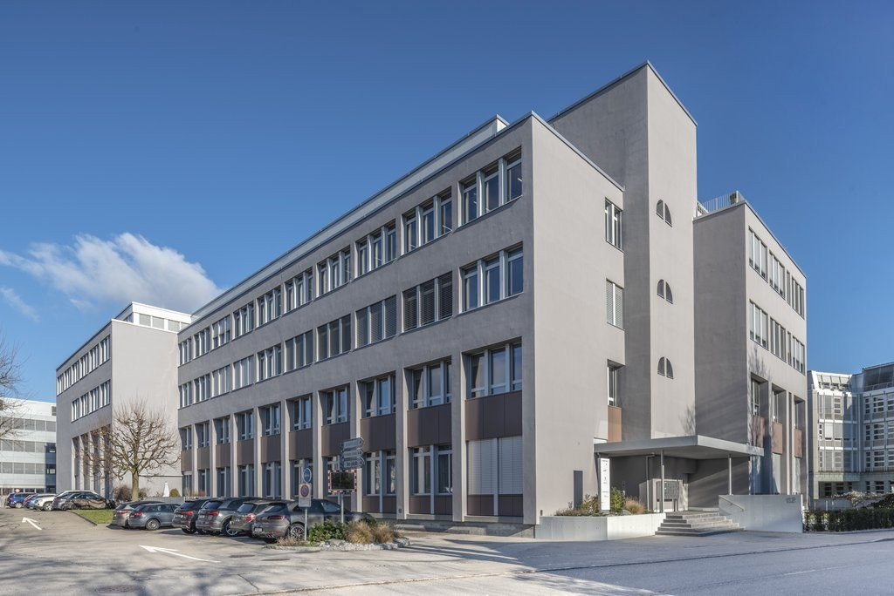
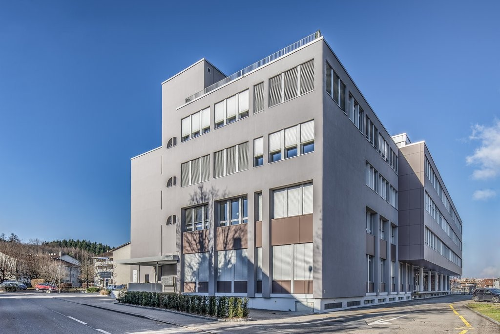
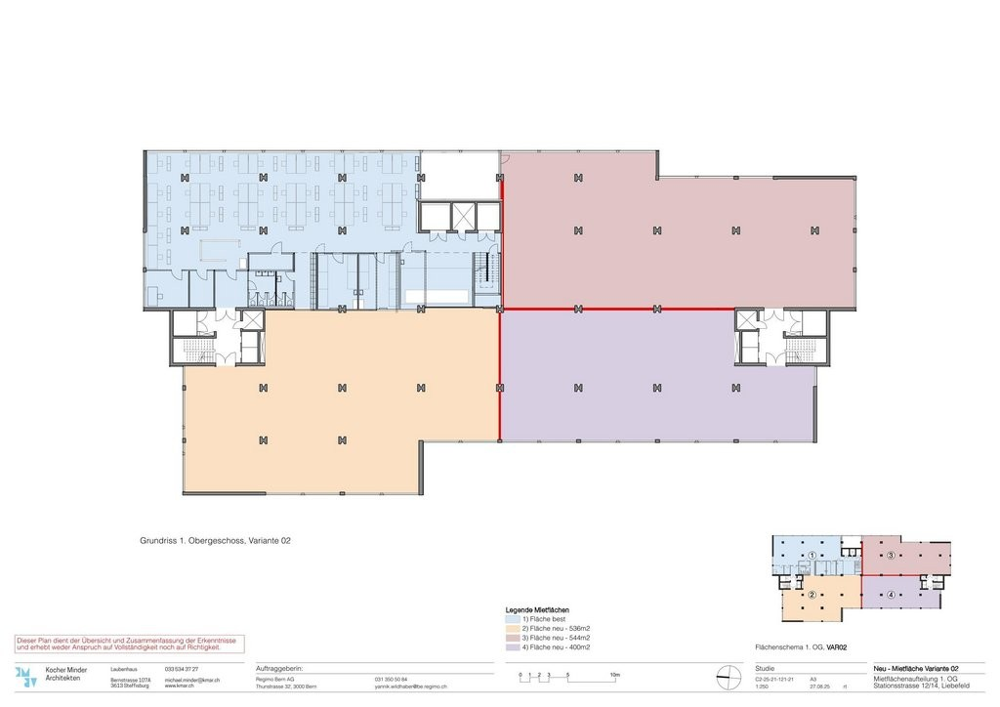

# Stationsstrasse 12, 3097 Liebefeld - CHF 185 inkl. NK pro m² / Jahr

> **Categorie:** `B_buero_gewerbe`  
> **Regiune:** Cantonul Berna  
> **Tip ofertă:** RENT / COMMERCIAL  
> **Relevant pentru praxis:** da (praxis)  
> **Sursă:** [flatfox.ch](https://flatfox.ch/de/wohnung/stationsstrasse-12-3097-liebefeld/85665692/)  
> **Descărcat:** 2026-08-17 12:35

## Date obiect

| Câmp | Valoare |
|---|---|
| Adresă | Stationsstrasse 12, 3097 Liebefeld |
| Categorie obiect | INDUSTRY |
| Tip obiect | COMMERCIAL |
| Chirie netă | CHF 185 |
| Chirie brută | CHF 185 |
| Preț afișat | CHF 185 |
| Suprafață utilă | 544 m² |
| Etaj | 1 |
| An construcție | 1987 |
| An renovare | 2018 |
| Disponibil de la | imm |
| Referință | ..921_26201.01.6012 |

## Texte originale (germană)

**Titlu public:** Stationsstrasse 12, 3097 Liebefeld - CHF 185 inkl. NK pro m² / Jahr

**Titlu scurt:** 544m² Gewerbe

**Pitch:** 544m² Gewerbe in Liebefeld mieten

**Titlu descriere:** Attraktive 544m2 Gewerbefläche mit Gestaltungsfreiheit an idealer Lage

**Titlu chirie:** 544m² Gewerbe in Liebefeld mieten

**Spațiu afișat:** 544

### Descriere completă

Das Geschäftshaus befindet sich an sehr gut erschlossener Lage. Der Hauptbahnhof Bern ist in rund 10 Minuten erreichbar. Zudem profitieren Sie von hervorragenden Anbindungen an den öffentlichen sowie den privaten Verkehr. Der nahegelegene Autobahnanschluss Bern-Bümpliz gewährleistet eine optimale Erreichbarkeit für den Individualverkehr.   
  
Die zur Vermietung stehende Gewerbefläche wird im Rohbauzustand als Rohbaumiete angeboten und bietet maximale Gestaltungsfreiheit. Der Innenausbau erfolgt durch den Mieter und kann individuell an die gewünschte Nutzung angepasst werden. Die Fläche eignet sich ideal für Büro-, Praxis- oder Dienstleistungsnutzungen.   
  
**Gut fürs Geschäft:**   
\- Flexibel organisierbar: Einzel- und Grossraumbüros    
\- Helle und grosszügige Flächen   
\- Vielfältige Nutzungsmöglichkeiten   
  
Einstellhallen- sowie Aussenabstellplätze stehen zur Verfügung und können bei Bedarf zusätzlich gemietet werden.   
  
Der Mietzins versteht sich zzgl. MwSt.   
  
**Ihre Vorteile mit Regimo Business:**   
1\. Individuelle Mietpreis- und Vertragsmodelle   
2\. Beratung und Unterstützung bei der Umbau- und Einrichtungsplanung durch ausgewiesene Spezialisten.   
3\. Persönliche Betreuung und hohe Flexibilität im Hinblick auf Mieterwünsche während der gesamten Vertragsdauer.   
  
Haben wir Ihr Interesse geweckt? Dann zögern Sie nicht und kontaktieren Sie uns, um einen individuellen Besichtigungstermin zu vereinbaren.

## Dotări (attributes)

- lift
- parkingspace

## Ofertant

- **Nume:** Regimo Bern
- **Stradă:** Thunstrasse 32
- **NPA:** 3005
- **Localitate:** Bern

## Imagini (3)

*`01.jpg` — 1024x684 px — Gebäude*

*`02.jpg` — 1024x684 px — Gebäude*

*`03.jpg` — 1024x724 px — Grundrissplan*
