# Kasernenstrasse 27, 3013 Bern - CHF 220 inkl. NK pro m² / Jahr

> **Categorie:** `B_buero_gewerbe`  
> **Regiune:** Berna (oraș)  
> **Tip ofertă:** RENT / OFFICE  
> **Sursă:** [flatfox.ch](https://flatfox.ch/de/wohnung/kasernenstrasse-27-3013-bern/85701015/)  
> **Descărcat:** 2026-08-17 12:28

## Date obiect

| Câmp | Valoare |
|---|---|
| Adresă | Kasernenstrasse 27, 3013 Bern |
| Categorie obiect | INDUSTRY |
| Tip obiect | OFFICE |
| Chirie netă | CHF 220 |
| Chirie brută | CHF 220 |
| Preț afișat | CHF 220 |
| Suprafață utilă | 356 m² |
| Etaj | 3 |
| Disponibil de la | 2026-09-01 |
| Referință | 18390.01.430011 |

## Texte originale (germană)

**Titlu public:** Kasernenstrasse 27, 3013 Bern - CHF 220 inkl. NK pro m² / Jahr

**Titlu scurt:** 356m² Büro

**Pitch:** 356m² Büro in Bern mieten

**Titlu descriere:** Neuer Standort an Top Lage

**Titlu chirie:** 356m² Büro in Bern mieten

**Spațiu afișat:** 356

### Descriere completă

An der Kasernenstrasse 27 in 3013 Bern vermieten wir per 1. September 2026 oder nach Vereinbarung eine grosszügige Bürofläche im 3. Obergeschoss. 

Die rund 356 m2 grosse Fläche ist bereits im ausgebauten Zustand und verfügt über 11 abgetrennte Räume - ideal für Unternehmen mit Bedarf an Einzelbüros, Teamräumen oder Besprechungszonen. Nebst der Büronutzung eignet sich die Raumaufteilung auch hervorragend für schulische Nutzungen oder Beratungszwecke, bei denen mehrere separate Räume benötigt werden. Die WC-Anlagen befinden sich auf den allgemeinen Etagen und stehen zur Mitbenutzung zur Verfügung. 

**Ihre Vorteile auf einen Blick:**

  * 356 m2 Bürofläche im 3. Obergeschoss 
  * Separate Räume mit grossen Fensterfronten. Bestehende Einzelabtrennungen können bei Bedarf entfernt werden, um grössere, zusammenhängende Flächen zu schaffen. 
  * Personenlift vorhanden 
  * Ausgebauter Zustand sofort nutzbar 
  * Nebenkosten CHF 30.- / p.J. 
  * Zentrale Lage in Bern Nord 
  * Sehr gute ÖV-Anbindung 
  * Autobahnanschlüsse in kurzer Distanz 

Zusätzlich besteht die Möglichkeit, Lagerfläche anzumieten. Einstellplätze stehen für CHF 150.00 exkl. MwSt pro Monat zur Verfügung. 

Der Standort überzeugt durch seine zentrale Lage im Stadtteil Bern Nord. Mehrere Tram- und Buslinien befinden sich in unmittelbarer Nähe und gewährleisten eine schnelle Verbindung zum Bahnhof Bern sowie in die Innenstadt, welche auch bequem zu Fuss oder mit dem Velo erreichbar sind. Die nahegelegenen Hauptverkehrsachsen ermöglichen eine rasche Erreichbarkeit der Autobahnanschlüsse in alle Richtungen. 

  

**Haben wir Ihr Interesse geweckt? Über die Onlinekontaktanfrage-Funktion erhalten Sie Auskunft zu den Besichtigungsmöglichkeiten.**

## Dotări (attributes)

- lift

## Ofertant

- **Nume:** Von Graffenried AG Liegenschaften
- **Stradă:** Marktgass-Passage 3
- **NPA:** 3011
- **Localitate:** Bern

## Imagini (11)

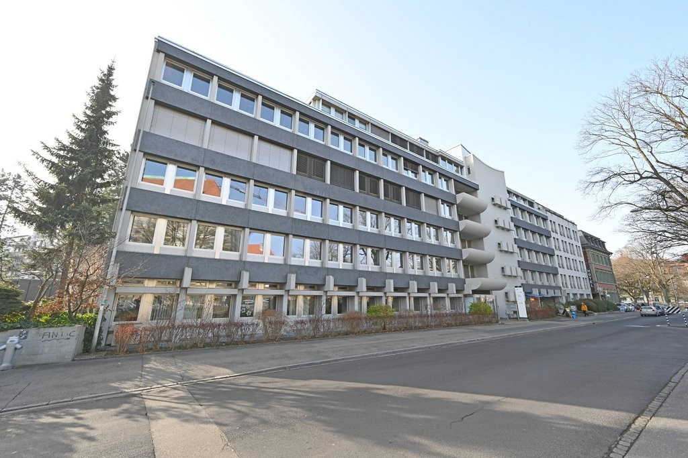
*`01.jpg` — 1024x683 px — Aussenansicht*

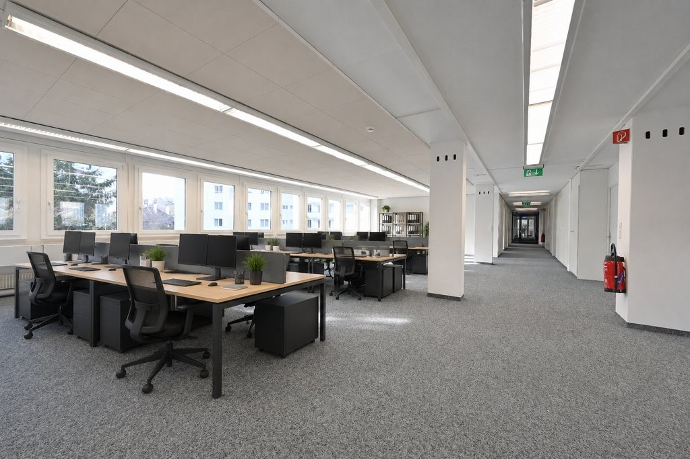
*`02.jpg` — 1024x683 px — Visualisierung Grossraumbüro*

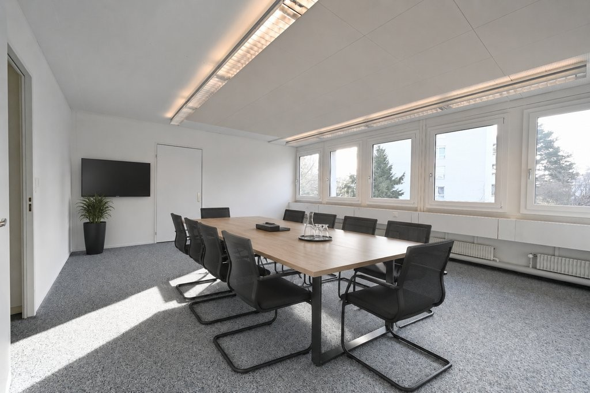
*`03.jpg` — 1024x682 px — Visualisierung  Sitzungszimmer*

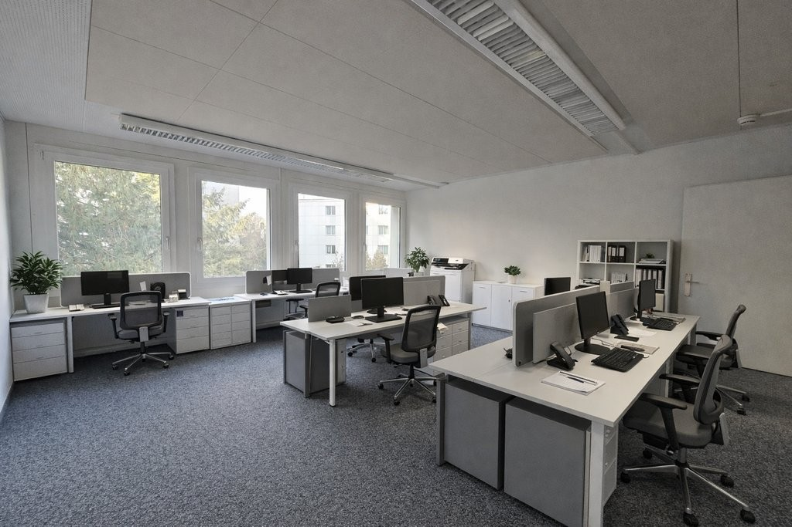
*`04.jpg` — 1024x683 px — Visualisierung  Büro *

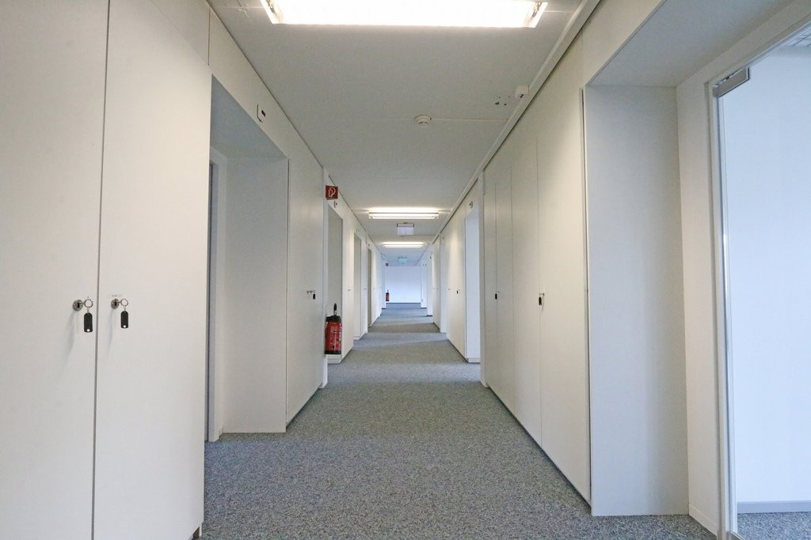
*`05.jpg` — 1024x683 px — Korridor*

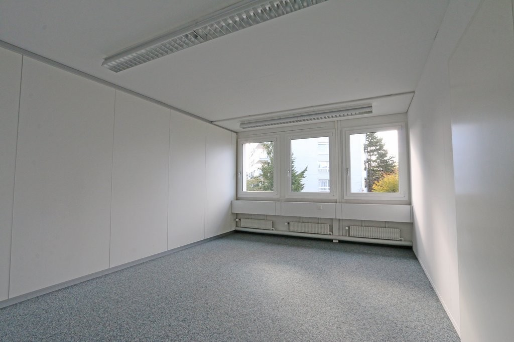
*`06.jpg` — 1024x683 px — Büro*

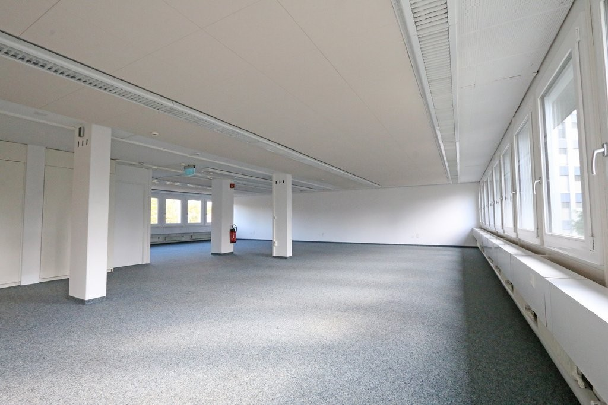
*`07.jpg` — 1024x683 px — Variante Grossraumbüro*

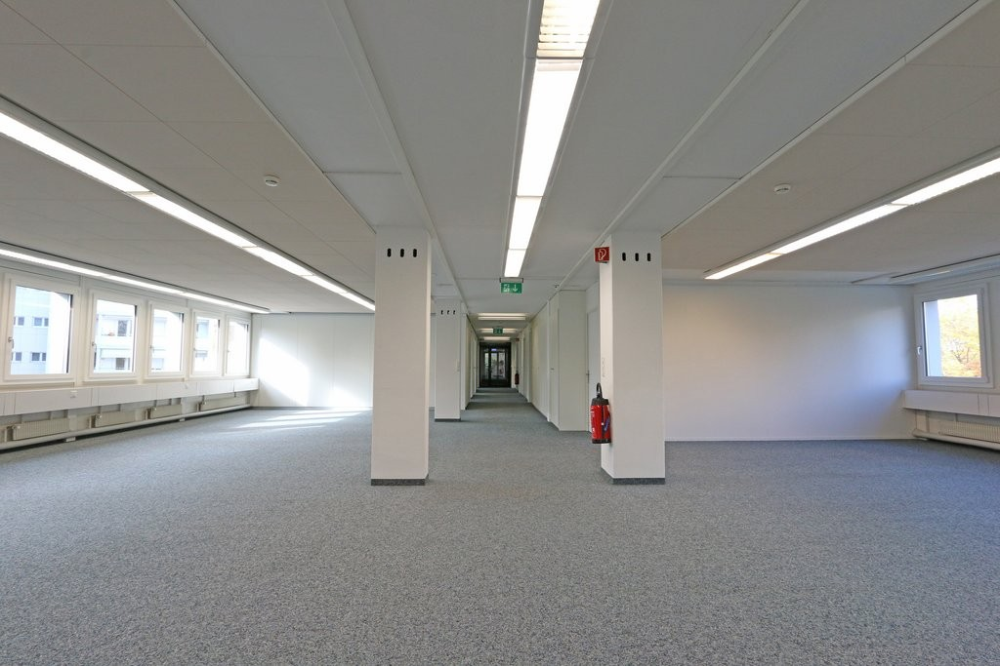
*`08.jpg` — 1024x683 px — Variante Grossraumbüro*

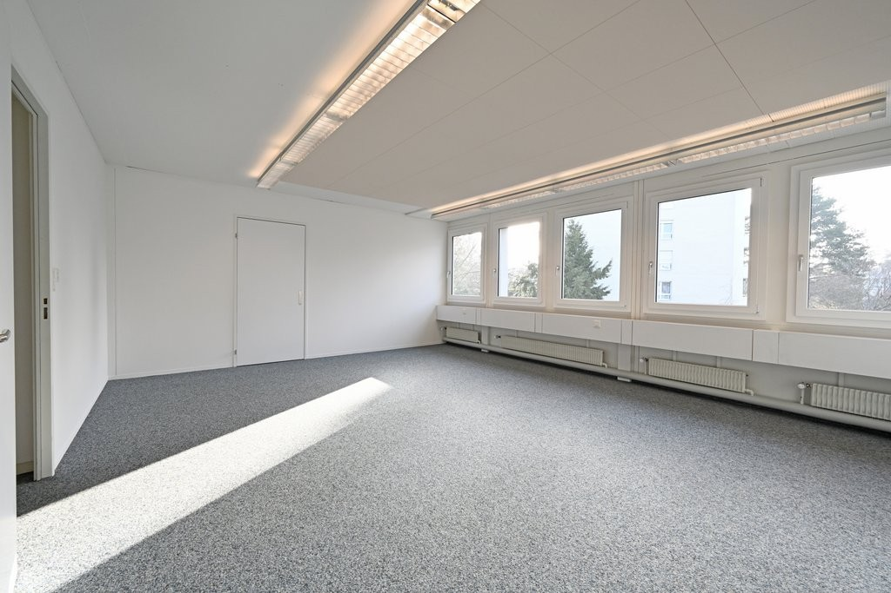
*`09.jpg` — 1024x683 px — Büro*

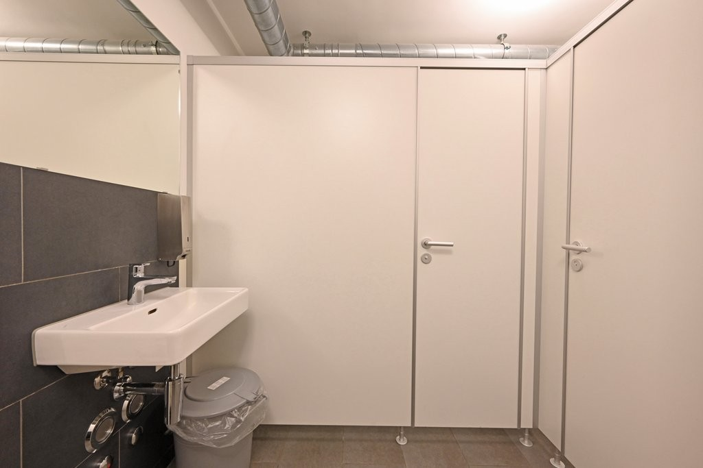
*`10.jpg` — 1024x683 px — Allgemeine WC-Anlage zur Mitbenützung*

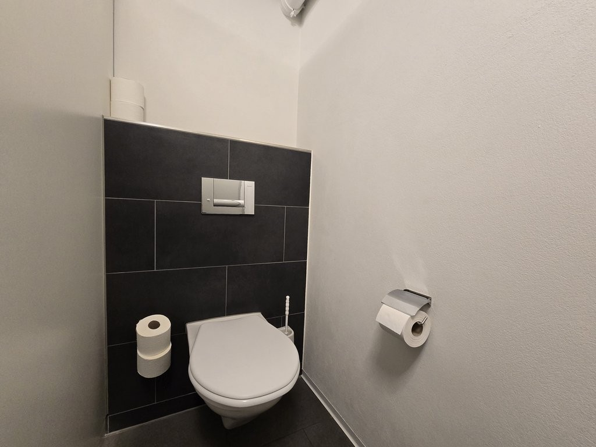
*`11.jpg` — 1024x768 px — Allgemeine WC-Anlage zur Mitbenützung*
