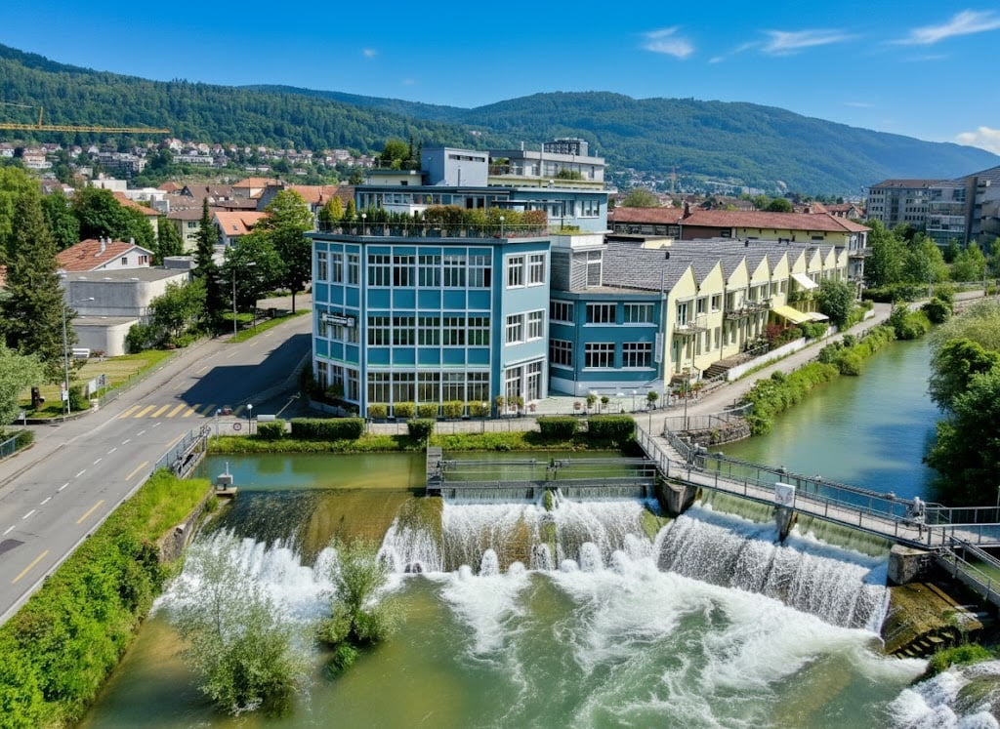
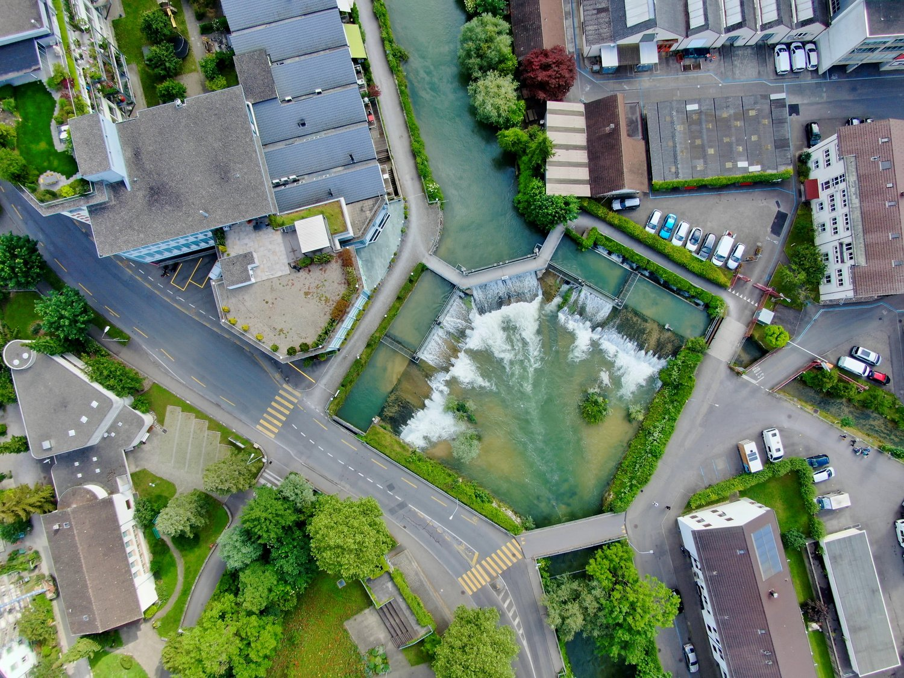

# Jakob-Stämpfli-Strasse 4, 2502 Biel/Bienne - CHF 200

> **Categorie:** `B_buero_gewerbe`  
> **Regiune:** Cantonul Berna  
> **Tip ofertă:** RENT / OFFICE  
> **Relevant pentru praxis:** da (praxis)  
> **Sursă:** [flatfox.ch](https://flatfox.ch/de/wohnung/jakob-stampfli-strasse-4-2502-bielbienne/85707012/)  
> **Descărcat:** 2026-08-17 12:35

## Date obiect

| Câmp | Valoare |
|---|---|
| Adresă | Jakob-Stämpfli-Strasse 4, 2502 Biel/Bienne |
| Categorie obiect | INDUSTRY |
| Tip obiect | OFFICE |
| Chirie netă | CHF 180 |
| Nebenkosten | CHF 20 |
| Chirie brută | CHF 200 |
| Preț afișat | CHF 200 |
| Suprafață utilă | 132 m² |
| Suprafață teren | 132 m² |
| Etaj | 2 |
| Disponibil de la | agr |
| Referință | ..155w6.704eg |

## Texte originale (germană)

**Titlu public:** Jakob-Stämpfli-Strasse 4, 2502 Biel/Bienne - CHF 200

**Titlu scurt:** 132m² Büro

**Pitch:** 132m² Büro in Biel/Bienne mieten

**Titlu descriere:** Gewerberäumlichkeiten im Hauser-Park - EXKLUSIV!

**Titlu chirie:** 132m² Büro in Biel/Bienne mieten

**Spațiu afișat:** 132

### Descriere completă

Sie suchen geeignete Gewerberäumlichkeiten für Ihren Gewerbebetrieb, wollen einen Laden, Physio oder eine Praxis eröffnen oder suchen helle und moderne Räume für Ihr neues Büro? Dann haben wir das Richtige für Sie. 

Im Hauserpark an der Schüss, eine der markantesten Liegenschaften Biels, sind von 132 m2 bis gesamthaft 278 m2 im oberen Stockwerk der Liegenschaft zu vermieten. 

**Die Gewerbeflächen sind exklusiv und punkten mit diversen Highlights:**

\- mietbar als Gesamtfläche von 278 m2 oder unterteilbar in 132 m2 und 146m2 

\- klimatisierte und besonders hohe helle Räume 

\- grossen Fensterfronten 

\- Personal- und Warenlift 

\- attraktiver und gepflegter Innenhof 

**zur Lage:**

\- ruhige Lage direkt an der Schüss und neben dem Stadtpark 

\- wenige Gehminuten ins Stadtzentrum 

\- nahe der Autobahn und dem Omegaareal 

\- ÖV direkt vor der Liegenschaft 

\- Parkmöglichkeiten vorhanden 

Vor allem die repräsentativen Büros mit Sicht auf das Schüsswehr und den Stadtpark würden sich hervorragend für den Hauptsitz einer Firma eignen. In den hinteren Räumen ist Gewerbe aller Art denkbar. 

Haben wir Ihr Interesse geweckt? Dann melden Sie sich noch heute für eine Besichtigung vor Ort bei uns. Wir freuen uns auf Ihre Kontaktaufnahme! 

**Nettomietzins: CHF 180.- /m2 p. a + MWST**

## Dotări (attributes)

- accessiblewithwheelchair
- lift
- garage

## Ofertant

- **Nume:** PS Immobilien AG
- **Stradă:** Paul-Emile-Brandt-Strasse 2
- **NPA:** 2502
- **Localitate:** Biel

## Imagini (2)

*`01.jpg` — 1024x747 px*

*`02.jpg` — 1500x1125 px*
