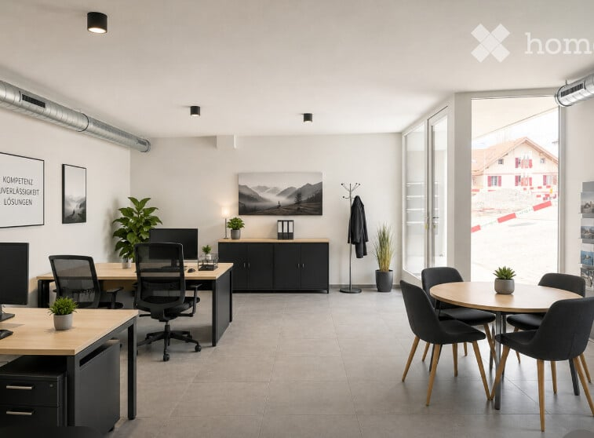
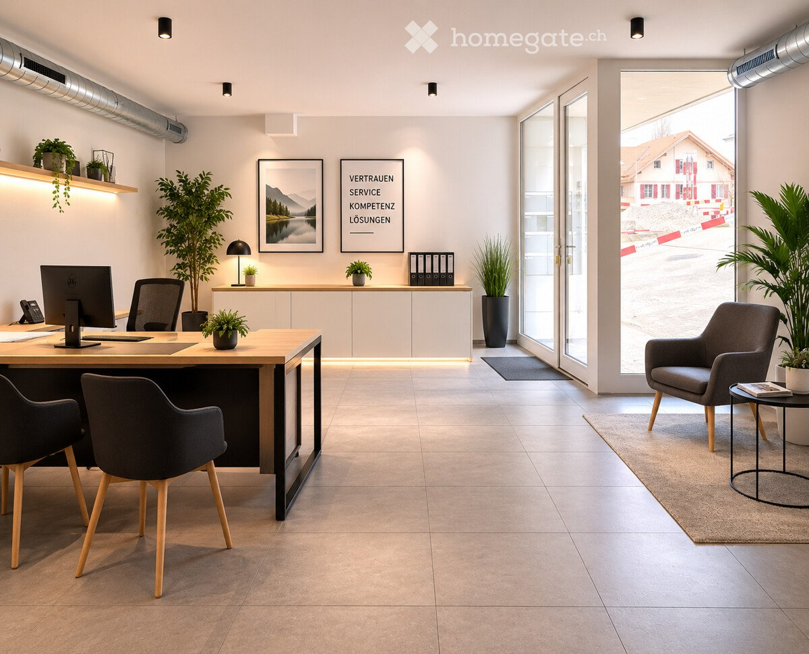
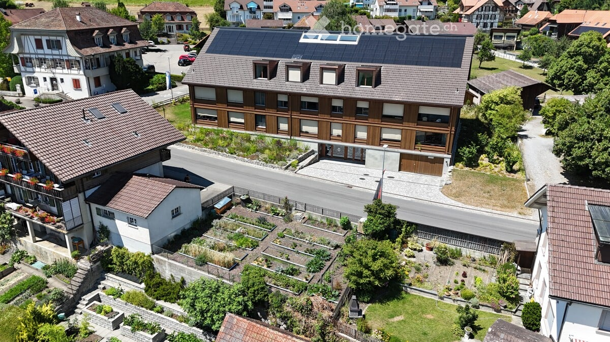
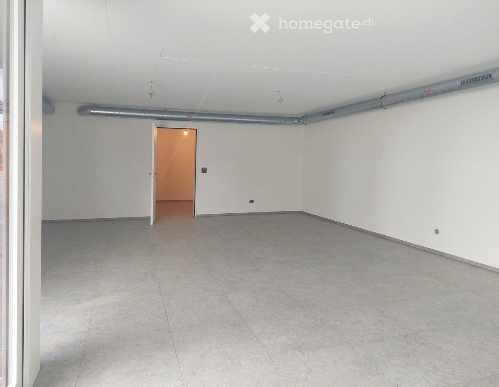
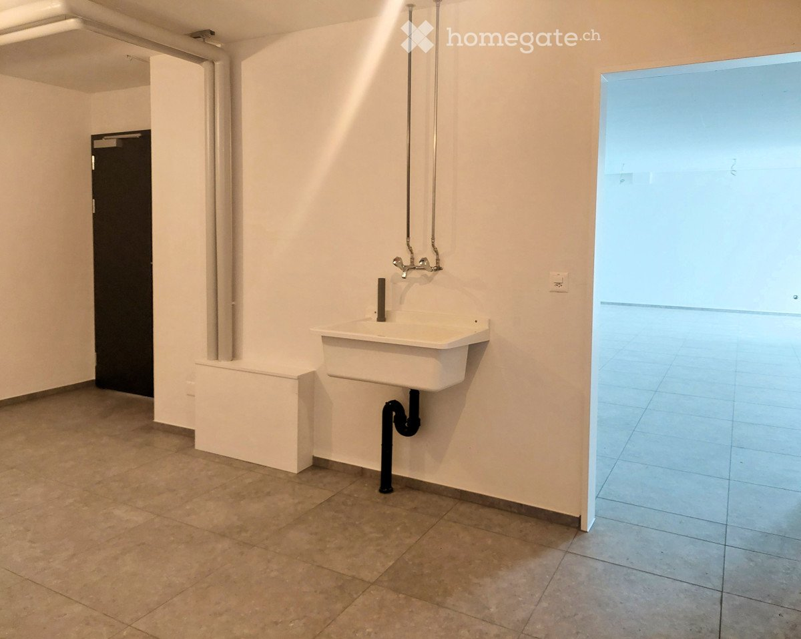
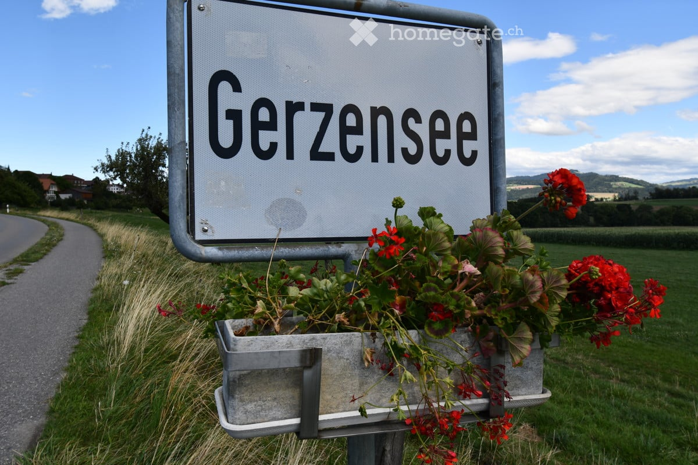

# Dorfstrasse 10, 3115 Gerzensee - CHF 1’460

> **Categorie:** `B_buero_gewerbe`  
> **Regiune:** Cantonul Berna  
> **Tip ofertă:** RENT / SHOP  
> **Relevant pentru praxis:** da (praxis)  
> **Sursă:** [flatfox.ch](https://flatfox.ch/de/wohnung/dorfstrasse-10-3115-gerzensee/85710419/)  
> **Descărcat:** 2026-08-17 12:38

## Date obiect

| Câmp | Valoare |
|---|---|
| Adresă | Dorfstrasse 10, 3115 Gerzensee |
| Categorie obiect | INDUSTRY |
| Tip obiect | SHOP |
| Chirie netă | CHF 1'240 |
| Nebenkosten | CHF 220 |
| Chirie brută | CHF 1'460 |
| Preț afișat | CHF 1'460 |
| An construcție | 2023 |
| Disponibil de la | imm |
| Referință | ..ZO2395 |

## Texte originale (germană)

**Titlu public:** Dorfstrasse 10, 3115 Gerzensee - CHF 1’460

**Titlu scurt:** Ladenfläche

**Pitch:** Ladenfläche in Gerzensee mieten

**Titlu descriere:** Moderne Gewerbefläche in Neubau  vielseitig nutzbar und ideal gelegen

**Titlu chirie:** Ladenfläche in Gerzensee mieten

### Descriere completă

Starten Sie Ihr Business an bester Lage Ihre neue Gewerbefläche in Gerzensee   
  
Machen Sie Ihre Vision zur Realität. Ob Praxis, Büro, Atelier, Verkaufsfläche oder Dienstleistung diese vielseitig nutzbare Gewerbefläche mit 74 m² in einem modernen Neubaugebäude bietet Ihnen die perfekte Basis für Ihren Erfolg.   
  
Gerzensee, das charmante Dorf zwischen Bern, Thun und Belp, bietet eine hervorragende Erreichbarkeit und eine starke Kundenfrequenz. Der zentrale Standort im Dorfkern sorgt für Laufkundschaft, während die Südlage mit Blick auf die Berner Hochalpen und den Gerzensee ein inspirierendes Arbeitsumfeld schafft.   
  
Die Fläche besteht aus zwei Räumen und verfügt über ein eigenes WC. Dank der flexiblen Raumgestaltung und der modernen Bauweise eignet sie sich für unterschiedlichste Geschäftsmodelle.   
  
Ihre Vorteile auf einen Blick:   
  
\- 74 m² Gewerbefläche in einem Neubaugebäude   
\- Zwei helle Räume mit individuellen Nutzungsmöglichkeiten   
\- Eigenes WC für zusätzlichen Komfort   
\- Zentrale Lage mit hoher Sichtbarkeit   
\- Kundenpotenzial durch Anwohner und Passanten   
\- Moderne Architektur und flexible Gestaltungsmöglichkeiten   
\- Bezugsbereit nach Vereinbarung   
  
Nutzen Sie diese Gelegenheit und bringen Sie Ihr Unternehmen an einen Standort, der Erfolg verspricht. Gerne senden wir Ihnen weitere Informationen oder vereinbaren einen persönlichen Besichtigungstermin.   
  
Besuchen Sie unsere Website: www.wohnen-gerzensee.ch   
  
Wir freuen uns auf Ihre Kontaktaufnahme.

## Dotări (attributes)

- lift

## Ofertant

- **Nume:** Zollinger Immobilien AG
- **Stradă:** Worbstrasse 237
- **NPA:** 3073
- **Localitate:** Muri bei Bern / Gümligen

## Imagini (7)

*`01.jpg` — 757x558 px — Screenshot 2026-07-03 082645*

*`02.jpg` — 1200x971 px — Bild möblierung*

*`03.jpg` — 1200x675 px — DJI_20250710145456_0026_D*

*`04.jpg` — 1200x931 px — 20240312_134620*

*`05.jpg` — 1200x958 px — 20240312_134656*

*`06.jpg` — 1200x800 px — DSC_5463*

*`07.jpg` — 1200x1200 px — QR-Code*
