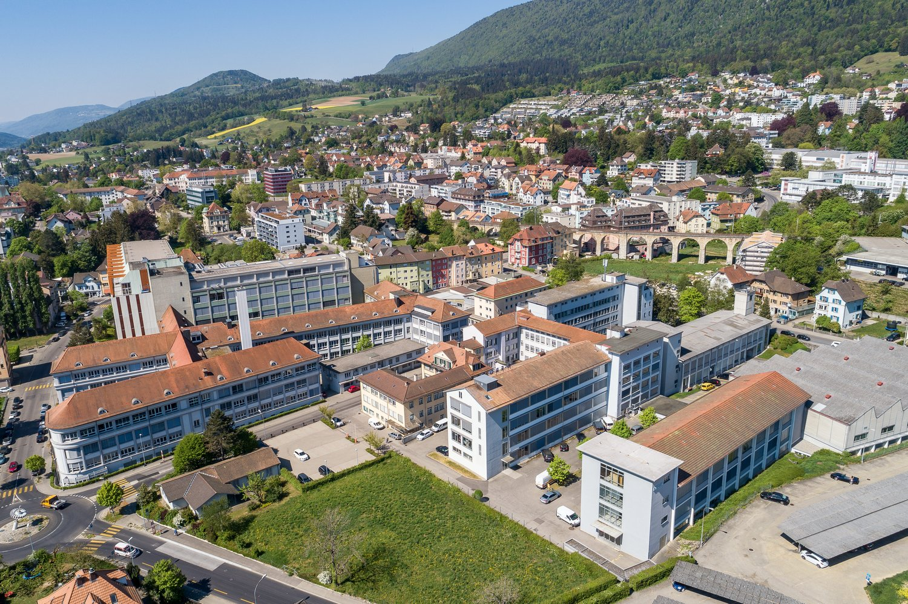
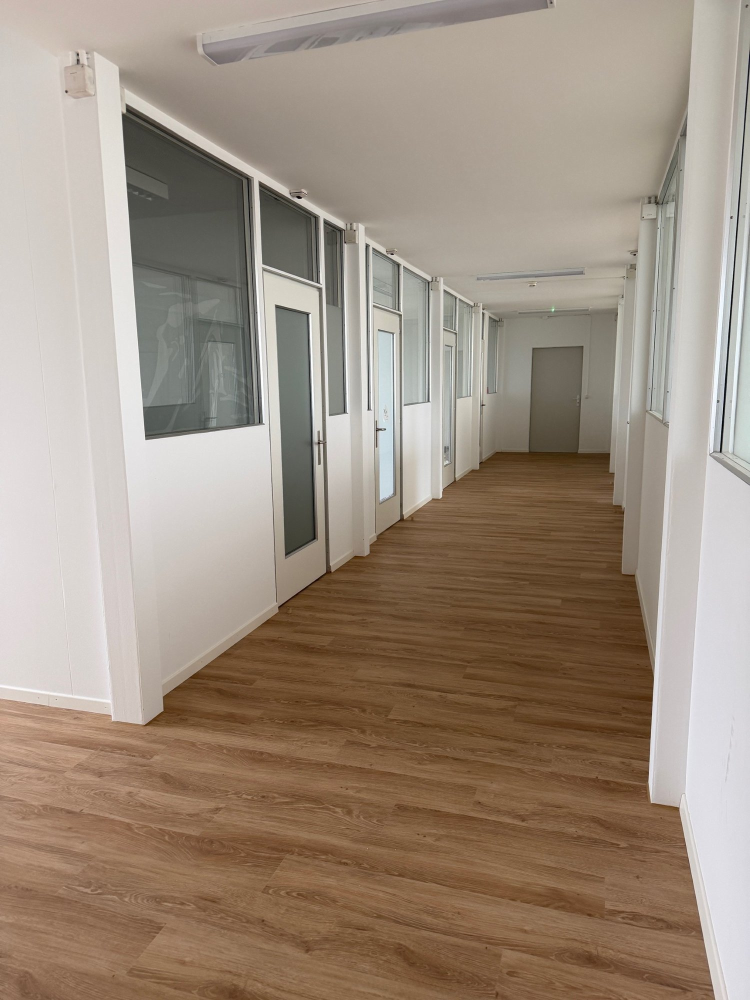
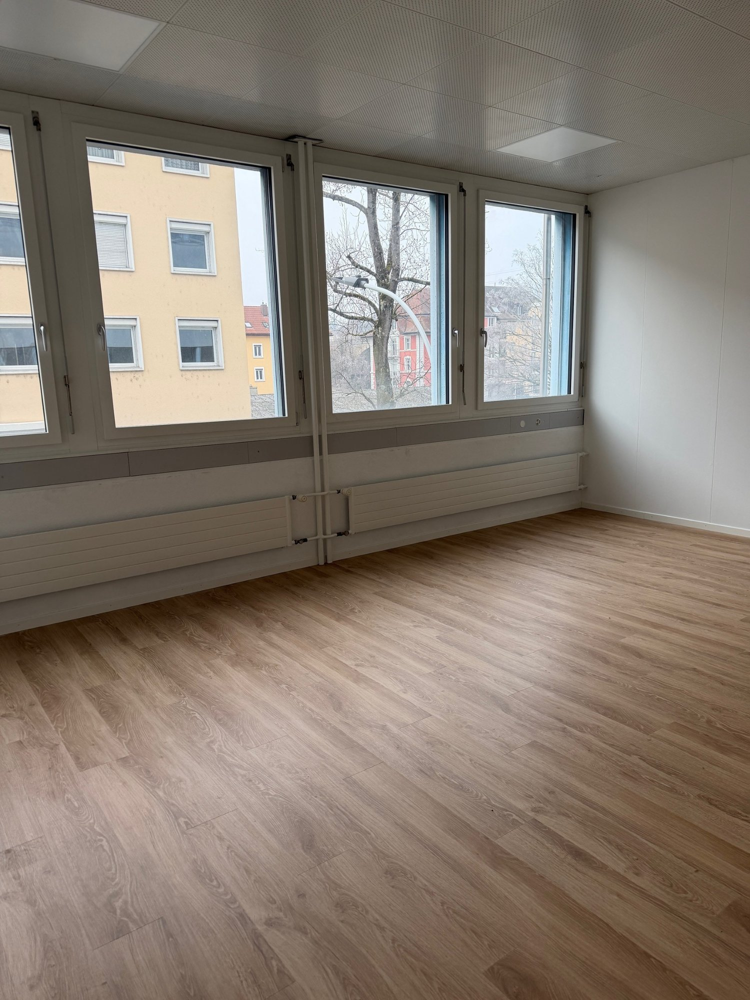
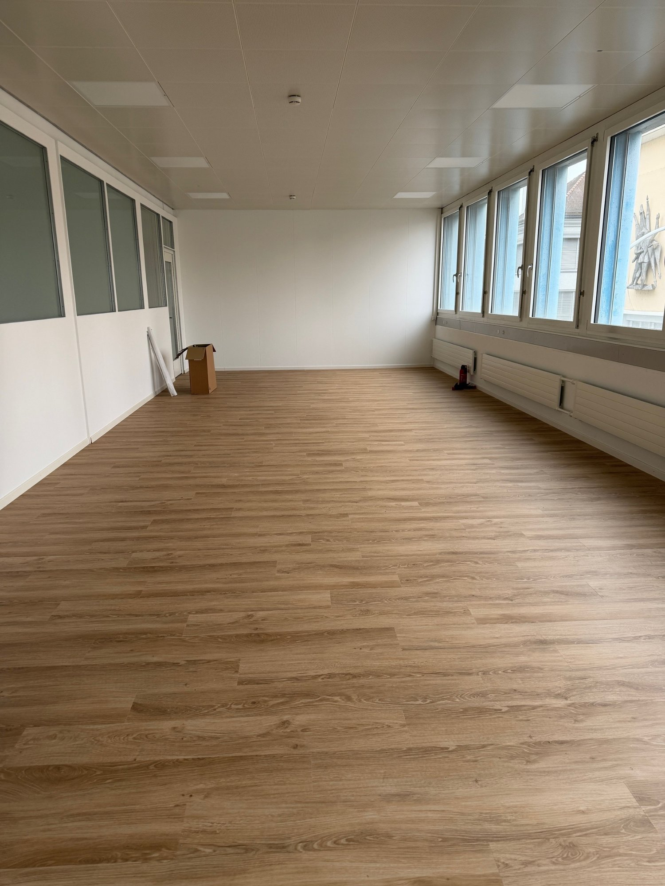
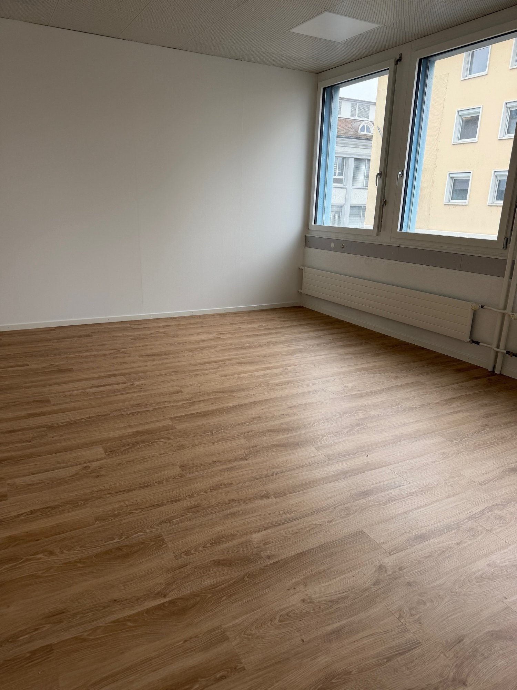

# Kapellstrasse 26, 2540 Grenchen - CHF 1’062

> **Categorie:** `B_buero_gewerbe`  
> **Regiune:** Cantonul Berna  
> **Tip ofertă:** RENT / OFFICE  
> **Relevant pentru praxis:** da (praxen)  
> **Sursă:** [flatfox.ch](https://flatfox.ch/de/wohnung/kapellstrasse-26-2540-grenchen/85713683/)  
> **Descărcat:** 2026-08-17 12:35

## Date obiect

| Câmp | Valoare |
|---|---|
| Adresă | Kapellstrasse 26, 2540 Grenchen |
| Categorie obiect | INDUSTRY |
| Tip obiect | OFFICE |
| Chirie netă | CHF 782 |
| Nebenkosten | CHF 280 |
| Chirie brută | CHF 1'062 |
| Preț afișat | CHF 1'062 |
| Suprafață utilă | 106 m² |
| Etaj | 2 |
| Disponibil de la | imm |
| Referință | ..xlxt1.elp02 |

## Texte originale (germană)

**Titlu public:** Kapellstrasse 26, 2540 Grenchen - CHF 1’062

**Titlu scurt:** 106m² Büro

**Pitch:** 106m² Büro in Grenchen mieten

**Titlu descriere:** Moderne Büroräumlichkeit in Grenchen

**Titlu chirie:** 106m² Büro in Grenchen mieten

**Spațiu afișat:** 106

### Descriere completă

Das EBOSA-Areal in Grenchen verfügt im Ganzen über 18'000m2 Gewerbeflächen, welche sich für verschiedenste Nutzungen eignen und auch über eine eigene Mensa, welche durch den Verein Netzwerke Grenchen bewirtschaftet wird. 

Zur Zeit vermieten wir einen hellen Büro-/Gewerberaum **106m2 im 2.Obergeschoss** . Nicht zu unterschätzen ist auch die zentrale Lage des EBOSA-Areals in der Stadt Grenchen. Der Bahnhof der Stadt ist eifach zu Fuss erreichbar. Die Kapellstrasse mündet in die Verkehrsachse Bielstrasse, von welcher aus die Autobahn bequem in 3-4 Minuten zu erreichen ist. Auch ist Grenchen die ideale Umgebung dank des Flughafens und renomierten Unternehmen mit internationaler Bedeutung. 

Weitere Pluspunkt sind: 

  * Nettomietzins CHF 782.00 pro Monat 

  * HK/NK-Akonto CHF 280.00 pro Monat 

  * Vinyl-Bodenbelag 

  * neuere Fenster mit IV-Verglasung 

  * lichtdurchflutete Räumlichkeiten 

  * Beleuchtung und Standard-Elektroinstallation installiert 

  * Mitbenützung allg. WC-Anlagen 

  * 2 vollamtliche Hauswarte vor Ort 

  * Besucherparkplätze 

  * im Areal vorhandene Mensa 

  * Parkplätze können dazu gemietet werden 

  * Zentrumsnahe Lage 

  * Restaurants, Einkaufsläden, Praxen, usw. in unmittelbarer Nähe 

Gerne stehen wir Ihnen für weitere Auskünfte und/oder einer individuellen Besichtigung zur Verfügung.

## Dotări (attributes)

- lift
- parkingspace

## Ofertant

- **Nume:** Roth Immobilien Management
- **Stradă:** Florastrasse 30
- **NPA:** 2500
- **Localitate:** Biel/Bienne

## Imagini (6)

*`01.jpg` — 1500x999 px*

*`02.jpg` — 1500x999 px*

*`03.jpg` — 1500x2000 px*

*`04.jpg` — 1500x2000 px*

*`05.jpg` — 1500x2000 px*

*`06.jpg` — 1500x2000 px*
