# Bernstrasse 48, 3053 Münchenbuchsee - CHF 3’000

> **Categorie:** `B_buero_gewerbe`  
> **Regiune:** Cantonul Berna  
> **Tip ofertă:** RENT / COMMERCIAL  
> **Relevant pentru praxis:** da (praxis)  
> **Sursă:** [flatfox.ch](https://flatfox.ch/de/wohnung/bernstrasse-48-3053-munchenbuchsee/85740885/)  
> **Descărcat:** 2026-08-17 12:29

## Date obiect

| Câmp | Valoare |
|---|---|
| Adresă | Bernstrasse 48, 3053 Münchenbuchsee |
| Categorie obiect | INDUSTRY |
| Tip obiect | COMMERCIAL |
| Chirie brută | CHF 3'000 |
| Preț afișat | CHF 3'000 |
| Suprafață utilă | 215 m² |
| Etaj | 0 |
| Disponibil de la | agr |
| Referință | ..gh11p.pn3sw |

## Texte originale (germană)

**Titlu public:** Bernstrasse 48, 3053 Münchenbuchsee - CHF 3’000

**Titlu scurt:** 215m² Gewerbe

**Pitch:** 215m² Gewerbe in Münchenbuchsee mieten

**Titlu descriere:** Vielseitige 5-Zimmer-Gewerberäume an zentraler Lage in Münchenbuchsee

**Titlu chirie:** 215m² Gewerbe in Münchenbuchsee mieten

**Spațiu afișat:** 215

### Descriere completă

Grosszügige Gewerberäume an Toplage in Münchenbuchsee (215 m²) 

An zentraler und gut sichtbarer Lage an der **Bernstrasse 48 in 3053 Münchenbuchsee** vermieten wir vielseitig nutzbare Gewerberäume mit rund **215 m² im Erdgeschoss** . Die Fläche eignet sich ideal für **Praxis, Büro, Therapie, Dienstleistung oder ähnliche gewerbliche Nutzungen** . 

Highlights auf einen Blick 

  * Ca. **215 m² Gewerbefläche im Erdgeschoss**

  * **5 flexibel nutzbare Räume** mit hochwertigem Parkettboden 

  * **Grosser, offener Bereich** mit professioneller Beleuchtung 

  * **Helle, weisse Wände** und angenehme Raumhöhen 

  * **2 WCs**

  * **Schaufensterfront direkt an der Bernstrasse** mit guter Sichtbarkeit 

  * **Parkplätze auf Wunsch verfügbar** für Kunden oder Mitarbeitende 

  * **Bushaltestelle in ca. 3 Gehminuten** erreichbar 

Die Liegenschaft befindet sich in einer etablierten, ruhigen Gemeinde mit **sehr guter Verkehrsanbindung Richtung Bern** . Die sonnige Lage und die angenehme Atmosphäre schaffen optimale Bedingungen für konzentriertes Arbeiten und Kundenempfang. 

**Individueller Ausbau:** Ein Umbau oder eine Anpassung der Räumlichkeiten nach Mieterwunsch ist **nach Absprache möglich** . Der Mietzins pro m² und Jahr richtet sich nach dem gewählten Ausbaustandard.

## Dotări (attributes)

- parkingspace

## Ofertant

- **Nume:** LAYF GmbH
- **Stradă:** Buckhauserstrasse 36
- **NPA:** 8048
- **Localitate:** Zürich

## Imagini (13)

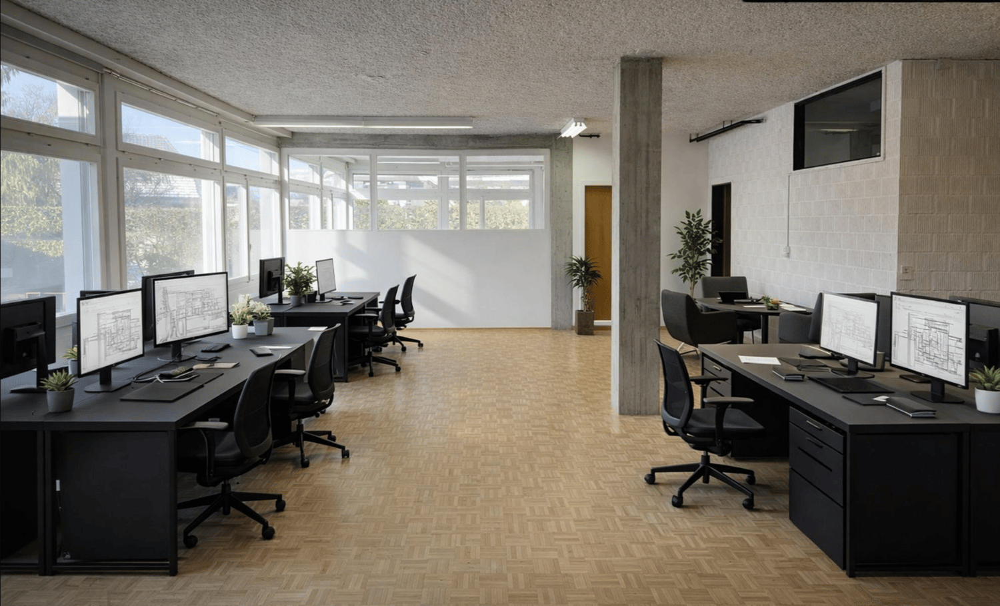
*`01.png` — 1500x910 px — modern office setup, black desks, black swivel chairs, white walls, large windows, plants, and monitors*

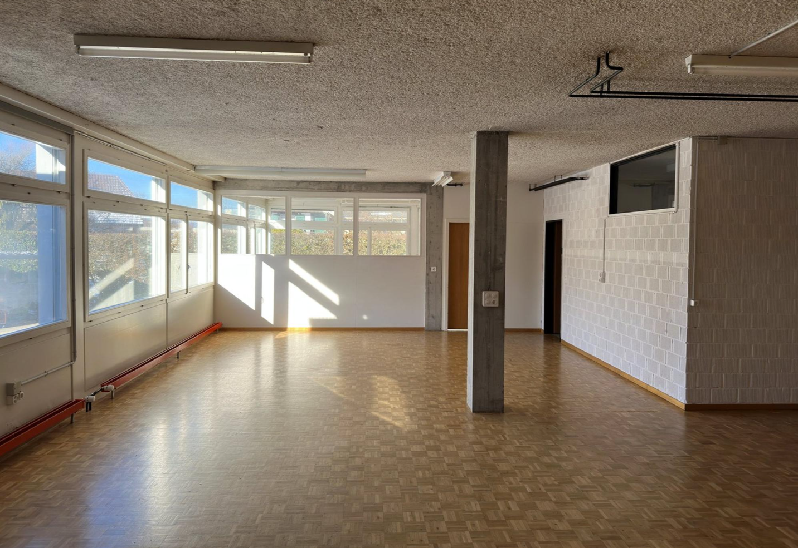
*`02.png` — 1432x985 px — Open room with parquet floor, windows, column, ceiling lamps*

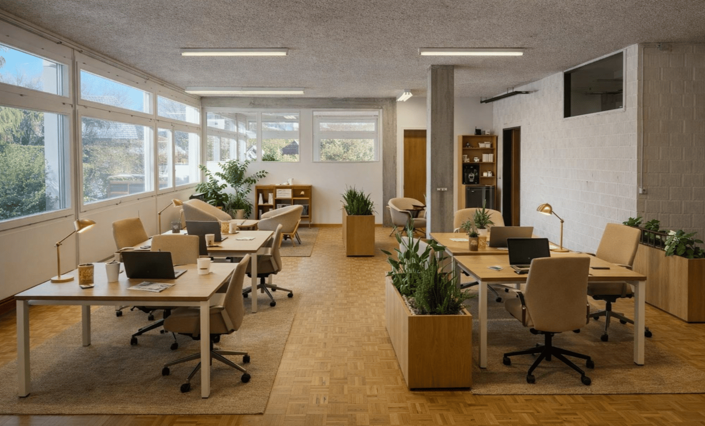
*`03.png` — 1500x906 px — Open office with large windows, wooden desks, white walls, potted plants, office chairs*

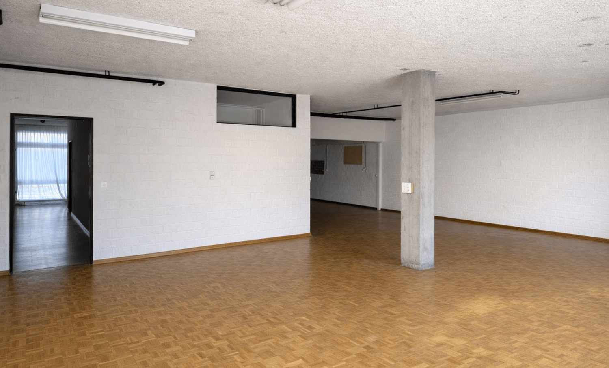
*`04.png` — 1500x908 px*

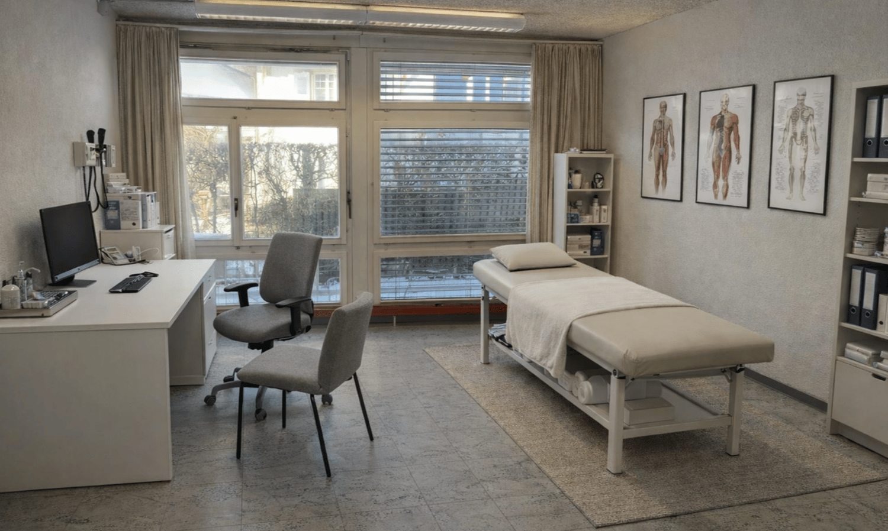
*`05.png` — 1500x898 px — Desk, chair, bed, window, shelves, medical diagrams on the wall.*

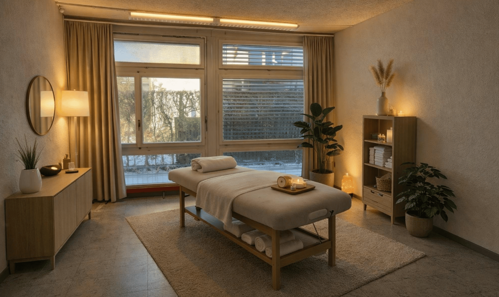
*`06.png` — 1500x895 px — spacious, modern room with massage table, indoor plants, large windows with curtains, side table, mirror, wooden shelf with candles, lamps*

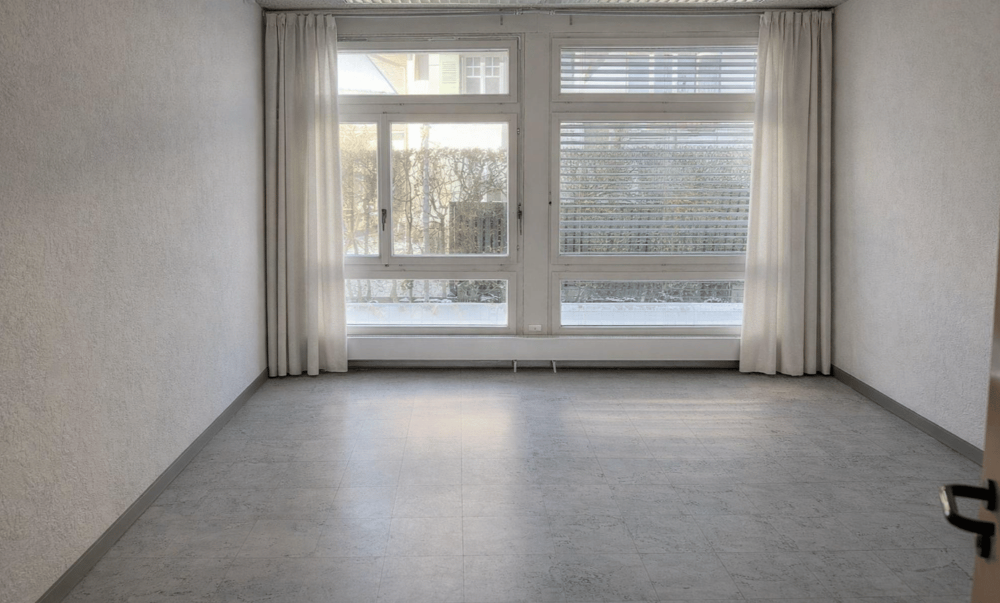
*`07.png` — 1500x905 px — tiled floor, white walls, double windows with white curtains, single open door*

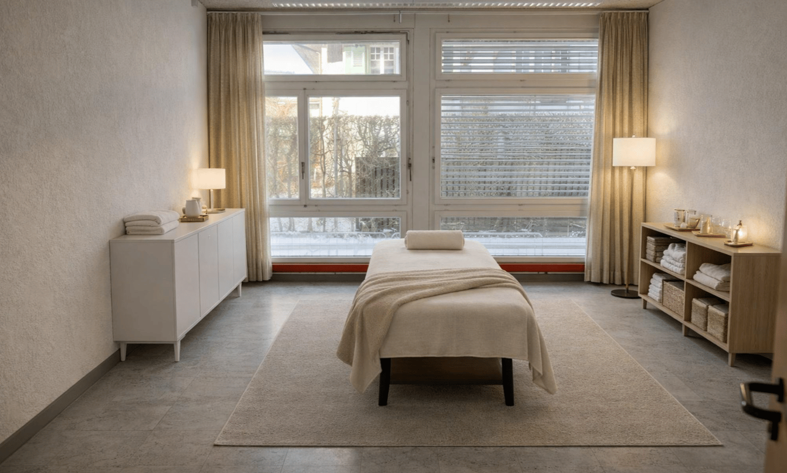
*`08.png` — 1500x903 px — empty room with a massage table, large window, white furniture, white lamps, carpet, and towels on shelves*

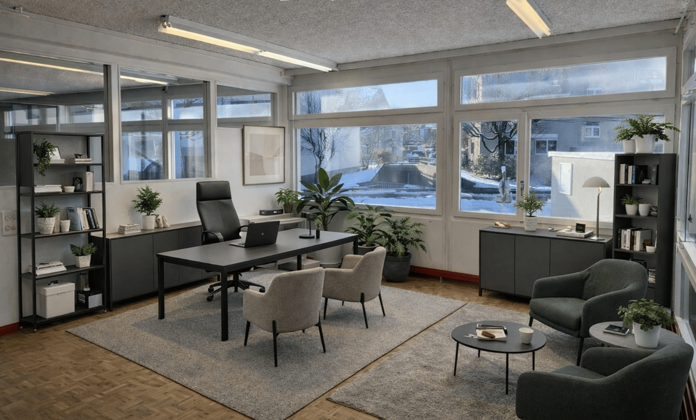
*`09.png` — 1500x906 px — Open space office with a desk, a few chairs, a carpet, a rug, a round table, a lamp, potted plants, and bookshelves.*

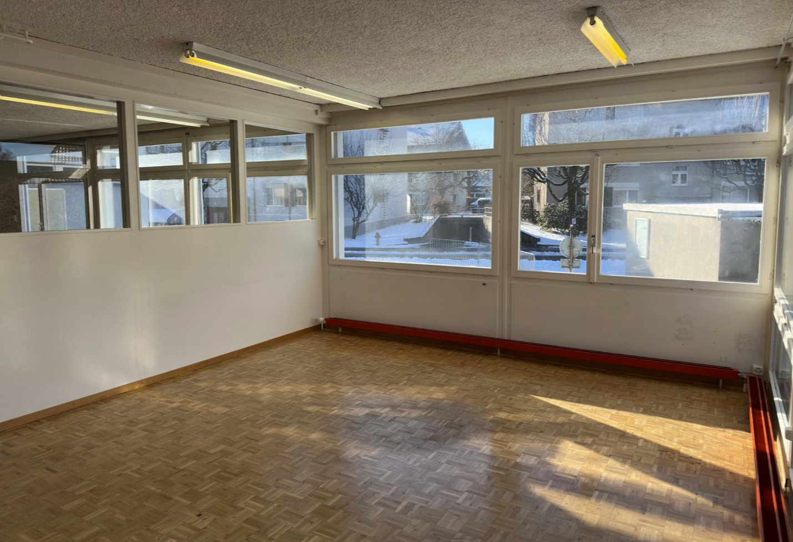
*`10.png` — 1429x978 px — Empty room with parquet flooring, large windows, and fluorescent ceiling lights*

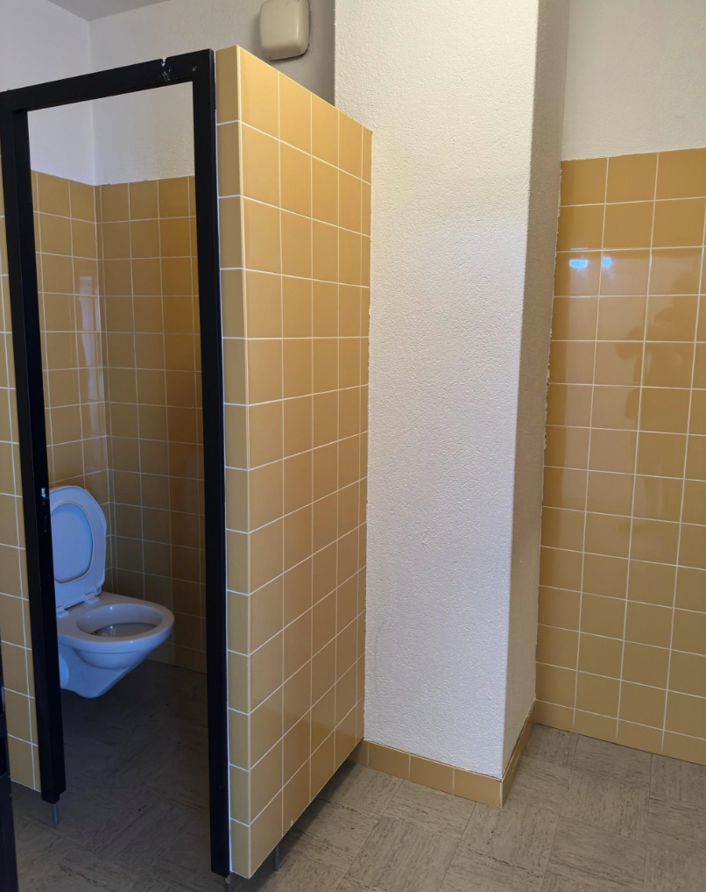
*`11.png` — 806x1017 px — A small enclosed bathroom stall with tiled walls and a white toilet*

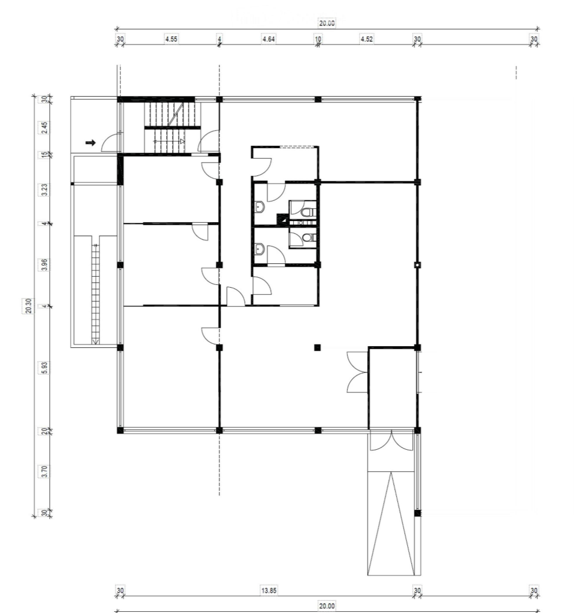
*`12.png` — 998x1059 px — One living room, one kitchen, one bedroom, one bathroom, one balcony*

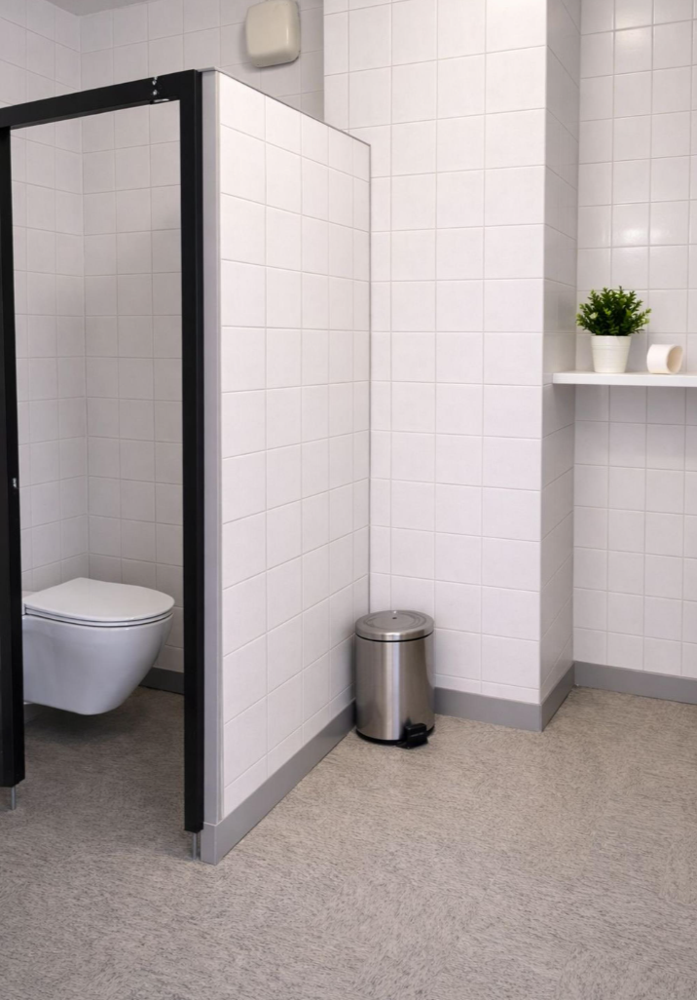
*`13.png` — 716x1026 px — small cubicle for toilet, wall is white tiled, white toilet bowl, grey floor, stainless steel trash can*
