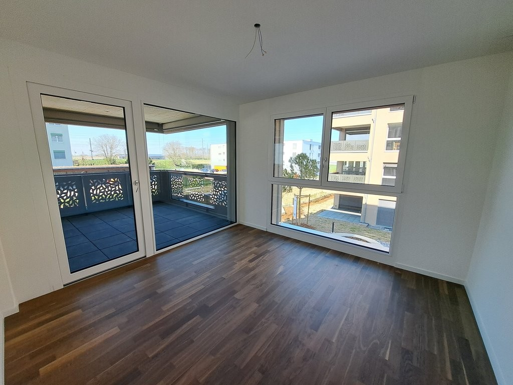
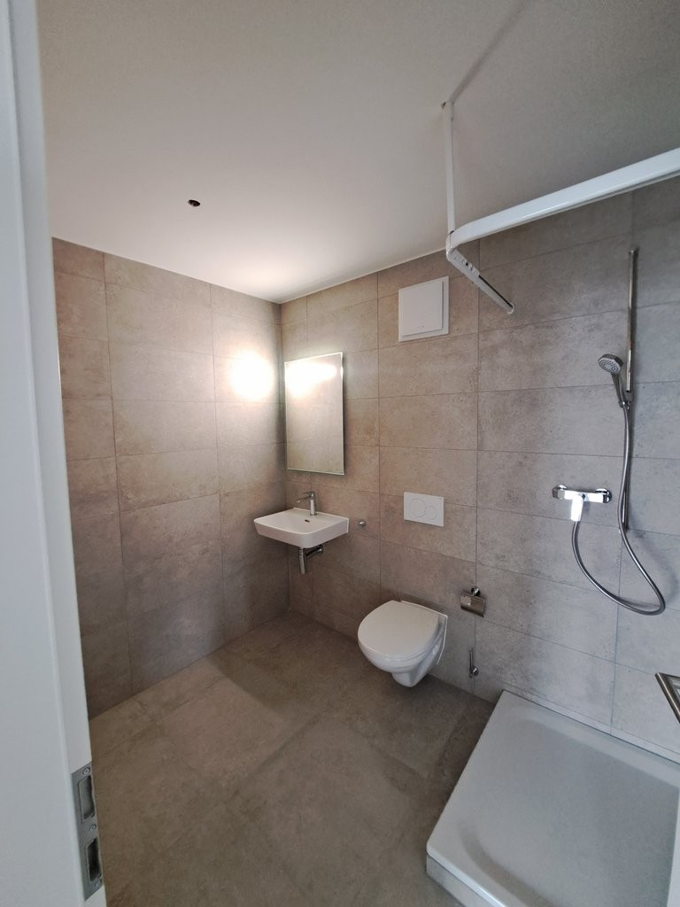
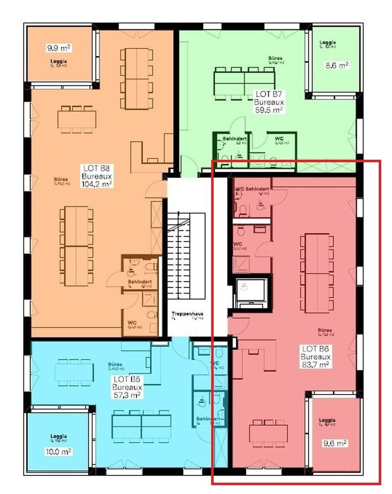

# Steindleren 1a, 3210 Kerzers - CHF 184 inkl. NK pro m² / Jahr

> **Categorie:** `B_buero_gewerbe`  
> **Regiune:** Cantonul Berna  
> **Tip ofertă:** RENT / OFFICE  
> **Relevant pentru praxis:** da (praxen)  
> **Sursă:** [flatfox.ch](https://flatfox.ch/de/wohnung/steindleren-1a-3210-kerzers/85794543/)  
> **Descărcat:** 2026-08-17 12:37

## Date obiect

| Câmp | Valoare |
|---|---|
| Adresă | Steindleren 1a, 3210 Kerzers |
| Categorie obiect | INDUSTRY |
| Tip obiect | OFFICE |
| Chirie netă | CHF 184 |
| Chirie brută | CHF 184 |
| Preț afișat | CHF 184 |
| Suprafață utilă | 84 m² |
| Etaj | 1 |
| Disponibil de la | imm |
| Referință | 62011.02.0103 |

## Texte originale (germană)

**Titlu public:** Steindleren 1a, 3210 Kerzers - CHF 184 inkl. NK pro m² / Jahr

**Titlu scurt:** 84m² Büro

**Pitch:** 84m² Büro in Kerzers mieten

**Titlu descriere:** Flexibel nutzbare Rohbauflächen - Surface commerciale brut à louer

**Titlu chirie:** 84m² Büro in Kerzers mieten

**Spațiu afișat:** 84

### Descriere completă

An der Einfahrt von Kerzers erwartet Sie ein strategisch günstiger Standort !   
  
Dieses ideal gelegene Gebäude bietet dank der unmittelbaren Nähe zur Autobahn und den Bahnverbindunge Murten-Aarberg-Lyss so wie Bern-Neeuenburg eine optimale Erreichbarkeit.   
  
Die Rohbaufläche befindet sich im 1. Stock eines Mehrfamilienhauses und kann flexibel nach Ihren Bedürfnissen, Ihrer Kreativität und Ihren Vorlieben gestaltet werden. Dieser Raum eignet sich perfekt für ein Büro oder andere vielseitige Nutzungskonzepte.   
  
Die Flächen eignen sich hervorragend für Praxen, Büros oder andere vielseitige Nutzungskonzepte.   
  
Dans Gebäude ist mit einem Lift augestattet.   
  
Tiefgaragenplätze sind zusätzlich zur Miete verfügbar und Besucherpakplätze befinden sich direkt vor dem Gebäude.   
  
\-------   
  
A l'entrée de Chiètres, un emplacement stratégique vous attend ! Cet immeuble idéalement situé offre une accessibilité optimale grâce à la proximité imméditate de l'autoroute et des axes ferroviaires Morat-Aarberg-Lyss et Berne-Neuchâtel.   
  
La surface en état brut est disponible au 1er étage d'un immeuble locatif et peut être aménagée de manière flexible selon vos besoins, votre créativité ainsi que vos préférences. Cet espace convient parfaitement à un bureau ou à d'autres concepts d'utilisation polyvalents.   
  
L'immeuble est équipé d'un ascenseur pour plus de confort.   
  
Parking souterrain disponible en supplément et places visiteurs juste devant l'entrée pour accueillir vos clients facilement.

## Dotări (attributes)

- lift

## Ofertant

- **Nume:** Apleona Suisse SA
- **Stradă:** Avenue de la Gare 1
- **NPA:** 1700
- **Localitate:** Fribourg

## Imagini (5)

*`01.jpg` — 768x1024 px — Immeuble*

*`02.jpg` — 1024x768 px — Surface*

*`03.jpg` — 1024x768 px — Surface*

*`04.jpg` — 768x1024 px — Salle de bains*

*`05.jpg` — 800x1008 px — Plans_surface_commerciale_84.jpg*
