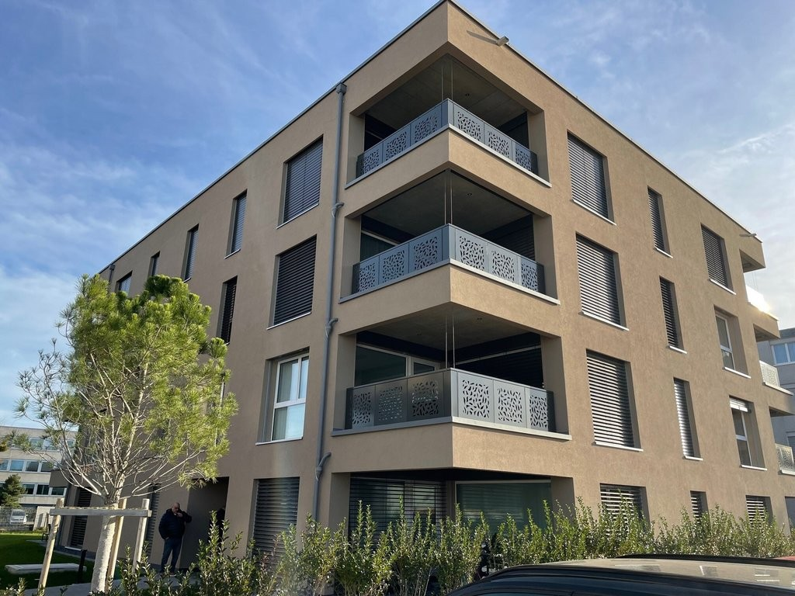
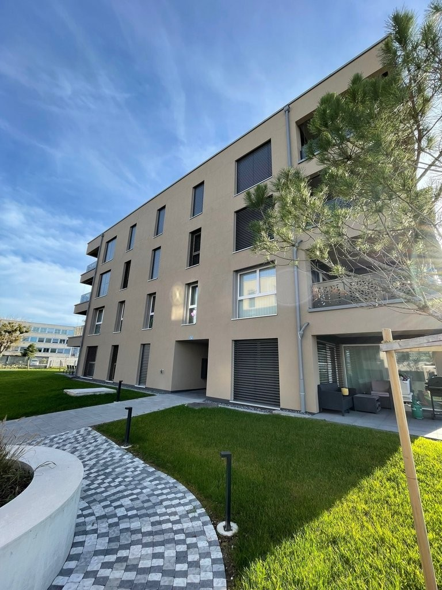
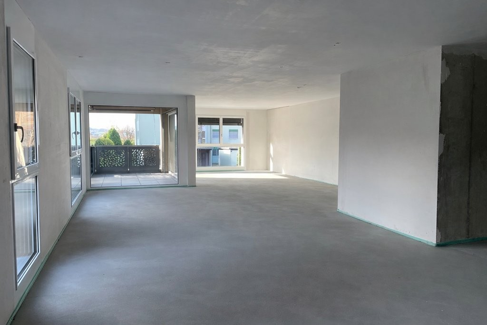
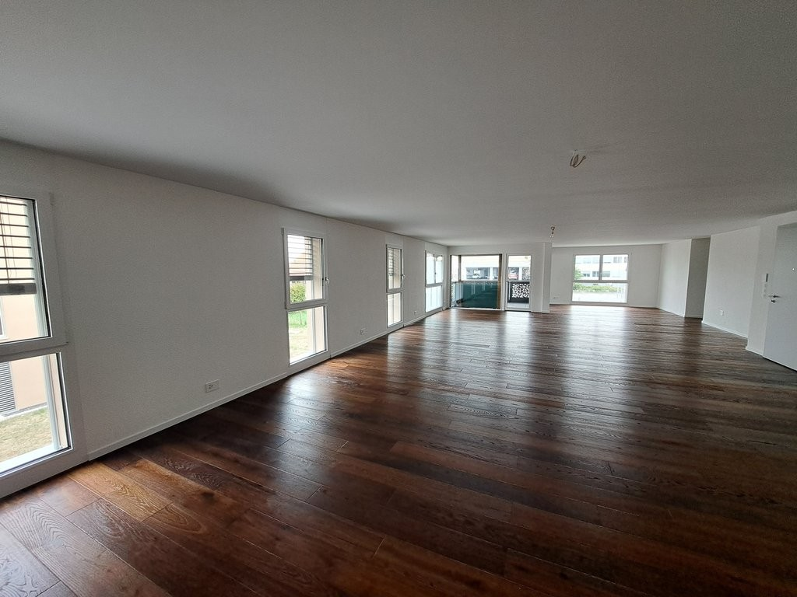
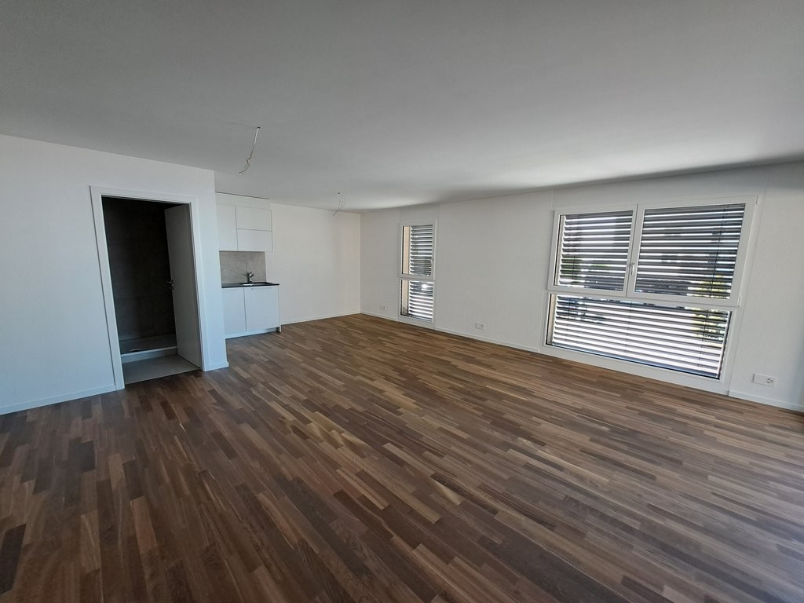
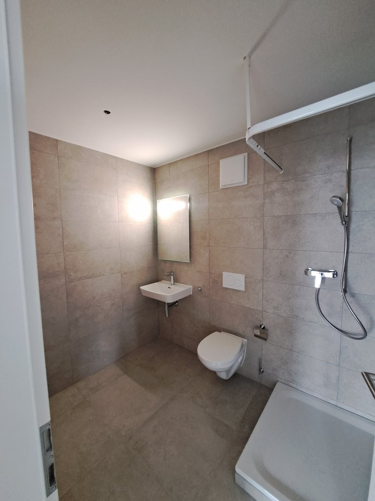
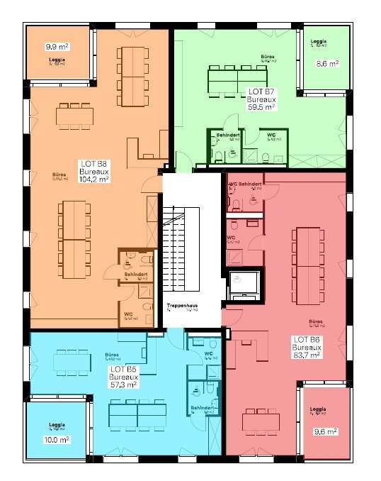

# Steindleren 1, 3210 Kerzers - auf Anfrage

> **Categorie:** `B_buero_gewerbe`  
> **Regiune:** Cantonul Berna  
> **Tip ofertă:** RENT / OFFICE  
> **Relevant pentru praxis:** da (praxen)  
> **Sursă:** [flatfox.ch](https://flatfox.ch/de/wohnung/steindleren-1-3210-kerzers/85806778/)  
> **Descărcat:** 2026-08-17 12:30

## Date obiect

| Câmp | Valoare |
|---|---|
| Adresă | Steindleren 1, 3210 Kerzers |
| Categorie obiect | INDUSTRY |
| Tip obiect | OFFICE |
| Suprafață utilă | 305 m² |
| Etaj | 1 |
| Disponibil de la | imm |
| Referință | ..62011.03.0101 |

## Texte originale (germană)

**Titlu public:** Steindleren 1, 3210 Kerzers - auf Anfrage

**Titlu scurt:** 305m² Büro

**Pitch:** 305m² Büro in Kerzers mieten

**Titlu descriere:** Flexibel nutzbare Rohbauflächen ab 57m2 - Surfaces bruts dès 57m2

**Titlu chirie:** 305m² Büro in Kerzers mieten

**Spațiu afișat:** 305

### Descriere completă

An der Einfahrt von Kerzers erwartet Sie ein strategisch günstiger Standort !   
  
Dieses ideal gelegene Gebäude bietet dank der unmittelbaren Nähe zur Autobahn und den Bahnverbindunge Murten-Aarberg-Lyss so wie Bern-Neeuenburg eine optimale Erreichbarkeit.   
  
Die Räumlichkeiten im Rohbauzustand (ab 57m2) stehen im 1. Obergeschoss eines Mietgebäudes zur Verfügung und können flexibel nach Ihren indiduellen Bedürfnissen, Ihrer Kreativität sowie Ihren Vortstellungen getaltet werden.   
  
Die Flächen eignen sich hervorragend für Praxen, Büros oder andere vielseitige Nutzungskonzepte.   
  
Dans Gebäude ist mit einem Lift augestattet.   
  
Attraktive Miete : CHF 175.00 / m2 / Jahr + Heiz- und Nebenkosten-Akontozahlungen.   
  
Tiefgaragenplätze sind zusätzlich zur Miete verfügbar und Besucherpakplätze befinden sich direkt vor dem Gebäude.   
  
\-------   
  
A l'entrée de Chiètres, un emplacement stratégique vous attend ! Cet immeuble idéalement situé offre une accessibilité optimale grâce à la proximité imméditate de l'autoroute et des axes ferroviaires Morat-Aarberg-Lyss et Berne-Neuchâtel.   
  
Les locaux en état brut sont disponibles, dès 57m2, au 1er étage d'un immeuble locatif et peuvent être aménagés de manière flexible selon vos besoins, votre créativité ainsi que vos préférences. Ces espaces conviennent parfaitement à des cabinets médicaux, des bureaux ou à d'autres concepts d'utilisation polyvalents.   
  
L'immeuble est équipé d'un ascenseur pour plus de confort.   
  
Loyer attractif : CHF 175.00 / m2 / par an + acompte de chauffage et frais accessoires.   
  
Parking souterrain disponible en supplément et places visiteurs juste devant l'entrée pour accueillir vos clients facilement.

## Dotări (attributes)

- parkingspace
- balconygarden
- accessiblewithwheelchair
- lift

## Ofertant

- **Nume:** Apleona Suisse SA
- **Stradă:** Avenue de la Gare 1
- **NPA:** 1700
- **Localitate:** Fribourg

## Imagini (7)

*`01.jpg` — 1024x768 px — Liegenschaft*

*`02.jpg` — 768x1024 px — Liegenschaft*

*`03.jpg` — 1024x683 px — Geschäftsfläche *

*`04.jpg` — 1024x768 px — Geschäftsfläche *

*`05.jpg` — 1024x768 px — Geschäftsfläche *

*`06.jpg` — 768x1024 px — Badezimmer*

*`07.jpg` — 538x678 px — Plan.png*
