# Kreuzfeldweg 24a, 3373 Röthenbach Herzogenbuchsee - CHF 1’470

> **Categorie:** `B_buero_gewerbe`  
> **Regiune:** Cantonul Berna  
> **Tip ofertă:** RENT / COMMERCIAL  
> **Sursă:** [flatfox.ch](https://flatfox.ch/de/wohnung/kreuzfeldweg-24a-3373-rothenbach-herzogenbuchsee/85808541/)  
> **Descărcat:** 2026-08-17 12:33

## Date obiect

| Câmp | Valoare |
|---|---|
| Adresă | Kreuzfeldweg 24a, 3373 Röthenbach Herzogenbuchsee |
| Categorie obiect | INDUSTRY |
| Tip obiect | COMMERCIAL |
| Chirie netă | CHF 1'420 |
| Nebenkosten | CHF 50 |
| Chirie brută | CHF 1'470 |
| Preț afișat | CHF 1'470 |
| Suprafață utilă | 110 m² |
| Etaj | 0 |
| An construcție | 2025 |
| Disponibil de la | imm |
| Referință | ..1nvzy.89h6k |

## Texte originale (germană)

**Titlu public:** Kreuzfeldweg 24a, 3373 Röthenbach Herzogenbuchsee - CHF 1’470

**Titlu scurt:** 110m² Gewerbe

**Pitch:** 110m² Gewerbe in Röthenbach Herzogenbuchsee mieten

**Titlu descriere:** Moderne Gewerbeimmobilie in Röthenbach Herzogenbuchsee zu vermieten

**Titlu chirie:** 110m² Gewerbe in Röthenbach Herzogenbuchsee mieten

**Spațiu afișat:** 110

### Descriere completă

***** Beachten sie auch unseren 360° - Rundgang oben *****

**LETZTE MIETBOX VERFÜGBAR! NR. 12**

Im Kreuzfeld in Röthenbach bei Herzogenbuchsee ist per sofort oder nach Vereinbarung ein innovativer modularer Gewerberaum zu vermieten. Die Idee hinter diesen Gewerberäumen ist es, flexible Arbeitsflächen zu schaffen, die den Bedürfnissen verschiedenster Unternehmen, sowie für Kunst und Hobby gerecht werden können. 

Der Gewerberaum verfügt über: 

**Gewerberaum gross (110 m2) auf zwei Etagen:**

  * Fläche EG 55m2 / OG 55m2 / Total 110m2 

  * Nettomietzins: CHF 1'320.– / Monat 

  * Nebenkosten: CHF 50.– / Monat 

  * Nettomietzins Parkplatz: CHF 100.– / Monat 

  * Vorplatz mit Parkplatz 

  * OG mit Glasfaser-Internetanschluss 

  * EG mit Starkstromanschluss 400V und 230V 

  * Eigenes WC mit Lavabo 

  * **Beheizt und klimatisiert**

  * Elektrische Storen 

  * Anschlüsse für Küche OG vorbereitet 

  * Sonnerie (Türklingel) 

  * Grosses Sektionaltor (4.00m x 4.50m) 

Egal, ob Sie ein kleines Start-up-Unternehmen sind oder ein etabliertes Unternehmen, das nach flexiblen Räumlichkeiten sucht, wir haben die passende Lösung für Sie. 

Vereinbaren Sie noch heute eine Besichtigung und überzeugen Sie sich selbst von den Vorzügen dieser modernen Gewerbeimmobilie an zentraler Lage in Röthenbach bei Herzogenbuchsee.

## Dotări (attributes)

- parkingspace

## Ofertant

- **Nume:** NEGRI Immobilien AG
- **Stradă:** Untere Brühlstrasse 52
- **NPA:** 4800
- **Localitate:** Zofingen

## Imagini (14)

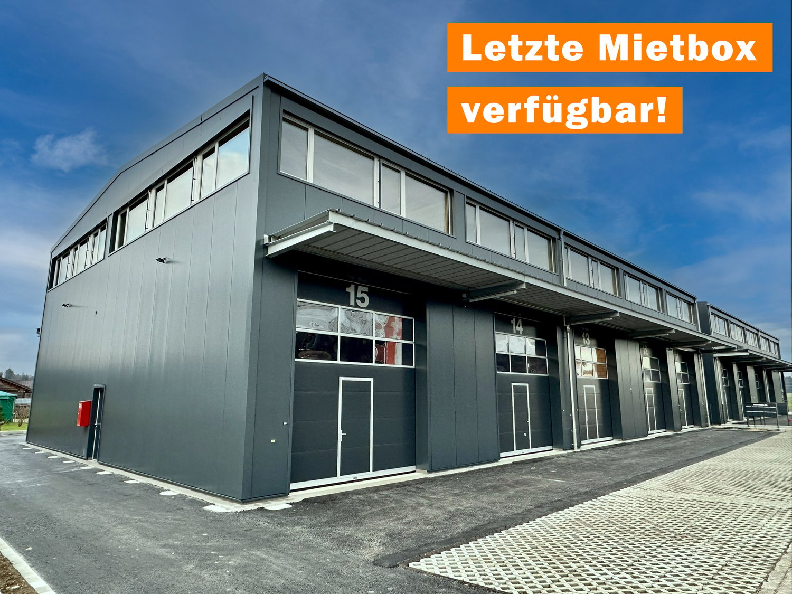
*`01.jpg` — 1500x1125 px — warehouse style building, multiple doors and windows, garage entrance*

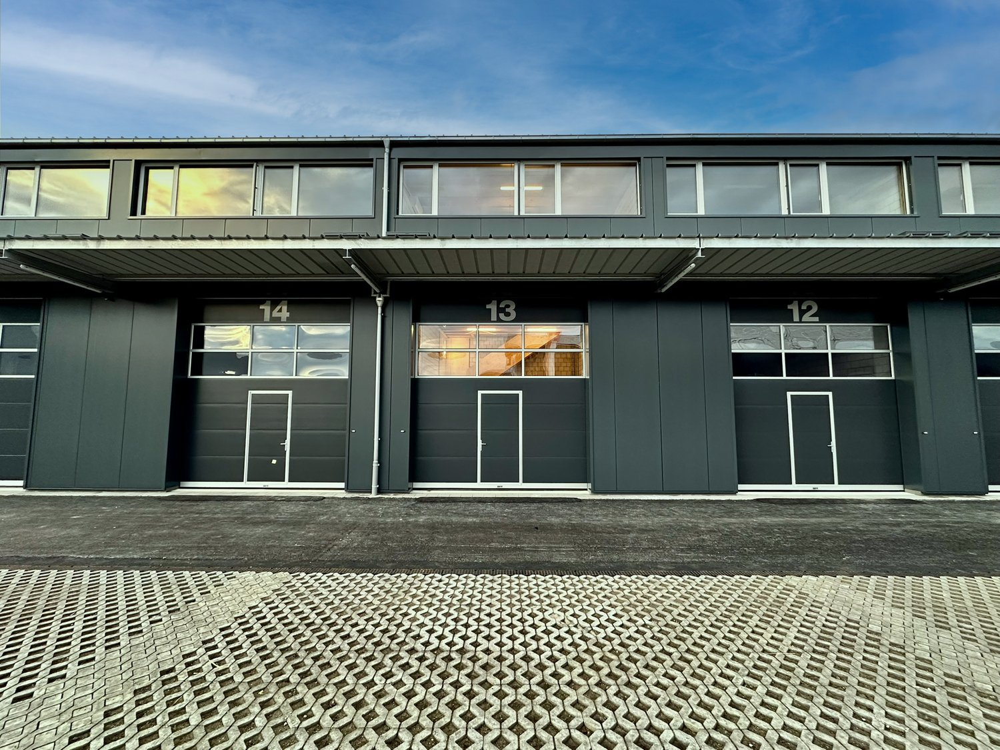
*`02.jpg` — 1500x1125 px*

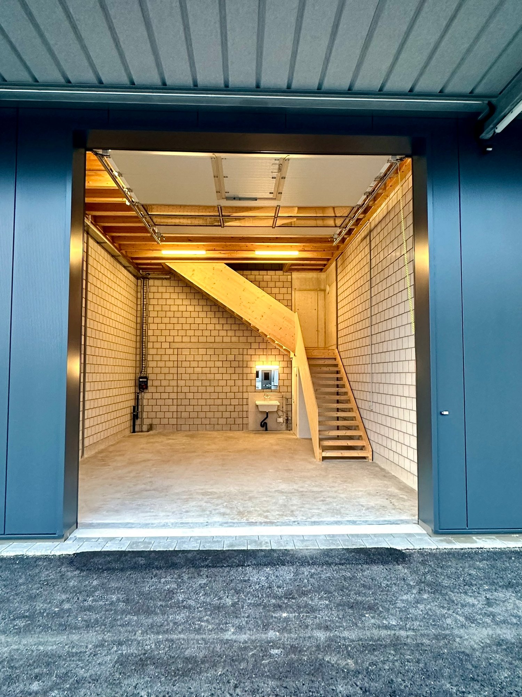
*`03.jpg` — 1500x2000 px — blue exterior doors, wooden staircase, white brick walls, concrete floor, open garage door*

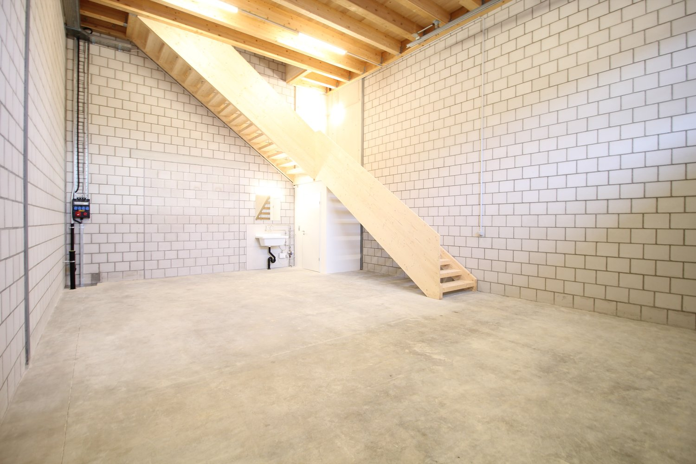
*`04.jpg` — 1500x1000 px — cement floor, white brick walls, wooden staircase, sink*

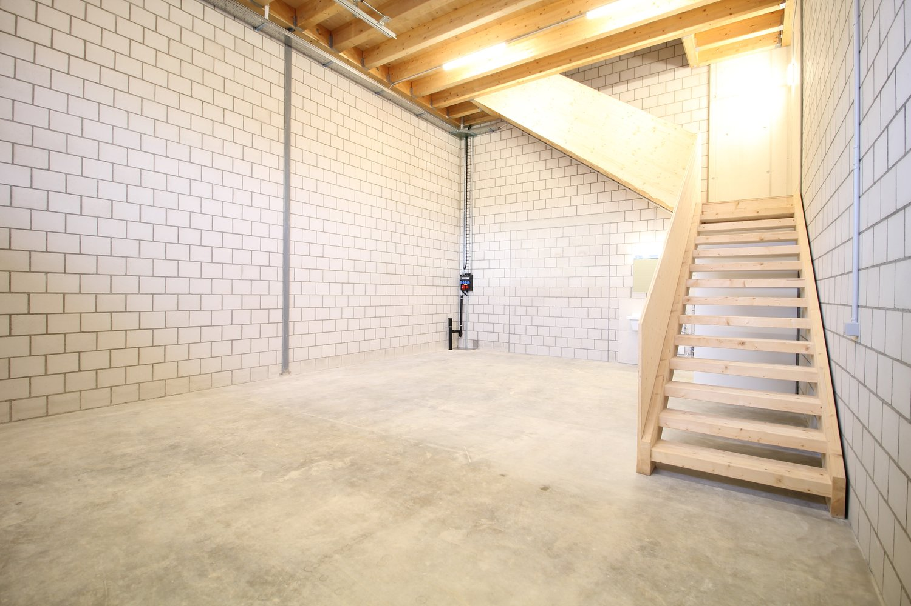
*`05.jpg` — 1500x1000 px*

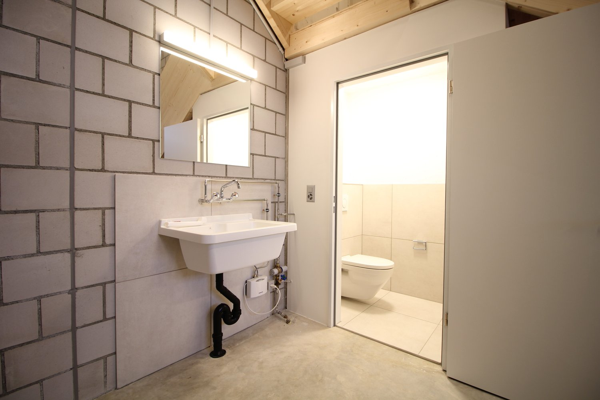
*`06.jpg` — 1500x1000 px — tiled walls, concrete floor, white sink with faucet, mirror, toilet, power outlet, exposed plumbing*

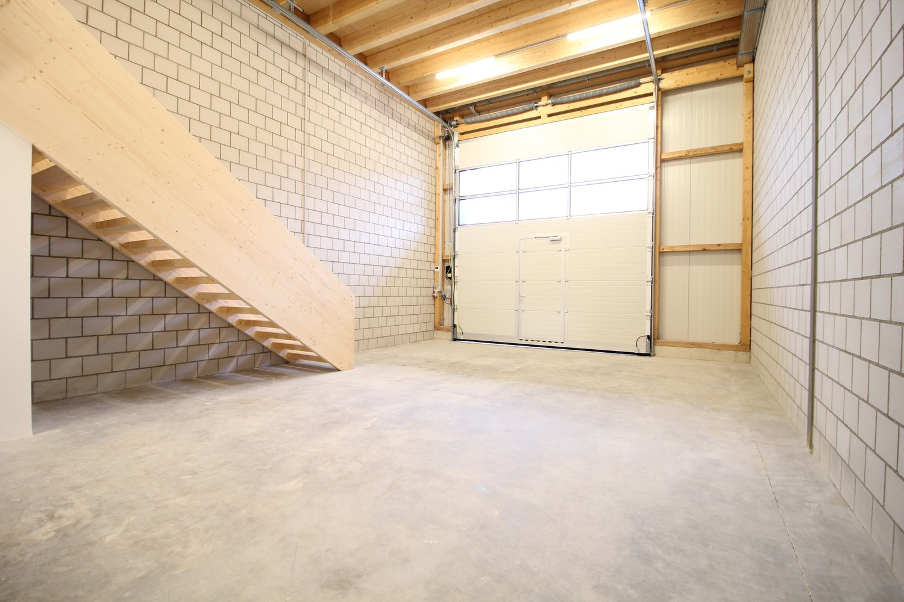
*`07.jpg` — 1500x1000 px — Empty room with white brick walls, wooden ceiling, concrete floor, wooden staircase, and a white garage door.*

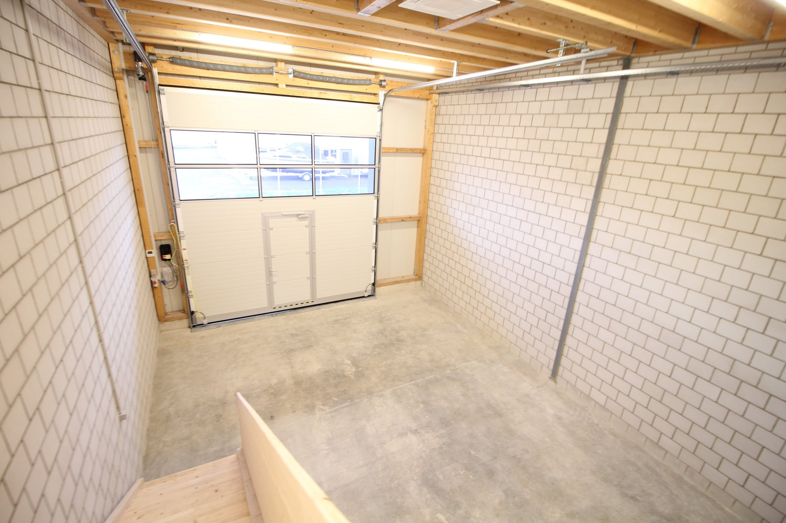
*`08.jpg` — 1500x1000 px*

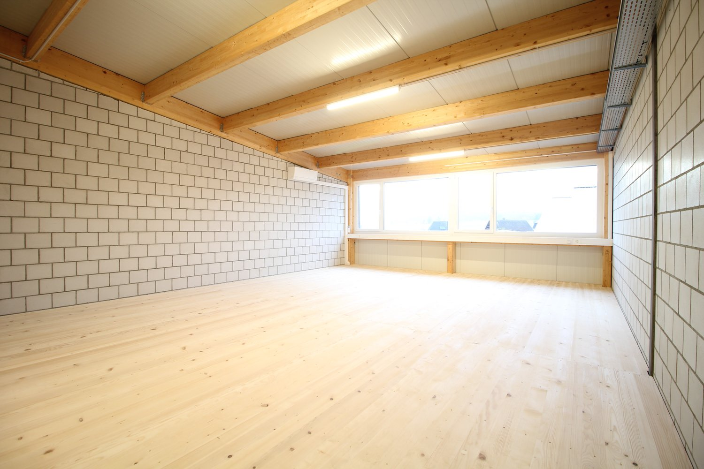
*`09.jpg` — 1500x1000 px — tiled walls, wooden beams, window, wooden flooring*

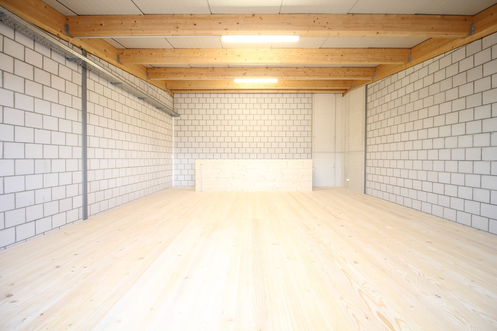
*`10.jpg` — 1500x1000 px — Large open room, wooden floor, white brick walls, wooden beams on the ceiling, recessed lighting*

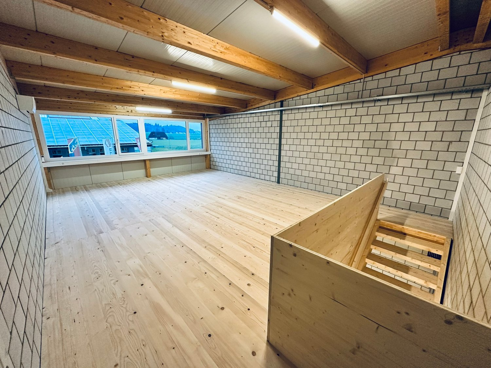
*`11.jpg` — 1500x1125 px — An empty room with hardwood floor, wooden beams on the ceiling, tiled walls, windows, and stairs*

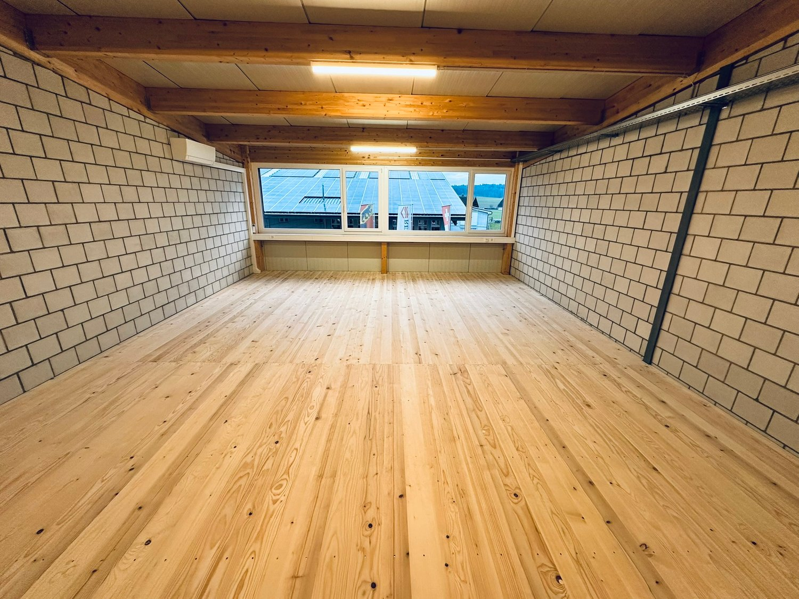
*`12.jpg` — 1500x1125 px — Empty room, wooden floors, white brick walls, large window with solar panels view.*

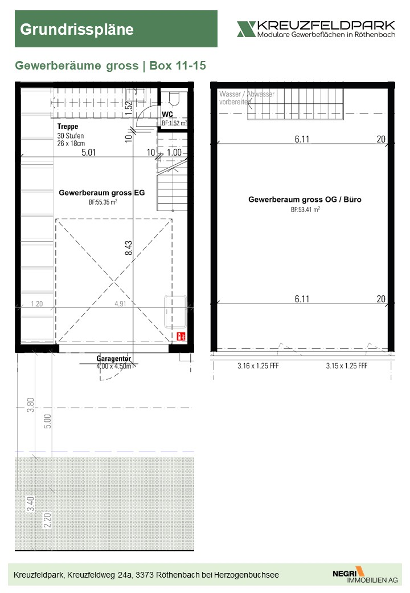
*`13.jpg` — 720x1040 px — Floor plan of a commercial space with gross sizes, dimensions, and annotations for water, waste, and parking.*

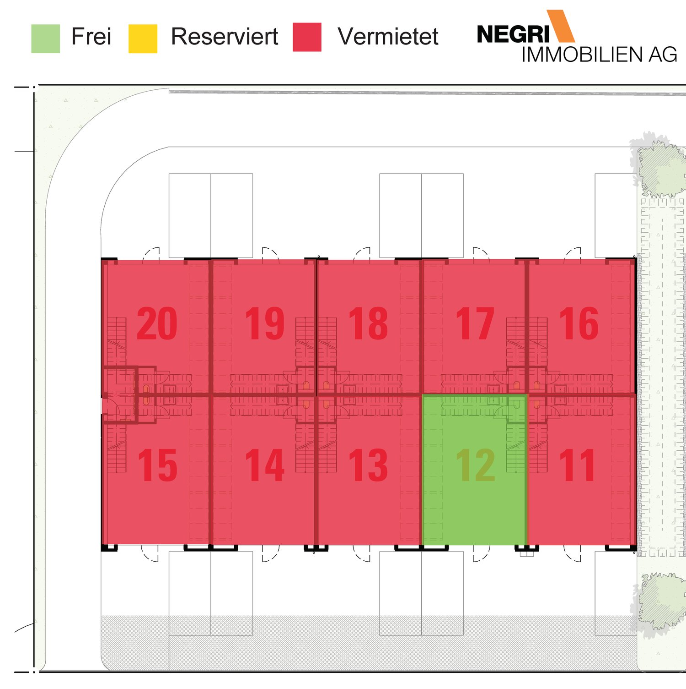
*`14.jpg` — 1500x1504 px — 3 rows, 8 parking places each row, 1 free place, rest all marked as rented*

## Media suplimentară

- **tour_url:** https://my.matterport.com/show/?m=EzKR4Sf2H41
- **website_url:** https://www.negri-immobilien.ch
