# Kernenriedstrasse 1, 3421 Lyssach - CHF 54’640 inkl. NK pro Jahr

> **Categorie:** `B_buero_gewerbe`  
> **Regiune:** Cantonul Berna  
> **Tip ofertă:** RENT / COMMERCIAL  
> **Relevant pentru praxis:** da (praxis)  
> **Sursă:** [flatfox.ch](https://flatfox.ch/de/wohnung/kernenriedstrasse-1-3421-lyssach/85837332/)  
> **Descărcat:** 2026-08-17 12:25

## Date obiect

| Câmp | Valoare |
|---|---|
| Adresă | Kernenriedstrasse 1, 3421 Lyssach |
| Categorie obiect | INDUSTRY |
| Tip obiect | COMMERCIAL |
| Chirie netă | CHF 48'400 |
| Nebenkosten | CHF 6'240 |
| Chirie brută | CHF 54'640 |
| Preț afișat | CHF 4'553 |
| Suprafață utilă | 242 m² |
| An construcție | 2015 |
| Disponibil de la | agr |
| Referință | .1717378.71d4940c-17ee-11f1-89d7-069ae14c7a06 |

## Texte originale (germană)

**Titlu public:** Kernenriedstrasse 1, 3421 Lyssach - CHF 54’640 inkl. NK pro Jahr

**Titlu scurt:** 242m² Gewerbe

**Pitch:** 242m² Gewerbe in Lyssach mieten

**Titlu descriere:** Moderne Gewerbefläche im Gewerbepark "Paradies"

**Titlu chirie:** 242m² Gewerbe in Lyssach mieten

**Spațiu afișat:** 242

### Descriere completă

**Moderne Bürofläche mit 242.43 m² an Toplage direkt bei der A1**   
  
Im repräsentativen Blickle Center in Lyssach, an erstklassiger Lage direkt bei der Autobahnausfahrt Kirchberg (A1) und unmittelbar an der Shoppingmeile Zone 3, vermieten wir per sofort oder nach Vereinbarung eine hochwertige Gewerbefläche im 3. Obergeschoss mit grosszügigen 242.43 m².   
  
Die Fläche bietet viel Raum für verschiedenste Ideen und Nutzungskonzepte, ob als Büro, Verwaltungsstandort, Praxis oder Ausstellungsfläche. Dank der durchdachten Aufteilung und dem hohen Ausbaustandard lässt sich hier ein professionelles und zugleich angenehmes Arbeitsumfeld realisieren.   
  
Der Ausbau überzeugt mit Minergie-Bauweise, 3-fach verglasten Fenstern, einer Raumhöhe von rund 3.11 m sowie einem belüfteten und teilklimatisierten Raumkonzept. Bodenanschlussdosen mit EDV-Verkabelung, Grundbeleuchtung, Telefon-, Radio-, TV- und Internetanschlüsse (Localnet und Swisscom), Laminatboden sowie weiss gehaltene Wände und Decken sind bereits vorhanden. Zur Fläche gehören eine Teeküche mit Kühlschrank und Geschirrspüler, Damen- und Herren-WC-Anlagen, zwei barrierefreie WC-Anlagen, eine Dusche sowie ein Server- bzw. Abstellraum.   
  
Im Gebäude stehen drei Personenlifte sowie zwei grosse Warenlifte mit direkter Anbindung über Hebebühnen zur Verfügung, ideal auch für An- und Ablieferungen. Werbemöglichkeiten sind ebenfalls gegeben.   
  
Die Erreichbarkeit ist optimal: Die Bushaltestelle "Kernenriedstrasse" befindet sich direkt vor dem Gebäude mit Viertelstundentakt und Anschluss an den Bahnhof Kirchberg (SBB/BLS). Für Kunden stehen zahlreiche Aussenparkplätze zur Verfügung, zusätzlich sind öffentlich zugängliche Ladestationen für Elektrofahrzeuge vorhanden.   
  
8 Einstellhallenplätze sind können von Ihnen dazu gemietet werden (CHF 95 p.P.), komfortabel und wettergeschützt. Insgesamt bietet die Liegenschaft eine grosszügige Parkierungsinfrastruktur mit rund 190 Tiefgaragenplätzen sowie ca. 70 Aussenparkplätzen.   
  
Ein angenehmer und etablierter Mietermix sowie das im Haus gelegene Restaurant Noah runden das attraktive Gesamtangebot ab.   
  
  
  
Ihre Vorteile auf einen Blick:   
  

  * Toplage direkt bei der Autobahnausfahrt Kirchberg (A1) 
  * Repräsentativer Standort im Blickle Center in Lyssach 
  * Sehr gute Erreichbarkeit für Kunden und Mitarbeitende 
  * Unmittelbar bei der Shoppingmeile Zone 3 
  * Grosszügige Gewerbefläche mit 242.43 m² Lage im 3. Obergeschoss 
  * Flexible Nutzungsmöglichkeiten (Büro, Praxis, Verwaltung, Showroom) 
  * Moderne und repräsentative Architektur 
  * Grosszügige Fensterflächen mit viel Tageslicht 
  * Raumhöhe von ca. 3.11 m für ein angenehmes Raumgefühl 
  * Energieeffiziente Minergie-Bauweise 
  * Teilklimatisierte und belüftete Räume 
  * 3-fach verglaste Fenster 
  * Bodenanschlussdosen mit EDV-Verkabelung   
Telefon-, Radio-, TV- und Internetanschlüsse vorhanden 
  * Teeküche/Kleinküche mit Kühlschrank, 
  * Geschirrspüler und Mikrowelle 
  * WC-Anlagen gemäss Plan 
  * Laminatboden sowie helle Wände und Decken 
  * Einstellhallenplätze verfügbar 
  * Bezug per sofort möglich 

Gerne zeigen wir Ihnen diese vielseitige Fläche bei einem unverbindlichen Besichtigungstermin. Wir freuen uns auf Ihre Kontaktaufnahme.

## Dotări (attributes)

- parkingspace
- lift
- minergie
- garage

## Ofertant

- **Nume:** Agentur Wyss AG
- **Stradă:** Wyniengstrasse 6
- **NPA:** 3400
- **Localitate:** Burgdorf

## Imagini (13)

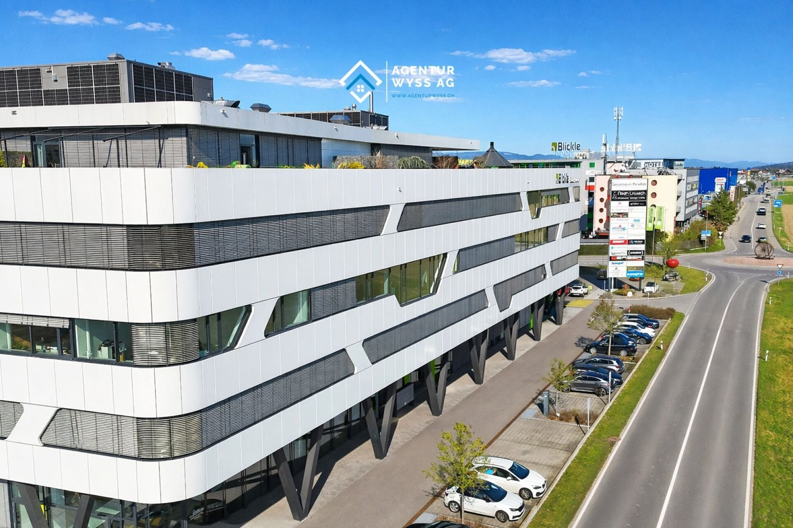
*`01.jpg` — 1500x1000 px*

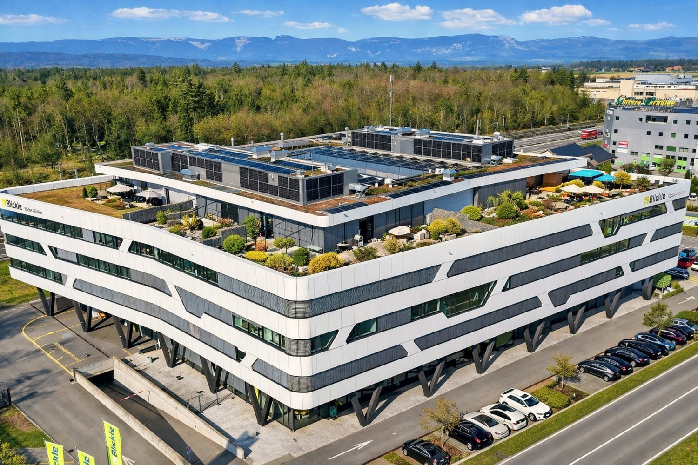
*`02.jpg` — 1500x1000 px*

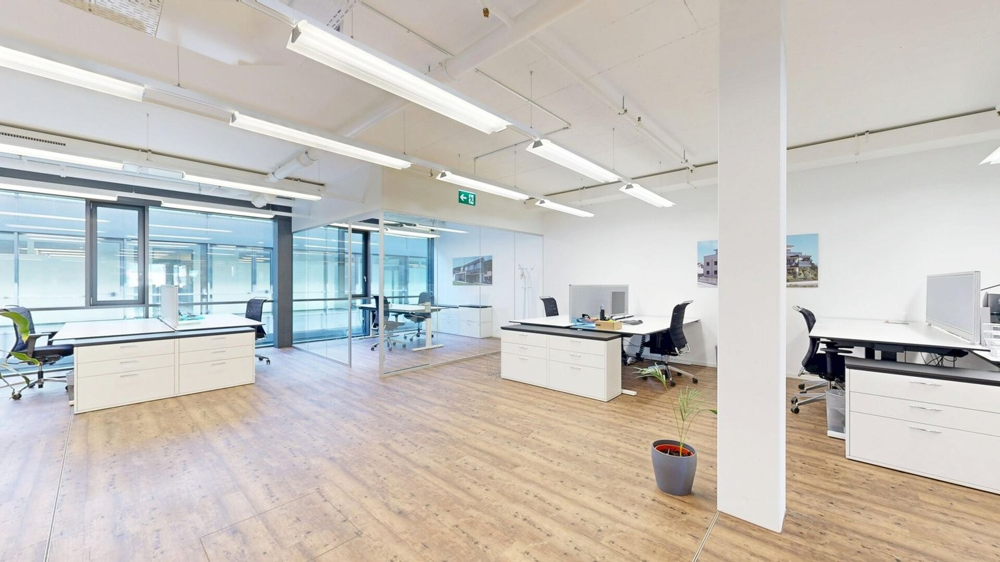
*`03.jpg` — 1500x844 px*

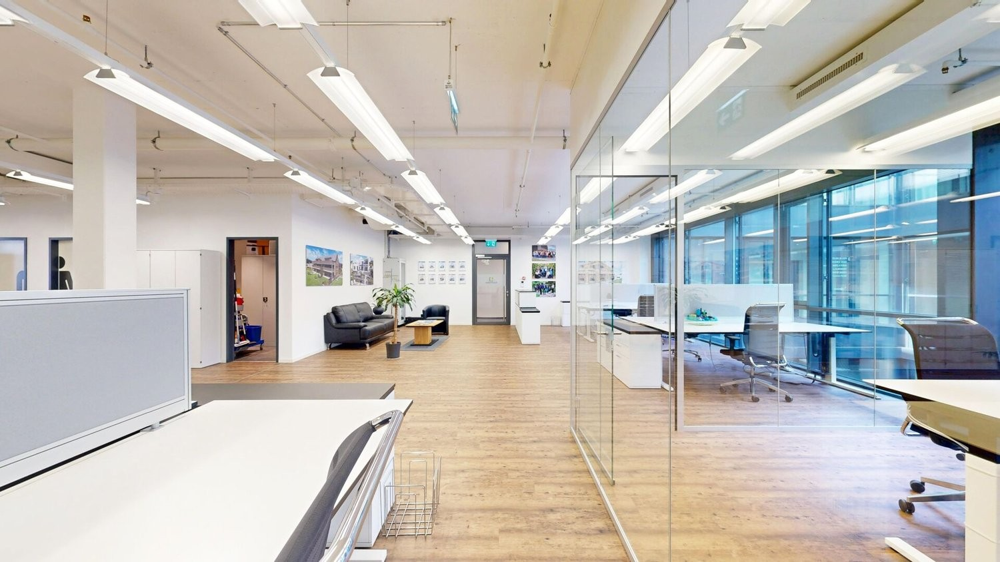
*`04.jpg` — 1500x844 px*

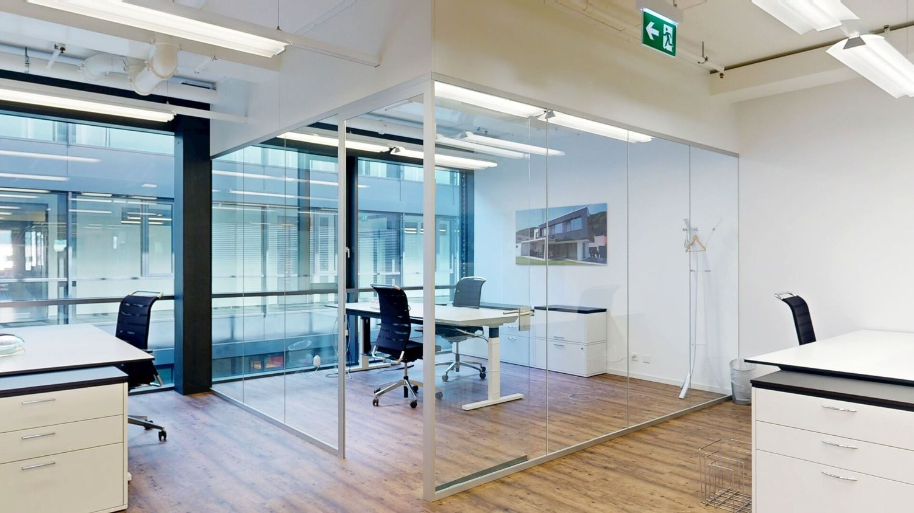
*`05.jpg` — 1500x844 px*

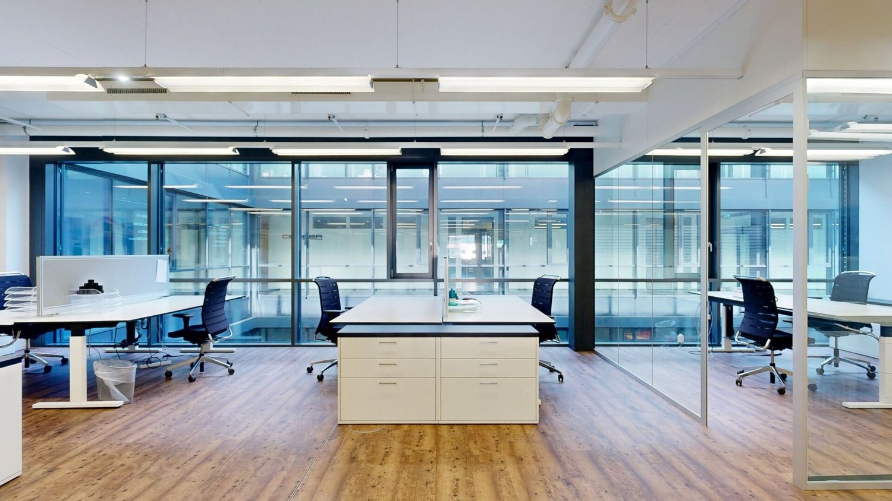
*`06.jpg` — 1500x844 px*

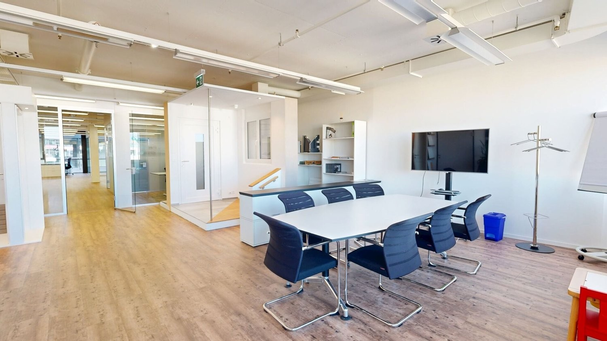
*`07.jpg` — 1500x844 px*

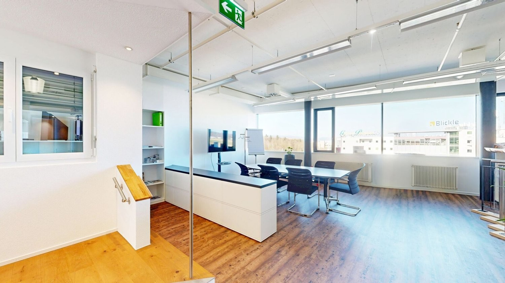
*`08.jpg` — 1500x844 px*

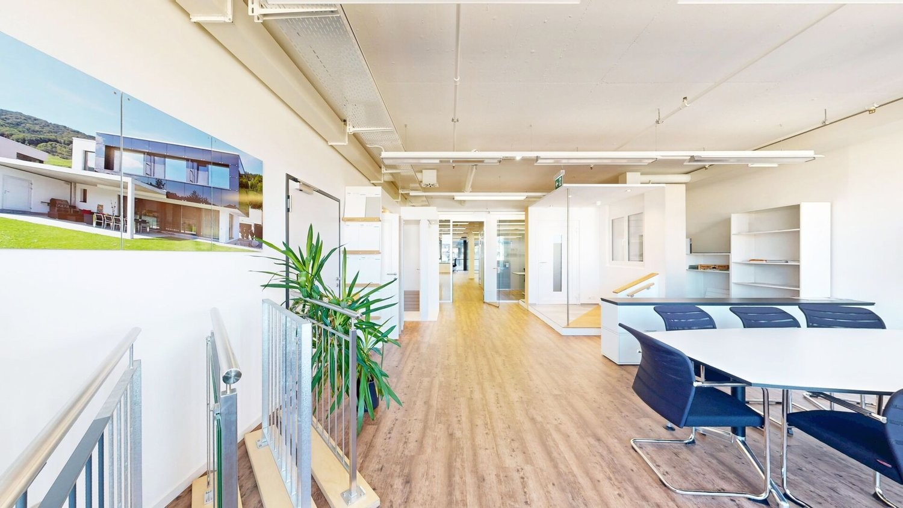
*`09.jpg` — 1500x844 px*

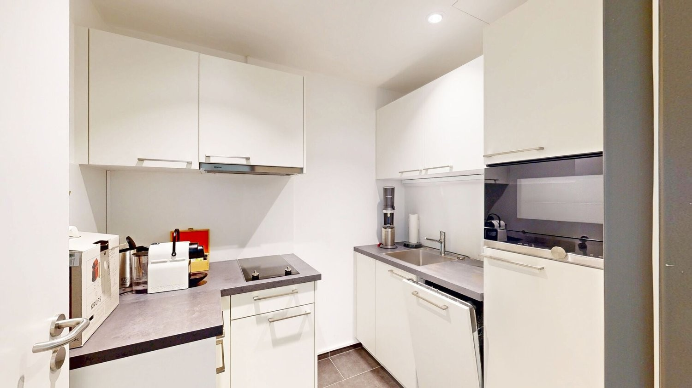
*`10.jpg` — 1500x844 px*

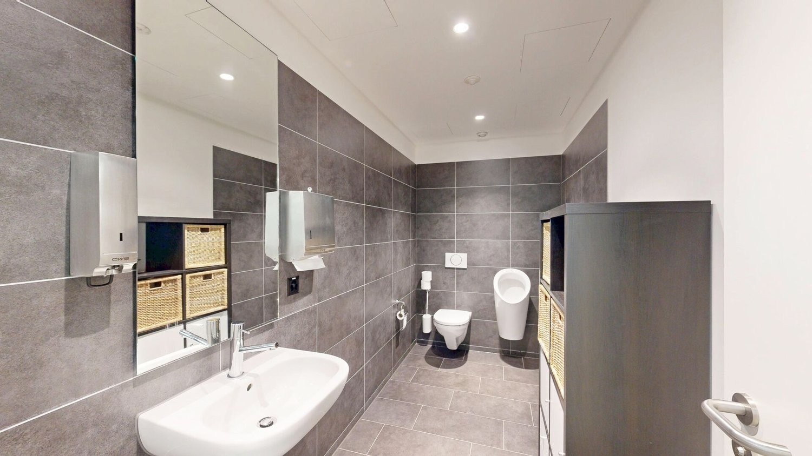
*`11.jpg` — 1500x844 px*

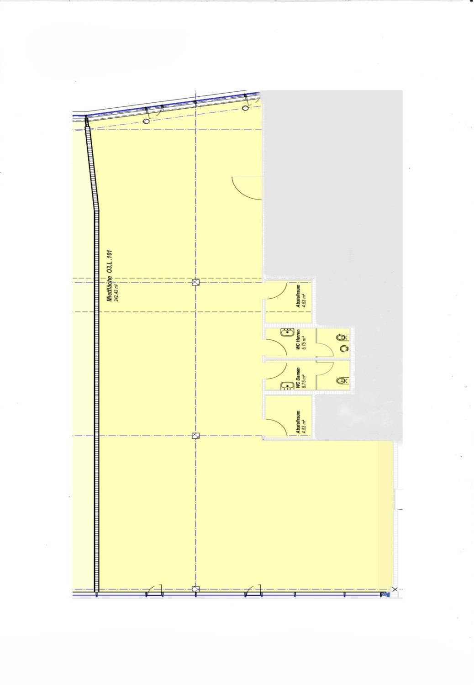
*`12.jpg` — 1038x1500 px*

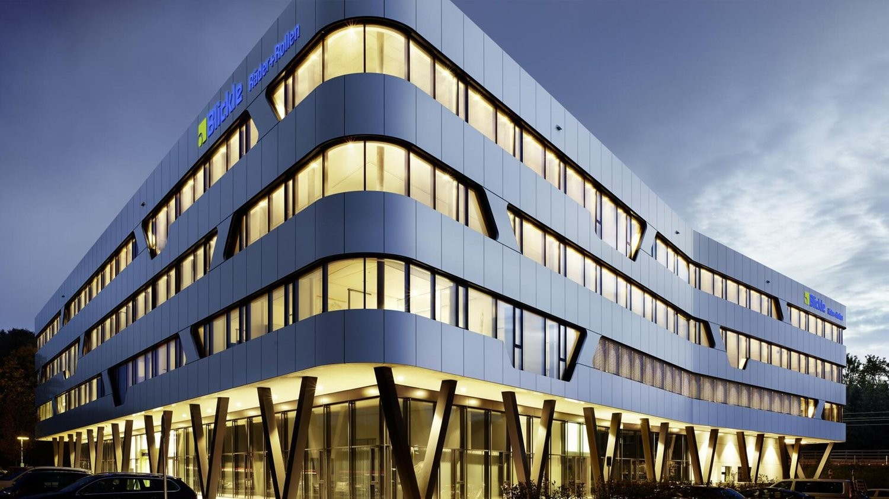
*`13.jpg` — 1500x844 px*

## Media suplimentară

- **tour_url:** https://my.matterport.com/show/?m=yCMcM5UvCqi
- **video_url:** https://youtu.be/OQu9r3nDX6Y?si=afm1f9RzN88xLz4a
