# Bündengasse 22, 2540 Grenchen - auf Anfrage

> **Categorie:** `B_buero_gewerbe`  
> **Regiune:** Cantonul Berna  
> **Tip ofertă:** RENT / OFFICE  
> **Relevant pentru praxis:** da (praxis)  
> **Sursă:** [flatfox.ch](https://flatfox.ch/de/wohnung/bundengasse-22-2540-grenchen/85837672/)  
> **Descărcat:** 2026-08-17 12:27

## Date obiect

| Câmp | Valoare |
|---|---|
| Adresă | Bündengasse 22, 2540 Grenchen |
| Categorie obiect | INDUSTRY |
| Tip obiect | OFFICE |
| Suprafață utilă | 251 m² |
| Etaj | 2 |
| Disponibil de la | agr |
| Referință | 30058.02.420020 |

## Texte originale (germană)

**Titlu public:** Bündengasse 22, 2540 Grenchen - auf Anfrage

**Titlu scurt:** 251m² Büro

**Pitch:** 251m² Büro in Grenchen mieten

**Titlu descriere:** Attraktive Büro- und Gewerberäumlichkeiten in Solothurn!

**Titlu chirie:** 251m² Büro in Grenchen mieten

**Spațiu afișat:** 251

### Descriere completă

An gut erschlossener Lage in Grenchen vermieten wir per sofort oder nach Vereinbarung attraktive Büro- bzw. Gewerberäumlichkeiten mit einer Nutzfläche von rund **251 m2** . Die Räumlichkeiten eignen sich ideal für Unternehmen aus den Bereichen Büro, Dienstleistung, Beratung, Praxis, Schulung oder für stilles Gewerbe. 

  

Die Fläche überzeugt durch eine durchdachte Raumaufteilung , die eine flexible Nutzung ermöglicht. Mehrere separate Räume bieten ideale Voraussetzungen sowohl für **Einzelbüros, Besprechungsräume oder Teamarbeitsplätze** . Dank der grosszügigen Fensterflächen profitieren die Räume von **viel Tageslicht** , was zu einer angenehmen und produktiven Arbeitsatmosphäre beiträgt. 

  

**Highlights der Räumlichkeiten**

  * Helle und freundliche Arbeitsräume 

  * Praktische Unterteilung in mehrere kleinere Büros bzw. Arbeitsbereiche 

  * Flexible Nutzungsmöglichkeiten für Büro, Dienstleistung, Praxis, Schulung oder stilles Gewerbe 

  * Zwei separate WC-Anlagen vorhanden 

  * Parkplätze direkt beim Gebäude verfügbar 

  * Gute Erreichbarkeit sowohl mit dem Auto als auch mit öffentlichen Verkehrsmitteln 

  * Angenehmes und professionelles Arbeitsumfeld 

Die Lage bietet eine **sehr gute Anbindung an das Verkehrsnetz** , sodass Mitarbeitende, Kundinnen und Kunden die Räumlichkeiten bequem erreichen können. Parkmöglichkeiten in unmittelbarer Nähe sorgen zusätzlich für Komfort im Arbeitsalltag. 

  

Haben wir Ihr Interesse geweckt?   
Gerne zeigen wir Ihnen die Räumlichkeiten bei einer persönlichen Besichtigung vor Ort und stehen Ihnen für weitere Informationen jederzeit zur Verfügung.

## Ofertant

- **Nume:** Privera AG
- **Stradă:** Worbstrasse 142
- **NPA:** 3073
- **Localitate:** Gümligen

## Imagini (13)

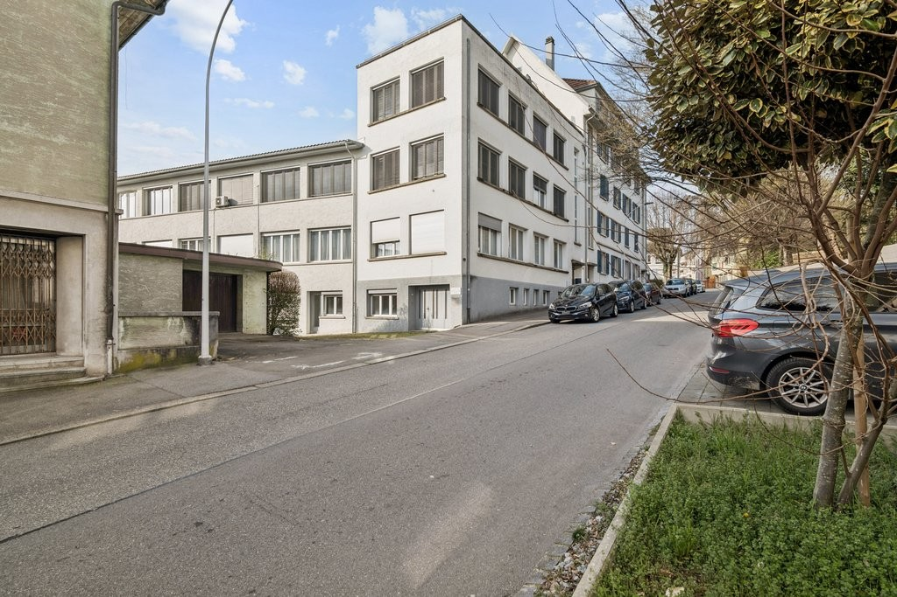
*`01.jpg` — 1024x683 px — 604554-A-backbonephoto-004.jpg*

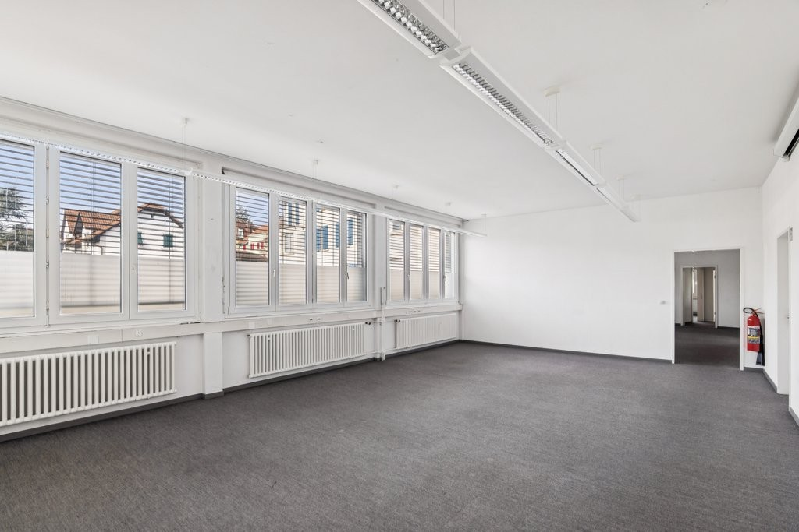
*`02.jpg` — 1024x683 px — 604554-A-backbonephoto-010.jpg*

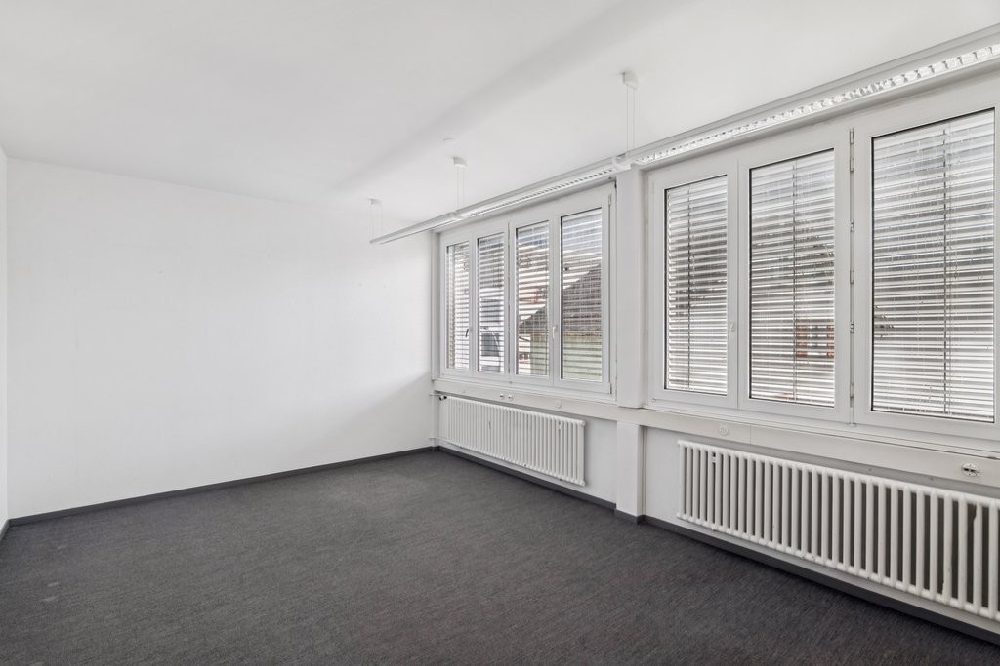
*`03.jpg` — 1024x683 px — 604554-A-backbonephoto-019.jpg*

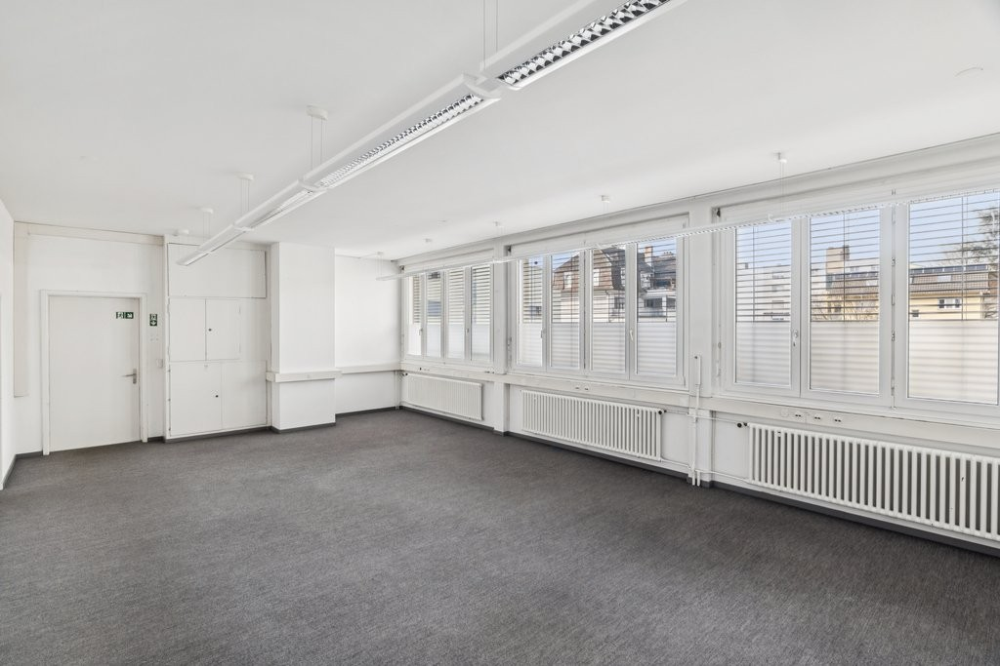
*`04.jpg` — 1024x683 px — 604554-A-backbonephoto-016.jpg*

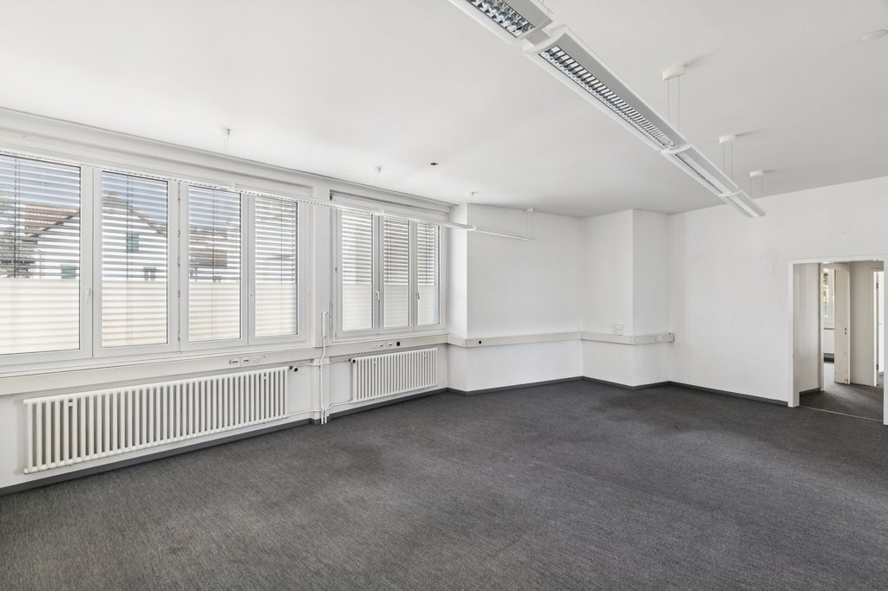
*`05.jpg` — 1024x683 px — 604554-A-backbonephoto-028.jpg*

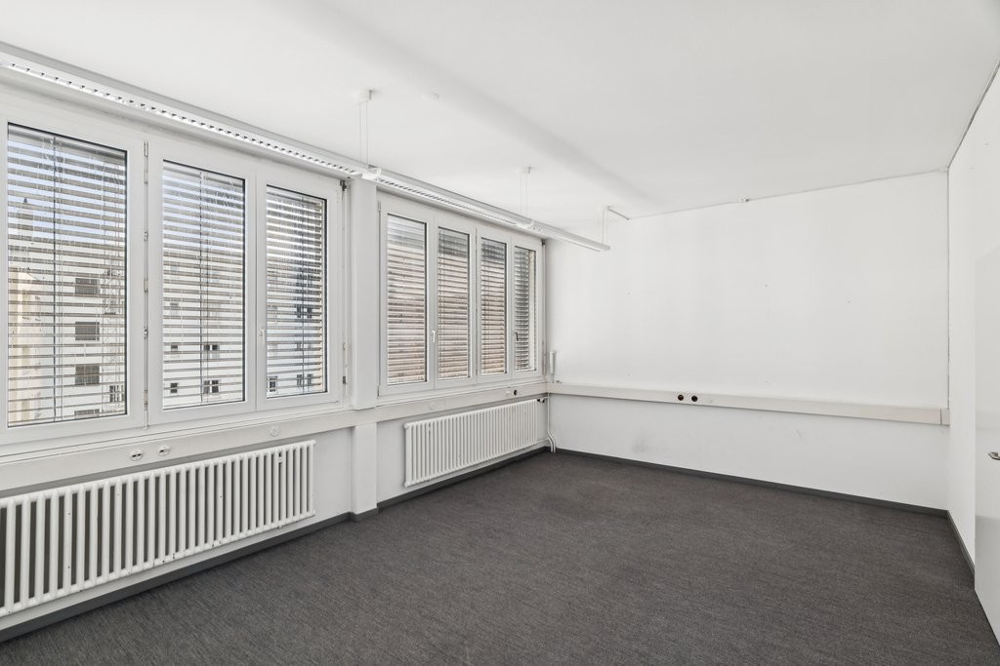
*`06.jpg` — 1024x683 px — 604554-A-backbonephoto-022.jpg*

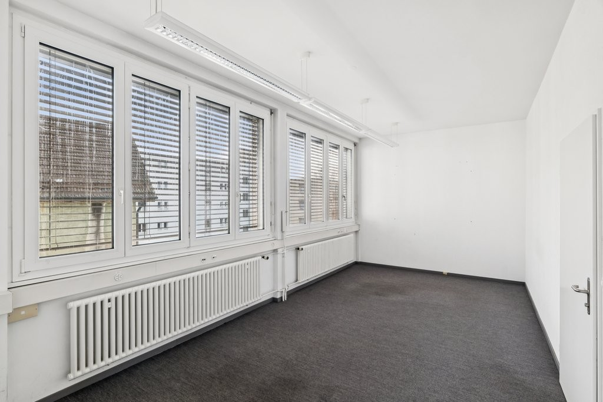
*`07.jpg` — 1024x683 px — 604554-A-backbonephoto-034.jpg*

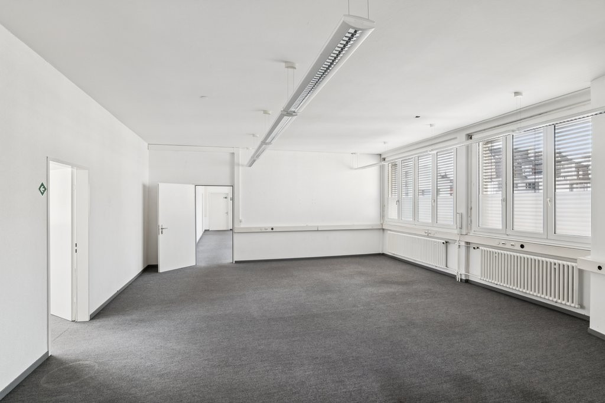
*`08.jpg` — 1024x683 px — 604554-A-backbonephoto-031.jpg*

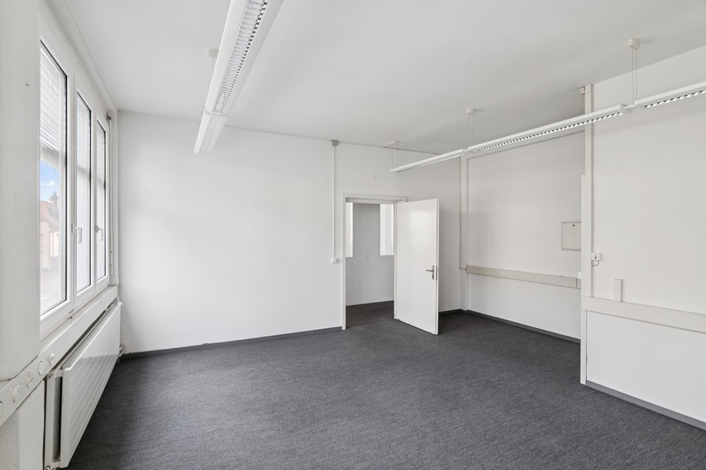
*`09.jpg` — 1024x683 px — 604554-A-backbonephoto-043.jpg*

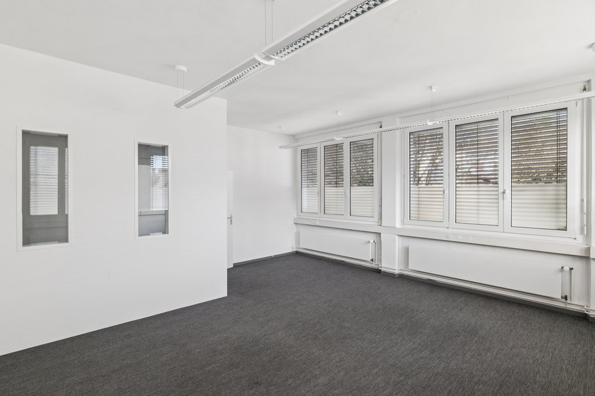
*`10.jpg` — 1024x683 px — 604554-A-backbonephoto-049.jpg*

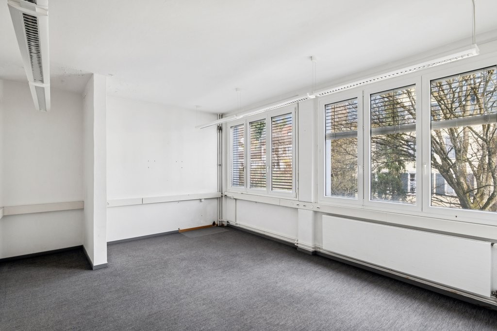
*`11.jpg` — 1024x683 px — 604554-A-backbonephoto-040.jpg*

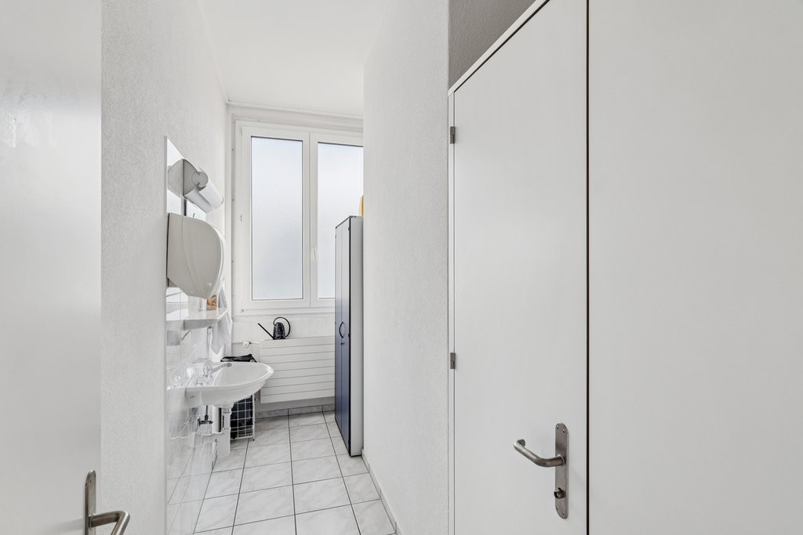
*`12.jpg` — 1024x683 px — 604554-A-backbonephoto-064.jpg*

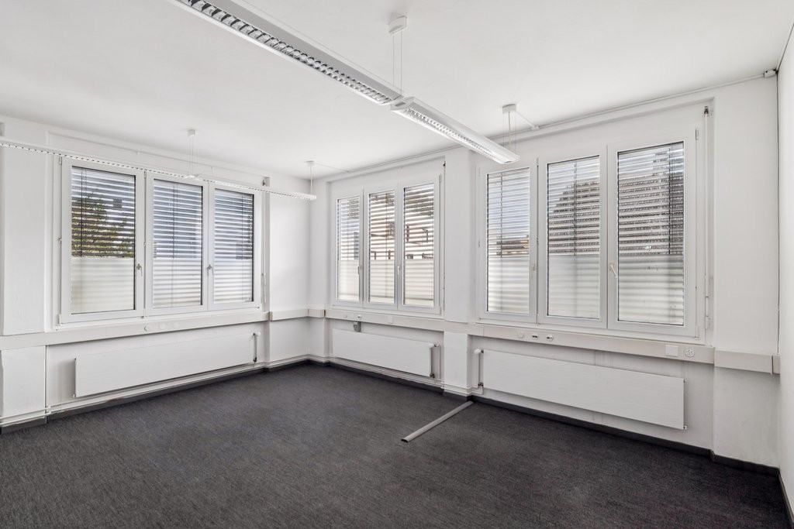
*`13.jpg` — 1024x683 px — 604554-A-backbonephoto-046.jpg*
