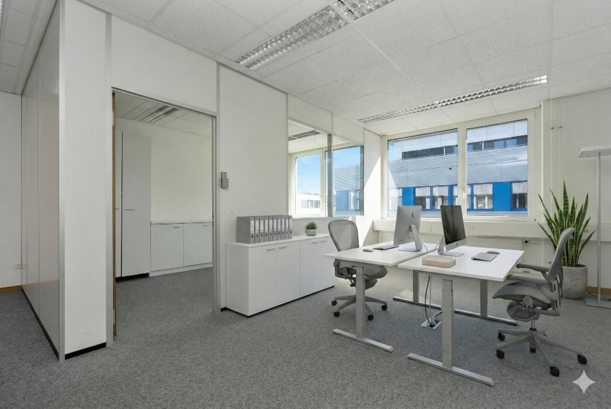
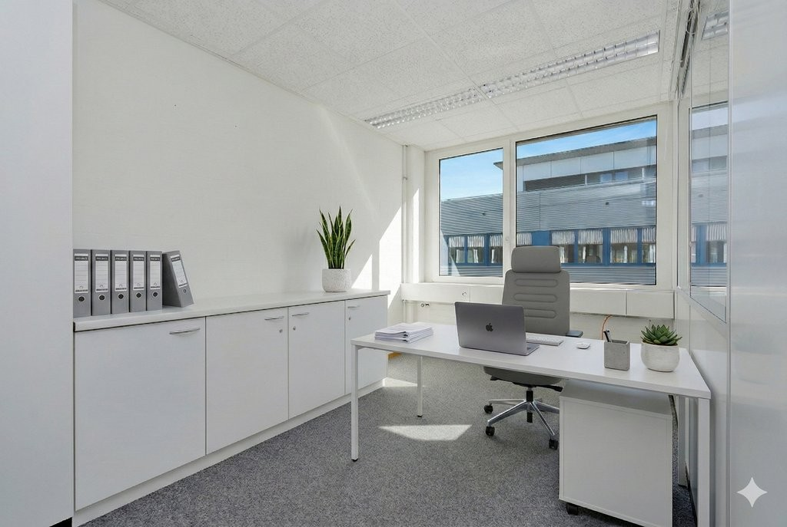
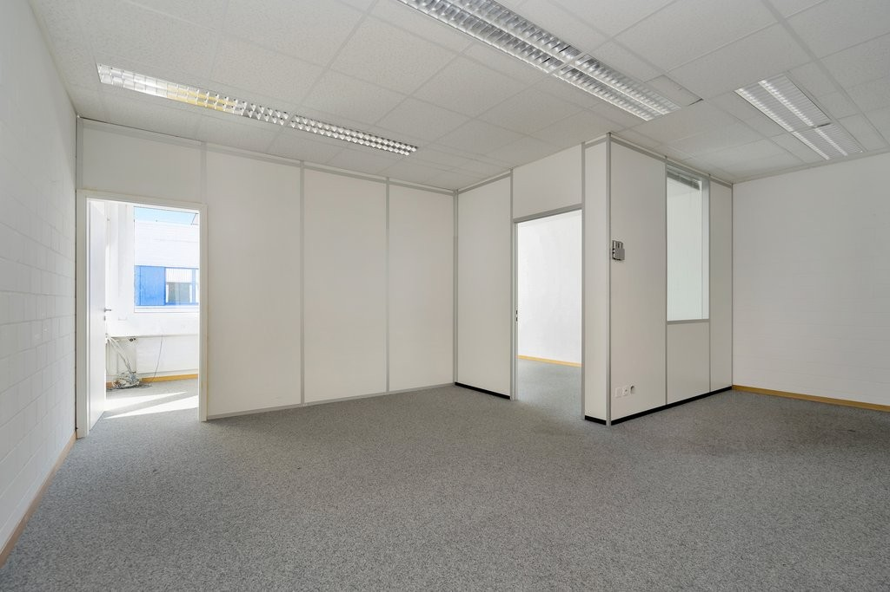
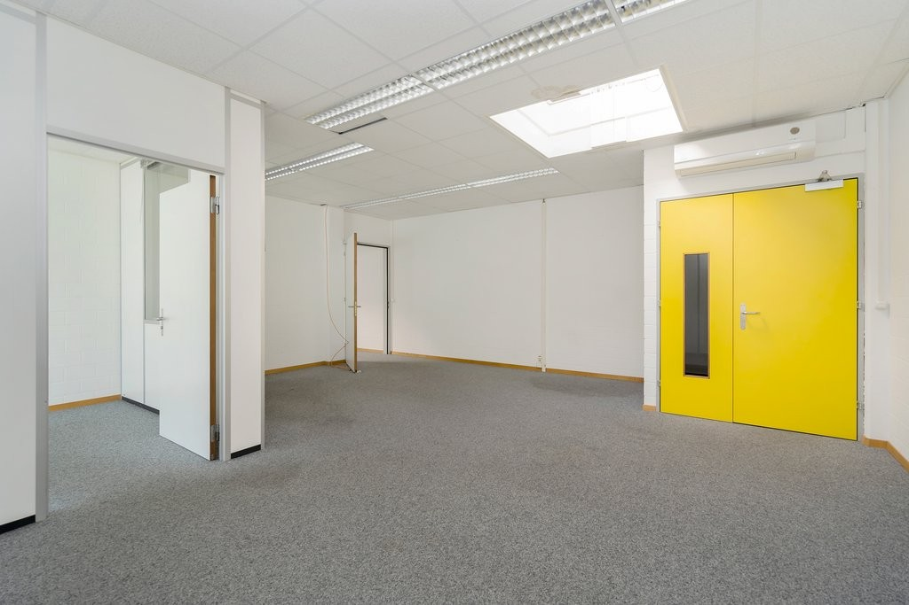
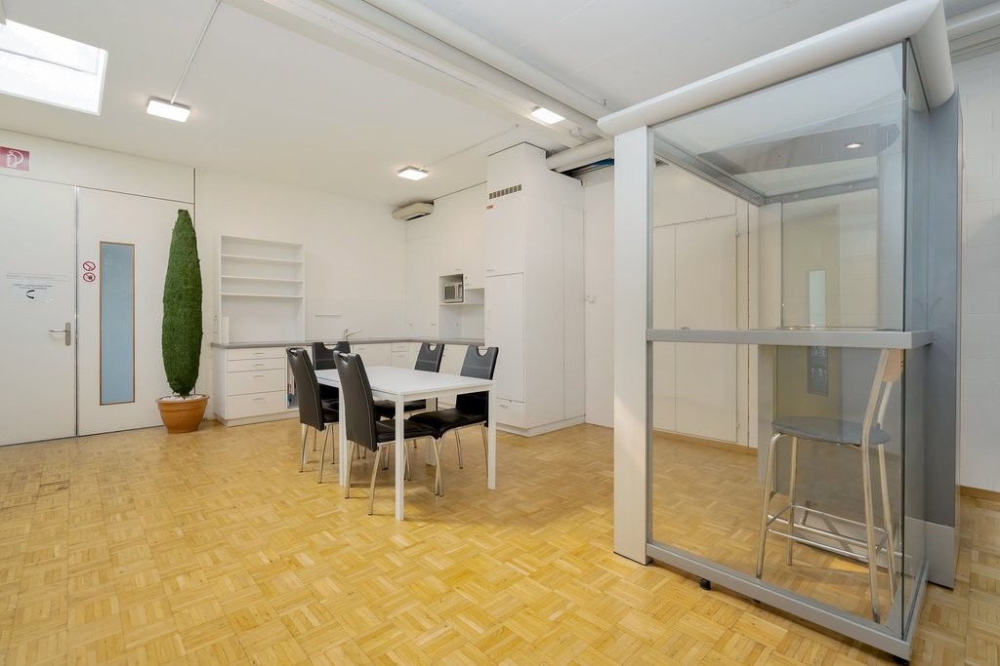
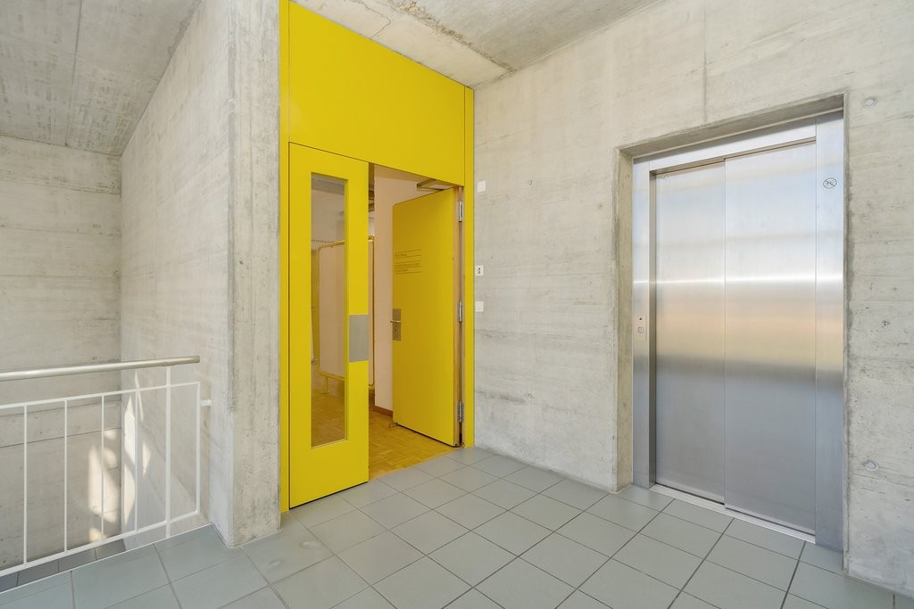
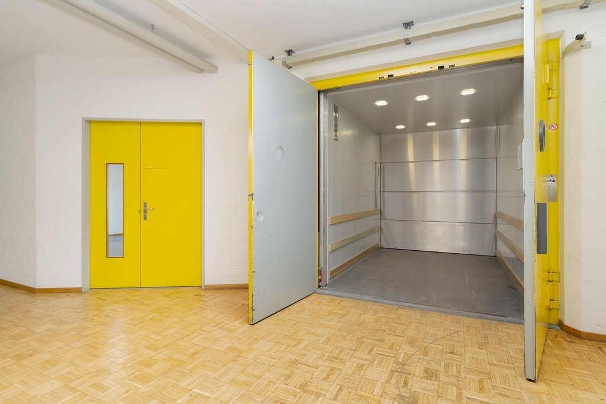
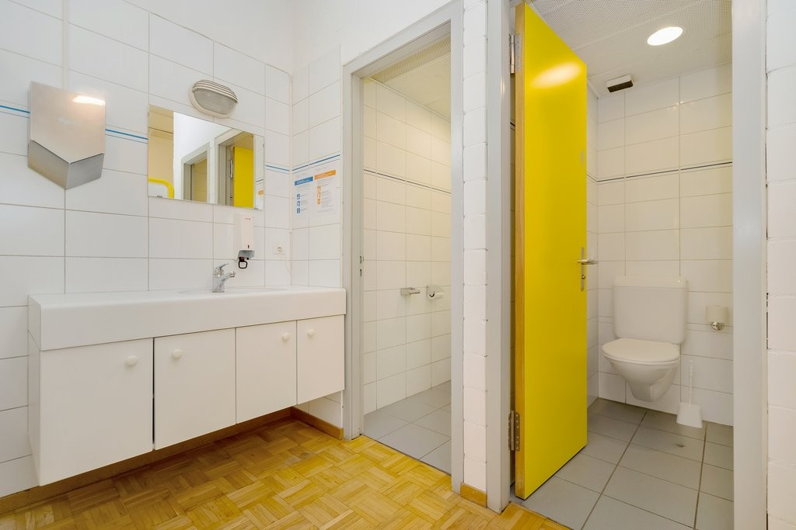
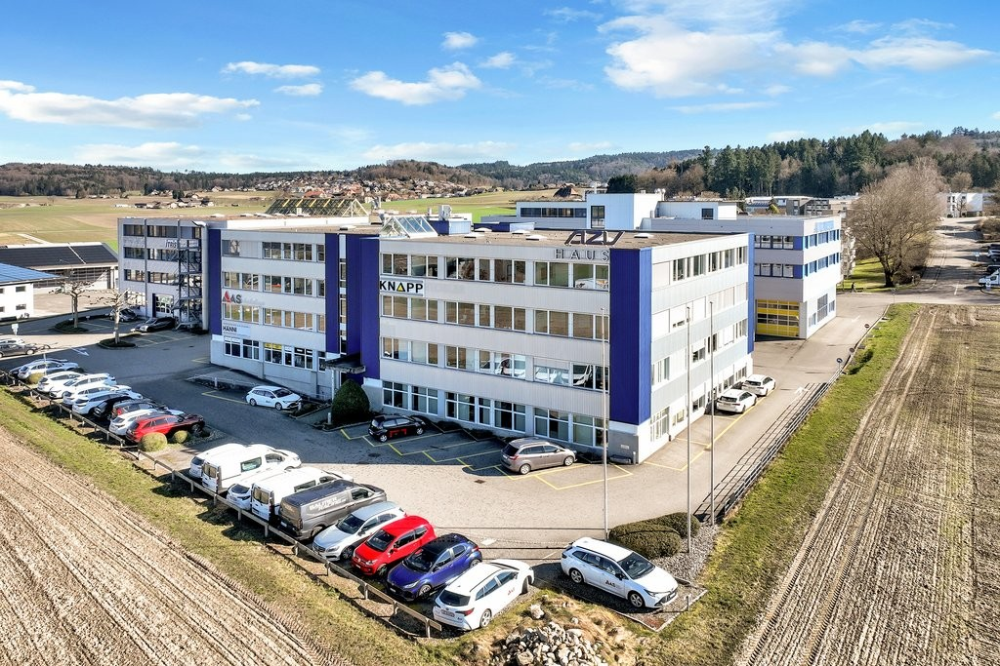

# Grubenstrasse 107, 3322 Urtenen-Schönbühl - CHF 185 inkl. NK pro m² / Jahr

> **Categorie:** `B_buero_gewerbe`  
> **Regiune:** Cantonul Berna  
> **Tip ofertă:** RENT / OFFICE  
> **Relevant pentru praxis:** da (praxis)  
> **Sursă:** [flatfox.ch](https://flatfox.ch/de/wohnung/grubenstrasse-107-3322-urtenen-schonbuhl/85843805/)  
> **Descărcat:** 2026-08-17 12:30

## Date obiect

| Câmp | Valoare |
|---|---|
| Adresă | Grubenstrasse 107, 3322 Urtenen-Schönbühl |
| Categorie obiect | INDUSTRY |
| Tip obiect | OFFICE |
| Chirie netă | CHF 160 |
| Nebenkosten | CHF 25 |
| Chirie brută | CHF 185 |
| Preț afișat | CHF 185 |
| Suprafață utilă | 120 m² |
| Etaj | 3 |
| Disponibil de la | agr |
| Referință | ..1738 |

## Texte originale (germană)

**Titlu public:** Grubenstrasse 107, 3322 Urtenen-Schönbühl - CHF 185 inkl. NK pro m² / Jahr

**Titlu scurt:** 120m² Büro

**Pitch:** 120m² Büro in Urtenen-Schönbühl mieten

**Titlu descriere:** Helle & flexible Gewerbefläche mit Top-Verkehrsanbindung in Schönbühl

**Titlu chirie:** 120m² Büro in Urtenen-Schönbühl mieten

**Spațiu afișat:** 120

### Descriere completă

Wir vermieten per sofort oder nach Vereinbarung im 3. Obergeschoss eine vollständig ausgebaute und vielseitig nutzbare Gewerbefläche an attraktiver Lage in Schönbühl. Die Liegenschaft ist sowohl mit dem Auto als auch bequem mit dem Bus bestens erreichbar. 

**Flexibles Flächenangebot:** ca. 60 m2 (Teilfläche) oder ca. 120 m2 (Gesamtfläche) 

Die hellen Räumlichkeiten überzeugen durch grosse Fensterflächen und bieten durch ihre offene Struktur maximale Flexibilität und lassen sich individuell an Ihre Bedürfnisse anpassen. 

**Ihre Vorteile auf einen Blick**

**Maximale Flexibilität - Freie Raumaufteilung:** Kaum tragende Zwischenwände ermöglichen individuelle Layouts. Vom Grossraumbüro über abgetrennte Sitzungsräume bis hin zu Showroom- oder Mischkonzepten. Arbeitsbereiche können flexibel angepasst oder erweitert werden. 

**Helle, produktive Arbeitsatmosphäre:** Grosszügige Fensterflächen und Oblicht sorgen für viel Tageslicht und ein angenehmes Raumklima. 

**Vielseitige Nutzungsmöglichkeiten:** Die Fläche eignet sich besonders für Büronutzung, Praxis- oder Dienstleistungsbetriebe sowie Ausstellungs- oder Verkaufsflächen. 

**Praktische und durchdachte Infrastruktur**

\- Personenlift und Warenlift 

\- Kunden-/Besucherparkplätze direkt vor dem Gebäude 

\- Tiefgarage mit verfügbaren Mietparkplätzen 

\- WC-Anlagen 

\- Gemeinschaftsküche mit Mikrowelle und Geschirrspüler 

\- Klimaanlage 

Die Kombination aus optimaler Erreichbarkeit, flexibler Raumgestaltung und attraktiver Infrastruktur macht dieses Angebot besonders interessant für Unternehmen. 

Haben wir Ihr Interesse geweckt?   
Dann freuen wir uns auf Ihre Kontaktaufnahme und zeigen Ihnen die Räumlichkeiten gerne bei einer persönlichen Besichtigung. 

**Achtung** : Eigenwerbung: Sie ziehen in eine Mietwohnung und benötigen Unterstützung für den bestmöglichen Verkauf Ihrer Immobilie? Kontaktieren Sie die Dr.Meyer Immobilien AG für eine unverbindliche Offerte -  **wir sind gut darin.**

## Dotări (attributes)

- garage
- accessiblewithwheelchair
- lift
- ramp
- parkingspace
- view

## Ofertant

- **Nume:** Dr.Meyer Immobilien AG
- **Stradă:** Morgenstrasse 83A
- **NPA:** 3018
- **Localitate:** Bern

## Imagini (9)

*`01.jpg` — 1024x687 px — Titelbild.png*

*`02.jpg` — 1024x687 px — Option_Einzelbuero.jpg*

*`03.jpg` — 1024x683 px — Ansicht_Bueroflaeche_1.jpg*

*`04.jpg` — 1024x683 px — Ansicht_Bueroflaeche_2.jpg*

*`05.jpg` — 1024x683 px — Kueche_Gemeinschaftsflaeche.jpg*

*`06.jpg` — 1024x683 px — Eingang_und_Lift.jpg*

*`07.jpg` — 1024x683 px — Warenlift.jpg*

*`08.jpg` — 1024x683 px — Toiletten.jpg*

*`09.jpg` — 1024x683 px — Aussenansicht.jpg*
