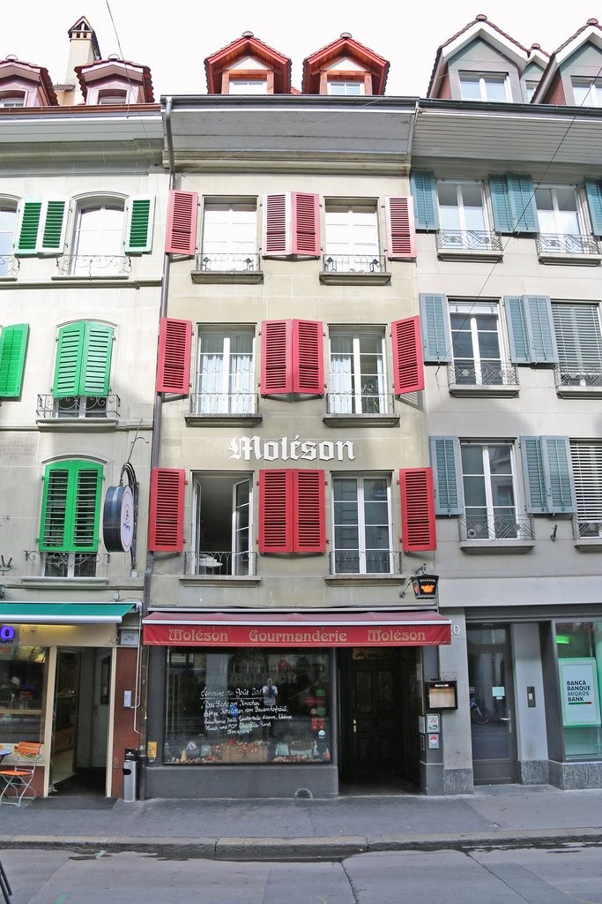
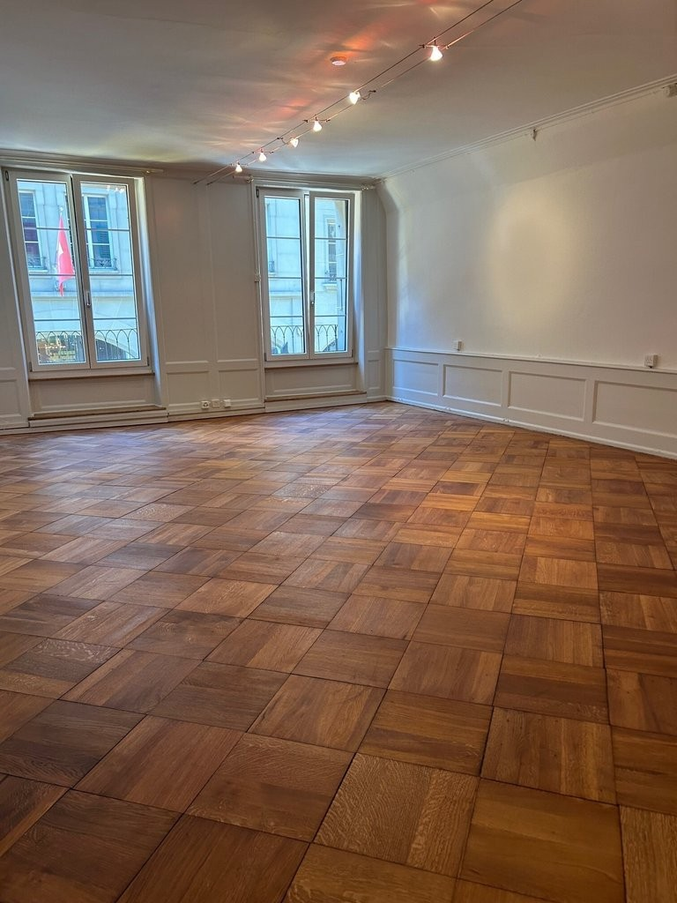
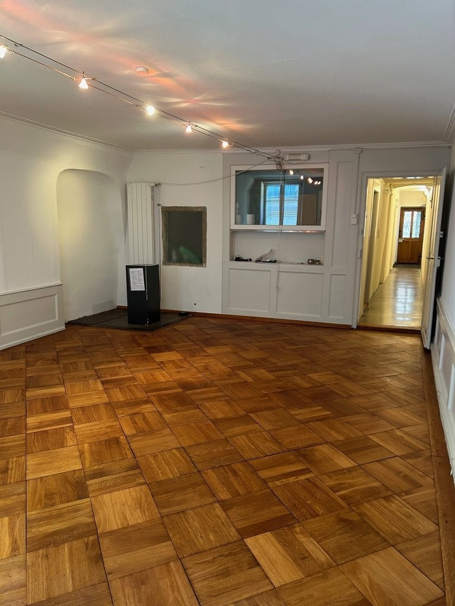
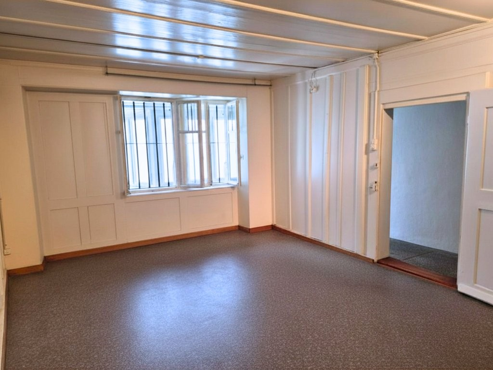
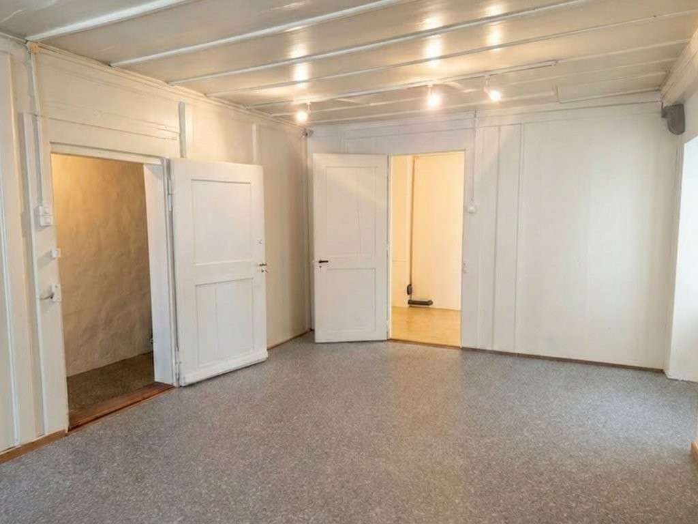

# Aarbergergasse 24, 3011 Bern - CHF 1’785 inkl. NK pro Monat

> **Categorie:** `B_buero_gewerbe`  
> **Regiune:** Berna (oraș)  
> **Tip ofertă:** RENT / OFFICE  
> **Relevant pentru praxis:** da (praxis)  
> **Sursă:** [flatfox.ch](https://flatfox.ch/de/wohnung/aarbergergasse-24-3011-bern/85853714/)  
> **Descărcat:** 2026-08-17 12:26

## Date obiect

| Câmp | Valoare |
|---|---|
| Adresă | Aarbergergasse 24, 3011 Bern |
| Categorie obiect | INDUSTRY |
| Tip obiect | OFFICE |
| Chirie netă | CHF 1'585 |
| Nebenkosten | CHF 200 |
| Chirie brută | CHF 1'785 |
| Preț afișat | CHF 1'785 |
| Suprafață utilă | 76 m² |
| Etaj | 1 |
| Disponibil de la | imm |
| Referință | 17890.01.410010 |

## Texte originale (germană)

**Titlu public:** Aarbergergasse 24, 3011 Bern - CHF 1’785 inkl. NK pro Monat

**Titlu scurt:** 76m² Büro

**Pitch:** 76m² Büro in Bern mieten

**Titlu descriere:** Einzigartige Gewerberäumlichkeit mit Charakter in Berns Altstadt

**Titlu chirie:** 76m² Büro in Bern mieten

**Spațiu afișat:** 76

### Descriere completă

An zentraler Lage, nur wenige Schritte vom Bahnhof Bern entfernt, vermieten wir eine einzigartige Gewerberäumlichkeit an der **Aarbergergasse 24, 3011 Bern** . Die Räumlichkeit befindet sich in einem historischen Gebäude und überzeugt durch ihren besonderen Charme: **wunderschöner Parkett** , **eine charaktervolle Holzdecke** sowie hohe Räume schaffen eine warme, einladende Atmosphäre - ideal für eine Praxis, ein Atelier, eine Kanzlei oder ein stilles Büro. 

  

Die Fläche wurde bisher als **Wirtenbüro** genutzt und eignet sich aufgrund der zentralen Lage hervorragend für ähnliche oder andere diskrete Nutzungen im Dienstleistungsbereich. Aufgrund der bisherigen Nutzung ist die Räumlichkeit nur zweckmässig ausgestattet, auf individuelle Wünsche kann eingegangen werden. 

  

**Ihre Vorteile auf einen Blick:**

  * Toplage in der Berner Altstadt , wenige Gehminuten vom Bahnhof entfernt 

  * Historisches Ambiente mit viel Charme und Charakter 

  * Grosszügige, helle Räume mit Altbauflair 

  * Zugang zu Innenhof für Pausen, etc. 

  * Vielfältige Gastronomie-, Einkaufs- und Dienstleistungsangebote in unmittelbarer Umgebung 

  * eigene Toilette in der Mietfläche 

  * zweckmässige Teeküche möglich 

  * Parkhäuser und Veloabstellplätze in der Nähe 

  * Repräsentative Adresse 

Die Räumlichkeit bietet nicht nur einen inspirierenden Arbeitsplatz, sondern auch eine hervorragende Visitenkarte für Ihre Kundschaft. 

  

Es stehen keine Parkplätze in der Liegenschaft zur Verfügung. Die Räumlichkeiten sind nicht rollstuhlgängig erschlossen und die Liegenschaft verfügt über keinen Lift.   

  

**Haben wir Ihr Interesse geweckt?**   
Gerne stehen wir Ihnen für weitere Informationen oder einen unverbindlichen Besichtigungstermin zur Verfügung.

## Ofertant

- **Nume:** Von Graffenried AG Liegenschaften
- **Stradă:** Marktgass-Passage 3
- **NPA:** 3011
- **Localitate:** Bern

## Imagini (5)

*`01.jpg` — 683x1024 px — IMG_7367.jpg*

*`02.jpg` — 768x1024 px — Buero_vorne_3.jpg*

*`03.jpg` — 768x1024 px — Buero_vorne.jpg*

*`04.jpg` — 1024x768 px — Buero_1._Stock_Archiv_Fensteransicht.png*

*`05.jpg` — 1024x768 px — Buero_1._Stock_Archiv.png*
