# Industrie Neuhof 78, 3422 Kirchberg BE - CHF 220 exkl. NK pro m² / Jahr

> **Categorie:** `B_buero_gewerbe`  
> **Regiune:** Cantonul Berna  
> **Tip ofertă:** RENT / COMMERCIAL  
> **Sursă:** [flatfox.ch](https://flatfox.ch/de/wohnung/industrie-neuhof-78-3422-kirchberg-be/85891457/)  
> **Descărcat:** 2026-08-17 12:33

## Date obiect

| Câmp | Valoare |
|---|---|
| Adresă | Industrie Neuhof 78, 3422 Kirchberg BE |
| Categorie obiect | INDUSTRY |
| Tip obiect | COMMERCIAL |
| Chirie netă | CHF 220 |
| Preț afișat | CHF 220 |
| Suprafață utilă | 904 m² |
| Disponibil de la | imm |
| Referință | 664.1725632.ab221d04-26bc-11f1-89d7-069ae14c7a06 |

## Texte originale (germană)

**Titlu public:** Industrie Neuhof 78, 3422 Kirchberg BE - CHF 220 exkl. NK pro m² / Jahr

**Titlu scurt:** 904m² Gewerbe

**Pitch:** 904m² Gewerbe in Kirchberg BE mieten

**Titlu descriere:** 904 m2 Gewerbe-/Bürofläche

**Titlu chirie:** 904m² Gewerbe in Kirchberg BE mieten

**Spațiu afișat:** 904

### Descriere completă

**Moderne Büroflächen in etablierter Gewerbelage**   
  
An der Industrie Neuhof 78 in Kirchberg stehen attraktive Büroflächen zur Vermietung bereit. Die Liegenschaften befinden sich in einem gut eingespielten Gewerbequartier und richten sich an Unternehmen, die Wert auf eine professionelle Adresse, flexible Raumaufteilung und eine hervorragende Verkehrsanbindung legen.   
  
**Lage & Erreichbarkeit **   
  
Kirchberg liegt im Herzen des Kantons Bern und bietet eine der besten Verkehrslagen der Region. Die Autobahn A1 ist in wenigen Minuten erreichbar und verbindet den Standort direkt mit Bern, Biel, Solothurn und Zürich. Für Mitarbeitende, die mit dem öffentlichen Verkehr anreisen, steht der Bahnhof Kirchberg-Alchenflüh in der Nähe zur Verfügung, von wo aus regelmässige Verbindungen in die Region bestehen. Grosszügige Parkplätze direkt am Gebäude sorgen dafür, dass auch Besucher und Kundinnen unkompliziert und kostenlos parkieren können.   
  
**Die Büroflächen**   
  
Im 3. Obergeschoss des Gebäudes erwarten Sie exklusive, private Büroflächen, die ausschliesslich über einen persönlichen Schlüssel und separaten Eingang zugänglich sind. Das gesamte Stockwerk steht Ihnen zur alleinigen Nutzung zur Verfügung, diskret, sicher und vollständig auf Ihre Bedürfnisse ausgerichtet. Die hellen, autonomen Bürozimmer sind entlang zwei parallel verlaufender Korridore angeordnet. Dank grosszügiger Fensterfronten auf beiden Gebäudeseiten profitieren alle Räume von natürlichem Tageslicht und einer angenehmen, produktiven Arbeitsatmosphäre. Im zentralen Bereich zwischen den Bürozimmern und den Korridoren befinden sich die gemeinschaftlichen Einrichtungen: zwei separate WC-Anlagen sowie ein Putzraum. Alles ist zentral gelegen, gepflegt und für alle Nutzer des Stockwerks bequem erreichbar.   
  
**Infrastruktur & Umfeld **   
  
Die Lage im Industriegebiet Neuhof bietet eine ruhige, konzentrierte Arbeitsatmosphäre fernab von städtischem Lärm und Trubel. Dennoch fehlt es nicht an Versorgung: Restaurants, Einkaufsmöglichkeiten und weitere Dienstleister befinden sich in unmittelbarer Nähe und machen den Arbeitsalltag angenehm. Das Gewerbequartier ist seit Jahren gewachsen und beherbergt eine Vielzahl etablierter Unternehmen, ein Umfeld, das Seriosität und Stabilität ausstrahlt.   
  
**Warum Kirchberg?**   
  
Der Kanton Bern bietet Unternehmen stabile und verlässliche Rahmenbedingungen. Kirchberg als Gewerbestandort verbindet die Nähe zur Bundesstadt mit einem deutlich günstigeren Kostenniveau, sowohl bei den Mietpreisen als auch im allgemeinen Betrieb. Wer in Kirchberg mietet, gewinnt Fläche, Flexibilität und eine hervorragende Anbindung, ohne die hohen Kosten eines Stadtstandorts tragen zu müssen.

## Dotări (attributes)

- parkingspace

## Ofertant

- **Nume:** Agentur Wyss AG
- **Stradă:** Wyniengstrasse 6
- **NPA:** 3400
- **Localitate:** Burgdorf

## Imagini (13)

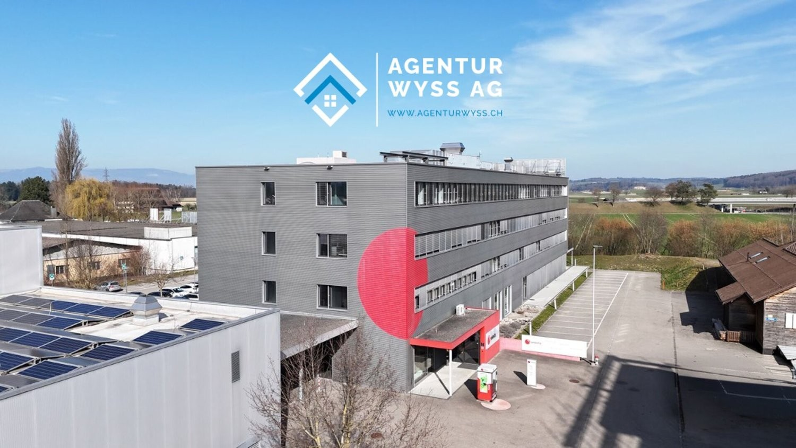
*`01.jpg` — 1500x845 px*

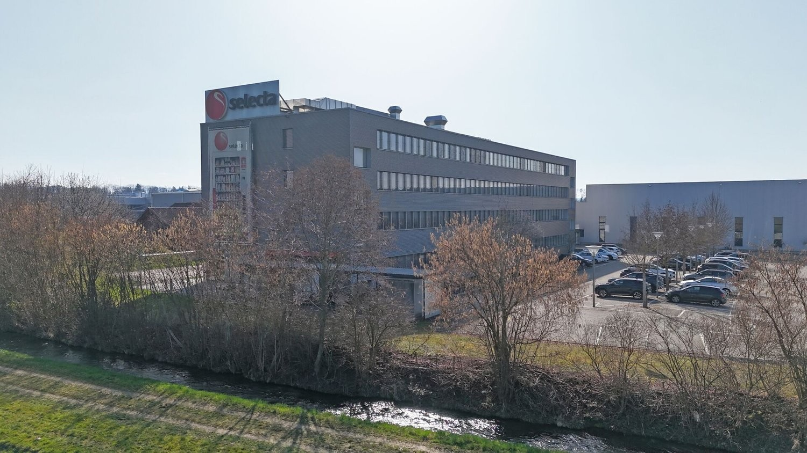
*`02.jpg` — 1500x844 px*

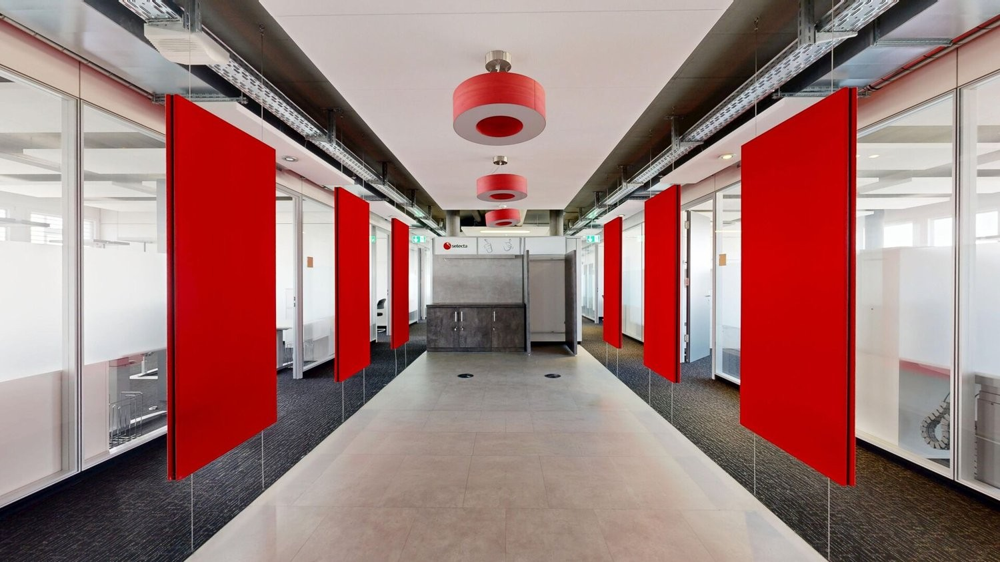
*`03.jpg` — 1500x844 px*

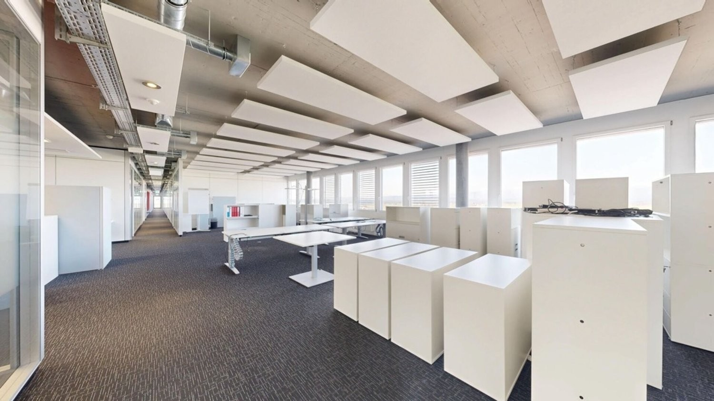
*`04.jpg` — 1500x843 px*

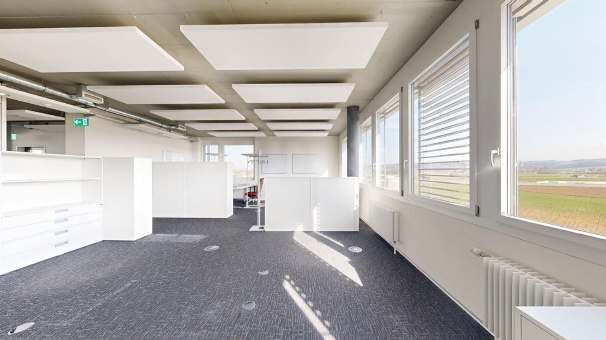
*`05.jpg` — 1500x843 px*

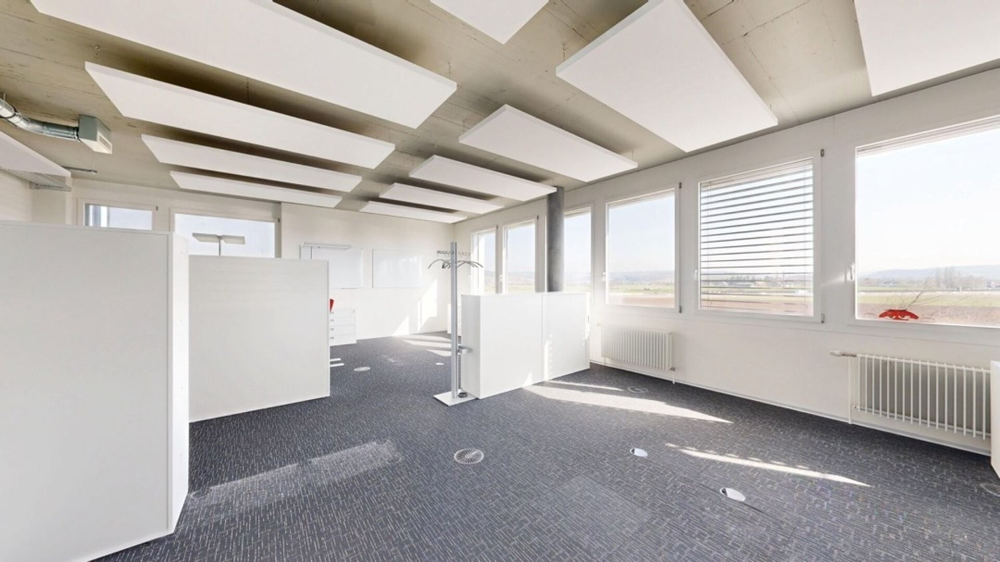
*`06.jpg` — 1500x843 px*

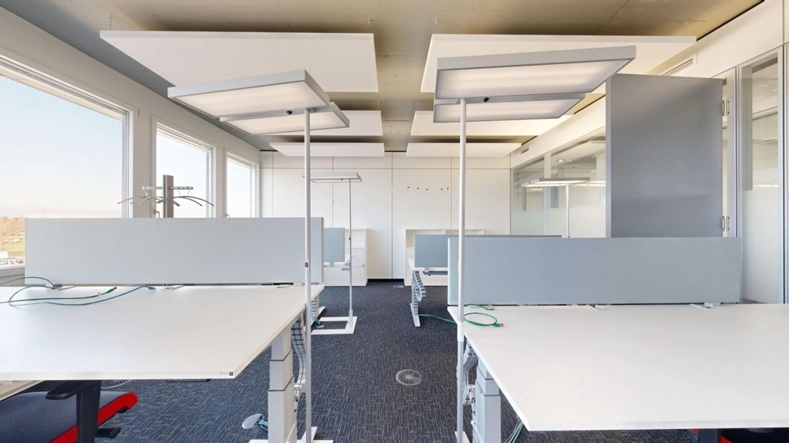
*`07.jpg` — 1500x843 px*

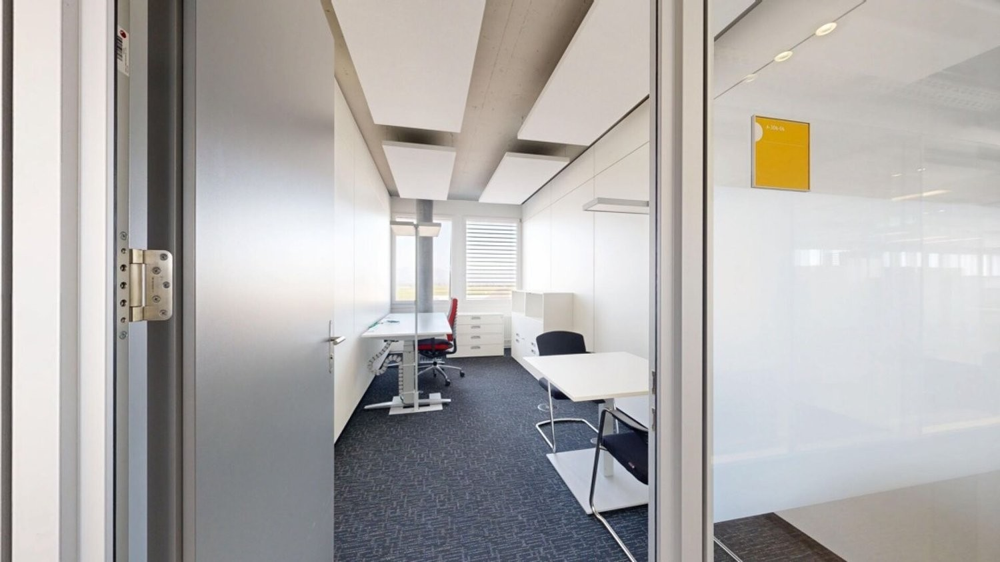
*`08.jpg` — 1500x843 px*

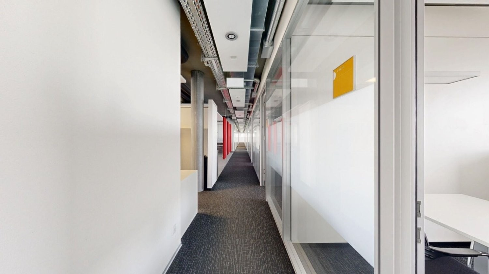
*`09.jpg` — 1500x843 px*

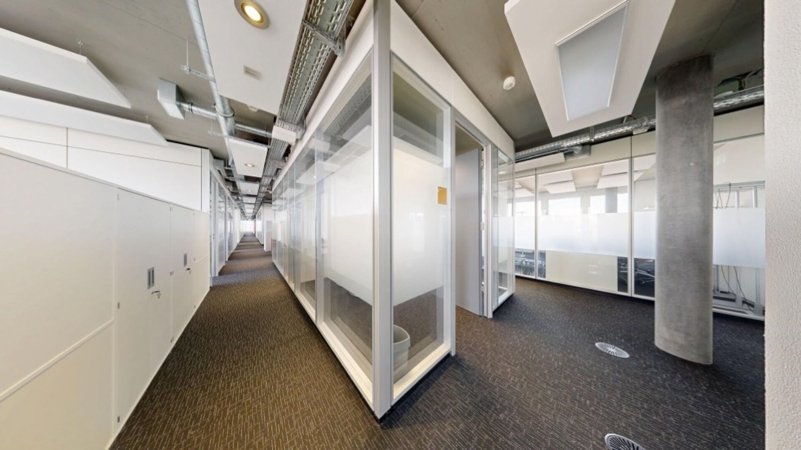
*`10.jpg` — 1500x843 px*

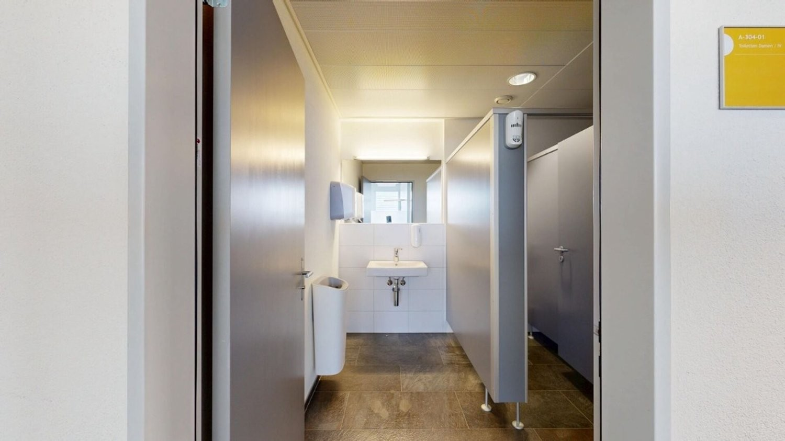
*`11.jpg` — 1500x843 px*

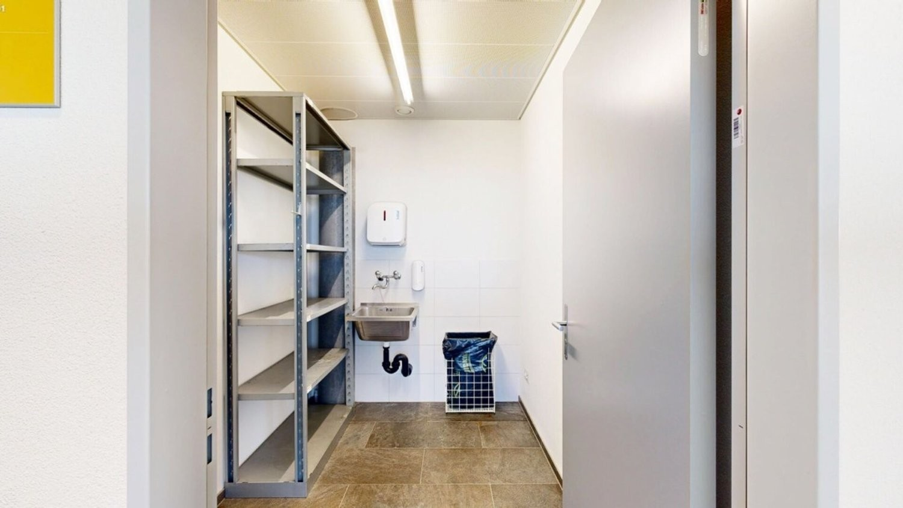
*`12.jpg` — 1500x845 px*

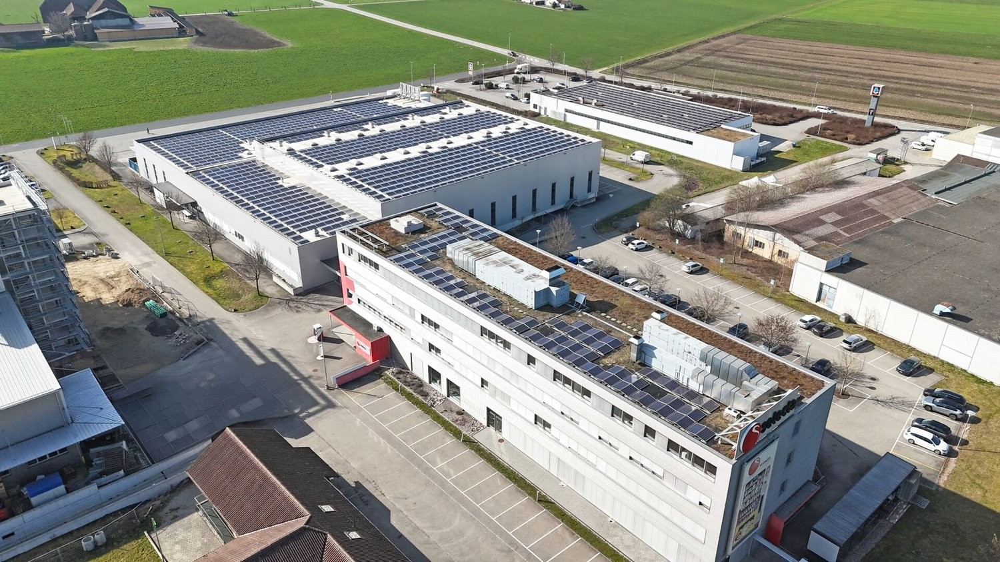
*`13.jpg` — 1500x844 px*

## Media suplimentară

- **tour_url:** https://my.matterport.com/show/?m=5XXVJdnKXu9
- **video_url:** https://youtu.be/K5SPVXVofQU?si=Bt7gjscIZ54zk8ZQ
