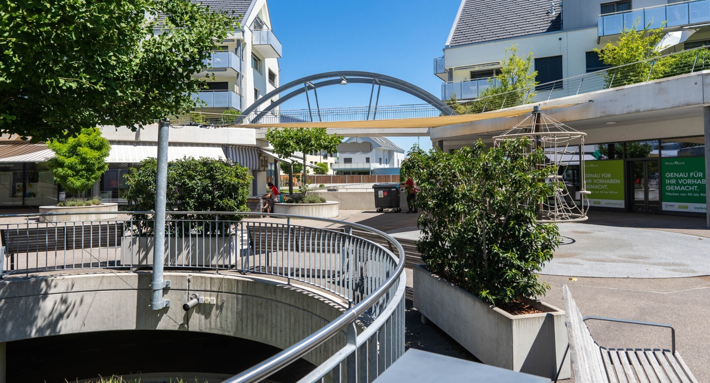
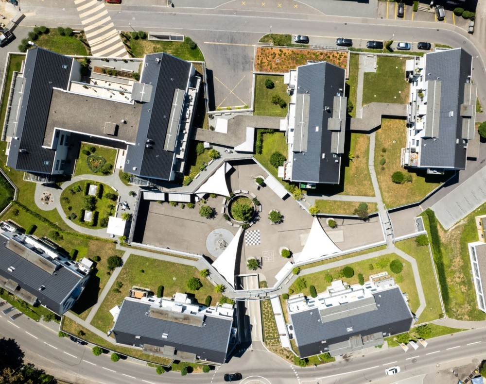
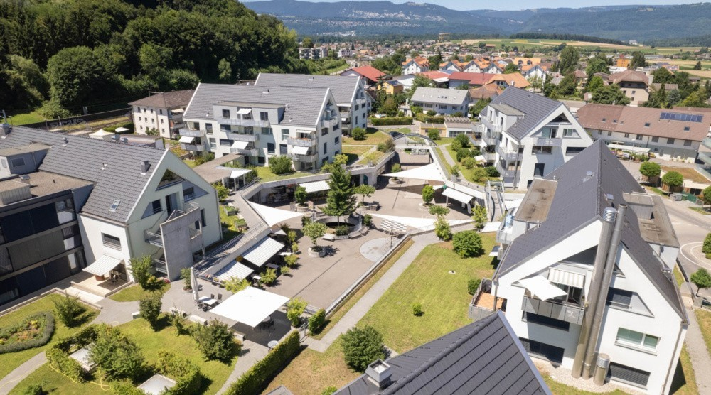
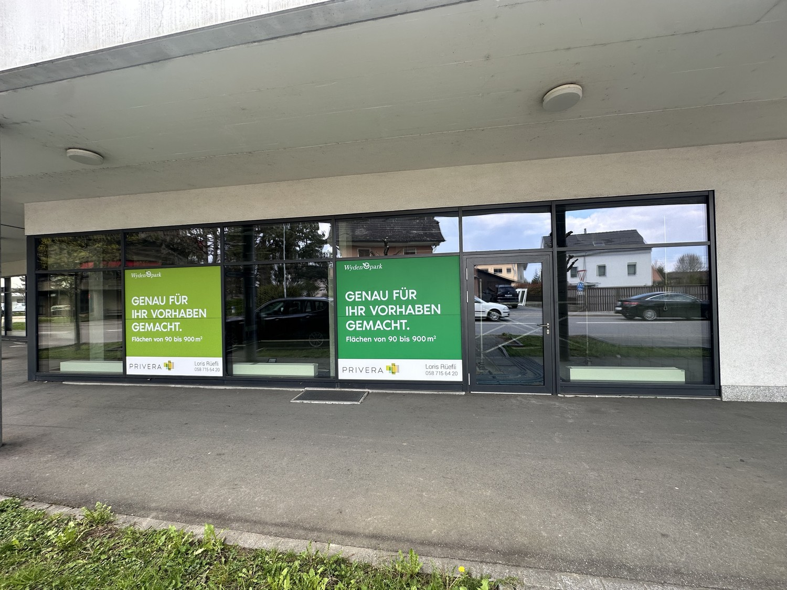
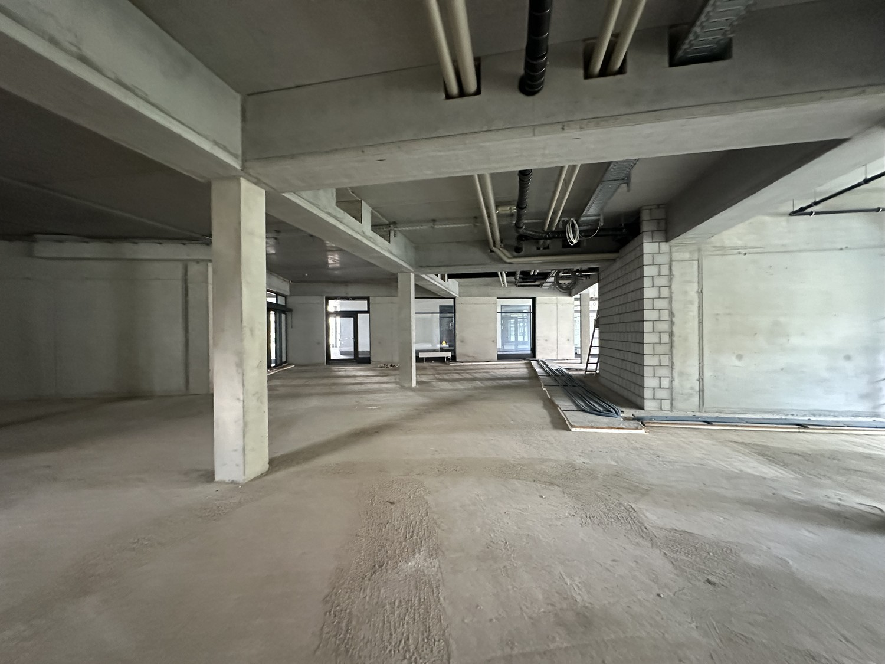
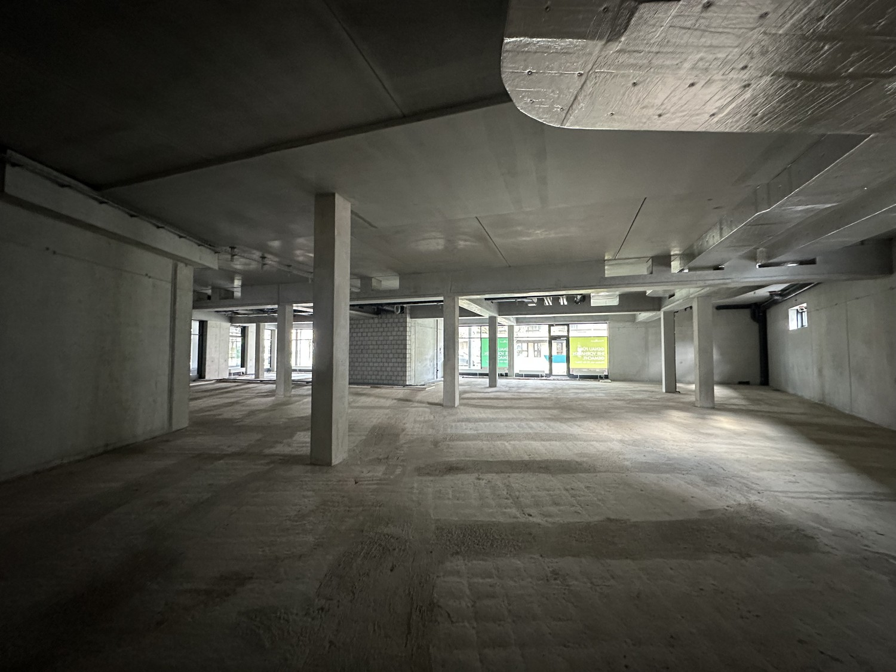

# Wydenpark 1-7, Hauptstrasse 70, 2557 Studen - CHF 230 inkl. NK pro m² / Jahr

> **Categorie:** `B_buero_gewerbe`  
> **Regiune:** Cantonul Berna  
> **Tip ofertă:** RENT / SHOP  
> **Relevant pentru praxis:** da (apotheke)  
> **Sursă:** [flatfox.ch](https://flatfox.ch/de/wohnung/wydenpark-1-7-hauptstrasse-70-2557-studen/85904905/)  
> **Descărcat:** 2026-08-17 12:31

## Date obiect

| Câmp | Valoare |
|---|---|
| Adresă | Wydenpark 1-7, Hauptstrasse 70, 2557 Studen |
| Categorie obiect | INDUSTRY |
| Tip obiect | SHOP |
| Chirie netă | CHF 190 |
| Nebenkosten | CHF 40 |
| Preț afișat | CHF 230 |
| Suprafață utilă | 438 m² |
| Etaj | 0 |
| An construcție | 2013 |
| Disponibil de la | agr |
| Referință | CM100.0102169.3a |

## Texte originale (germană)

**Titlu public:** Wydenpark 1-7, Hauptstrasse 70, 2557 Studen - CHF 230 inkl. NK pro m² / Jahr

**Titlu scurt:** 438m² Ladenfläche

**Pitch:** 438m² Ladenfläche in Studen mieten

**Titlu descriere:** Attraktive Gewerbeflächen im lebendigen Zentrum von Studen BE – ideale Lage für Ihren Geschäftserfolg

**Titlu chirie:** 438m² Ladenfläche in Studen mieten

**Spațiu afișat:** 438

### Descriere completă

Positionieren Sie Ihr Unternehmen an einem der attraktivsten Standorte in Studen BE: Der moderne Wydenpark liegt im Herzen eines dynamisch wachsenden Wohnquartiers und profitiert von hoher Kundenfrequenz sowie einem etablierten Umfeld.  
  
Direkt vor Ort sorgen renommierte Ankermieter wie Coop, Die Post und die Dorfplatz-Apotheke für eine starke Grundfrequenz und ideale Synergien. Zusätzlich befindet sich die Altersresidenz Senevita in unmittelbarer Nachbarschaft und erweitert das Einzugsgebiet.  
  
**Ihre Standortvorteile auf einen Blick:**  

*   Zentrale Lage in einem wachsenden und lebendigen Quartier
*   Etablierte Ankermieter mit hoher Besucherfrequenz
*   Hervorragende Erreichbarkeit: Autobahnanschluss (A6) in wenigen Minuten
*   Optimale Anbindung an den öffentlichen Verkehr (Bahnhof Studen, Bushaltestelle Wydenpark in Gehdistanz)
*   Schnelle Verbindungen in die Wirtschaftszentren Biel, Lyss und Bern
*   Grosse Tiefgarage für Besucher und Mieter

  
Das Center fungiert als zentrale Begegnungsstätte der Gemeinde und bietet ideale Voraussetzungen für Retail-, Dienstleistungs- und Gewerbekonzepte. Nutzen Sie diese Gelegenheit, um Ihre Marke sichtbar zu positionieren und Ihr Filialnetz nachhaltig auszubauen.  
  
**Interesse geweckt?**  
Gerne stellen wir Ihnen weitere Informationen zur Verfügung oder vereinbaren einen persönlichen Besichtigungstermin.  
Wir freuen uns auf Ihre Kontaktaufnahme.

## Dotări (attributes)

- parkingspace
- garage
- accessiblewithwheelchair

## Ofertant

- **Nume:** PRIVERA AG
- **Stradă:** Täfernstrasse 16
- **NPA:** 5405
- **Localitate:** Baden-Dättwil

## Imagini (6)

*`01.jpg` — 1500x810 px*

*`02.jpg` — 1000x791 px*

*`03.jpg` — 1000x556 px*

*`04.jpg` — 1500x1125 px*

*`05.jpg` — 1500x1125 px*

*`06.jpg` — 1500x1125 px*
