# Bernstr. 131, 3052 Zollikofen - CHF 248 inkl. NK pro m² / Jahr

> **Categorie:** `B_buero_gewerbe`  
> **Regiune:** Cantonul Berna  
> **Tip ofertă:** RENT / OFFICE  
> **Sursă:** [flatfox.ch](https://flatfox.ch/de/wohnung/bernstr-131-3052-zollikofen/85924274/)  
> **Descărcat:** 2026-08-17 12:35

## Date obiect

| Câmp | Valoare |
|---|---|
| Adresă | Bernstr. 131, 3052 Zollikofen |
| Categorie obiect | INDUSTRY |
| Tip obiect | OFFICE |
| Chirie netă | CHF 224 |
| Nebenkosten | CHF 24 |
| Chirie brută | CHF 248 |
| Preț afișat | CHF 248 |
| Suprafață utilă | 330 m² |
| Etaj | 0 |
| An construcție | 1988 |
| An renovare | 2022 |
| Disponibil de la | 2027-04-01 |
| Referință | 9209.01.0008 |

## Texte originale (germană)

**Titlu public:** Bernstr. 131, 3052 Zollikofen - CHF 248 inkl. NK pro m² / Jahr

**Titlu scurt:** 330m² Büro

**Pitch:** 330m² Büro in Zollikofen mieten

**Titlu descriere:** Attraktive Bürofläche mit top Anbindung in Zollikofen

**Titlu chirie:** 330m² Büro in Zollikofen mieten

**Spațiu afișat:** 330

### Descriere completă

Sie suchen einen repräsentativen Standort für Ihr Unternehmen? An frequentierter Lage, im Herzen von Zollikofen stehen Ihnen per 01.04.2027 oder nach Vereinbarung, diese vielseitig nutzbaren Büroräumlichkeiten mit 330m2 zur Verfügung. 

  

Die hellen und gepflegten Räume eignen sich ideal für Dienstleistungsbetriebe, Beratungen, Start-ups oder als ruhiger Arbeitsplatz für Einzelunternehmen. Die zentrale Lage bietet eine ausgezeichnete Erreichbarkeit und eine attraktive Umgebung für Mitarbeitende sowie Kundschaft. 

  

**Ihre Vorteile auf einen Blick**

  * Vielseitige Büroräumlichkeiten mit einladendem Empfangsbereich 
  * Flexible Nutzungsmöglichkeiten: Einzelbüro / Meeting-Room 
  * Voll ausgestattete Küche und Pausenbereich zur alleinigen Nutzung 
  * WC Anlagen zur Mitbenutzung 
  * Lift mit Zugang zur Einstellhalle 
  * Gut frequentierte Lage in Zollikofen 
  * Gute Erreichbarkeit mit ÖV sowie naher Anschluss an die Autobahn 
  * Nähe zu Einkaufsmöglichkeiten, Restaurants und weiteren Dienstleistungen 

  

Ein praktischer Lagerraum mit 16 m2 steht Ihnen zusätzlich zum Mietobjekt zur Verfügung und bietet idealen Platz für Archiv, Material und Equipment. Ebenfalls können mehrere Auto-Einstellplätze à CHF 120.- / Monat (ohne MWST) dazu gemietet werden. 

  

Haben wir Ihr Interesse geweckt? 

  

Wir freuen uns auf Ihre Kontaktaufnahme und zeigen Ihnen das Objekt gerne vor Ort.

## Dotări (attributes)

- lift

## Ofertant

- **Nume:** Apleona Schweiz AG
- **Stradă:** Kirchstrasse 24
- **NPA:** 3097
- **Localitate:** Liebefeld

## Imagini (11)

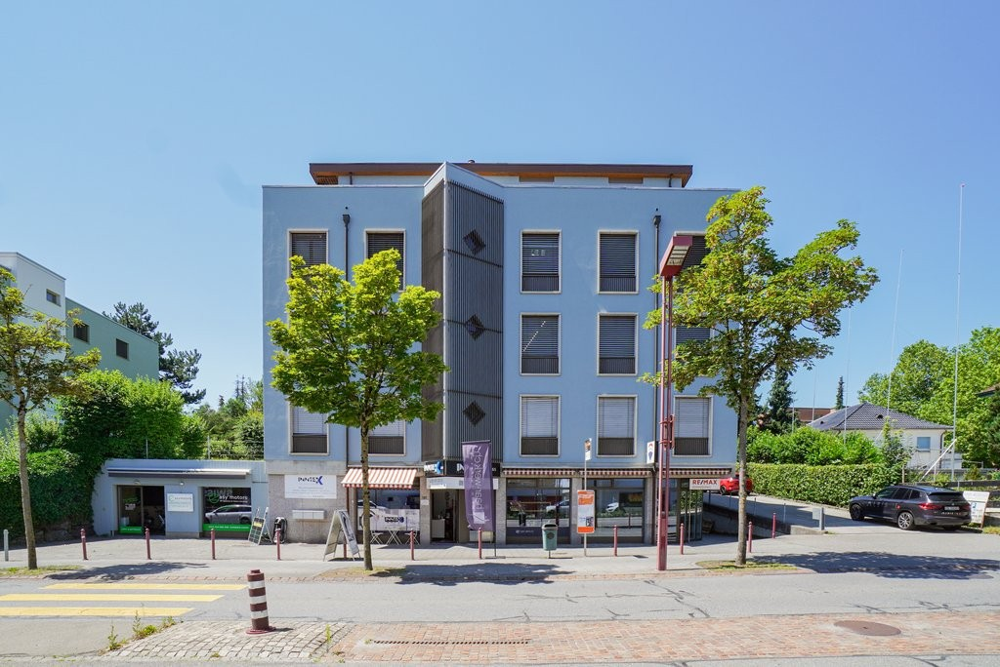
*`01.jpg` — 1024x684 px — Aussenansicht*

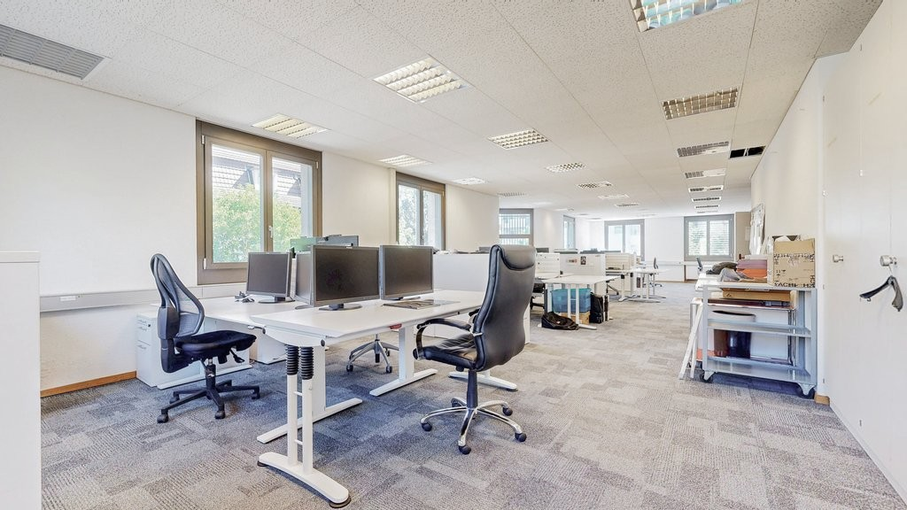
*`02.jpg` — 1024x576 px — Buero 4*

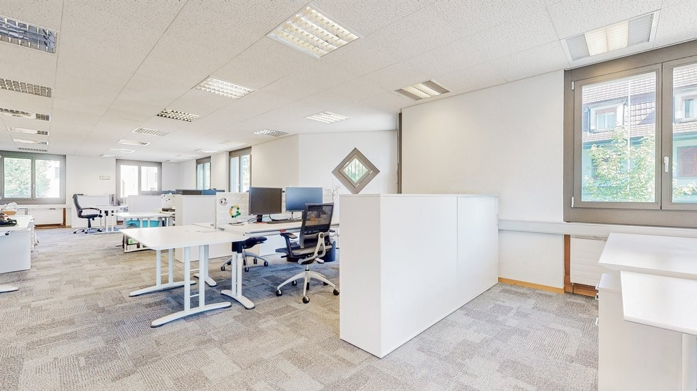
*`03.jpg` — 1024x576 px — Buero 4*

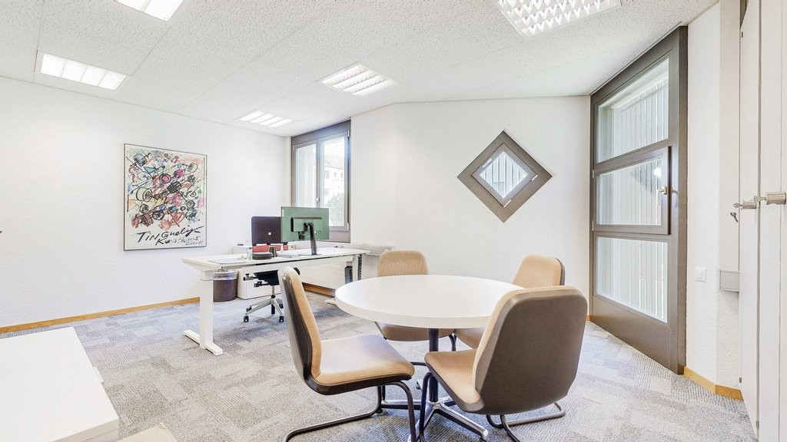
*`04.jpg` — 1024x576 px — Buero 2*

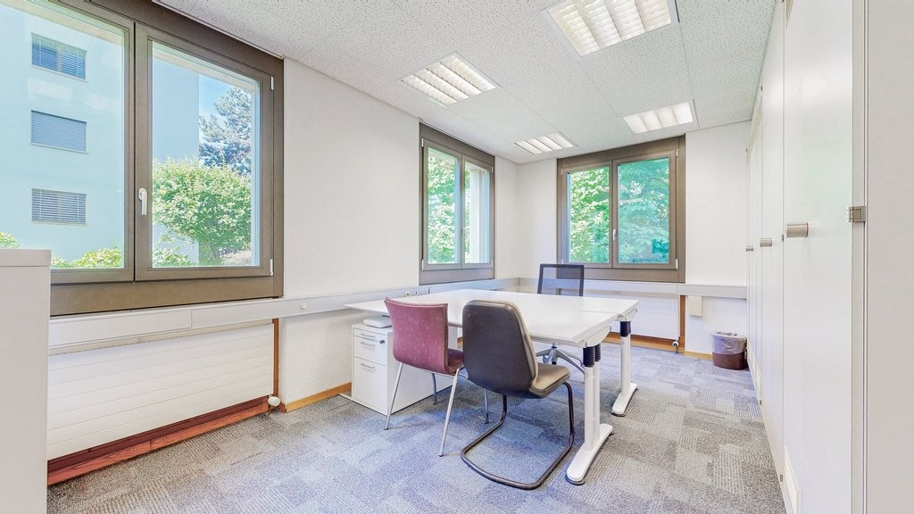
*`05.jpg` — 1024x576 px — Buero 3*

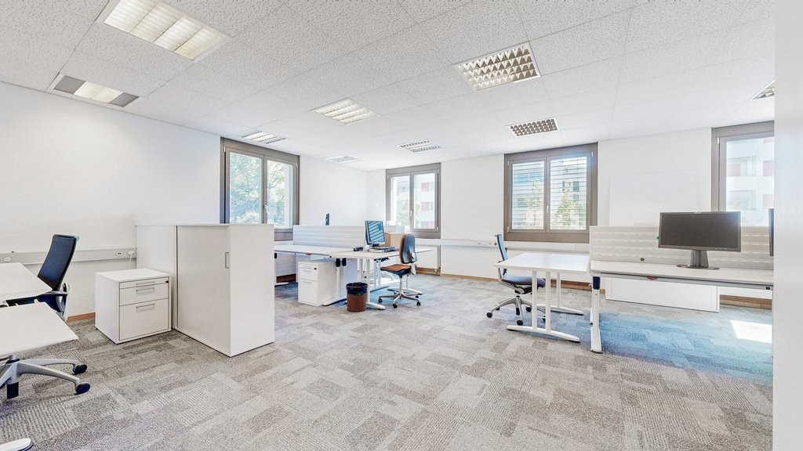
*`06.jpg` — 1024x576 px —  Buero 4*

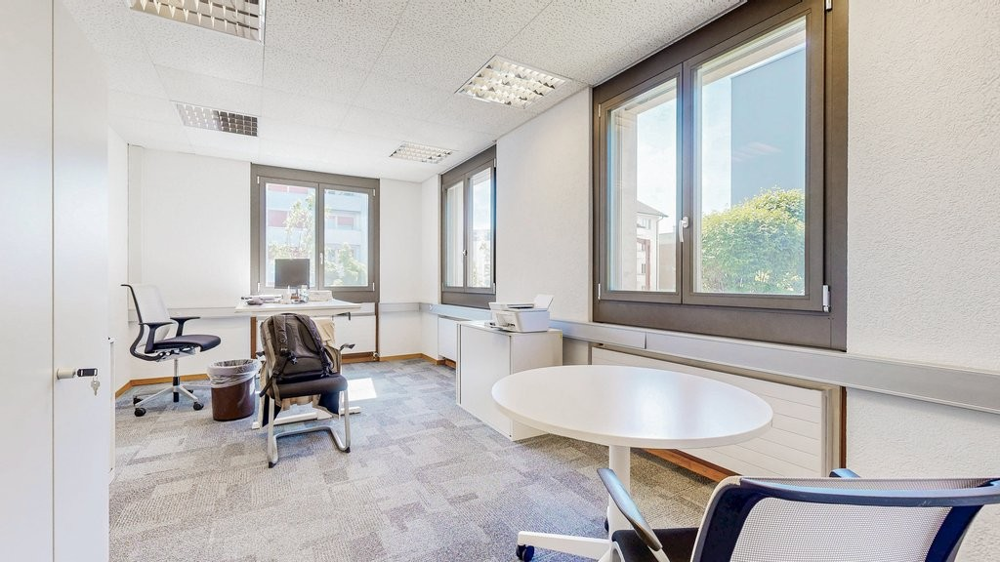
*`07.jpg` — 1024x576 px — Buero 1*

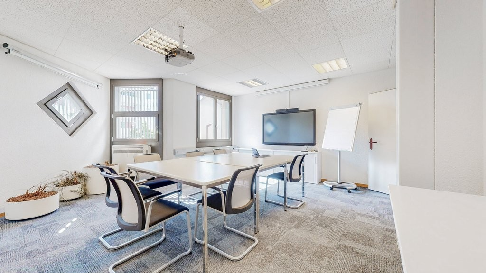
*`08.jpg` — 1024x576 px — Meetingraum*

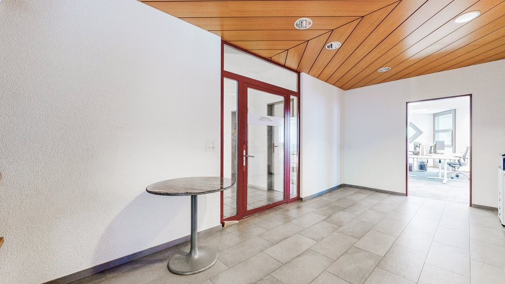
*`09.jpg` — 1024x576 px —  Eingang*

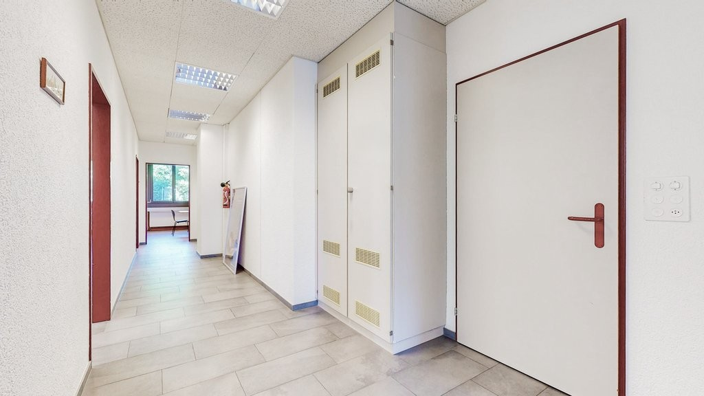
*`10.jpg` — 1024x576 px —  Flur*

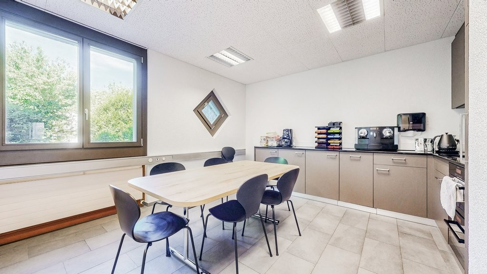
*`11.jpg` — 1024x576 px — Kueche*

## Media suplimentară

- **tour_url:** https://my.matterport.com/show/?m=q8dBsDxpZaJ
