# Jean-Sessler-Strasse 1, Biel, Schweiz, 2502 Biel - auf Anfrage

> **Categorie:** `B_buero_gewerbe`  
> **Regiune:** Cantonul Berna  
> **Tip ofertă:** RENT / SHOP  
> **Sursă:** [flatfox.ch](https://flatfox.ch/de/wohnung/jean-sessler-strasse-1-biel-schweiz-2502-biel/85948245/)  
> **Descărcat:** 2026-08-17 12:38

## Date obiect

| Câmp | Valoare |
|---|---|
| Adresă | Jean-Sessler-Strasse 1, Biel, Schweiz, 2502 Biel |
| Categorie obiect | INDUSTRY |
| Tip obiect | SHOP |
| Suprafață utilă | 190 m² |
| Etaj | 0 |
| Disponibil de la | 2026-09-01 |
| Referință | 231-1-2001..3sexq.0thup |

## Texte originale (germană)

**Titlu public:** Jean-Sessler-Strasse 1, Biel, Schweiz, 2502 Biel - auf Anfrage

**Titlu scurt:** 190m² Ladenfläche

**Pitch:** 190m² Ladenfläche in Biel mieten

**Titlu descriere:** Attraktive Gewerbefläche an zentraler Lage in Biel – ideal für Verkauf, Showroom oder Dienstleistung

**Titlu chirie:** 190m² Ladenfläche in Biel mieten

**Spațiu afișat:** 190

### Descriere completă

An der stark frequentierten **Jean-Sessler-Strasse 1 in Biel/Bienne** vermieten wir per **01.09.2026** eine vielseitig nutzbare Gewerbefläche in zentraler Innenstadtlage. 

Die Liegenschaft befindet sich in einem lebendigen Quartier mit hoher Kundenfrequenz und ausgezeichneter Visibilität. 

**Objektbeschrieb**

Die Gewerbefläche erstreckt sich über zwei Ebenen und bietet flexible Nutzungsmöglichkeiten: 

  * Ca. **130 m² Verkaufsfläche im Erdgeschoss** (ebenerdig) 

  * Grosszügige **Schaufensterfront** mit optimaler Sichtbarkeit 

  * Ca. **60 m² zusätzliche Fläche im Untergeschoss** (z.B. Lager, Atelier, Büro) 

  * Verbindung zwischen EG und UG über eine **Wendeltreppe**

  * Praktischer Grundriss mit vielseitigen Nutzungsmöglichkeiten 

  * WC-Anlagen vorhanden 

  * Gute natürliche Belichtung im Erdgeschoss 

  * Direkter Zugang von der Strasse 

Die Räumlichkeiten wurden zuletzt als Verkaufsgeschäft genutzt und eignen sich hervorragend für: 

  * Detailhandel / Boutique 

  * Showroom 

  * Dienstleistungsbetrieb 

  * Studio oder Atelier 

**Lage**

Zentrale Lage im Herzen von Biel/Bienne mit hoher Passantenfrequenz. In unmittelbarer Umgebung befinden sich zahlreiche Geschäfte, Restaurants und Dienstleistungsbetriebe. 

Die gute Erreichbarkeit – sowohl zu Fuss als auch mit öffentlichen Verkehrsmitteln – macht diesen Standort besonders attraktiv. 

**Mietkonditionen**

  * Nettomiete: **CHF 5’700.– / Monat**

  * Nebenkosten: **CHF 250.– / Monat**

  * **Bruttomiete: CHF 5’950.– / Monat**

**Verfügbarkeit**

  * **Ab 01. September 2026**

**Kontakt**

Haben wir Ihr Interesse geweckt? Gerne stehen wir Ihnen für weitere Informationen oder eine Besichtigung zur Verfügung. 

********************************************************************** 

**Surface commerciale attractive au centre de Bienne – avec vitrine et espace supplémentaire au sous-sol**

À la très fréquentée **Rue Jean-Sessler 1 à Biel/Bienne** , nous proposons à la location, dès le **01.09.2026** , une surface commerciale polyvalente idéalement située en plein centre-ville. 

L’immeuble se trouve dans un quartier dynamique avec une excellente visibilité et un fort passage. 

**Description de l’objet**

La surface se répartit sur deux niveaux et offre de nombreuses possibilités d’aménagement : 

  * Environ **130 m² de surface de vente au rez-de-chaussée** (de plain-pied) 

  * **Grande vitrine** offrant une visibilité optimale 

  * Environ **60 m² de surface supplémentaire au sous-sol** (p. ex. stockage, atelier, bureau) 

  * Accès entre les deux niveaux via un **escalier en colimaçon**

  * Plan pratique et flexible 

  * WC à disposition 

  * Bonne luminosité naturelle au rez-de-chaussée 

  * Accès direct depuis la rue 

Les locaux ont été exploités jusqu’à présent comme commerce de détail et conviennent parfaitement pour : 

  * Commerce / boutique 

  * Showroom 

  * Activité de services 

  * Atelier ou studio 

**Situation**

Emplacement central au cœur de Biel/Bienne avec une forte fréquentation piétonne. À proximité immédiate : commerces, restaurants et diverses prestations de services. 

Très bonne accessibilité en transports publics ainsi qu’à pied. 

**Conditions de location**

  * Loyer net : **CHF 5’700.– / mois**

  * Charges : **CHF 250.– / mois**

  * **Loyer brut : CHF 5’950.– / mois**

**Disponibilité**

  * **Dès le 1er septembre 2026**

**Contact**

Intéressé(e) ? Nous nous tenons à votre disposition pour tout renseignement complémentaire ou pour organiser une visite.

## Ofertant

- **Nume:** Ottimmo AG
- **Stradă:** Murtenstrasse 26
- **NPA:** 2502
- **Localitate:** Biel/Bienne

## Imagini (14)

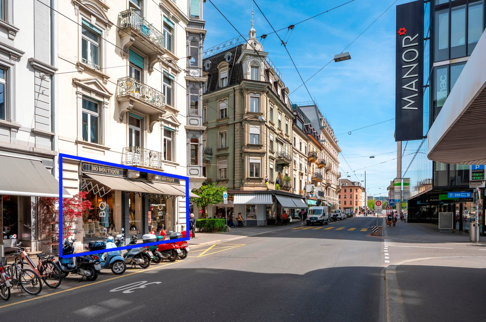
*`01.jpg` — 1500x994 px*

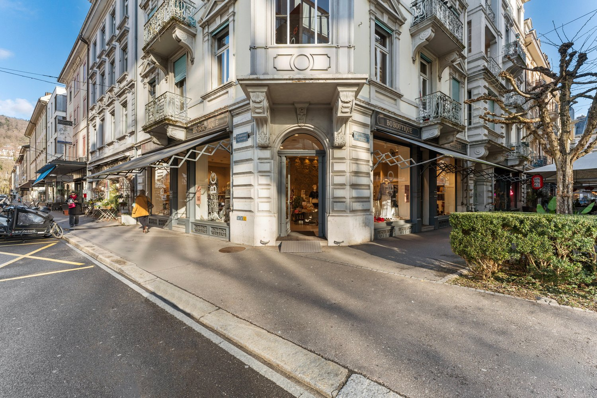
*`02.jpg` — 1500x1000 px*

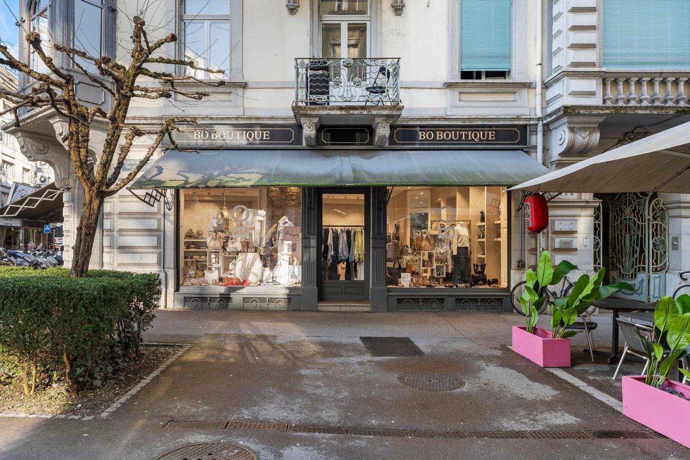
*`03.jpg` — 1500x1000 px*

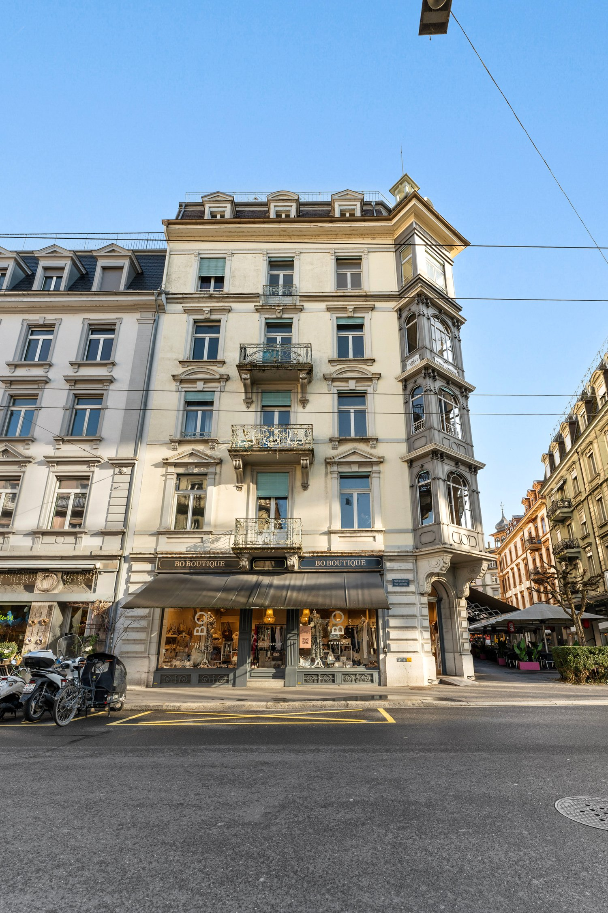
*`04.jpg` — 1500x2249 px*

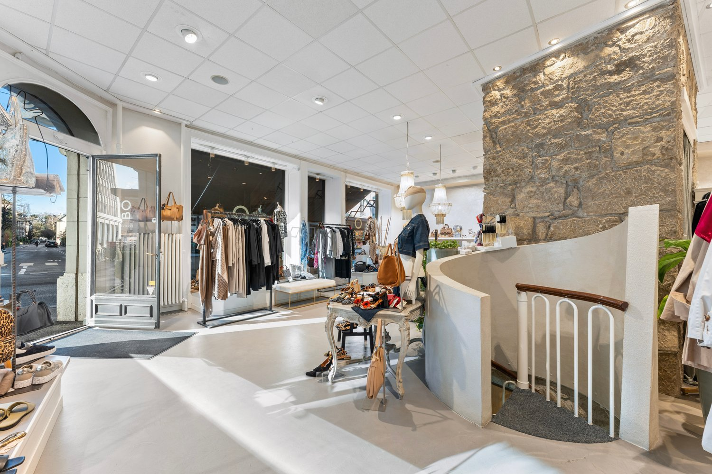
*`05.jpg` — 1500x1000 px*

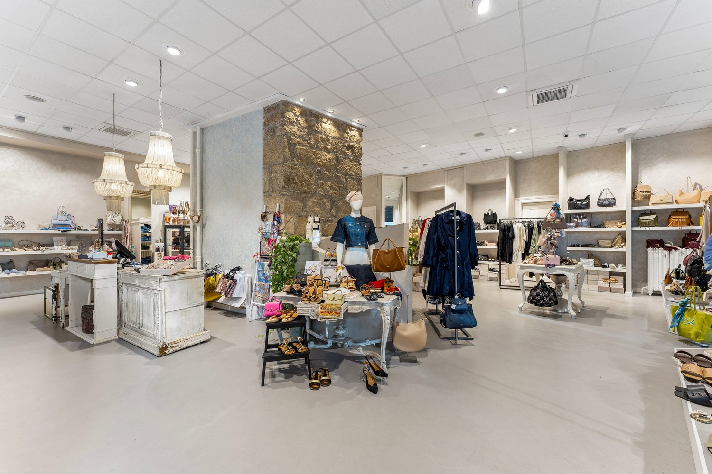
*`06.jpg` — 1500x1000 px*

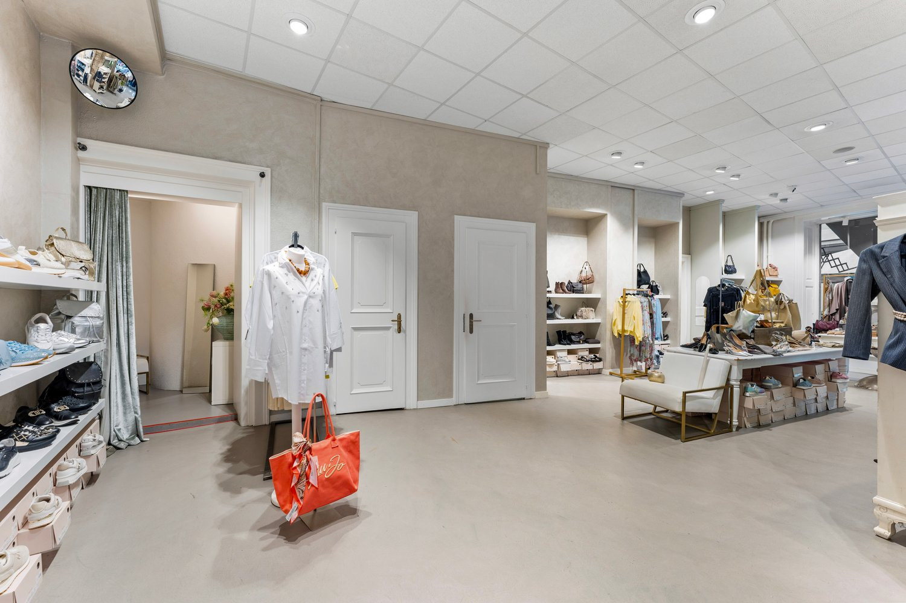
*`07.jpg` — 1500x1000 px*

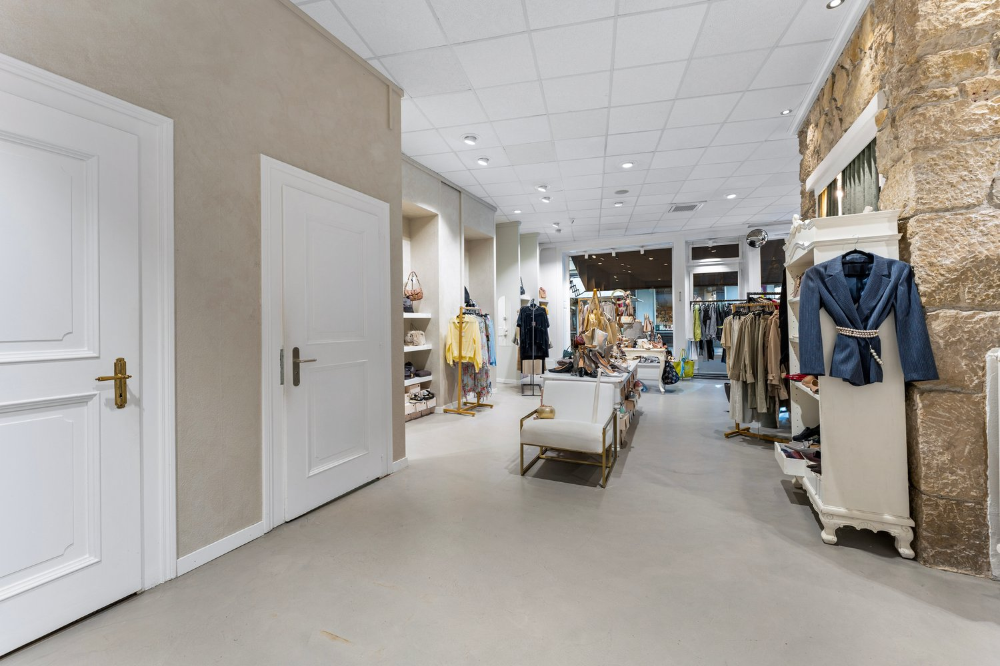
*`08.jpg` — 1500x1000 px*

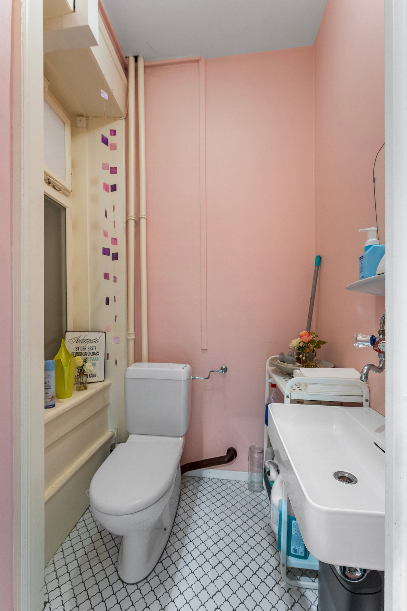
*`09.jpg` — 1500x2249 px*

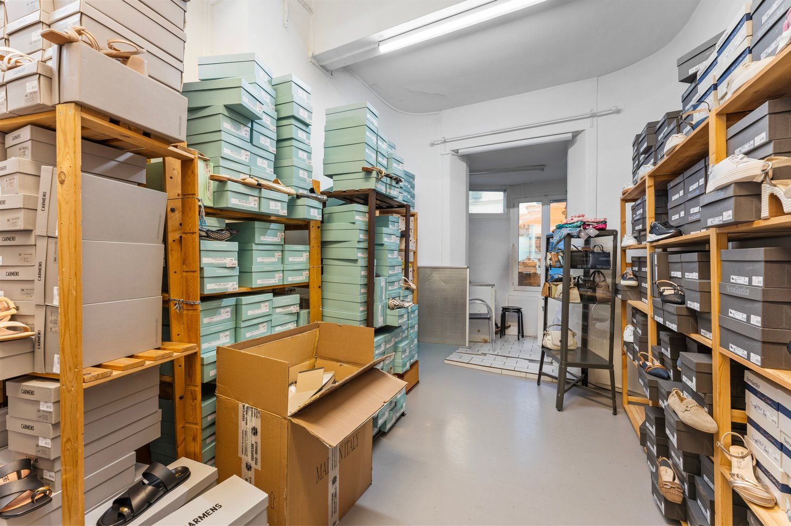
*`10.jpg` — 1500x1000 px*

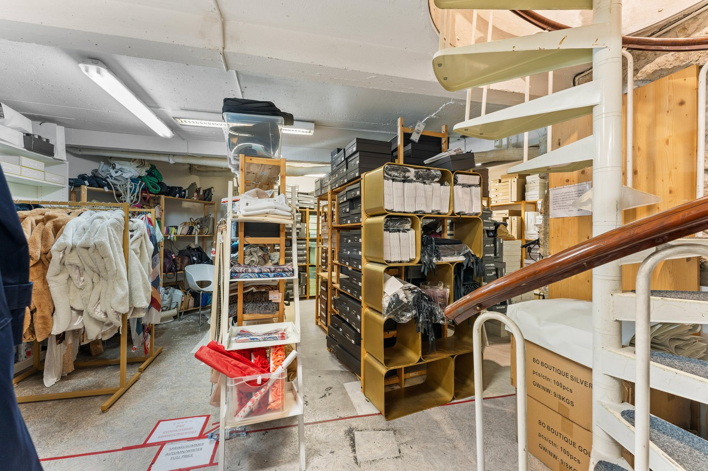
*`11.jpg` — 1500x1000 px*

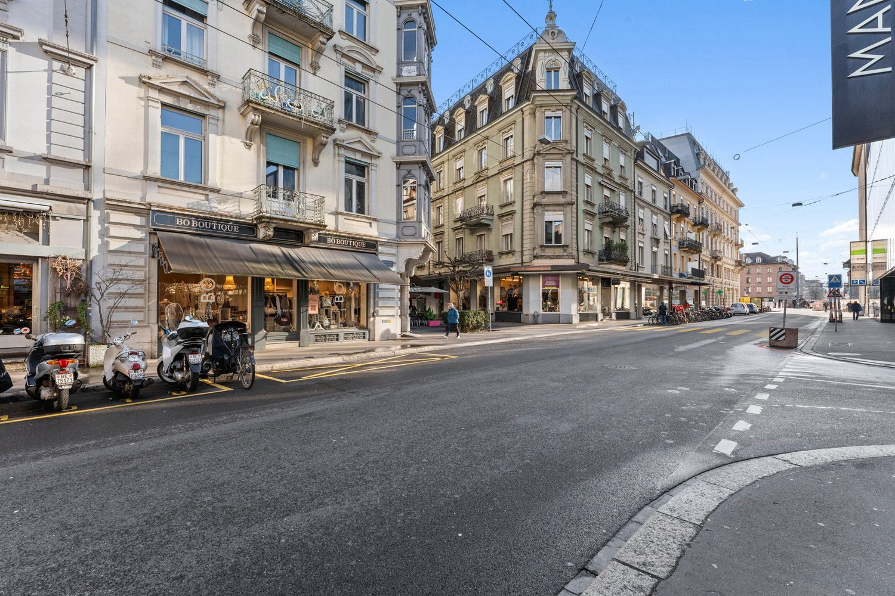
*`12.jpg` — 1500x1000 px*

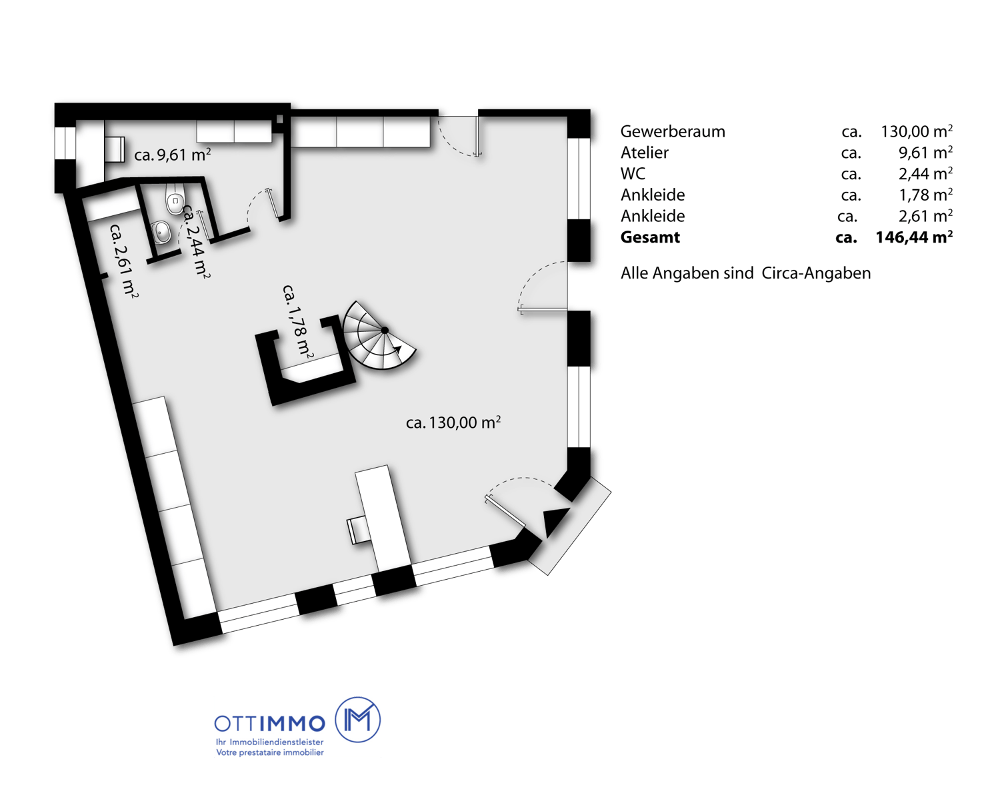
*`13.png` — 1500x1202 px*

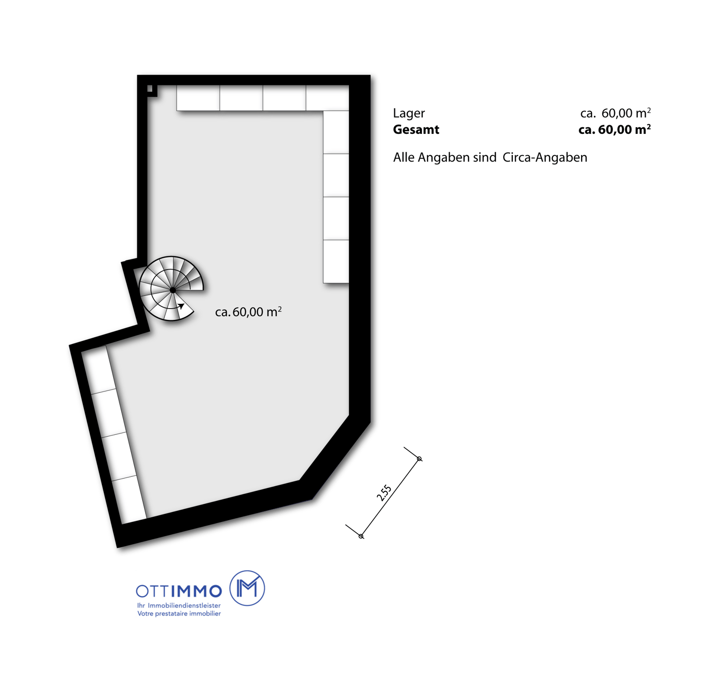
*`14.png` — 1500x1471 px*

## Media suplimentară

- **website_url:** https://lightroom.adobe.com/shares/a9005838337c4b629cfebe2cb4a47d53
