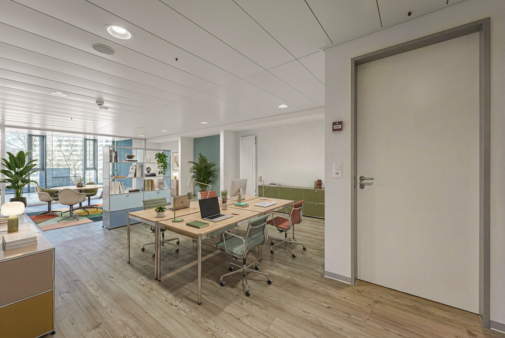
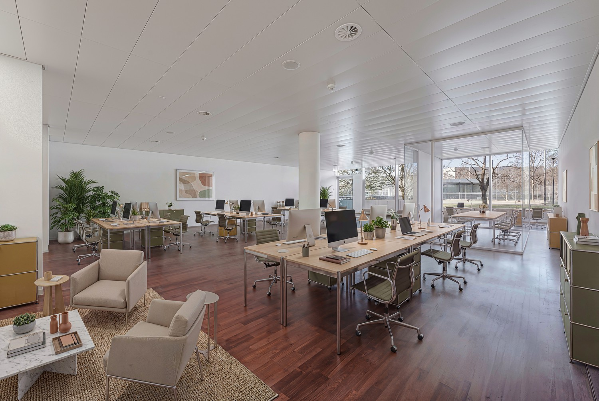
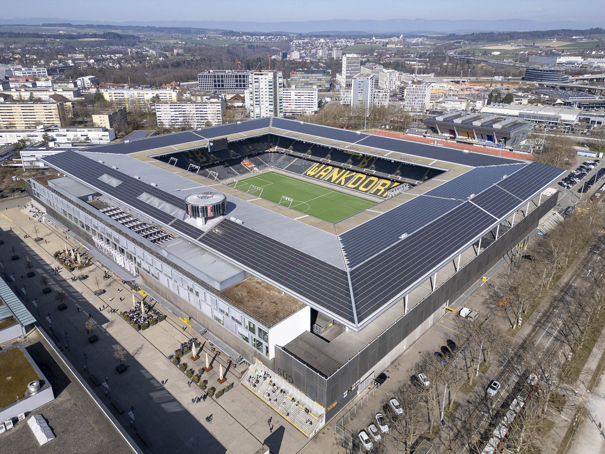
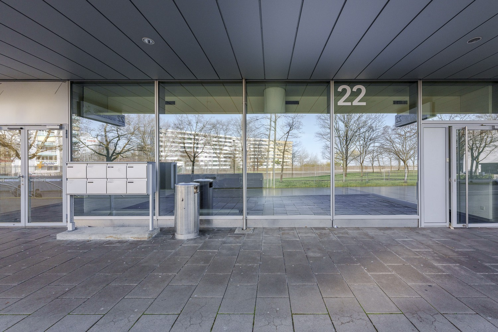
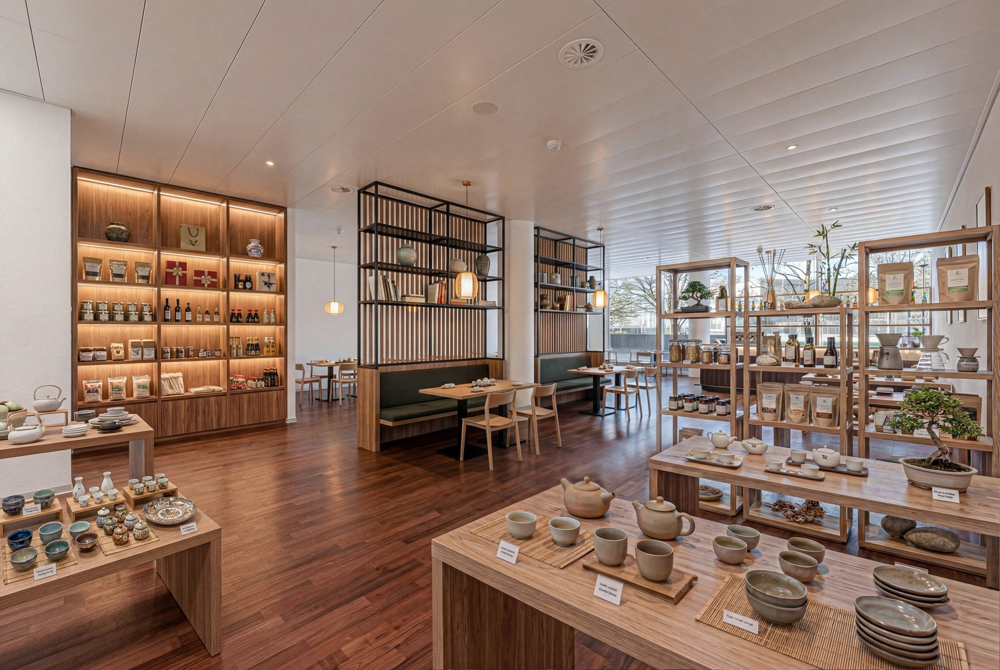
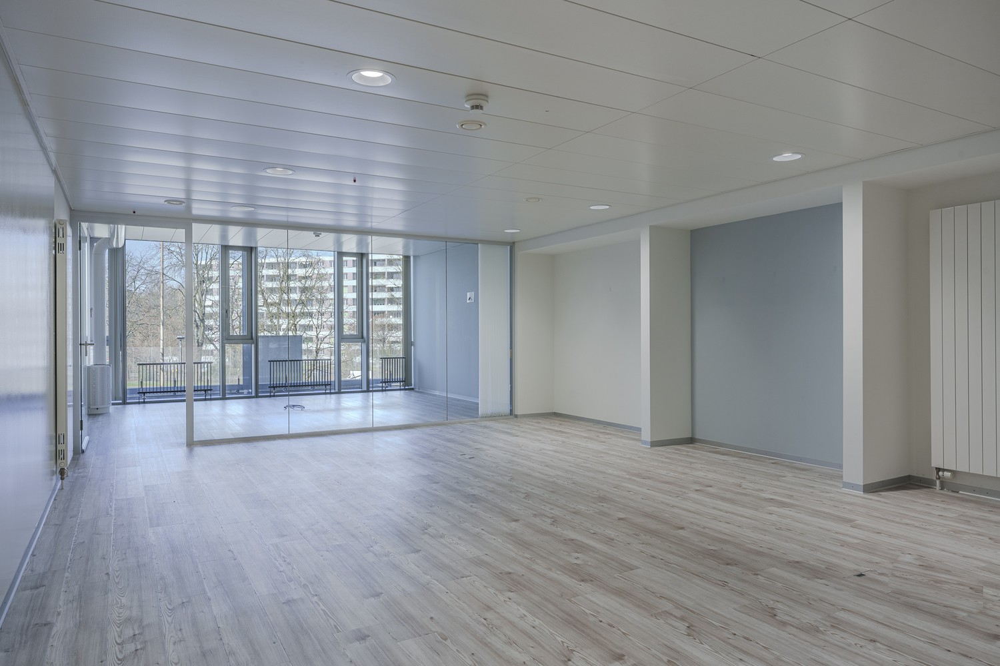

# Sempachstrasse 22, 3014 Bern - CHF 200 exkl. NK pro m² / Jahr

> **Categorie:** `B_buero_gewerbe`  
> **Regiune:** Berna (oraș)  
> **Tip ofertă:** RENT / OFFICE  
> **Relevant pentru praxis:** da (praxis)  
> **Sursă:** [flatfox.ch](https://flatfox.ch/de/wohnung/sempachstrasse-22-3014-bern/85955442/)  
> **Descărcat:** 2026-08-17 12:25

## Date obiect

| Câmp | Valoare |
|---|---|
| Adresă | Sempachstrasse 22, 3014 Bern |
| Categorie obiect | INDUSTRY |
| Tip obiect | OFFICE |
| Chirie netă | CHF 200 |
| Preț afișat | CHF 200 |
| Suprafață utilă | 272 m² |
| Etaj | 1 |
| Disponibil de la | agr |
| Referință | VM100.100.0321072.2 |

## Texte originale (germană)

**Titlu public:** Sempachstrasse 22, 3014 Bern - CHF 200 exkl. NK pro m² / Jahr

**Titlu scurt:** 107-272m² Büro

**Pitch:** 107-272m² Büro in Bern mieten

**Titlu descriere:** Ihr neuer Businessstandort im Wankdorf Center

**Titlu chirie:** 107-272m² Büro in Bern mieten

**Spațiu afișat:** 272

### Descriere completă

**Attraktive Büro- und Gewerbeflächen im Wankdorf Center Bern – flexibel kombinierbar**  
Im etablierten Wankdorf Center in 3014 Bern vermieten wir drei vielseitig nutzbare Büro- und Gewerbeflächen an hervorragend erschlossener Lage. Der Standort vereint Arbeiten, Einkaufen und Freizeit und bietet ein dynamisches Umfeld für Unternehmen verschiedenster Branchen.  
  
**Flächenangebot**  
Es stehen folgende Flächen zur Verfügung:  
  

*   **Sempachstrasse 22, 3014 Bern – Erdgeschoss:** ca. 165.36 m² (inkl. Teeküche)
*   **Sempachstrasse 22, 3014 Bern – 1. Obergeschoss:** ca. 107.35 m²
*   **Papiermühlestrasse 73, 3014 Bern – 4. Obergeschoss:** ca. 120.87 m² (Teeküche zur Mitbenützung)

Die Flächen an der **Sempachstrasse** können **ideal miteinander kombiniert und gemeinsam genutzt** werden. Dadurch ergeben sich attraktive Möglichkeiten für grössere Nutzungskonzepte oder wachsende Unternehmen.  
  
**Nutzung & Ausbau**  
Die Flächen eignen sich optimal für:  
  

*   Büro- und Verwaltungsnutzung
*   Dienstleistungsunternehmen
*   Praxis- oder Schulungsräume

**Highlights**  
  

*   Flexible Flächengrössen und Kombinationsmöglichkeiten
*   Attraktives, etabliertes Geschäftsumfeld
*   Vielfältige Infrastruktur direkt im Center (Einkauf, Gastronomie, Fitness etc.)
*   Repräsentativer Standort im wirtschaftsstarken Wankdorf-Gebiet
*   Gute Raumhöhen (ca. 2.40 m)
*   Parkmöglichkeiten im Center vorhanden

**Lage & Erreichbarkeit**  
  

*   Hervorragende ÖV-Anbindung (Tram, Bus, S-Bahn, RBS)
*   Bahnhof Bern in wenigen Minuten erreichbar
*   Direkter Anschluss an die Autobahnen A1 und A6
*   Stark frequentierte Lage mit teils hoher Visibilität

**Konditionen**  
  

*   Mietzins: nach Absprache
*   Bezug: ab sofort oder nach Vereinbarung
*   Mietdauer: ab 5 Jahre oder nach Vereinbarung

**Mietzins:**  
Kontaktieren Sie uns gerne für Angaben zu den Konditionen.  
  
Der Nettomietzins von CHF 200 pro m²/Jahr (zzgl. NK) im ersten Jahr basiert auf einer 5-jährigen Vertragsdauer und versteht sich als Rabattierung für das erste Jahr.  
Auch nach Ablauf der Rabattierung im ersten Jahr können wir Ihnen weiterhin attraktive Mietzinse anbieten; je nach Mietdauer, Ausbau & Fläche, die Sie wünschen.  
  
**Kontakt:**  
Für weitere Informationen oder zur Vereinbarung eines Besichtigungstermins stehen wir Ihnen gerne zur Verfügung. Zögern Sie nicht, uns zu kontaktieren!  
  
**Nutzen Sie die Gelegenheit, Ihr Unternehmen an einem gut erreichbaren und dynamischen Standort im Wankdorf Center zu etablieren!**  
  
_\*Die aufgeführten Impressionen (Fotos und Visualisierungen) sind urheberrechtlich geschützt und dürfen nicht von Dritten verwendet werden. Die Flächen werden ohne Einrichtung vermietet._

## Imagini (6)

*`01.jpg` — 1500x1006 px*

*`02.jpg` — 1500x1006 px*

*`03.jpg` — 1500x1125 px*

*`04.jpg` — 1500x1000 px*

*`05.jpg` — 1500x1006 px*

*`06.jpg` — 1500x1000 px*

## Media suplimentară

- **video_url:** https://vimeo.com/1177376824?share=copy&fl=sv&fe=ci
