# Unterer Quai 43, 2502 Biel - CHF 1’100

> **Categorie:** `B_buero_gewerbe`  
> **Regiune:** Cantonul Berna  
> **Tip ofertă:** RENT / ATELIER  
> **Relevant pentru praxis:** da (apotheke)  
> **Sursă:** [flatfox.ch](https://flatfox.ch/de/wohnung/unterer-quai-43-2502-biel/85956825/)  
> **Descărcat:** 2026-08-17 12:28

## Date obiect

| Câmp | Valoare |
|---|---|
| Adresă | Unterer Quai 43, 2502 Biel |
| Categorie obiect | INDUSTRY |
| Tip obiect | ATELIER |
| Chirie netă | CHF 800 |
| Nebenkosten | CHF 300 |
| Chirie brută | CHF 1'100 |
| Preț afișat | CHF 1'100 |
| Etaj | 1 |
| Disponibil de la | imm |
| Referință | 401-1-2.401-1-2.yzg0p.r4e97 |

## Texte originale (germană)

**Titlu public:** Unterer Quai 43, 2502 Biel - CHF 1’100

**Titlu scurt:** Atelier

**Pitch:** Atelier in Biel mieten

**Titlu descriere:** Moderne Büroräume am Unteren Quai in Biel

**Titlu chirie:** Atelier in Biel mieten

### Descriere completă

Entdecken Sie diese attraktiven Büroräume im 1. Stock am Unteren Quai 43 in Biel. 

Die Räumlichkeiten bieten eine ideale Arbeitsatmosphäre und einer erstklassigen Lage im Herzen der zweisprachigen Stadt. 

_Die Büroräume zeichnen sich aus durch:_

  * **Materialien:** Holzwände und warme Holzböden schaffen eine einladende Atmosphäre 

  * **Helle Räume:** Grosse Fenster sorgen für viel Tageslicht und eine angenehme Arbeitsumgebung 

  * **Flexible Raumaufteilung:** Die Räume ermöglichen eine individuelle Gestaltung nach Ihren Bedürfnissen 

  * **Ruhige Lage:** Trotz zentraler Lage geniessen Sie eine ruhige Arbeitsatmosphäre 

**Erstklassige Lage:** Die Büroräume befinden sich in optimaler Lage mit hervorragender Verkehrsanbindung. Der Bahnhof Biel/Bienne ist nur 7 Gehminuten entfernt, die Bushaltestelle Zentralplatz/Place Centrale erreichen Sie in 3 Minuten. Für die täglichen Besorgungen finden Sie einen Aldi-Supermarkt in 4 Minuten Fussdistanz und eine Apotheke bereits nach 2 Gehminuten. 

Die sonnige Lage sorgt das ganze Jahr über für angenehme Lichtverhältnisse in den Büroräumen. Die Nähe zum Fluss und die ruhige Umgebung schaffen ideale Bedingungen für konzentriertes Arbeiten. 

Diese Büroräume sind perfekt geeignet für Unternehmen, die Wert auf eine repräsentative Adresse und eine ausgezeichnete Infrastruktur legen. 

+++++++++++++++++++++++++++++++++++++ 

Découvrez ces bureaux attractifs situés au 1er étage, Unterer Quai 43 à Bienne. 

Ces locaux offrent une atmosphère de travail idéale et bénéficient d’un emplacement de premier ordre au cœur de la ville bilingue. 

_Les bureaux se distinguent par :_

  * **Matériaux de qualité** : Des parois en bois et des sols en bois chaleureux créent une atmosphère accueillante 

  * **Espaces lumineux** : De grandes fenêtres apportent une abondante lumière naturelle et garantissent un environnement de travail agréable 

  * **Aménagement flexible** : Les espaces permettent une organisation personnalisée selon vos besoins 

  * **Situation calme** : Malgré leur emplacement central, les bureaux offrent une atmosphère de travail paisible 

**Emplacement de premier choix** : Les bureaux bénéficient d’une situation optimale avec une excellente accessibilité. La gare de Bienne/Biel se trouve à seulement 7 minutes à pied, l’arrêt de bus Centralplatz / Place Centrale à 3 minutes. Pour les courses quotidiennes, un supermarché Aldi est accessible en 4 minutes à pied et une pharmacie en seulement 2 minutes. 

L’exposition ensoleillée garantit des conditions lumineuses agréables tout au long de l’année. La proximité de la rivière et l’environnement calme créent des conditions idéales pour un travail concentré. 

Ces bureaux conviennent parfaitement aux entreprises qui recherchent une adresse représentative ainsi qu’une infrastructure d’excellente qualité.

## Dotări (attributes)

- lift

## Ofertant

- **Nume:** IMMOVENTA GmbH
- **Stradă:** Buchenweg 3
- **NPA:** 2563
- **Localitate:** Ipsach

## Imagini (12)

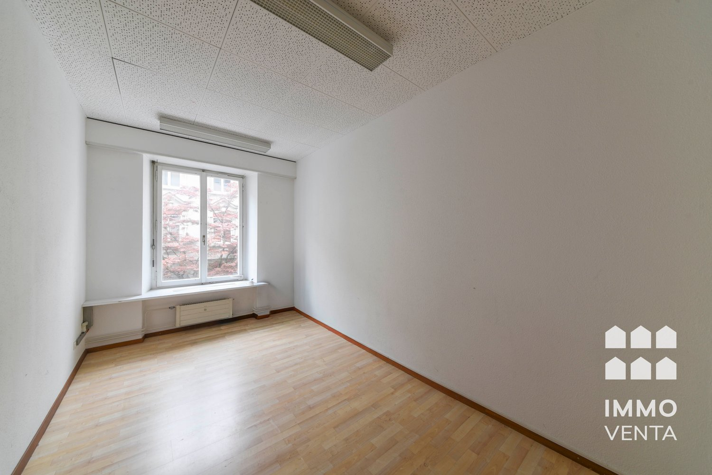
*`01.jpg`*

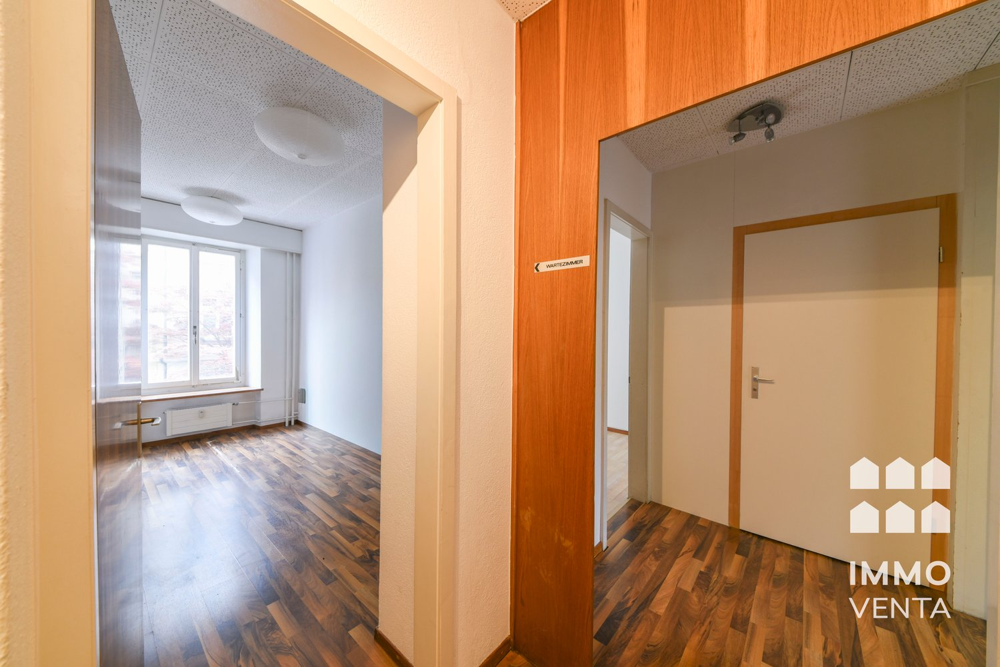
*`02.jpg`*

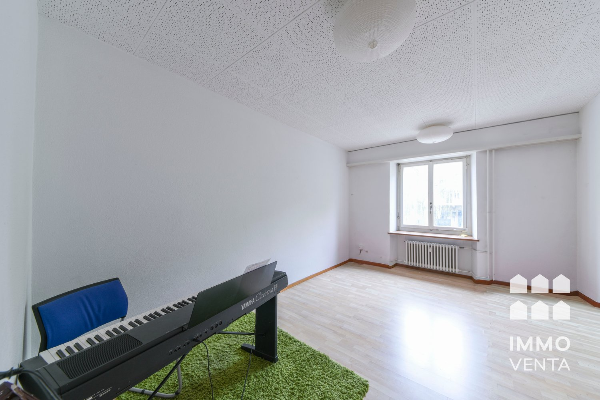
*`03.jpg`*

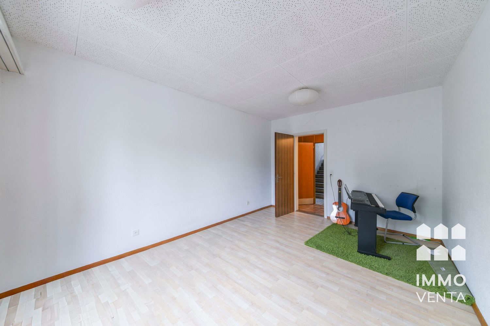
*`04.jpg`*

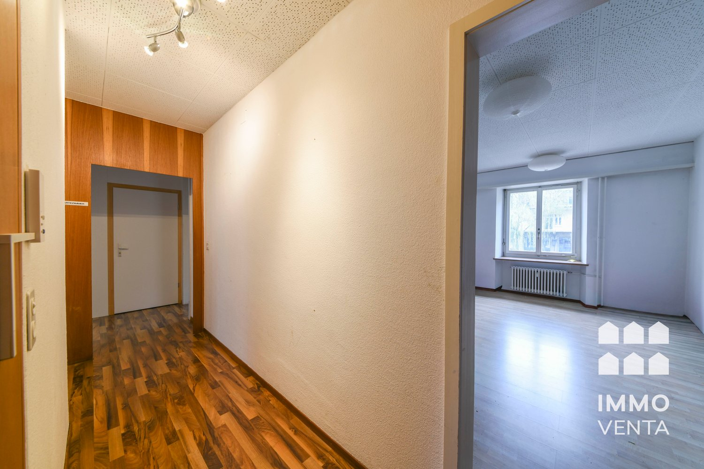
*`05.jpg`*

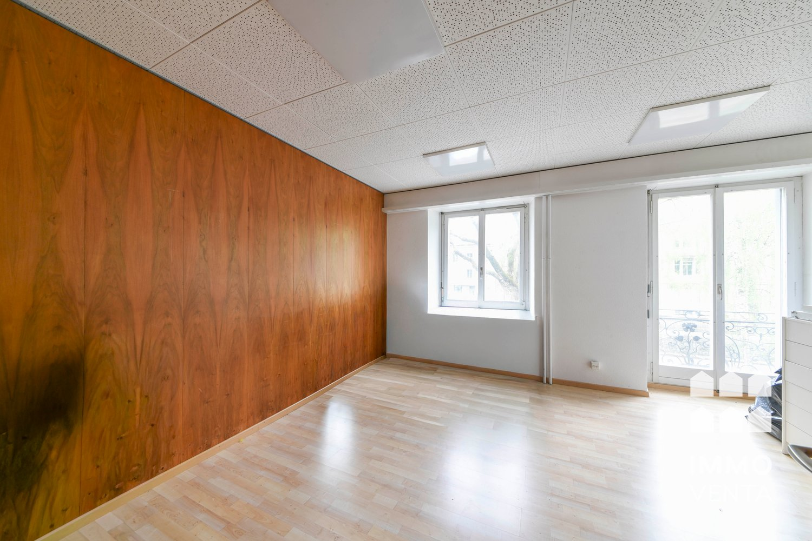
*`06.jpg`*

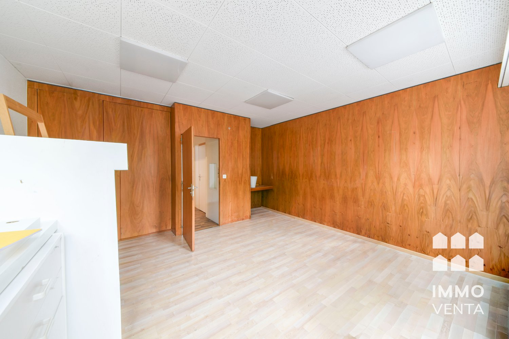
*`07.jpg`*

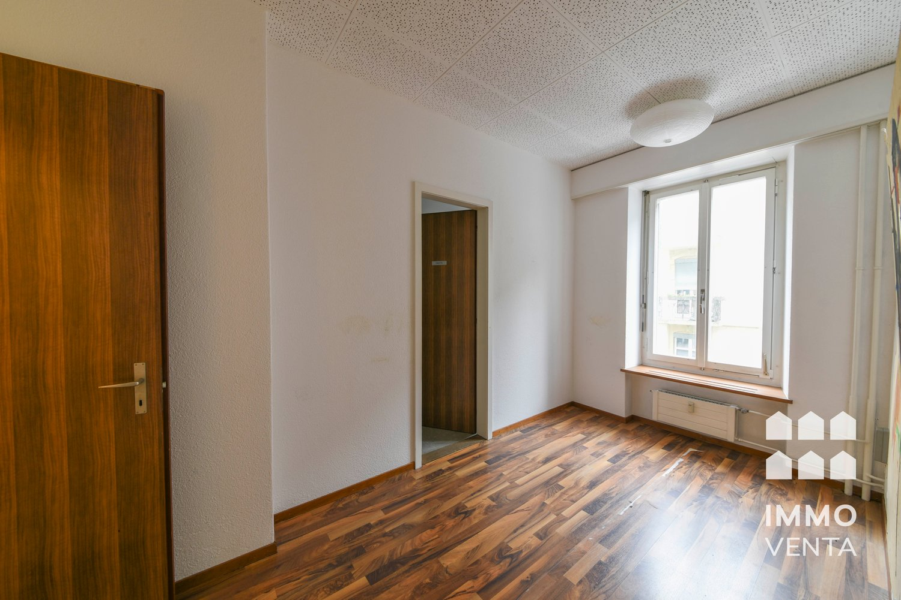
*`08.jpg`*

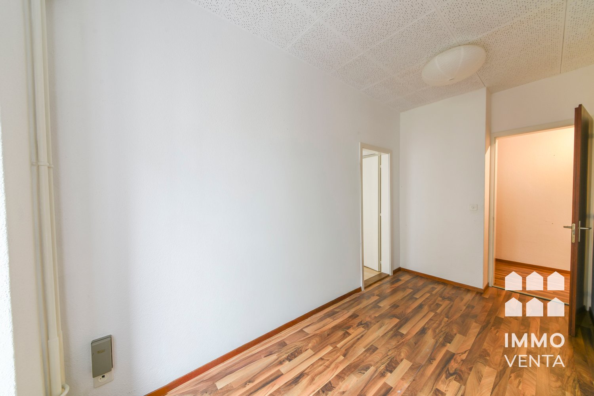
*`09.jpg`*

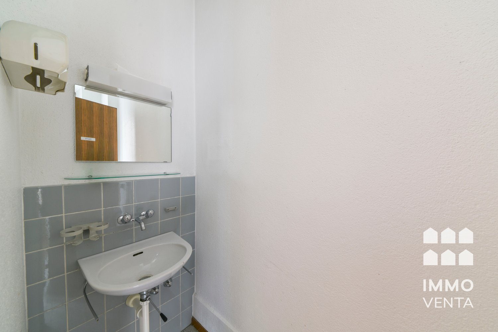
*`10.jpg`*

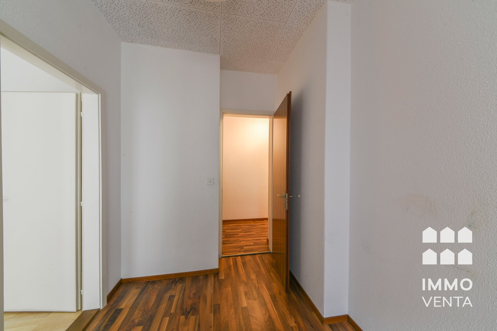
*`11.jpg`*

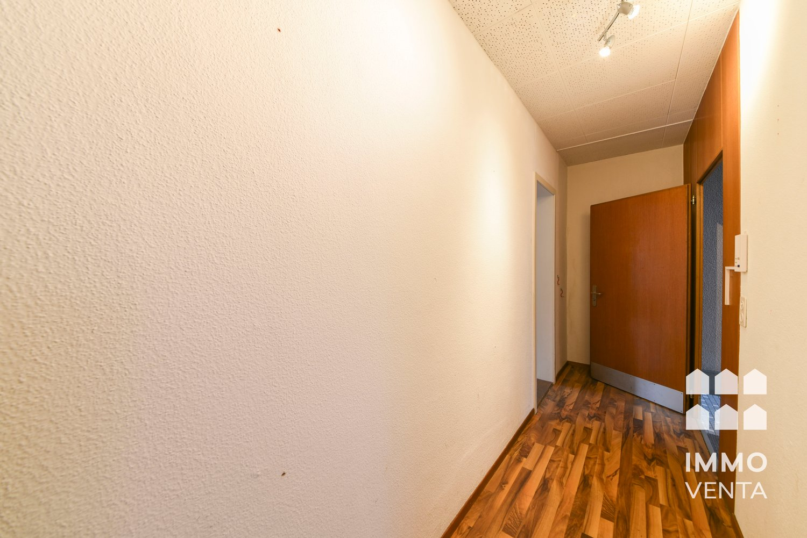
*`12.jpg`*
