# Grand-Rue 124, 2720 Tramelan - CHF 3’110 inkl. NK pro Monat

> **Categorie:** `B_buero_gewerbe`  
> **Regiune:** Cantonul Berna  
> **Tip ofertă:** RENT / OFFICE  
> **Sursă:** [flatfox.ch](https://flatfox.ch/de/wohnung/grand-rue-124-2720-tramelan/85971731/)  
> **Descărcat:** 2026-08-17 12:38

## Date obiect

| Câmp | Valoare |
|---|---|
| Adresă | Grand-Rue 124, 2720 Tramelan |
| Categorie obiect | INDUSTRY |
| Tip obiect | OFFICE |
| Chirie netă | CHF 2'710 |
| Nebenkosten | CHF 400 |
| Chirie brută | CHF 3'110 |
| Preț afișat | CHF 3'110 |
| Suprafață utilă | 217 m² |
| Etaj | 3 |
| Disponibil de la | agr |
| Referință | 23660.01.430010 |

## Texte originale (germană)

**Titlu public:** Grand-Rue 124, 2720 Tramelan - CHF 3’110 inkl. NK pro Monat

**Titlu scurt:** 217m² Büro

**Pitch:** 217m² Büro in Tramelan mieten

**Titlu descriere:** Bureau situé au 3e étage - Grand Rue 122/124, Tramelan

**Titlu chirie:** 217m² Büro in Tramelan mieten

**Spațiu afișat:** 217

### Descriere completă

Situé au coeur de Tramelan, au 122/124 de la Grand Rue, un bel espace de bureau est à louer au 3e étage. Il se trouve dans un immeuble commercial bien entretenu, équipé d'un ascenseur et bénéficiant d'un bon accès. 

  

Cet espace de bureau lumineux offre une atmosphère de travail agréable et convient parfaitement à une personne seule ou à une petite équipe. Grâce à la bonne configuration de son agencement, l'espace peut être utilisé de manière flexible et efficace. 

  

À proximité immédiate se trouvent d'autres bureaux et salles de réunion, ainsi qu'une cafétéria et des sanitaires, qui peuvent être utilisés en commun au sein du bâtiment. L'emplacement central garantit en outre une bonne accessibilité pour les collaborateurs et les clients. 

  

Nous nous tenons à votre disposition pour toute information complémentaire ou pour une visite. 

  

  

  

An zentraler Lage in Tramelan, an der Grand Rue 122/124, steht im 3. Obergeschoss ein attraktiver Büroraum zur Vermietung. Der Raum befindet sich in einem gepflegten Geschäftshaus mit Lift und guter Erschliessung. 

  

Der helle Büroraum bietet eine angenehme Arbeitsatmosphäre und eignet sich ideal für Einzelpersonen oder ein kleines Team. Durch die gute Grundrissstruktur lässt sich der Raum flexibel und effizient nutzen. 

  

In unmittelbarer Nähe befinden sich weitere Büro- und Sitzungsräume sowie eine Cafeteria und Sanitäranlagen, die im Gebäude mitgenutzt werden können. Die zentrale Lage sorgt zudem für eine gute Erreichbarkeit für Mitarbeitende und Kunden. 

  

Gerne stehen wir für weitere Informationen oder eine Besichtigung zur Verfügung.

## Ofertant

- **Nume:** Von Graffenried AG Liegenschaften
- **Stradă:** Marktgass-Passage 3
- **NPA:** 3011
- **Localitate:** Bern

## Imagini (12)

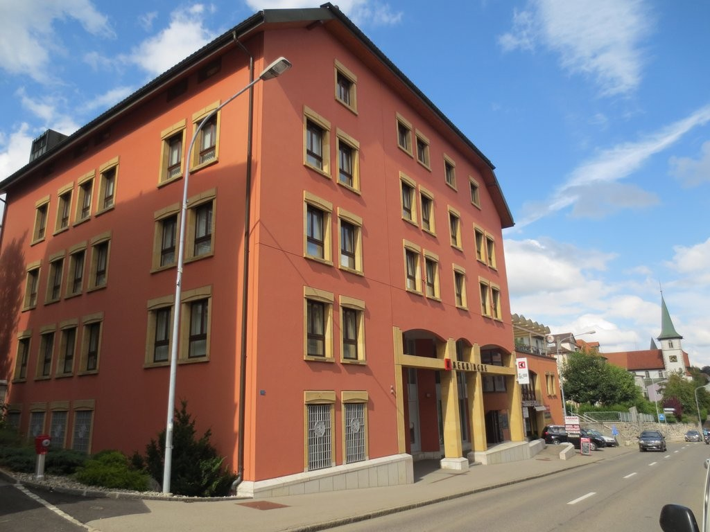
*`01.jpg` — 1024x768 px — Aussenansicht*

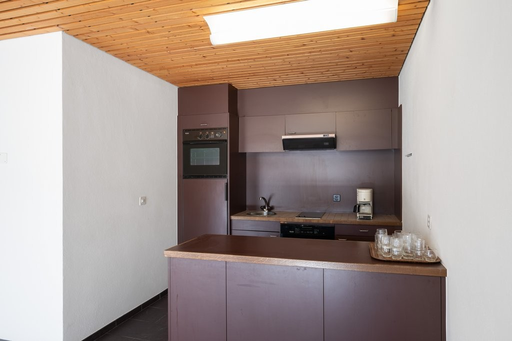
*`02.jpg` — 1024x683 px — Küche*

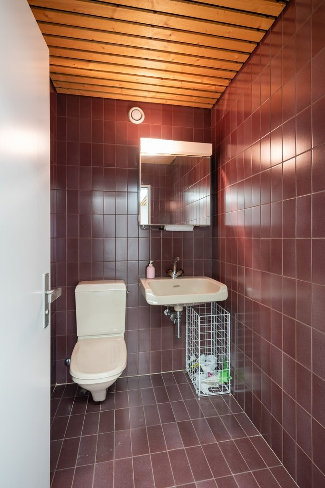
*`03.jpg` — 683x1024 px — Bad/WC*

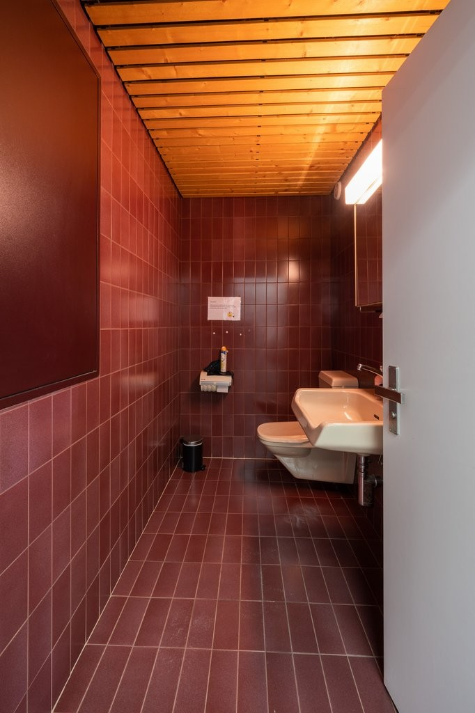
*`04.jpg` — 682x1024 px — Bad/WC*

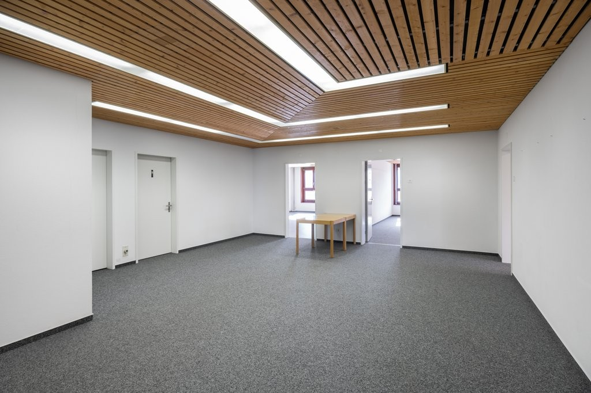
*`05.jpg` — 1024x683 px — Büroraum*

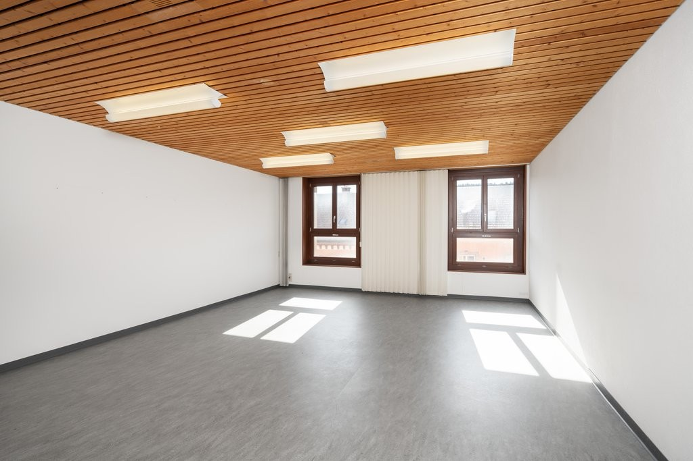
*`06.jpg` — 1024x683 px — Büroraum*

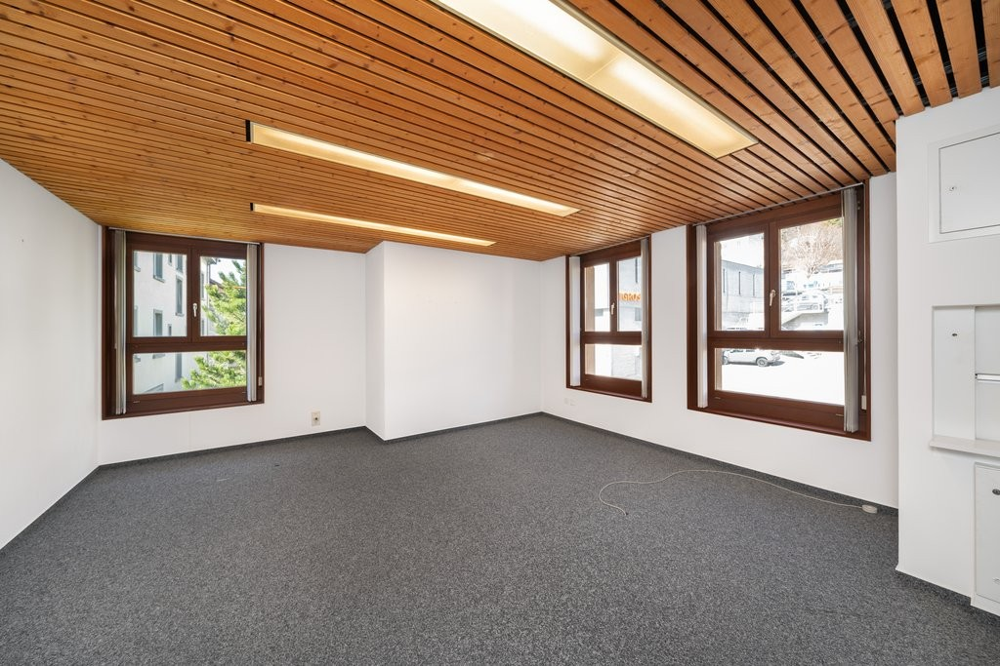
*`07.jpg` — 1024x683 px — Büroraum*

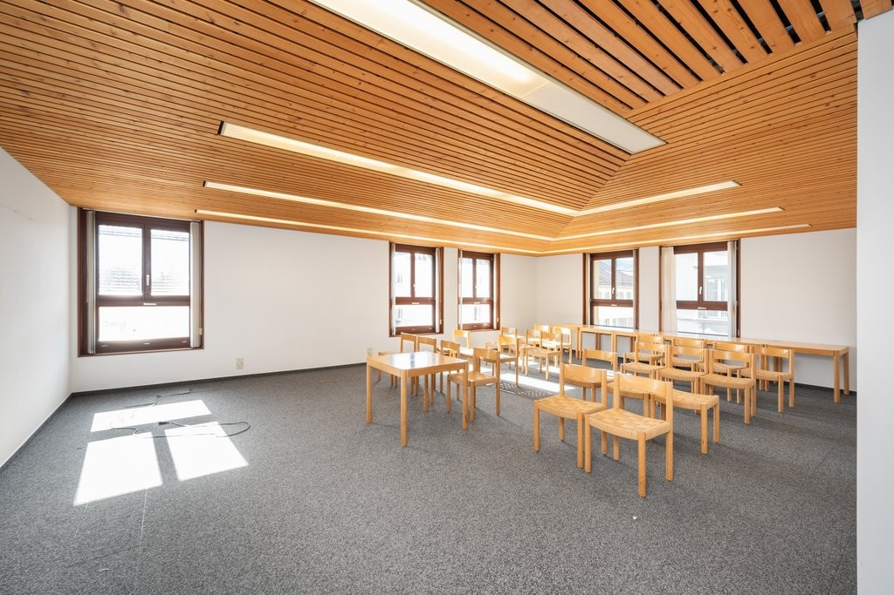
*`08.jpg` — 1024x683 px — Büroraum*

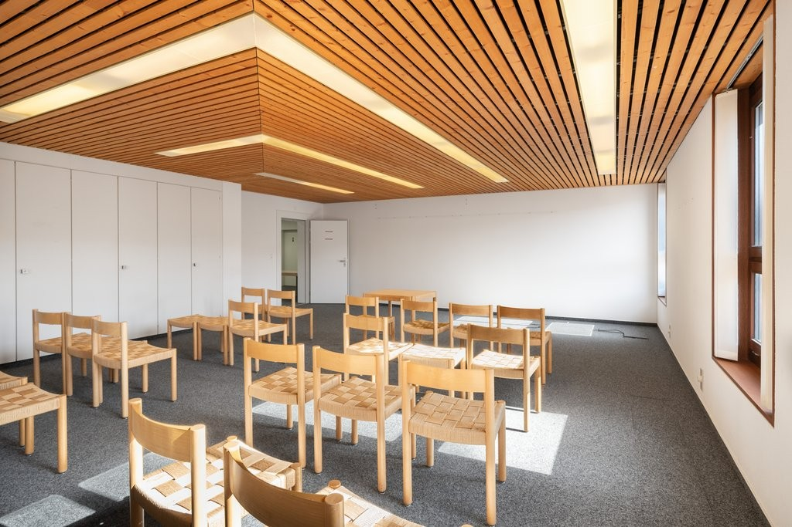
*`09.jpg` — 1024x683 px — Büroraum*

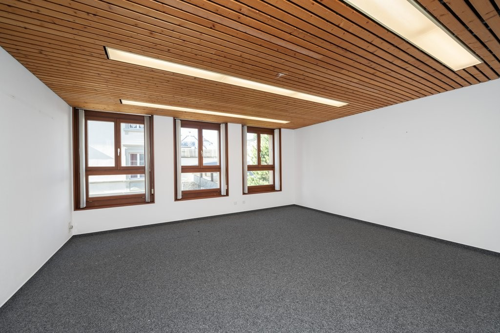
*`10.jpg` — 1024x683 px — Büroraum*

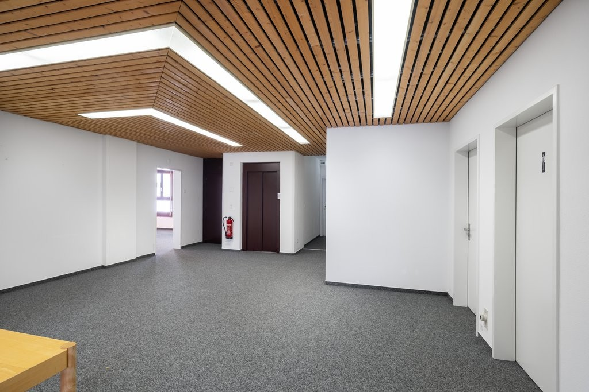
*`11.jpg` — 1024x683 px — Korridor*

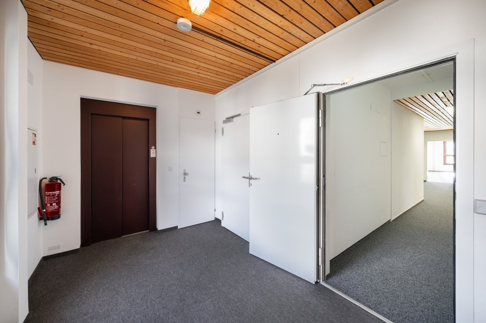
*`12.jpg` — 1024x683 px — Korridor/Lift*
