# Grand-Rue 124, 2720 Tramelan - CHF 3’700 inkl. NK pro Monat

> **Categorie:** `B_buero_gewerbe`  
> **Regiune:** Cantonul Berna  
> **Tip ofertă:** RENT / OFFICE  
> **Sursă:** [flatfox.ch](https://flatfox.ch/de/wohnung/grand-rue-124-2720-tramelan/85971762/)  
> **Descărcat:** 2026-08-17 12:38

## Date obiect

| Câmp | Valoare |
|---|---|
| Adresă | Grand-Rue 124, 2720 Tramelan |
| Categorie obiect | INDUSTRY |
| Tip obiect | OFFICE |
| Chirie netă | CHF 3'250 |
| Nebenkosten | CHF 450 |
| Chirie brută | CHF 3'700 |
| Preț afișat | CHF 3'700 |
| Suprafață utilă | 260 m² |
| Etaj | 2 |
| Disponibil de la | agr |
| Referință | 23660.01.420010 |

## Texte originale (germană)

**Titlu public:** Grand-Rue 124, 2720 Tramelan - CHF 3’700 inkl. NK pro Monat

**Titlu scurt:** 260m² Büro

**Pitch:** 260m² Büro in Tramelan mieten

**Titlu descriere:** Bureau situé au 2e étage - Grand Rue 122/124, Tramelan

**Titlu chirie:** 260m² Büro in Tramelan mieten

**Spațiu afișat:** 260

### Descriere completă

Au 2e étage du 122/124 Grand Rue à Tramelan, un bel espace de bureaux est à louer. Le bâtiment bénéficie d'un emplacement central et dispose d'un ascenseur pratique. 

  

Lumineux et fonctionnel, cet espace de bureau offre un cadre de travail agréable et convient parfaitement aux particuliers ou aux petites équipes. Grâce à son agencement judicieux, la surface peut être utilisée de manière flexible et aménagée selon vos besoins. 

  

L'accès partagé à des espaces communs modernes, tels que des salles de réunion, un espace de détente et des sanitaires situés au même étage, est possible et apporte un confort supplémentaire au quotidien. 

  

Sa situation centrale garantit une très bonne accessibilité ainsi qu'un environnement professionnel pour votre entreprise. 

  

Nous nous tenons à votre disposition pour toute information complémentaire ou pour une visite des lieux. 

  

  

  

Im 2. Obergeschoss an der Grand Rue 122/124 in Tramelan steht ein attraktiver Büroraum zur Vermietung. Das Gebäude ist zentral gelegen und verfügt über einen komfortablen Liftzugang. 

  

Der helle und funktionale Büroraum bietet eine angenehme Arbeitsumgebung und eignet sich ideal für Einzelpersonen oder kleine Teams. Durch die gute Raumaufteilung lässt sich die Fläche flexibel nutzen und individuell einrichten. 

  

Die Mitbenutzung von modernen Nebenflächen wie Sitzungszimmern, Aufenthaltsbereich sowie Sanitäranlagen im gleichen Geschoss ist möglich und sorgt für zusätzlichen Komfort im Arbeitsalltag. 

  

Die zentrale Lage garantiert eine sehr gute Erreichbarkeit sowie ein professionelles Umfeld für Ihr Unternehmen. 

  

Gerne stehen wir für weitere Informationen oder eine Besichtigung zur Verfügung.

## Ofertant

- **Nume:** Von Graffenried AG Liegenschaften
- **Stradă:** Marktgass-Passage 3
- **NPA:** 3011
- **Localitate:** Bern

## Imagini (12)

*`01.jpg` — 1024x768 px — Aussenansicht*

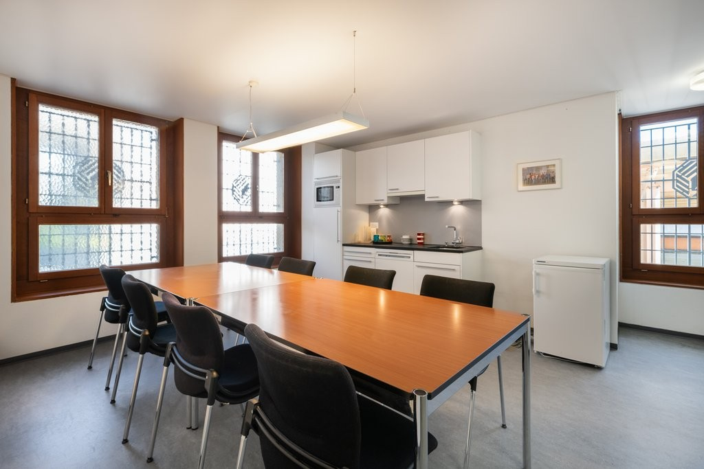
*`02.jpg` — 1024x683 px — Küche*

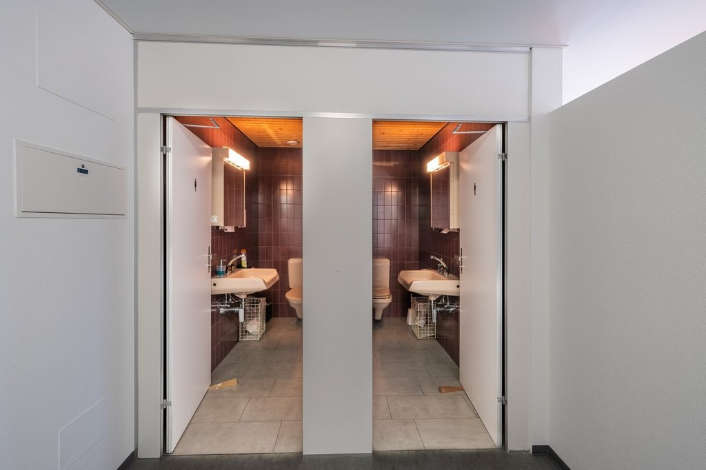
*`03.jpg` — 1024x682 px — Bad/WC*

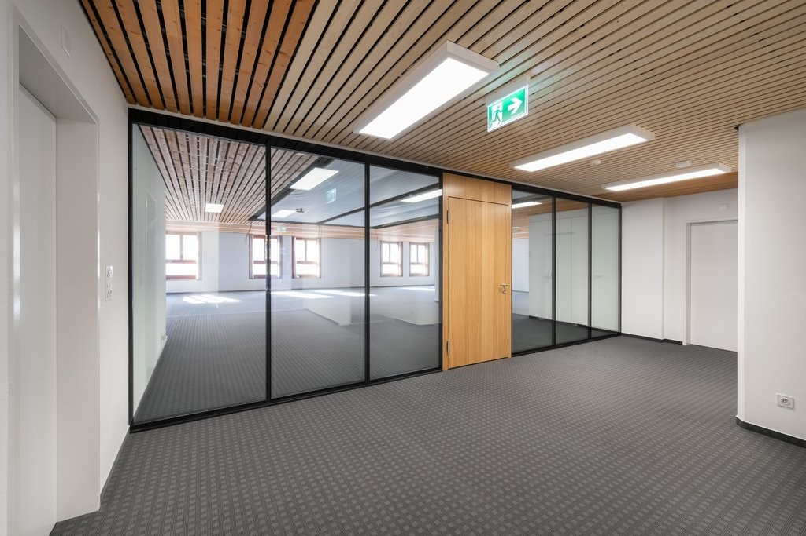
*`04.jpg` — 1024x683 px — Büroraum*

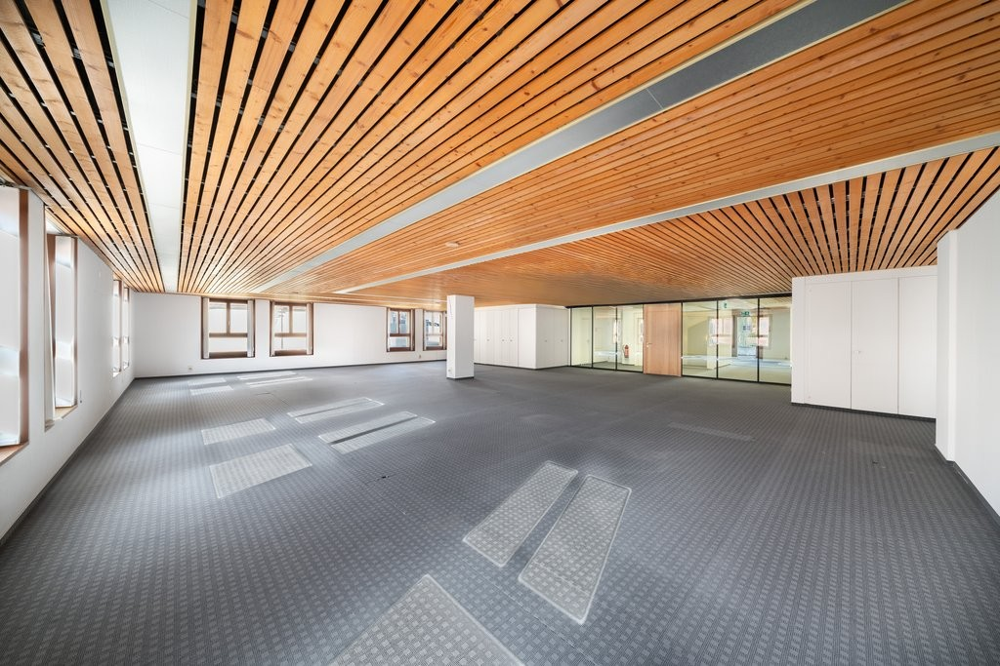
*`05.jpg` — 1024x683 px — Büroraum*

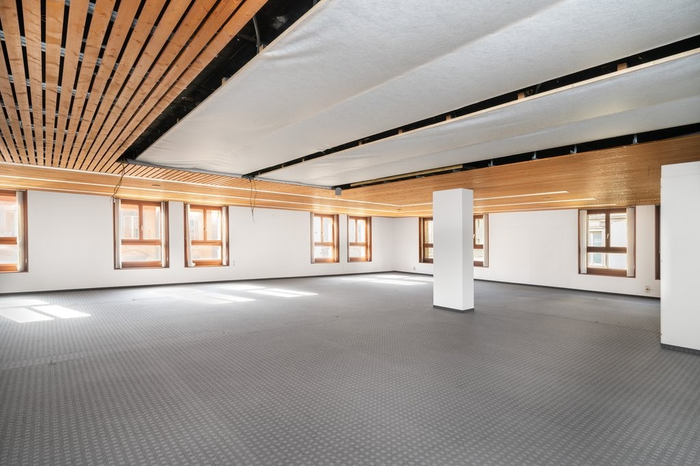
*`06.jpg` — 1024x683 px — Büroraum*

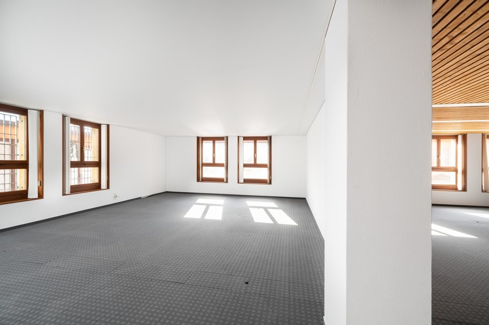
*`07.jpg` — 1024x683 px — Büroraum*

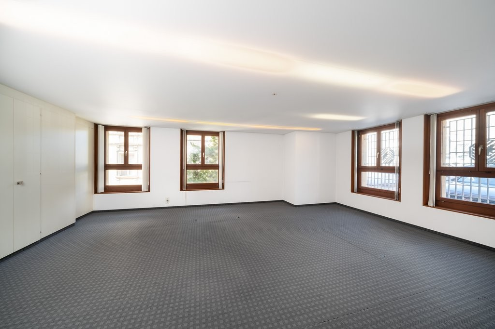
*`08.jpg` — 1024x683 px — Büroraum*

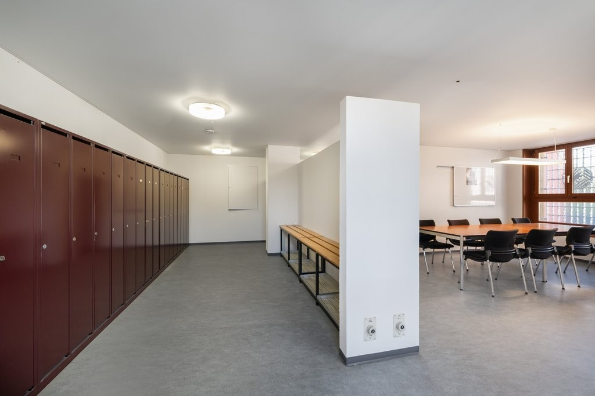
*`09.jpg` — 1024x683 px — Büroraum/Garderobe*

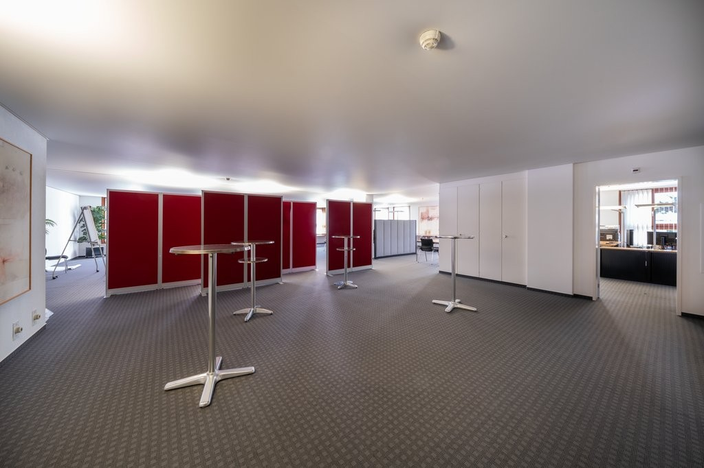
*`10.jpg` — 1024x682 px — Büroraum*

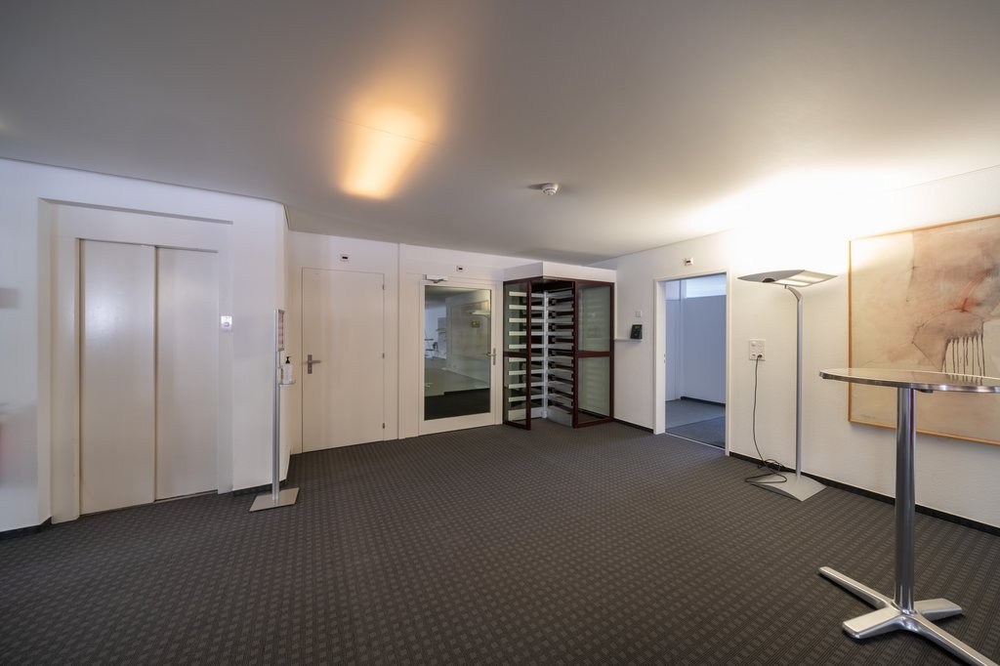
*`11.jpg` — 1024x682 px — Büroraum*

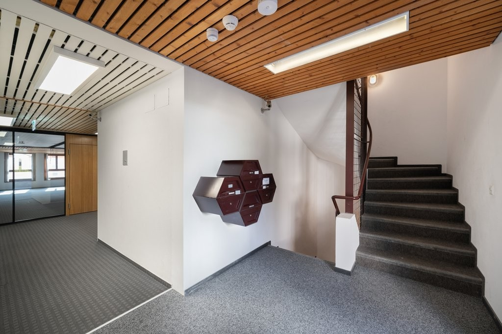
*`12.jpg` — 1024x683 px — Korridor/Diele*
