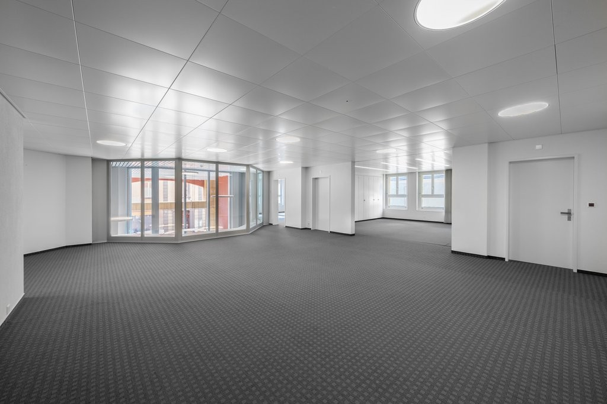
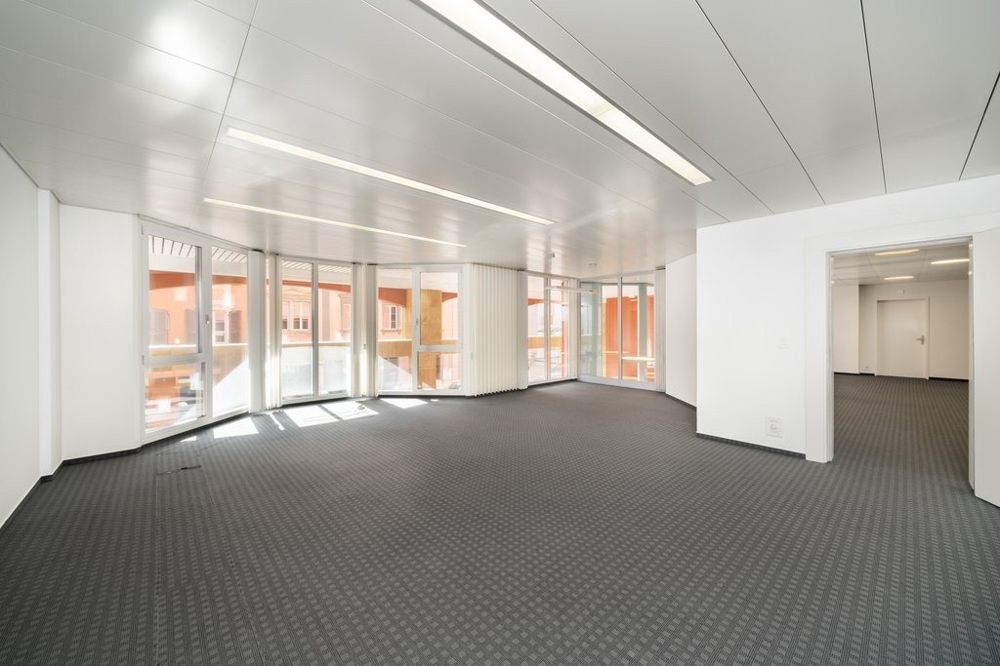
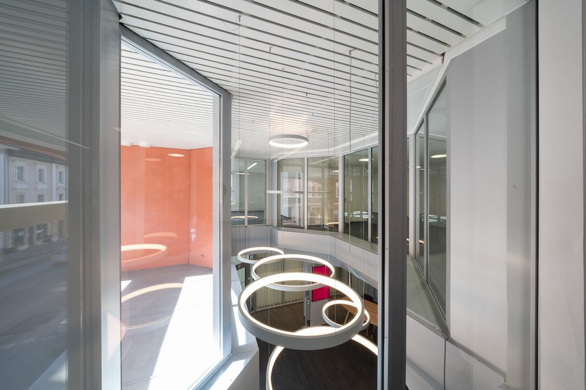
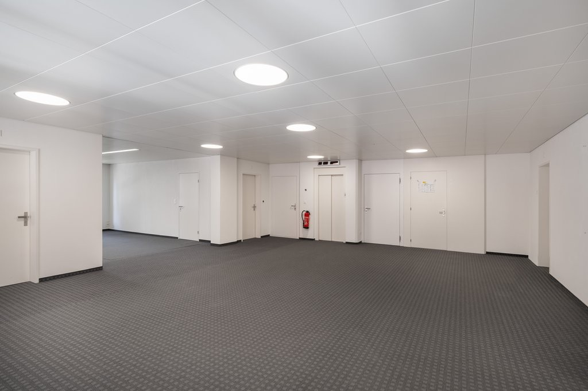
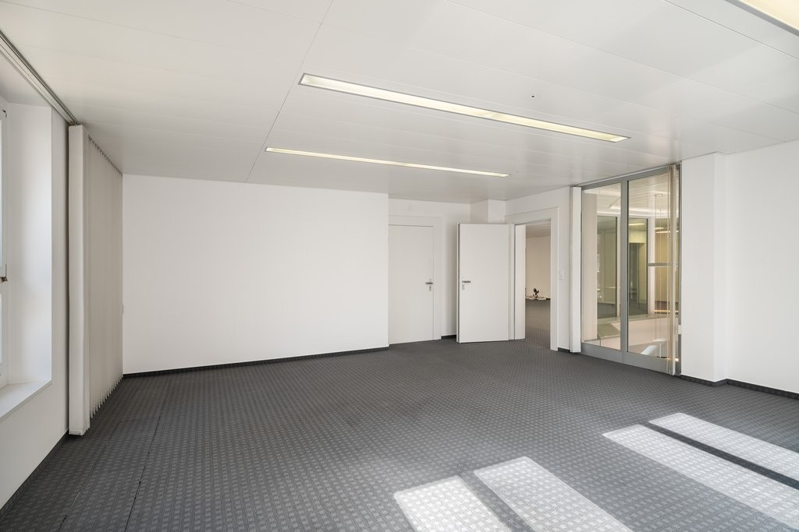
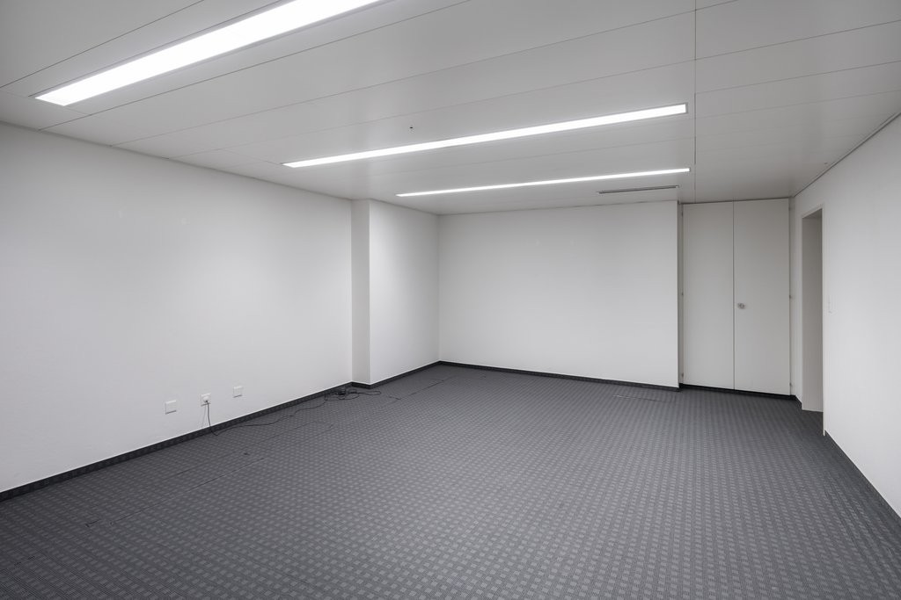
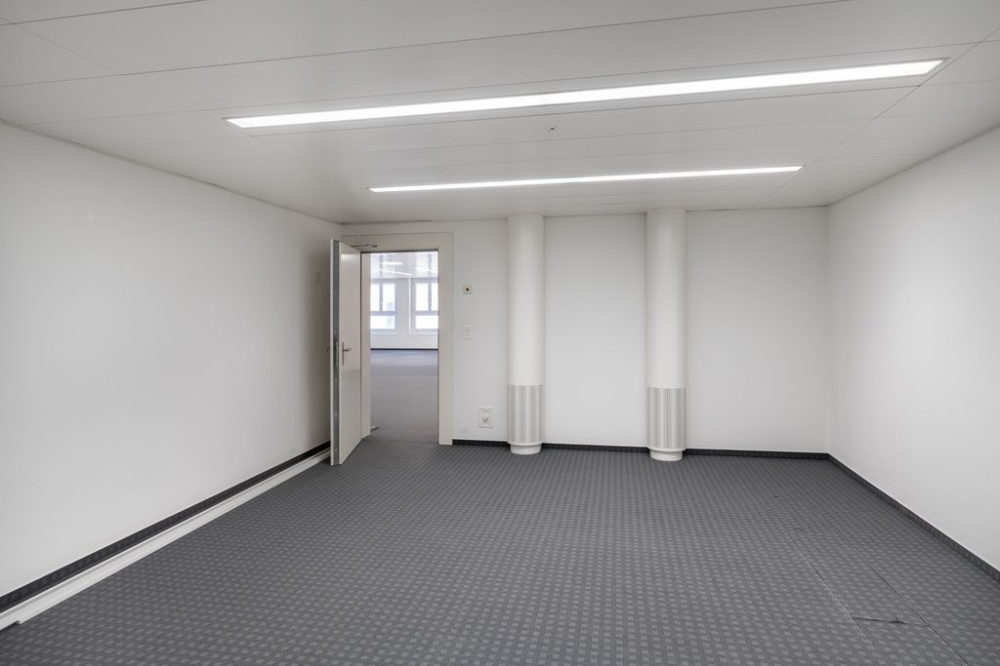
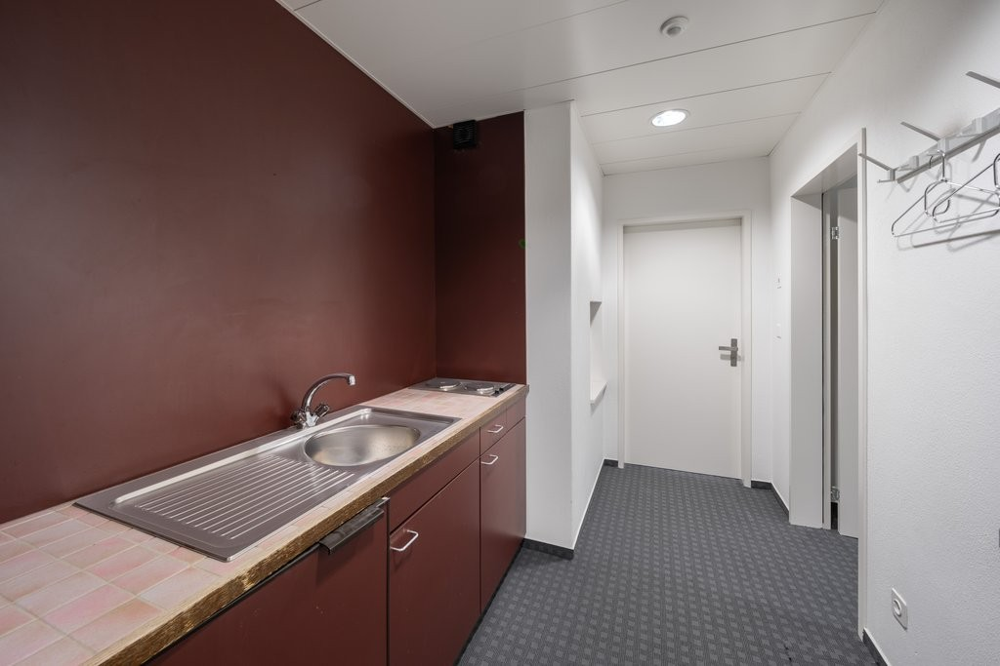
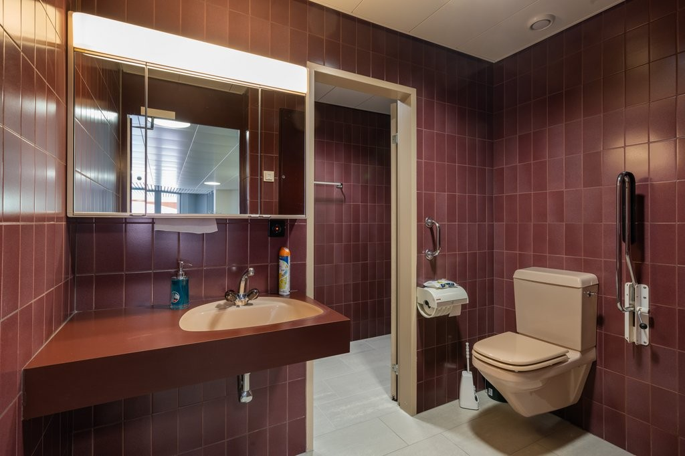
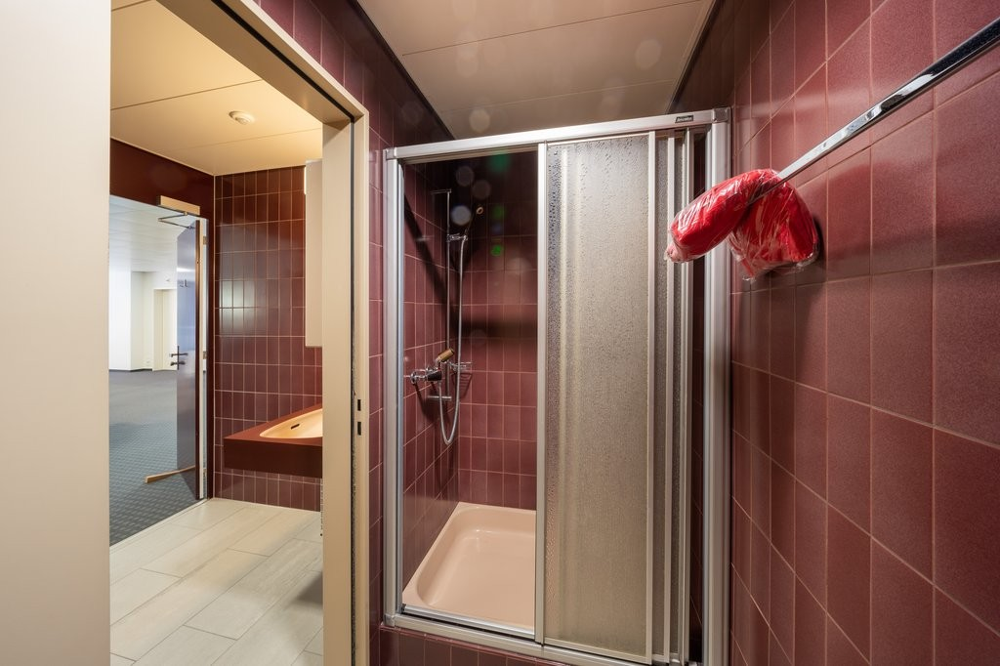

# Grand-Rue 124, 2720 Tramelan - CHF 3’900 inkl. NK pro Monat

> **Categorie:** `B_buero_gewerbe`  
> **Regiune:** Cantonul Berna  
> **Tip ofertă:** RENT / OFFICE  
> **Sursă:** [flatfox.ch](https://flatfox.ch/de/wohnung/grand-rue-124-2720-tramelan/85971767/)  
> **Descărcat:** 2026-08-17 12:38

## Date obiect

| Câmp | Valoare |
|---|---|
| Adresă | Grand-Rue 124, 2720 Tramelan |
| Categorie obiect | INDUSTRY |
| Tip obiect | OFFICE |
| Chirie netă | CHF 3'400 |
| Nebenkosten | CHF 500 |
| Chirie brută | CHF 3'900 |
| Preț afișat | CHF 3'900 |
| Suprafață utilă | 271 m² |
| Etaj | 1 |
| Disponibil de la | agr |
| Referință | 23660.01.410010 |

## Texte originale (germană)

**Titlu public:** Grand-Rue 124, 2720 Tramelan - CHF 3’900 inkl. NK pro Monat

**Titlu scurt:** 271m² Büro

**Pitch:** 271m² Büro in Tramelan mieten

**Titlu descriere:** Bureau situé au 1er étage - Grand Rue 122/124, Tramelan

**Titlu chirie:** 271m² Büro in Tramelan mieten

**Spațiu afișat:** 271

### Descriere completă

Au 1er étage du 122/124 Grand Rue à Tramelan, un bureau ou un espace de travail attrayant est à louer. Le bâtiment bénéficie d'un emplacement central et est facilement accessible par ascenseur. 

  

Lumineux, cet espace offre une atmosphère de travail agréable et convient parfaitement aux particuliers ou aux petites équipes. Grâce à son agencement pratique et bien pensé, la surface peut être utilisée de manière flexible et facilement aménagée. 

  

Au même étage, vous trouverez également des salles de réunion communes, des espaces clients, des zones de détente ainsi que des sanitaires. 

  

Sa situation centrale garantit une très bonne accessibilité et un environnement professionnel pour votre entreprise. 

  

Nous nous ferons un plaisir de vous fournir de plus amples informations ou de vous faire visiter les lieux. 

  

  

  

Im 1. Obergeschoss an der Grand Rue 122/124 in Tramelan steht eine attraktive Büro- oder Arbeitsfläche zur Vermietung. Das Gebäude liegt zentral und ist bequem mit dem Lift erschlossen. 

  

Die hellen Räumlichkeiten bieten eine angenehme Arbeitsatmosphäre und eignen sich ideal für Einzelpersonen oder kleine Teams. Durch die gute und praktische Raumaufteilung lässt sich die Fläche flexibel nutzen und einfach einrichten. 

  

Im gleichen Geschoss stehen zudem gemeinschaftlich nutzbare Sitzungsräume, Kundenbereiche, Aufenthaltszonen sowie Sanitäranlagen zur Verfügung. 

  

Die zentrale Lage sorgt für eine sehr gute Erreichbarkeit und ein professionelles Umfeld für Ihr Unternehmen. 

  

Gerne geben wir Ihnen weitere Informationen oder zeigen Ihnen den Raum bei einer Besichtigung.

## Ofertant

- **Nume:** Von Graffenried AG Liegenschaften
- **Stradă:** Marktgass-Passage 3
- **NPA:** 3011
- **Localitate:** Bern

## Imagini (12)

*`01.jpg` — 1024x768 px — Aussenansicht*

*`02.jpg` — 1024x683 px — Büroraum*

*`03.jpg` — 1024x683 px — Büroraum*

*`04.jpg` — 1024x683 px — Büroraum*

*`05.jpg` — 1024x683 px — Korridor/Diele*

*`06.jpg` — 1024x683 px — Büroraum*

*`07.jpg` — 1024x683 px — Büroraum*

*`08.jpg` — 1024x683 px — Büroraum*

*`09.jpg` — 1024x683 px — Büroraum*

*`10.jpg` — 1024x683 px — Küche*

*`11.jpg` — 1024x682 px — Bad/WC*

*`12.jpg` — 1024x682 px — Bad/Dusche*
