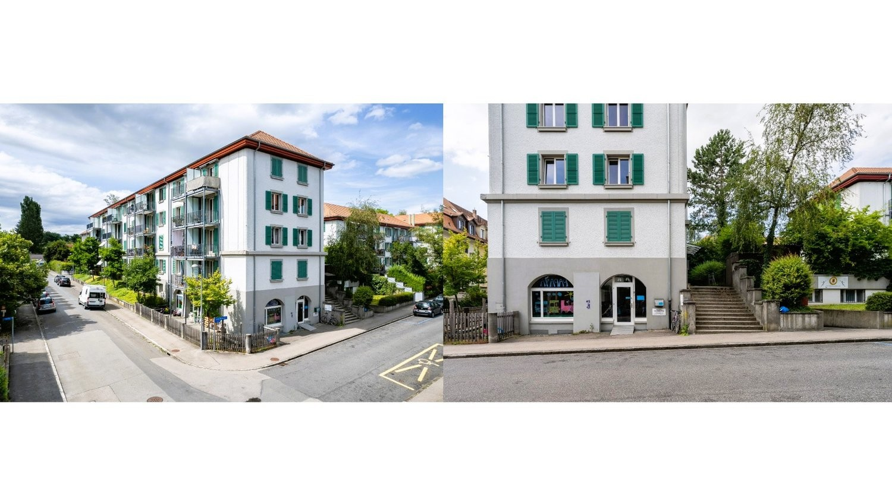

# Sahlistrasse 42, 3012 Bern - CHF 235 inkl. NK pro m² / Jahr

> **Categorie:** `B_buero_gewerbe`  
> **Regiune:** Berna (oraș)  
> **Tip ofertă:** RENT / COMMERCIAL  
> **Relevant pentru praxis:** da (behandlungszimmer)  
> **Sursă:** [flatfox.ch](https://flatfox.ch/de/wohnung/sahlistrasse-42-3012-bern/86009863/)  
> **Descărcat:** 2026-08-17 12:35

## Date obiect

| Câmp | Valoare |
|---|---|
| Adresă | Sahlistrasse 42, 3012 Bern |
| Categorie obiect | INDUSTRY |
| Tip obiect | COMMERCIAL |
| Chirie netă | CHF 200 |
| Nebenkosten | CHF 35 |
| Chirie brută | CHF 235 |
| Preț afișat | CHF 235 |
| Disponibil de la | imm |
| Referință | 7640..9001 |

## Texte originale (germană)

**Titlu public:** Sahlistrasse 42, 3012 Bern - CHF 235 inkl. NK pro m² / Jahr

**Titlu scurt:** Gewerbe

**Pitch:** Gewerbe in Bern mieten

**Titlu descriere:** Gewerbe-/Dienstleistungsfläche 171 m² oder Teilfläche ca. 81 m²

**Titlu chirie:** Gewerbe in Bern mieten

### Descriere completă

Lage:   
\- Zentrale Lage in der Länggasse   
\- Nähe zum Stadtzentrum   
\- Gute Erreichbarkeit (ÖV und Individualverkehr)   
\- Nähe zum Inselspital   
\- Schnelle Anbindung an die Autobahn   
\- Angenehmes und ruhiges Arbeitsumfeld   
  
Raumangebot:   
Die Gewerbefläche im Erdgeschoss verfügt über eine durchdachte und flexible Raumaufteilung.   
  
\- Grosszügiger Hauptraum   
\- Sechs kleinere Räume (ideal als Büros oder Behandlungszimmer o.ä.)   
\- Küchennische   
\- Zwei separate Toiletten-Anlagen   
\- Waschküche mit Dusche   
\- Gemütliche Terrasse zur exklusiven Nutzung   
  
Ausbau:   
Ausbauwünsche können berücksichtigt werden   
  
Besonderes:   
\- Flexible Nutzung dank separater Zugänge   
\- Anmietung der Gesamtfläche 171 m² oder Teilfläche von ca. 81 m² möglich   
  
Mietzins:   
CHF 200.00/m²/Jahr exkl. Nebenkosten   
  
Nebenkosten   
CHF 35.00/m²/Jahr   
  
Haben wir Ihr Interesse geweckt? Wir freuen uns auf Ihre Kontaktaufnahme.

## Dotări (attributes)

- balconygarden

## Ofertant

- **Nume:** BDO AG Bern

## Imagini (1)

*`01.jpg` — 1500x844 px — Unbenannt (1)*
