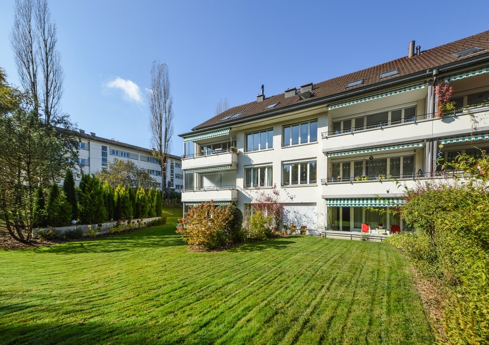
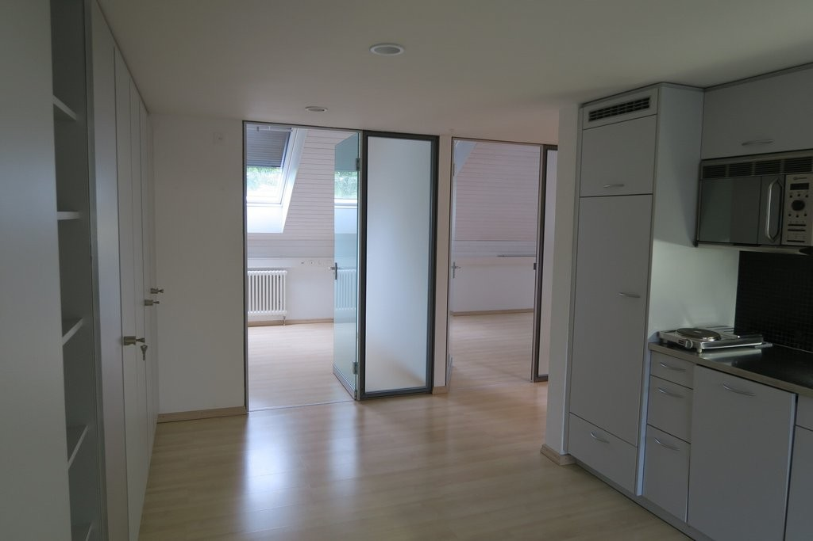
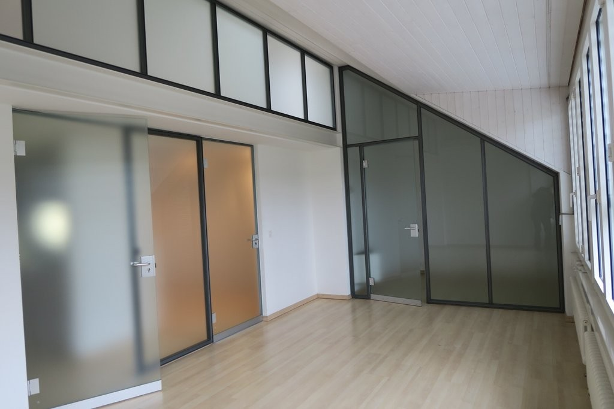
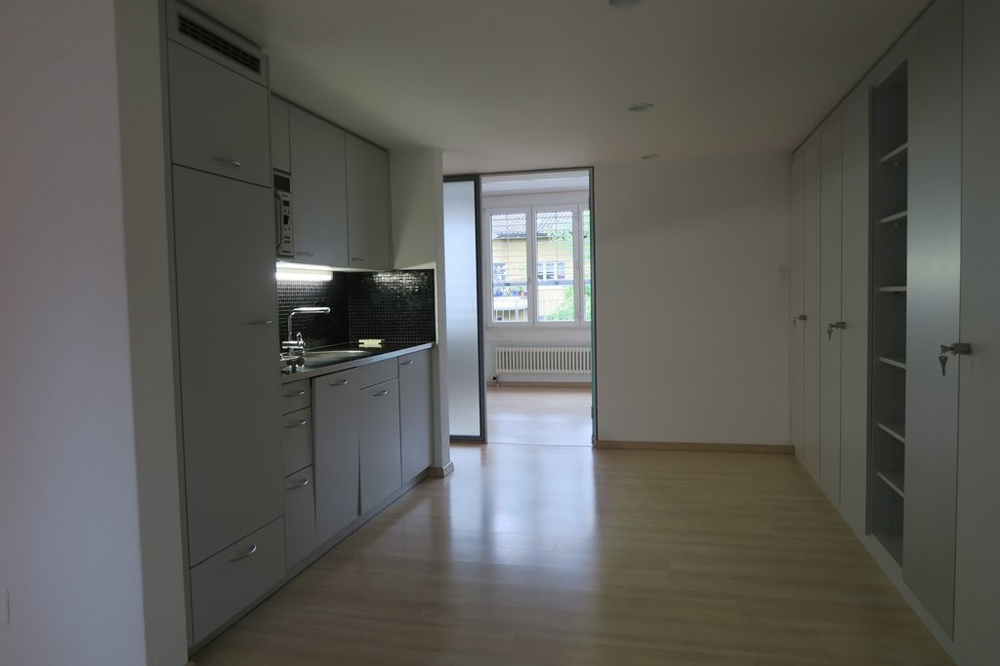
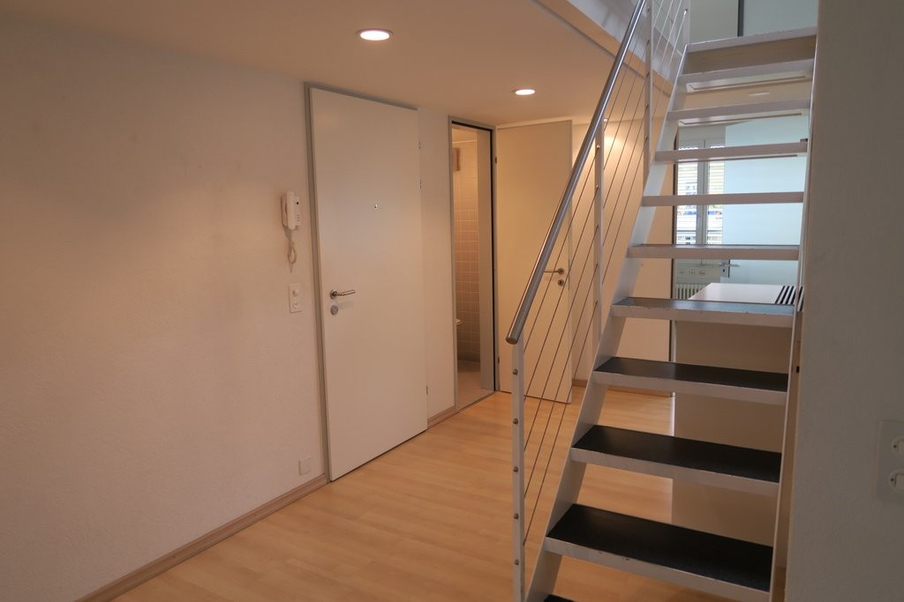
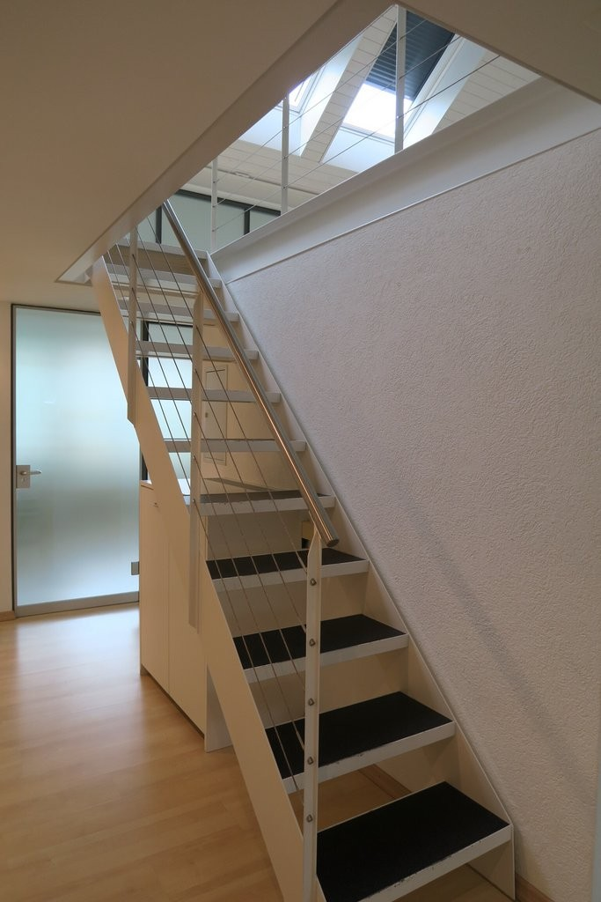
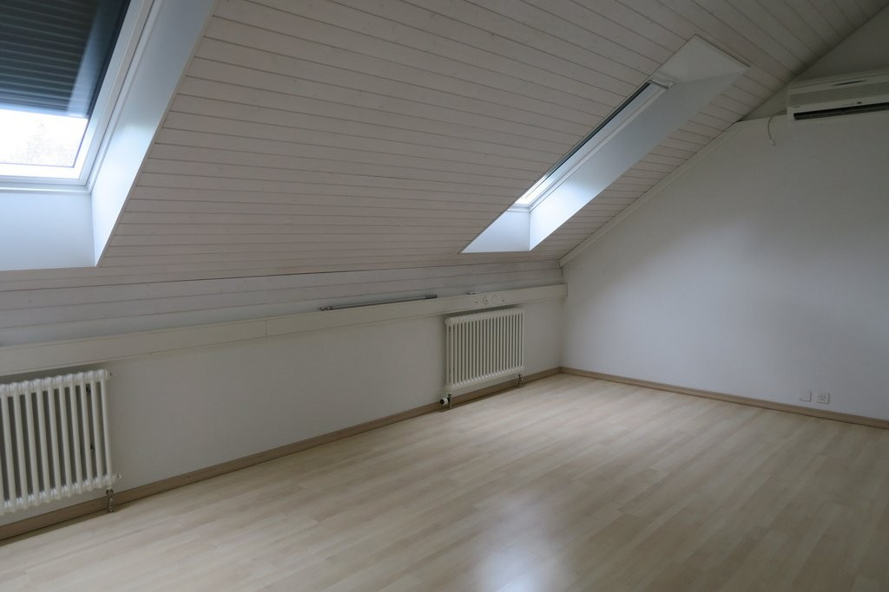
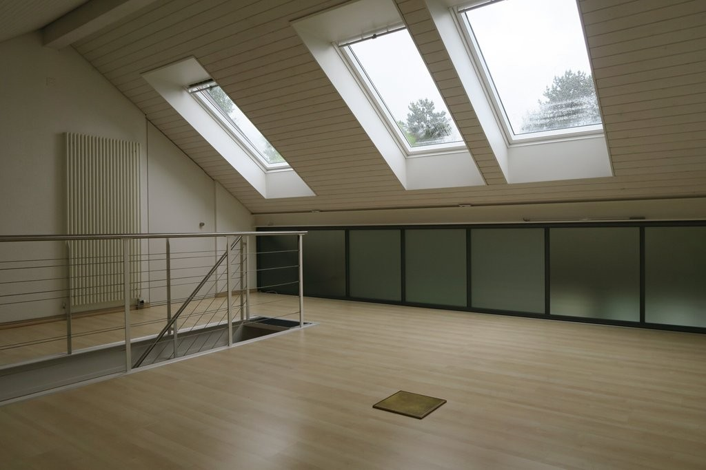
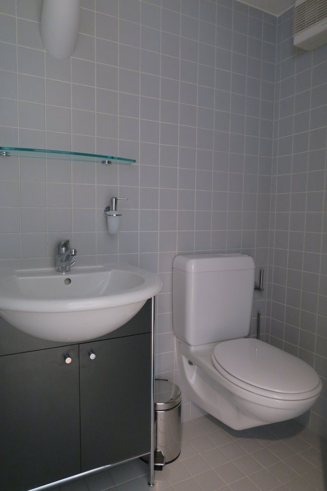

# Chutzenstrasse 70, 3007 Bern - CHF 1’950 inkl. NK pro Monat

> **Categorie:** `B_buero_gewerbe`  
> **Regiune:** Berna (oraș)  
> **Tip ofertă:** RENT / OFFICE  
> **Relevant pentru praxis:** da (praxis)  
> **Sursă:** [flatfox.ch](https://flatfox.ch/de/wohnung/chutzenstrasse-70-3007-bern/86020313/)  
> **Descărcat:** 2026-08-17 12:26

## Date obiect

| Câmp | Valoare |
|---|---|
| Adresă | Chutzenstrasse 70, 3007 Bern |
| Categorie obiect | INDUSTRY |
| Tip obiect | OFFICE |
| Chirie netă | CHF 1'700 |
| Nebenkosten | CHF 250 |
| Chirie brută | CHF 1'950 |
| Preț afișat | CHF 1'950 |
| Suprafață utilă | 103 m² |
| Etaj | 3 |
| An construcție | 1993 |
| Disponibil de la | imm |
| Referință | 11840.03.431010 |

## Texte originale (germană)

**Titlu public:** Chutzenstrasse 70, 3007 Bern - CHF 1’950 inkl. NK pro Monat

**Titlu scurt:** 103m² Büro

**Pitch:** 103m² Büro in Bern mieten

**Titlu descriere:** Ihre neue Wohnung oder Büroräumlichkeiten im Weissenbühlquartier!

**Titlu chirie:** 103m² Büro in Bern mieten

**Spațiu afișat:** 103

### Descriere completă

Das gepflegte Mehrfamilienhaus mit Lift liegt im schönen Weissenbühlquartier. Die Bushaltestelle Zieglerspital (Linie Nr. 19) sowie Einkaufsmöglichkeiten sind nur wenige Meter entfernt. Das Stadtzentrum erreichen Sie mit dem Bus in nur 5 Minuten.   
  
Per 1. Juni 2026 oder nach Vereinbarung vermieten wir Räumlichkeiten, welche sich als Wohnung oder als Büro /Praxis eignen:   
  
-3x abschliessbare Zimmer   
-Galerie-Zimmer   
-Toilettenanlage   
-ausgebaute Küche   
-Personenaufzug   
  
Im Falle einer Umnutzung in eine Wohnung wird eine Dusche neu eingebaut.   
  
Es besteht die Möglichkeit, einen oder mehrere Einstellhallenplätze dazu zu mieten.   
  
Haben wir Ihr Interesse geweckt? Dann melden Sie sich für einen unverbindlichen Besichtigungstermin über das Kontaktformular.

## Dotări (attributes)

- balconygarden
- lift

## Ofertant

- **Nume:** Von Graffenried AG Liegenschaften
- **Stradă:** Marktgass-Passage 3
- **NPA:** 3011
- **Localitate:** Bern

## Imagini (9)

*`01.jpg` — 1024x723 px — Aussenansicht*

*`02.jpg` — 1024x683 px — Küche / Eingangsbereich*

*`03.jpg` — 1024x683 px — Büro*

*`04.jpg` — 1024x683 px — Eingangsbereich / Küche*

*`05.jpg` — 1024x683 px — Korridor / Treppe zur Galerie*

*`06.jpg` — 683x1024 px — Korridor / Treppe zur Galerie*

*`07.jpg` — 1024x683 px — Büro*

*`08.jpg` — 1024x683 px — Galerie*

*`09.jpg` — 683x1024 px — Badezimmer*
