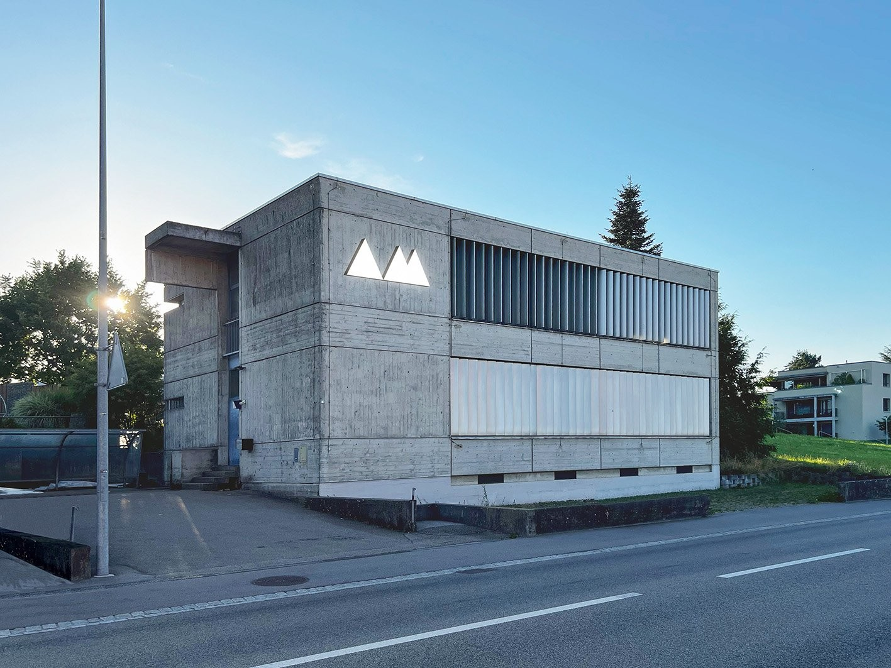
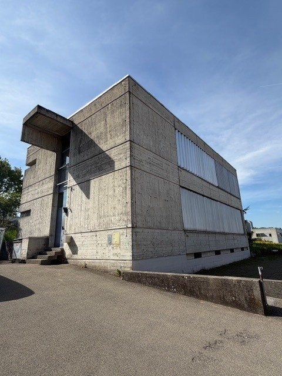
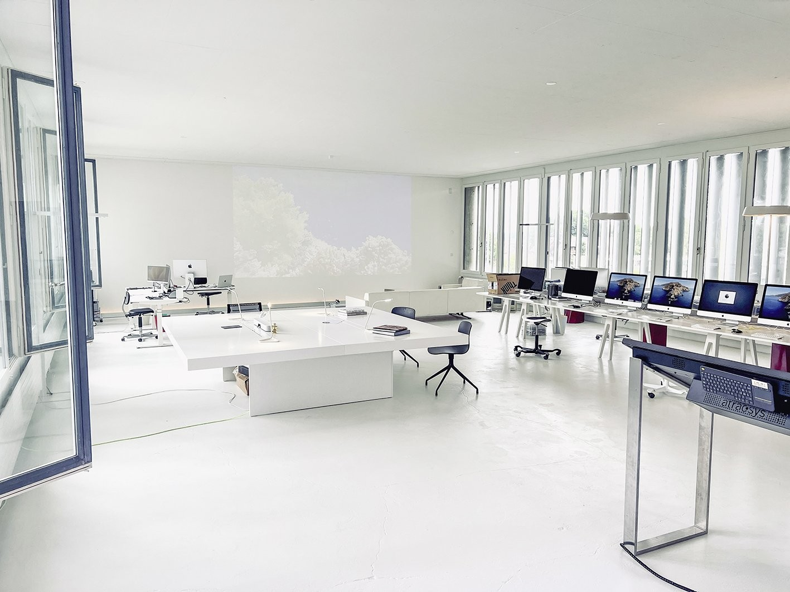
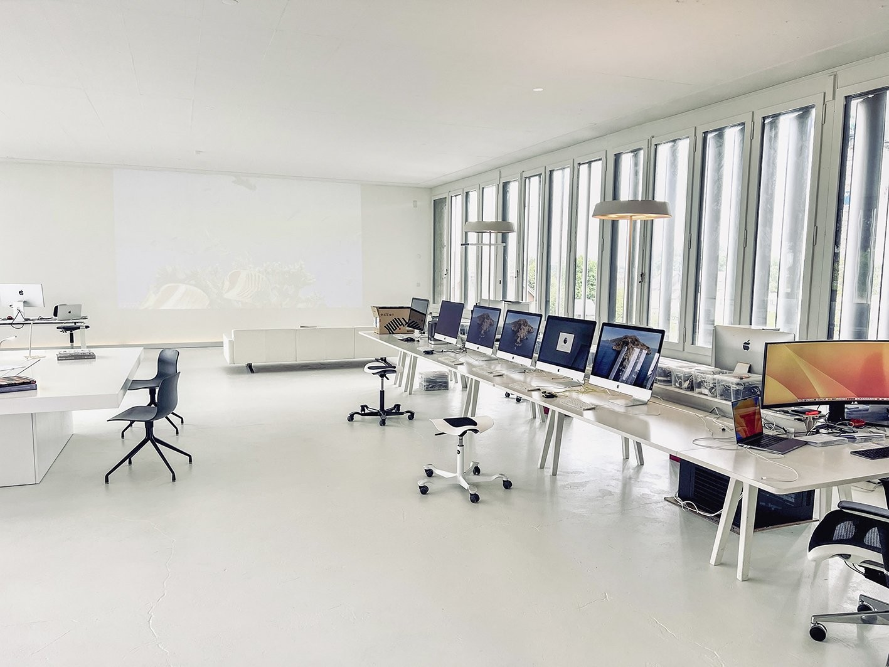
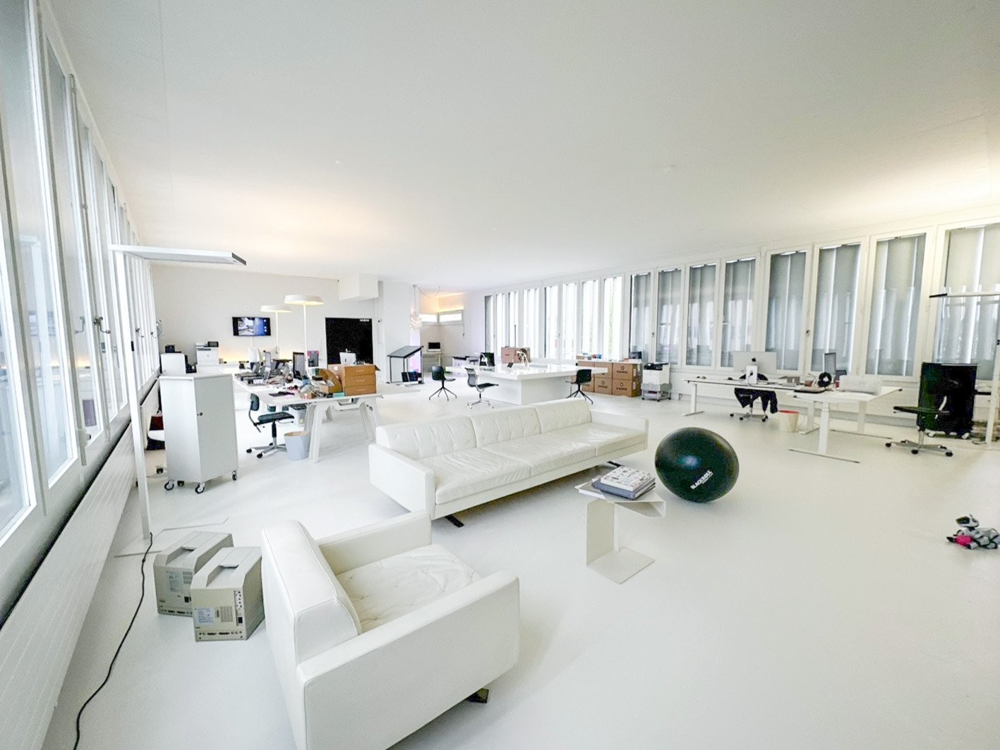
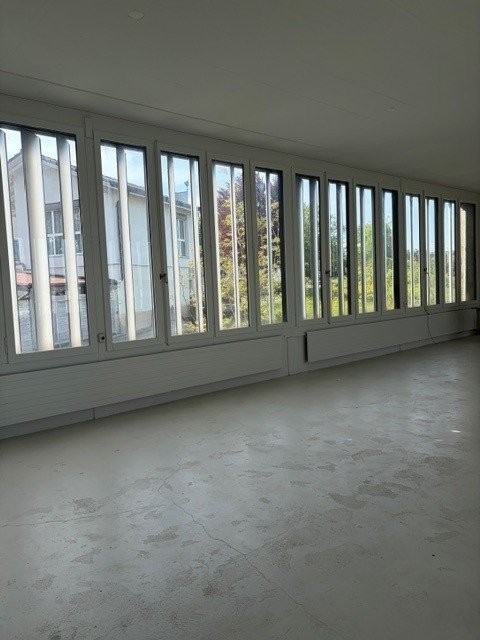
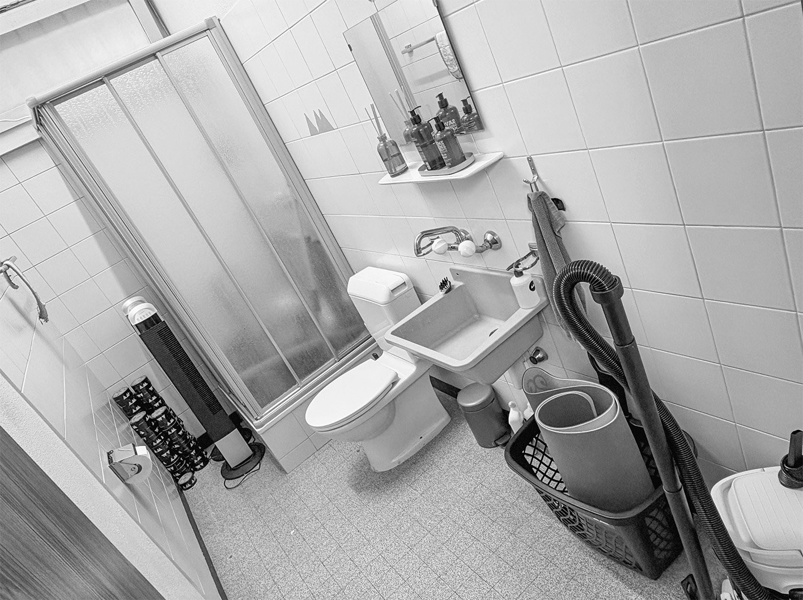

# Solothurnstrasse 35, 3322 Schönbühl-Urtenen - CHF 1’551 inkl. NK pro Monat

> **Categorie:** `B_buero_gewerbe`  
> **Regiune:** Cantonul Berna  
> **Tip ofertă:** RENT / OFFICE  
> **Relevant pentru praxis:** da (apotheke, podologie, ärztezentrum)  
> **Sursă:** [flatfox.ch](https://flatfox.ch/de/wohnung/solothurnstrasse-35-3322-schonbuhl-urtenen/86044540/)  
> **Descărcat:** 2026-08-17 12:39

## Date obiect

| Câmp | Valoare |
|---|---|
| Adresă | Solothurnstrasse 35, 3322 Schönbühl-Urtenen |
| Categorie obiect | INDUSTRY |
| Tip obiect | OFFICE |
| Chirie netă | CHF 1'351 |
| Nebenkosten | CHF 200 |
| Chirie brută | CHF 1'551 |
| Preț afișat | CHF 1'551 |
| Suprafață utilă | 144 m² |
| Etaj | 1 |
| An construcție | 1967 |
| An renovare | 1992 |
| Disponibil de la | agr |
| Referință | ..2117 |

## Texte originale (germană)

**Titlu public:** Solothurnstrasse 35, 3322 Schönbühl-Urtenen - CHF 1’551 inkl. NK pro Monat

**Titlu scurt:** 144m² Büro

**Pitch:** 144m² Büro in Schönbühl-Urtenen mieten

**Titlu descriere:** Lichtdurchflutete, vielseitig nutzbare Gewerberaum, Büro an zentraler Lage

**Titlu chirie:** 144m² Büro in Schönbühl-Urtenen mieten

**Spațiu afișat:** 144

### Descriere completă

An der Solothurnstrassse in Schönbühl-Urtenen vermieten nach Vereinbarung eine Gewerbefläche im 1.OG.   
  
Highlights:   
\- Offene Fläche mit 144m2 und 3.3m Höhe   
\- Einzige Gewerbefläche im Gebäude   
\- Die Fläche kann bei Bedarf unterteilt werden   
\- Hervorragende Anbindung an ÖV und Autobahn   
\- Nebenkosten pauschal   
\- Kein Lift   
  
Diese Gewerbefläche bietet:   
\- Ganzer Tag sehr hell/sonnig   
\- Grosszügige Fensterfront mit Storen   
\- Glasfaser-Internet   
\- Separates WC mit Dusche und Fenster zur Mitbenützung   
\- Velounterstand   
\- In unmittelbarer Nähe finden Sie: Post, Restaurants, Bäckereien, Shoppyland, Coop, Bioladen, Apotheke, Autobahn, Tankstelle, Natur, Ärztezentrum, Schule, Kirche, usw.   
  
Ideal z.B. für:   
\- Büro, kreativ Schaffende (Grafik, Architektur, Fotostudio, Versicherung, usw.)   
\- Ausstellungsraum, Gemeinschaftsbüro, Startups   
\- Seminare, Workshops, Therapieraum, Nails-Center, Podologie   
\- Lager, Werkstatt   
  
Bis zu drei Aussenparkplätze können für je CHF 60.00 / Mt. dazu gemietet werden.   
  
Wir freuen uns auf Ihre Kontaktaufnahme.

## Imagini (7)

*`01.jpg` — 1417x1063 px — Aussenansicht*

*`02.jpg` — 480x640 px — Aussenansicht*

*`03.jpg` — 1417x1063 px — Innenansicht*

*`04.jpg` — 1417x1063 px — Innenansicht*

*`05.jpg` — 1417x1064 px — Innenansicht*

*`06.jpg` — 480x640 px — Innenansicht*

*`07.jpg` — 1417x1060 px — Bad*
