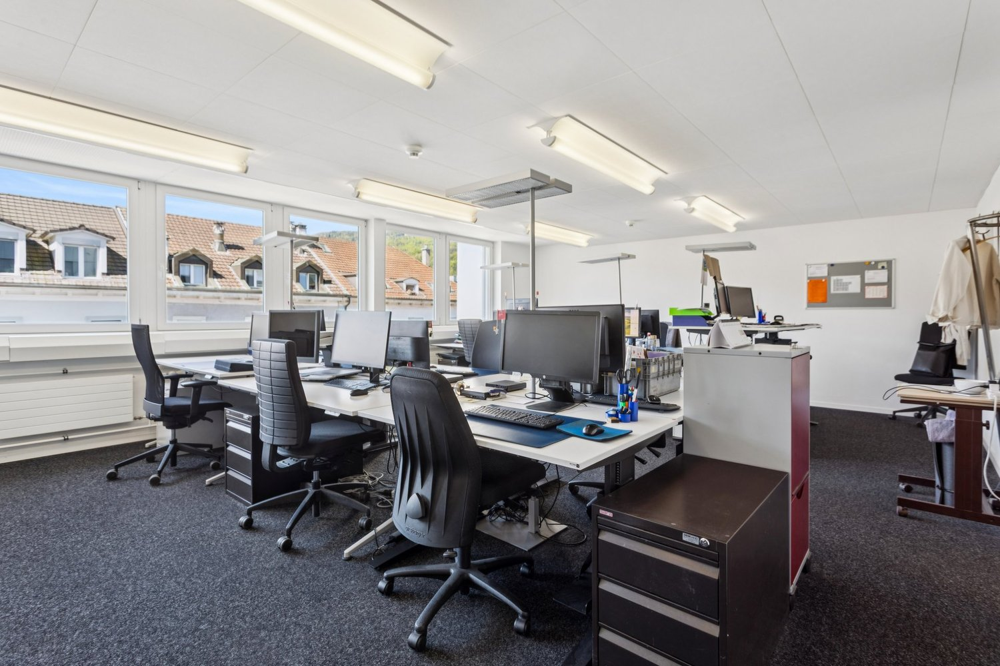
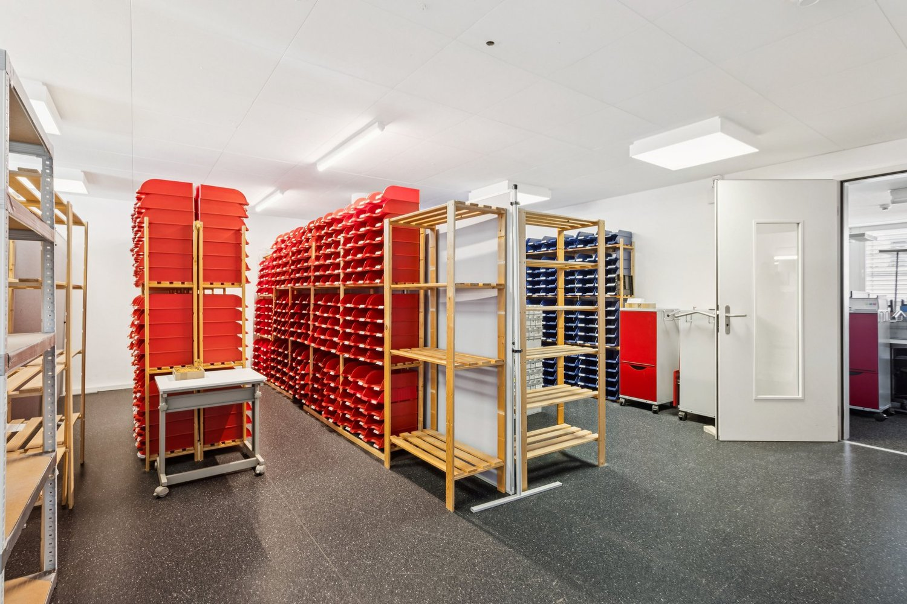
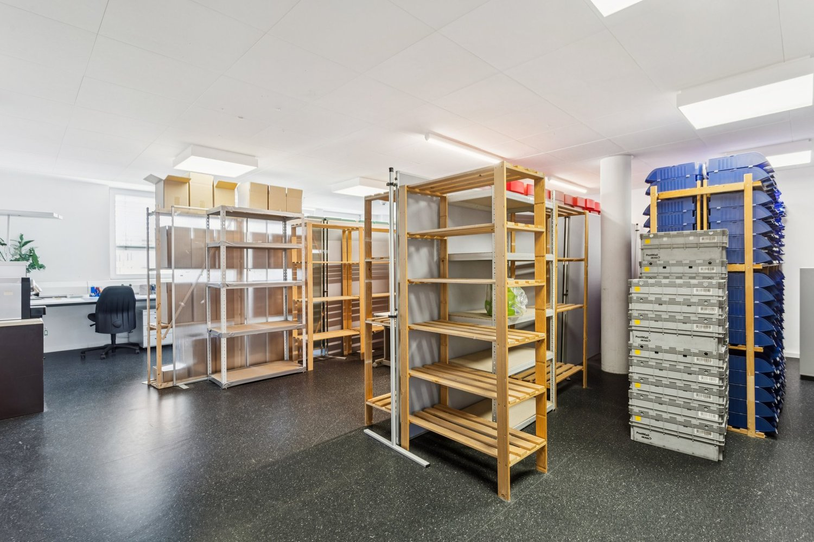
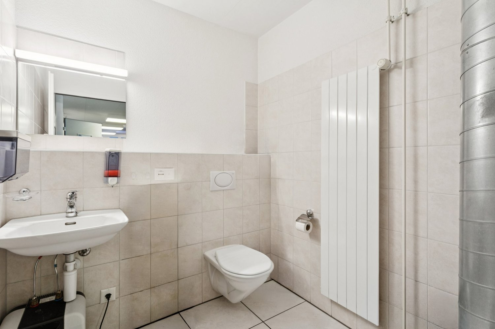
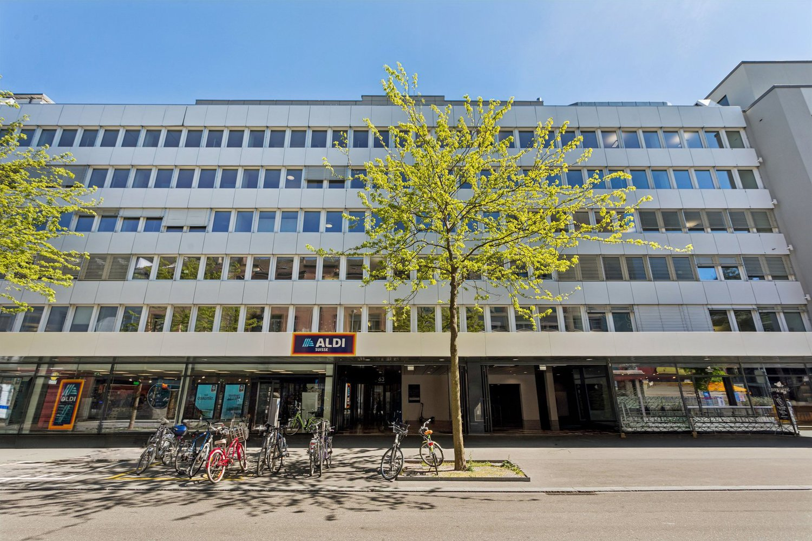
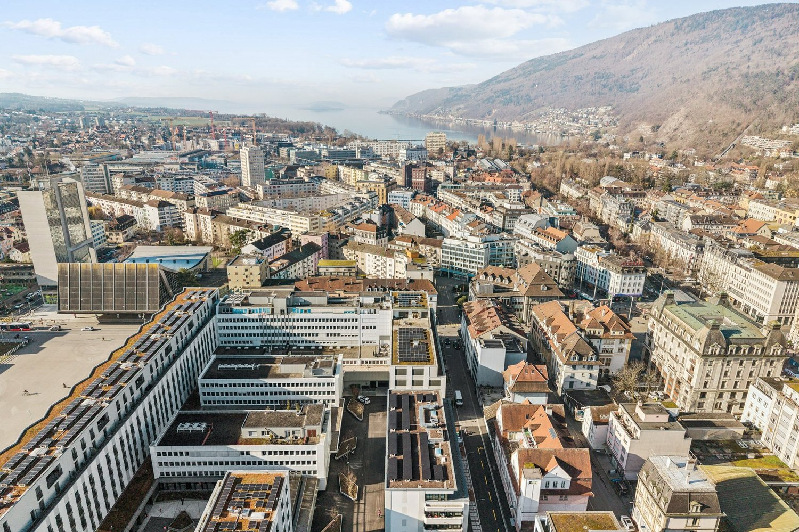
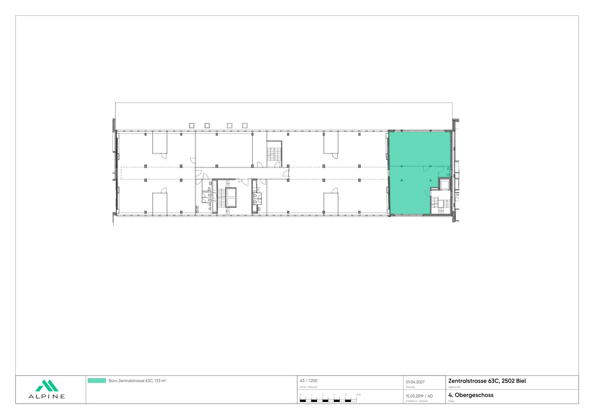

# Zentralstrasse 63 C, 2501 Biel/Bienne - CHF 240

> **Categorie:** `B_buero_gewerbe`  
> **Regiune:** Cantonul Berna  
> **Tip ofertă:** RENT / OFFICE  
> **Sursă:** [flatfox.ch](https://flatfox.ch/de/wohnung/zentralstrasse-63-c-2501-bielbienne/86045801/)  
> **Descărcat:** 2026-08-17 12:36

## Date obiect

| Câmp | Valoare |
|---|---|
| Adresă | Zentralstrasse 63 C, 2501 Biel/Bienne |
| Categorie obiect | INDUSTRY |
| Tip obiect | OFFICE |
| Chirie netă | CHF 240 |
| Chirie brută | CHF 240 |
| Preț afișat | CHF 240 |
| Suprafață utilă | 133 m² |
| Etaj | 4 |
| An construcție | 1970 |
| Disponibil de la | 2027-04-01 |
| Referință | 2863.4.1431 |

## Texte originale (germană)

**Titlu public:** Zentralstrasse 63 C, 2501 Biel/Bienne - CHF 240

**Titlu scurt:** 133m² Büro

**Pitch:** 133m² Büro in Biel/Bienne mieten

**Titlu descriere:** Ausgebaute Bürofläche an zentraler Lage

**Titlu chirie:** 133m² Büro in Biel/Bienne mieten

**Spațiu afișat:** 133

### Descriere completă

An zentraler Lage im Herzen von Biel, unmittelbar neben der Überbauung Centre Esplanade, steht diese kompakte, ausgebaute Bürofläche mit rund 133 m² im 4. Obergeschoss zur Vermietung. Die Räumlichkeiten sind funktional ausgebaut und bieten ideale Voraussetzungen für kleinere Unternehmen, Start-ups oder Projektteams.   
  
Die Fläche überzeugt durch einen praktischen Grundriss mit zwei Büroräumen, die sich flexibel nutzen lassen. Grosszügige Fenster sorgen für viel Tageslicht und schaffen eine angenehme Arbeitsumgebung.   
  
Weitere Vorteile:   
\- Bezugsbereite, ausgebaute Bürofläche   
\- Funktional ausgebaute Bürofläche   
\- Sanitäre Anlage direkt auf der Mietfläche   
  
Lage:   
\- Direkt neben dem Kongresshaus Biel   
\- Unmittelbare Nähe zum Bahnhof Biel sowie naheliegende Autobahnanschluss   
\- Hervorragende Erreichbarkeit mit öffentlichen und privaten Verkehrsmitteln   
\- Einkaufs, Gastronomie und Dienstleistungsangebote in unmittelbarer Nähe   
  
Unsere Geschäftsimmobilien verfügen über flexible Grundrisse und lassen sich ganz nach Ihren Bedürfnissen gestalten. Unser erfahrenes Team unterstützt Sie, gemeinsam mit unseren externen Partnern für Planung und Bau, bei der Realisierung Ihrer Vorstellungen.   
  
Alpine ist ein familiengeführtes Immobilienunternehmen mit Sitz in Zürich und Berlin. Als Bestandshalter sind wir spezialisiert auf Büro- und Geschäftshäuser im Umfeld internationaler Flughäfen. Von der Entwicklung über die Vermietung bis zur Bewirtschaftung von Immobilien bietet Alpine alle Dienstleistungen aus einer Hand an.   
  
Kontaktieren Sie uns und überzeugen Sie sich von unserem Angebot.   
*************************   
  
Situé en plein coeur de Bienne, juste à côté du complexe Centre Esplanade, cet espace de bureaux compact et aménagé d'environ 133 m² est à louer au 4e étage. Les locaux sont aménagés de manière fonctionnelle et offrent des conditions idéales pour les petites entreprises, les start-ups ou les équipes de projet.   
  
L'espace séduit par son agencement pratique comprenant deux bureaux pouvant être utilisés de manière flexible. De grandes fenêtres laissent entrer beaucoup de lumière naturelle et créent un environnement de travail agréable.   
  
Autres avantages:   
\- Espace de bureau aménagé, prêt à être occupé   
\- Espace de bureau aménagé de manière fonctionnelle   
\- Sanitaires directement sur la surface louée   
  
Situation:   
\- Juste à côté du Palais des Congrès de Bienne   
\- À proximité immédiate de la gare de Bienne et d'un accès autoroutier   
\- Excellente accessibilité en transports publics et privés   
\- Commerces, restaurants et services à proximité immédiate   
  
Nos immeubles commerciaux disposent de plans d'étage flexibles et peuvent être aménagés entièrement selon vos besoins. Notre équipe expérimentée, en collaboration avec nos partenaires externes spécialisés dans la planification et la construction, vous accompagne dans la concrétisation de vos projets.   
  
Alpine est une société immobilière familiale basée à Zurich et à Berlin. En tant que gestionnaire de portefeuille, nous sommes spécialisés dans les immeubles de bureaux et commerciaux situés à proximité d'aéroports internationaux. Du développement à la gestion immobilière en passant par la location, Alpine propose tous les services sous un même toit.   
  
Contactez-nous et découvrez notre offre.

## Dotări (attributes)

- accessiblewithwheelchair
- parkingspace
- garage
- view
- lift

## Ofertant

- **Nume:** Alpine Immobilien AG
- **Stradă:** Sägereistrasse 25
- **NPA:** 8152
- **Localitate:** Glattbrugg

## Imagini (8)

*`01.jpg` — 1500x1000 px*

*`02.jpg` — 1500x1000 px*

*`03.jpg` — 1500x1000 px*

*`04.jpg` — 1500x1000 px*

*`05.jpg` — 1500x1000 px*

*`06.jpg` — 1500x1000 px*

*`07.jpg` — 1500x999 px*

*`08.jpg` — 1500x1060 px*
