# Zentralstrasse 63, 2501 Biel/Bienne - CHF 220

> **Categorie:** `B_buero_gewerbe`  
> **Regiune:** Cantonul Berna  
> **Tip ofertă:** RENT / OFFICE  
> **Sursă:** [flatfox.ch](https://flatfox.ch/de/wohnung/zentralstrasse-63-2501-bielbienne/86045802/)  
> **Descărcat:** 2026-08-17 12:29

## Date obiect

| Câmp | Valoare |
|---|---|
| Adresă | Zentralstrasse 63, 2501 Biel/Bienne |
| Categorie obiect | INDUSTRY |
| Tip obiect | OFFICE |
| Chirie netă | CHF 220 |
| Chirie brută | CHF 220 |
| Preț afișat | CHF 220 |
| Suprafață utilă | 771 m² |
| Etaj | 1 |
| An construcție | 1970 |
| Disponibil de la | 2027-04-01 |
| Referință | 2863.1.1102 |

## Texte originale (germană)

**Titlu public:** Zentralstrasse 63, 2501 Biel/Bienne - CHF 220

**Titlu scurt:** 771m² Büro

**Pitch:** 771m² Büro in Biel/Bienne mieten

**Titlu descriere:** Bürofläche an erstklassiger Lage

**Titlu chirie:** 771m² Büro in Biel/Bienne mieten

**Spațiu afișat:** 771

### Descriere completă

An erstklassiger Lage im Herzen von Biel, unmittelbar neben der Überbauung Centre Esplanade, steht diese attraktive Bürofläche mit rund 771 m² im 1. Obergeschoss zur Vermietung. Die Räumlichkeiten sind vollständig ausgebaut und per 1. April 2027 bezugsbereit.   
  
Die offene Raumstruktur ermöglicht eine flexible und individuelle Gestaltung von modernen Open Space Lösungen über Teamzonen bis hin zu abgetrennten Besprechungsräumen sowie Einzelbüros. Teilweise sind bereits Sitzungszimmer vorhanden. Dank durchgehender Oblichter profitiert die gesamte Fläche von zusätzlichem natürlichem Tageslicht, was eine angenehme Arbeitsatmosphäre schafft. Die Bürofläche verfügt über zwei Zugänge über das Treppenhaus und ist somit von beiden Seiten erschlossen.   
  
Brauchen Sie zusätzliche Bürofläche?   
In derselben Liegenschaft stehen folgende Büroflächen, ebenfalls per 01.04.2027, zur Verfügung:   
\- ca. 258 m2 im 2. OG*   
\- ca. 133 m2 im 4. OG   
  
*Die Flächen im 1. und 2. Obergeschoss (771 m² und 258 m²) können bei Bedarf gemeinsam gemietet und mittels einem Durchbruch miteinander verbunden werden.   
  
Weitere Vorteile:   
\- Bezugsbereite, ausgebaute Bürofläche (inkl.Sanitäre Anlagen direkt auf der Mietfläche)   
\- Vollausgebaute Teeküche inkl. Aufenthaltsraum   
\- Gepflegte Liegenschaft mit angenehmem Arbeitsumfeld   
  
Lage:   
\- Direkt neben dem Kongresshaus Biel   
\- Unmittelbare Nähe zum Bahnhof Biel sowie naheliegendem Autobahnanschluss   
\- Hervorragende Erreichbarkeit mit öffentlichen und privaten Verkehrsmitteln   
\- Einkaufs-, Gastronomie- und Dienstleistungsangebote in unmittelbarer Nähe   
  
Diese Fläche überzeugt durch die Funktionalität, Flexibilität und Komfort. Ideal für Unternehmen, die eine zentrale Lage und vielseitig nutzbare Arbeitsräume schätzen. Verschaffen Sie sich mit Hilfe des 360 Rundgangs einen ersten Eindruck dieser Fläche.   
  
Unsere Geschäftsimmobilien verfügen über flexible Grundrisse und lassen sich ganz nach Ihren Bedürfnissen gestalten. Unser erfahrenes Team unterstützt Sie, gemeinsam mit unseren externen Partnern für Planung und Bau, bei der Realisierung Ihrer Vorstellungen.   
  
Alpine ist ein familiengeführtes Immobilienunternehmen mit Sitz in Zürich und Berlin. Als Bestandshalter sind wir spezialisiert auf Büro- und Geschäftshäuser im Umfeld internationaler Flughäfen. Von der Entwicklung über die Vermietung bis zur Bewirtschaftung von Immobilien bietet Alpine alle Dienstleistungen aus einer Hand an.   
  
Kontaktieren Sie uns und überzeugen Sie sich von unserem Angebot.   
*************************   
  
Situé dans un emplacement de premier choix au coeur de Bienne, cet espace de bureaux attrayant d'environ 771 m² est à louer au 1er étage. Les locaux, entièrement aménagés et disponibles dès le 1er avril 2027, offrent une grande flexibilité d'aménagement avec des espaces ouverts, bureaux individuels et salles de réunion déjà partiellement disponibles. Grâce aux lucarnes sur toute la longueur, la surface bénéficie d'une belle luminosité naturelle et d'une atmosphère de travail agréable. L'espace dispose également de deux accès par la cage d'escalier.   
  
Des surfaces supplémentaires sont disponibles dans le même immeuble dès le 01.04.2027: env. 258 m² au 2e étage et env. 133 m² au 4e étage. Les surfaces des 1er et 2e étages peuvent être reliées si nécessaire.   
  
L'espace comprend un coin cuisine équipé avec salle de détente ainsi que des installations sanitaires directement sur la surface. L'immeuble, bien entretenu, se situe juste à côté du Palais des Congrès, à proximité immédiate de la gare de Bienne et de l'autoroute, avec commerces et restaurants à quelques pas.   
  
Découvrez cet espace grâce à la visite virtuelle à 360.   
  
Notre team expérimenté vous soutient, en collaboration avec nos partenaires externes pour la réalisation de la planification et de la construction, dans la réalisation de vos idées. Contactez-nous et laissez-vous convaincre par notre offre.

## Dotări (attributes)

- accessiblewithwheelchair
- parkingspace
- garage
- view
- lift

## Ofertant

- **Nume:** Alpine Immobilien AG
- **Stradă:** Sägereistrasse 25
- **NPA:** 8152
- **Localitate:** Glattbrugg

## Imagini (13)

*`01.jpg` — 1500x1000 px*

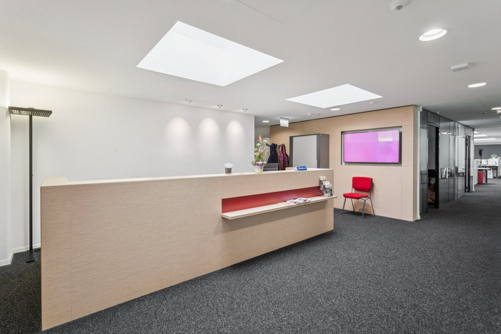
*`02.jpg` — 1500x1000 px*

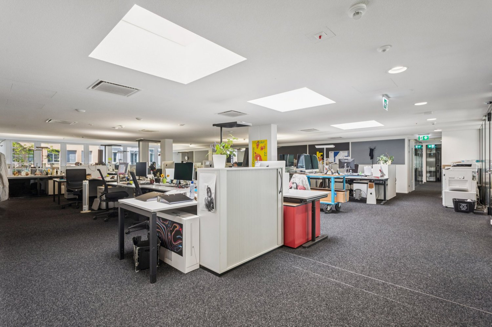
*`03.jpg` — 1500x1000 px*

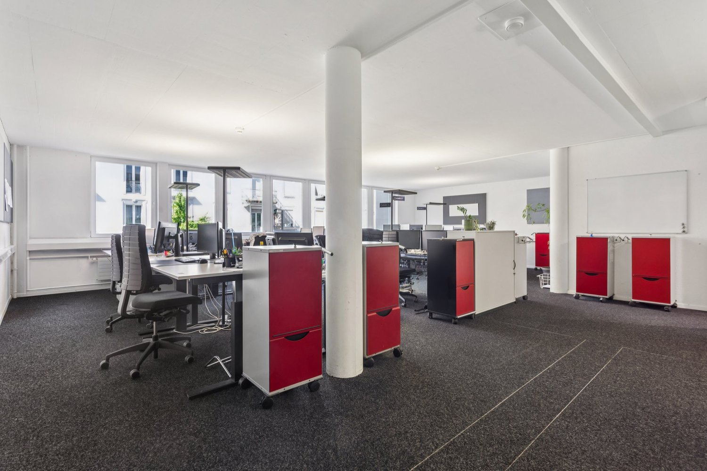
*`04.jpg` — 1500x1000 px*

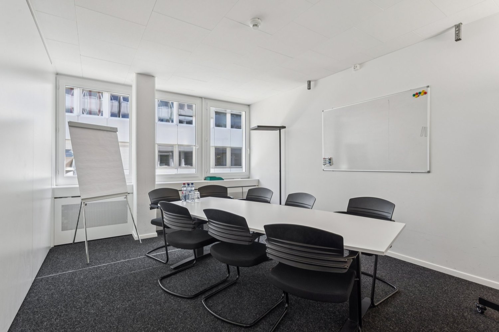
*`05.jpg` — 1500x1000 px*

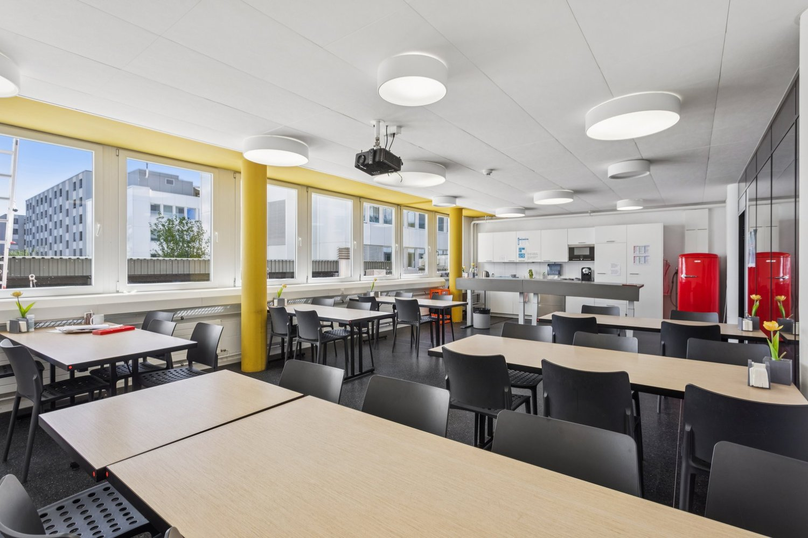
*`06.jpg` — 1500x1000 px*

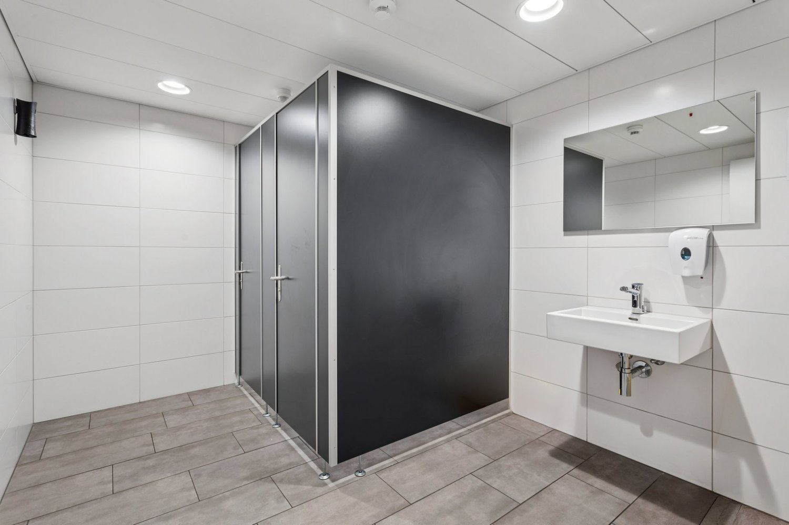
*`07.jpg` — 1500x1000 px*

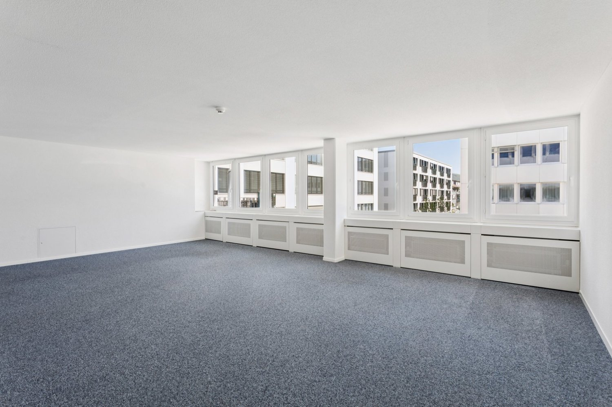
*`08.jpg` — 1500x1000 px*

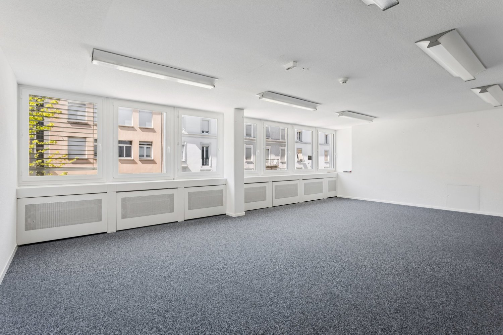
*`09.jpg` — 1500x1000 px*

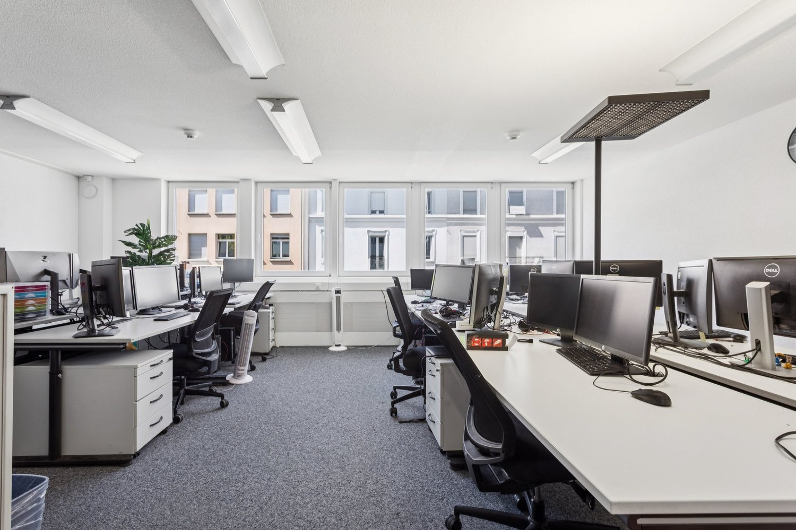
*`10.jpg` — 1500x1000 px*

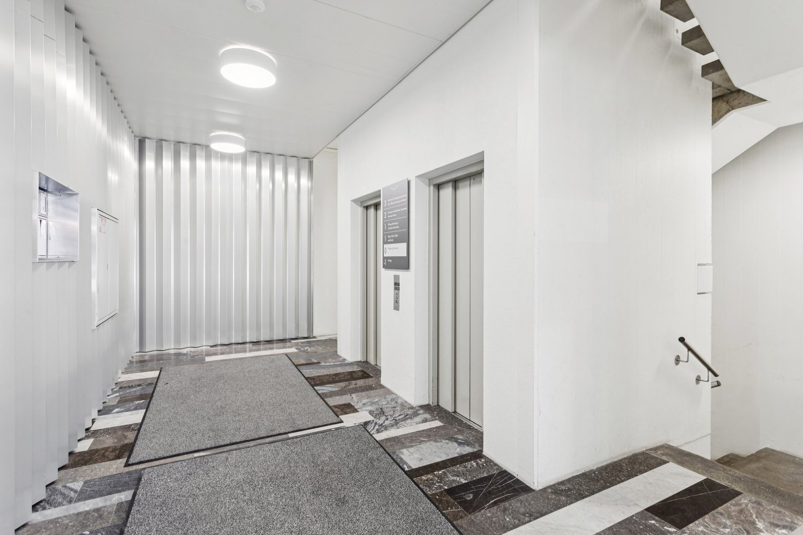
*`11.jpg` — 1500x1000 px*

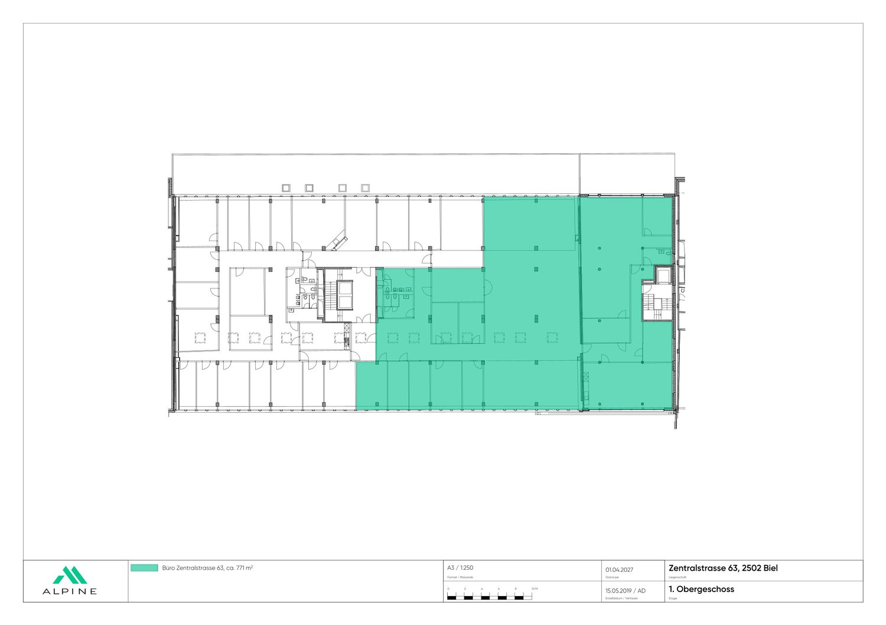
*`12.jpg` — 1500x1060 px*

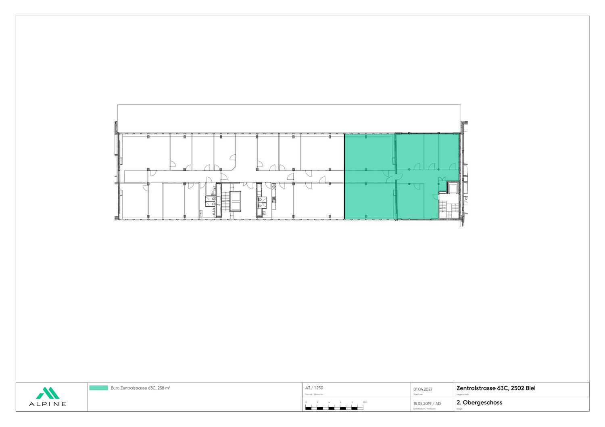
*`13.jpg` — 1500x1060 px*

## Media suplimentară

- **tour_url:** https://my.matterport.com/show/?m=caEwgJsN2o9
