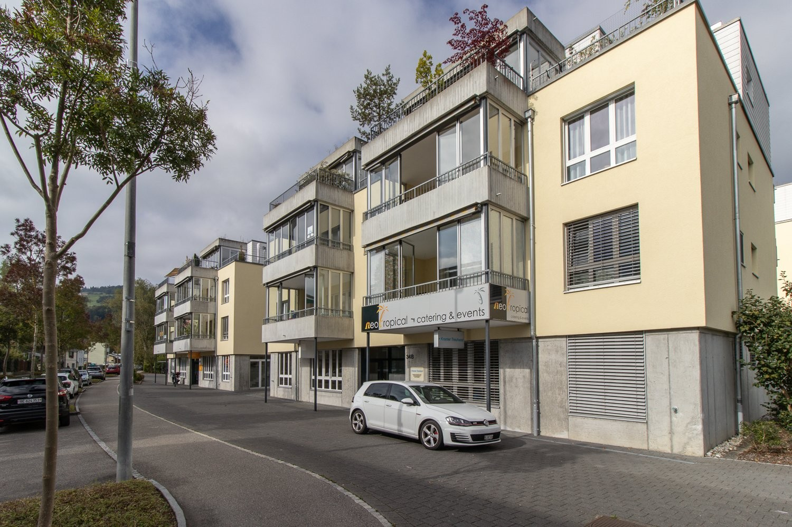
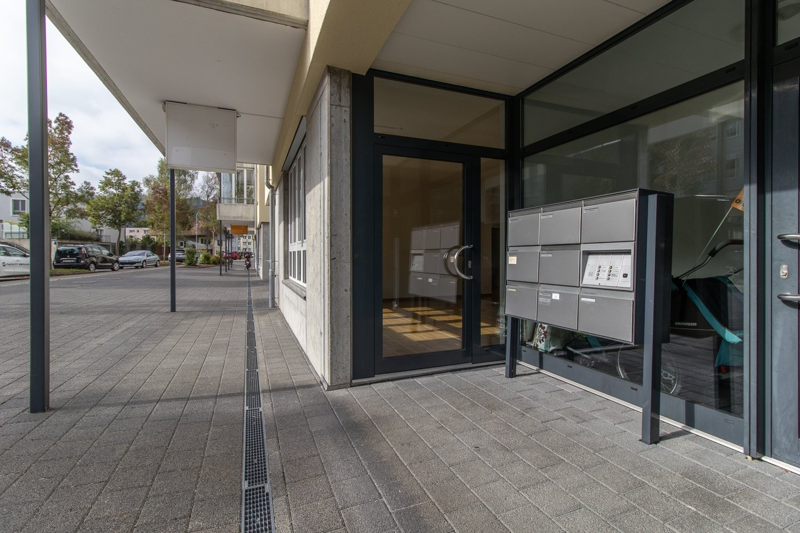
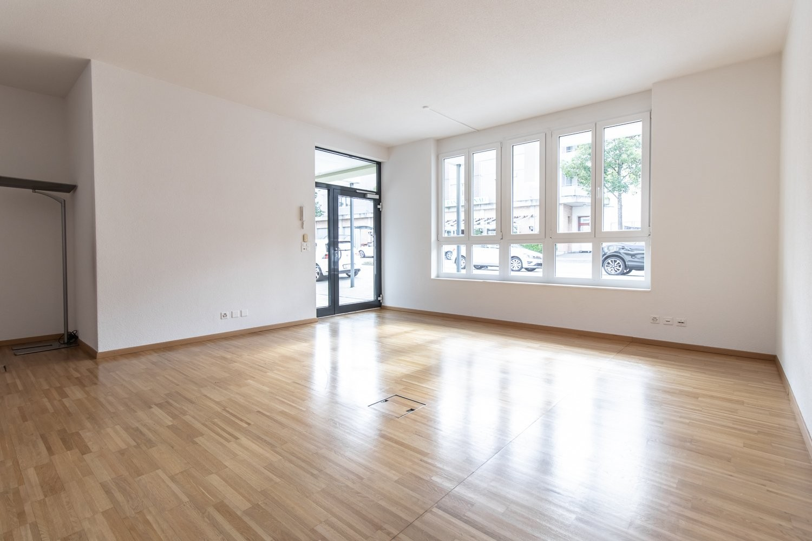
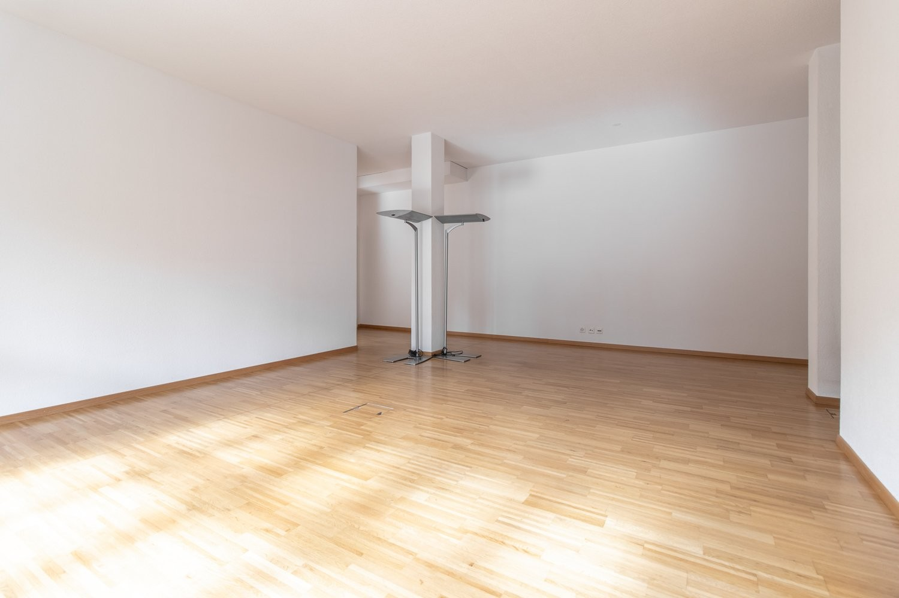
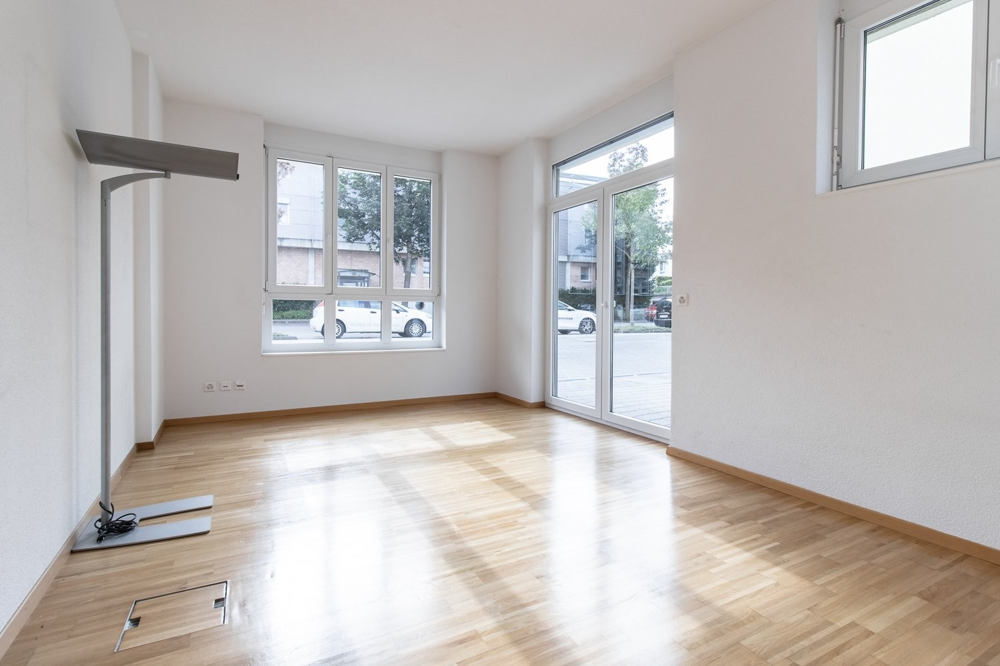
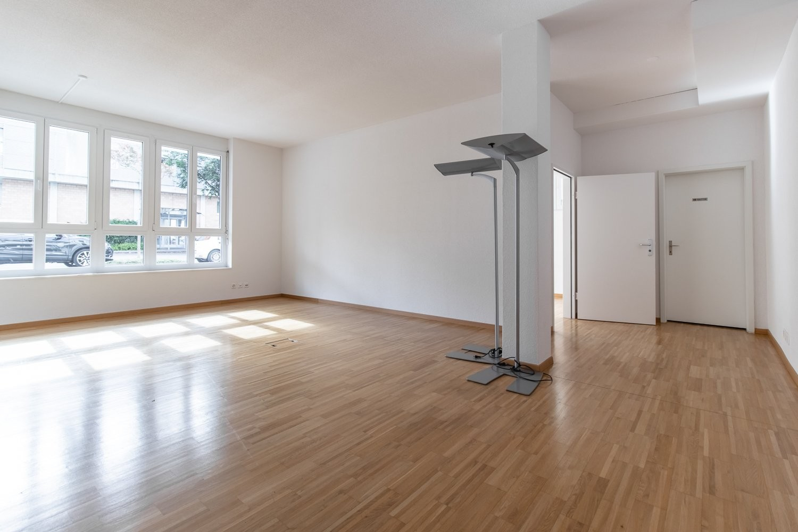
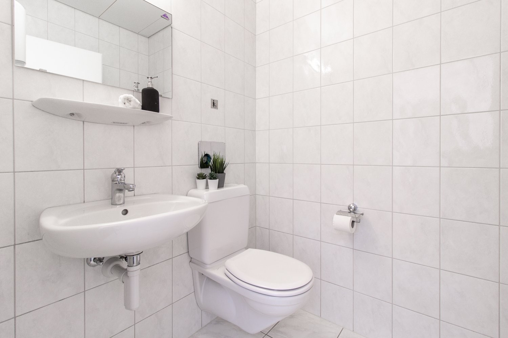
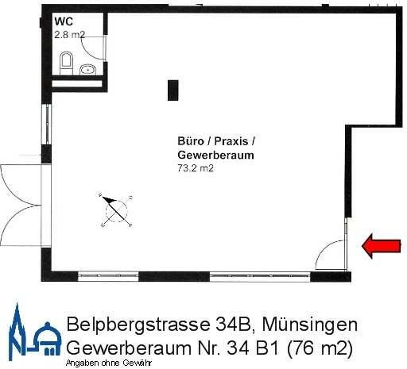

# Belpbergstrasse 34b, 3110 Münsingen - CHF 995 inkl. NK pro Monat

> **Categorie:** `B_buero_gewerbe`  
> **Regiune:** Cantonul Berna  
> **Tip ofertă:** RENT / OFFICE  
> **Relevant pentru praxis:** da (arztpraxis)  
> **Sursă:** [flatfox.ch](https://flatfox.ch/de/wohnung/belpbergstrasse-34b-3110-munsingen/86048679/)  
> **Descărcat:** 2026-08-17 12:35

## Date obiect

| Câmp | Valoare |
|---|---|
| Adresă | Belpbergstrasse 34b, 3110 Münsingen |
| Categorie obiect | INDUSTRY |
| Tip obiect | OFFICE |
| Chirie netă | CHF 775 |
| Nebenkosten | CHF 220 |
| Chirie brută | CHF 995 |
| Preț afișat | CHF 995 |
| Suprafață utilă | 76 m² |
| Etaj | 0 |
| An construcție | 2002 |
| Disponibil de la | 2026-10-01 |
| Referință | 21540..2001 |

## Texte originale (germană)

**Titlu public:** Belpbergstrasse 34b, 3110 Münsingen - CHF 995 inkl. NK pro Monat

**Titlu scurt:** 76m² Büro

**Pitch:** 76m² Büro in Münsingen mieten

**Titlu descriere:** Moderner Gewerberaum in Münsingen gesucht?

**Titlu chirie:** 76m² Büro in Münsingen mieten

**Spațiu afișat:** 76

### Descriere completă

Wir vermieten per 01.10.2026 oder nach Vereinbarung einen heller Raum (73 m2) mit Tageslicht auf Strassenniveau. Das Objekt bietet folgende Vorzüge:   
  
\- Ausbau mit einem hellen Parkettboden   
\- kleines Badezimmer mit Toilette   
\- Quartier mit vielen Familien und Ihren neuen Kunden   
  
Dieser Raum eignet sich ideal für ein Verkaufsladen sowie für eine Arztpraxis, ein Kosmetik- oder Beauty-Studio und weitere Dienstleistungsangebote.   
  
Münsingen liegt im idyllischen Aaretal zwischen Thun und Bern und zählt über 10‘000 Einwohner. Die Gemeinde vereint Industrie, Gewerbe und Landwirtschaft und überzeugt trotz moderner Neubauten mit sichtbarem ländlichem Charme.   
Das Objekt befindet sich in einem familienfreundlichen Quartier mit entsprechendem Kundenpotenzial.   
  
Haben wir Ihr Interesse geweckt? Gerne Können Sie uns kontaktieren, um einen Besichtigungstermin zu vereinbaren.   
  
  
Links   
www.niederer.com   
www.terra-domus.ch   
www.muensingen.ch   
www.be.ch

## Dotări (attributes)

- lift

## Ofertant

- **Nume:** Niederer AG Filiale Thun

## Imagini (8)

*`01.jpg` — 1500x1000 px — IMG_9878 haus*

*`02.jpg` — 1500x1000 px — Eingang*

*`03.jpg` — 1500x1000 px — Sicht Richtung Fenster/Eingang*

*`04.jpg` — 1500x1000 px — Sicht vom Eingang*

*`05.jpg` — 1500x1000 px — Abgetrennter Raum*

*`06.jpg` — 1500x1000 px — IMG_9873*

*`07.jpg` — 1500x1000 px — Toilette*

*`08.jpg` — 512x465 px — Grundriss*

## Media suplimentară

- **tour_url:** https://www.niederer.com/360/Belpbergstrasse_34B_M%C3%BCnsingen_Gewerbe_EG/2001/Index.html
