# Weibelackerweg 3, 4914 Roggwil - CHF 530 inkl. NK pro Monat

> **Categorie:** `B_buero_gewerbe`  
> **Regiune:** Cantonul Berna  
> **Tip ofertă:** RENT / COMMERCIAL  
> **Relevant pentru praxis:** da (praxisraum)  
> **Sursă:** [flatfox.ch](https://flatfox.ch/de/wohnung/weibelackerweg-3-4914-roggwil/86055759/)  
> **Descărcat:** 2026-08-17 12:26

## Date obiect

| Câmp | Valoare |
|---|---|
| Adresă | Weibelackerweg 3, 4914 Roggwil |
| Categorie obiect | INDUSTRY |
| Tip obiect | COMMERCIAL |
| Nebenkosten | CHF 110 |
| Chirie brută | CHF 530 |
| Preț afișat | CHF 530 |
| Suprafață utilă | 50 m² |
| Etaj | -1 |
| An construcție | 1908 |
| An renovare | 2026 |
| Disponibil de la | imm |

## Texte originale (germană)

**Titlu public:** Weibelackerweg 3, 4914 Roggwil - CHF 530 inkl. NK pro Monat

**Titlu scurt:** 50m² Gewerbe

**Pitch:** 50m² Gewerbe in Roggwil mieten

**Titlu descriere:** Klimaanlage: vielseitige Atelier/Gewerbe-/Hobbyfläche (ca. 50 m²) in Roggwil - zusätzliche Wohnmöglichkeiten im selben Haus

**Titlu chirie:** 50m² Gewerbe in Roggwil mieten

**Spațiu afișat:** 50

### Descriere completă

Diese attraktive und frisch teilrenovierte Gewerbe-/Hobbyfläche im Untergeschoss bietet mit einer **Gesamtfläche von 49,7 m²** den perfekten Rahmen für Ihre geschäftlichen oder privaten Pläne. Ob als ruhiges Büro/Homeoffice, kreatives Studio, Praxisraum, stilles Gewerbe oder privater Hobby- und Lagerraum - hier profitieren Sie von einem modernen Ausbau, viel Platz und maximaler Flexibilität.  
  
**Nutzung:** Diese Fläche ist ideal auf die geschäftliche oder private Nutzung ausgerichtet und steht exklusiv als Arbeits-, Gewerbe- oder Hobbyraum (ohne Wohnsitzbegründung) zur Verfügung. Die ca. 50 m² teilen sich perfekt auf in einen grosszügigen Hauptraum (Atelier mit 27,7 m²), einen eigenen Küchen-/Essbereich (11,9 m²), ein separates WC (6,4 m²) sowie ein einladendes Entrée (3,7 m²).  
  
**HIGHLIGHTS**  
  

*   **Separater Zugang:** Absolute Privatsphäre und Unabhängigkeit dank einem eigenen Eingang direkt von aussen über die Treppe.
*   **Optimales Raumklima:** Durch die Lage im Untergeschoss bleibt die Fläche auch an heissen Sommertagen natürlich und angenehm kühl. Für zusätzliche individuelle Wohlfühltemperatur sorgt die fest installierte Split-Klimaanlage.
*   **Ruhiges Umfeld:** Ein ungestörtes und fokussiertes Arbeiten oder Ausüben des Hobbys ist hier jederzeit garantiert.
*   **Infrastruktur direkt vor der Tür:** Der grosszügige, überdachte Unterstand und Aussenbereich liegt direkt neben dem Objekt.
*   **Nachhaltige Haustechnik:** Ökologische und kosteneffiziente Wärmepumpentechnologie hält die Nebenkosten stabil.
*   **Highspeed-Internet:** Die Gemeinde plant aktuell die Glasfasererschliessung für die Liegenschaft - beste Voraussetzungen für reibungsloses Arbeiten und Cloud-Anwendungen.
*   **Haustiere:** Nach Absprache (z. B. als Begleitung im Büro) erlaubt.

**LAGE & ERREICHBARKEIT (WIRTSCHAFTSREGION)**  
  

*   **Perfekt für Kunden & Partner:** Die regionalen Wirtschaftszentren sind in wenigen Autominuten schnell erreicht:
*   **Unter 10 Min.:** Aarwangen (5 Min.), Wynau (5 Min.), St. Urban (6 Min.), Langenthal (7 Min.) und Murgenthal (9 Min.).
*   **In 10-15 Min.:** Rothrist (11 Min.) und Niederbipp (15 Min.).
*   **Unter 20 Min.:** Oensingen (16 Min.) und Dagmersellen (18 Min.).
*   **In ca. 20 Min.:** Olten (20 Min.) und Zofingen (21 Min.).
*   **Grosstadtanbindung:** Ideale Erreichbarkeit über den nahen Autobahnanschluss A1 nach Bern (ca. 45 Min.), Basel (ca. 45 Min.) und Zürich (ca. 50 Min.). Der Bahnhof Roggwil ist bequem zu Fuss erreichbar.

**KONDITIONEN**  
  

*   **Monatsmiete:** CHF 530.- Brutto (aufgeteilt in CHF 420.- Netto + CHF 110.- Nebenkosten).
*   **Parken:** Ein Abstellplatz direkt vor dem Haus kann für CHF 50.-/Monat dazu gemietet werden.
*   **Bezug:** Per sofort oder nach Vereinbarung.

Gerne zeigen wir Ihnen die Räumlichkeiten gerne persönlichen. Wir freuen uns auf Ihre Kontaktaufnahme!  
  
**Wohnen & Arbeiten kombinieren:**  
Suchen Sie den perfekten Ort, um Arbeiten, Freizeit und Wohnen ideal zu verbinden? Neben dieser flexibel nutzbaren Gewerbe- und Hobbyfläche bieten wir im 1. Oberschoss zeitgleich attraktive Wohnungen zur Miete **CHF 1'395.- inkl. Nebenkosten** an. Die Einheiten verfügen über jeweils 3.5 Zimmer mit grosszügigen Raumhöhen, die für ein modernes und luftiges Wohngefühl auf 60 m² Wohnfläche sorgen.  
  
**Ihre Vorteile im Überblick:**  
  

*   **Klimaanlage & Raumklima**: Dank den installierten Klimaanlagen geniessen Sie hier selbst bei heissen Aussentemperaturen stets angenehm kühle und perfekt temperierte Räume.
*   **Moderne Ausstattung**: Die Küchen der Wohnungen sind mit komfortablen Geschirrspülern ausgestattet. Im Keller stehen zudem moderne Waschmaschinen und Trockner zur Mitbenutzung bereit.
*   **Gemeinschaft & Aussenbereich**: Ein gemeinsamer Sitzplatz im Freien lädt zu erholsamen Stunden und gemütlichem Beisammensein ein.
*   **Parkplätze & Haustiere**: Für Ihre Fahrzeuge sind Parkplätze direkt bei der Liegenschaft vorhanden. Zudem sind Ihre geliebten Haustiere in den Wohnungen herzlich willkommen.

Nutzen Sie diese seltene Gelegenheit, Ihr Gewerbe oder Hobby direkt mit einem neuen Zuhause am selben Standort zu kombinieren. Für nähere Angaben stehen wir Ihnen gerne zur Verfügung.

## Dotări (attributes)

- parkingspace
- dishwasher
- cable
- parquetflooring
- tumbler
- washingmachine
- petsallowed

## Imagini (14)

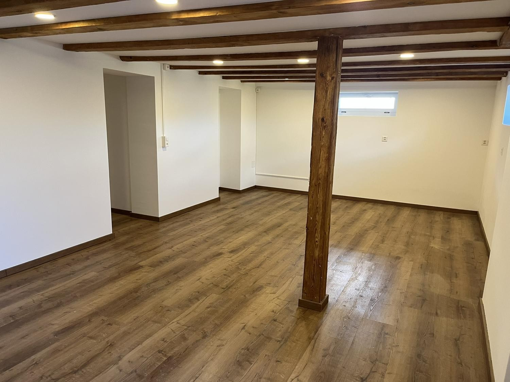
*`01.jpg` — 1500x1125 px — Atelier: Viel Platz für Ihre Ideen: Frisch teilrenovierter, heller Atelier- und Arbeitsraum mit gemütlichem Charme im Untergeschoss*

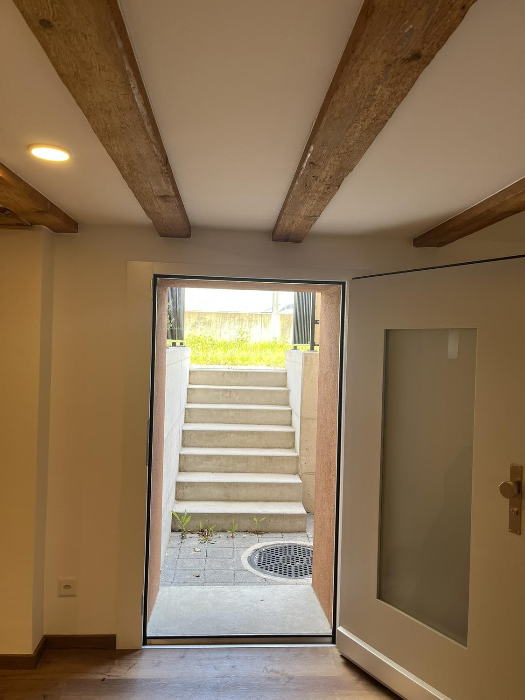
*`02.jpg` — 1125x1500 px — Atelier: Separater Eingang für Sie und Ihre Kunden – direkt neben dem überdachten Aussenbereich*

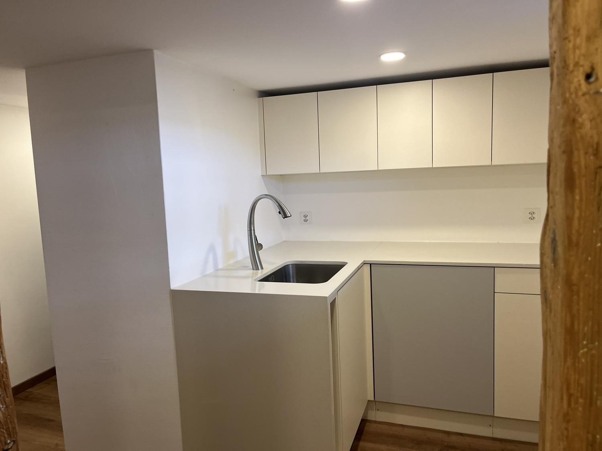
*`03.jpg` — 1500x1125 px — Atelier: Praktisch und modern: Die separate Küche bietet zusätzlichen Komfort direkt in Ihrer Gewerbeeinheit*

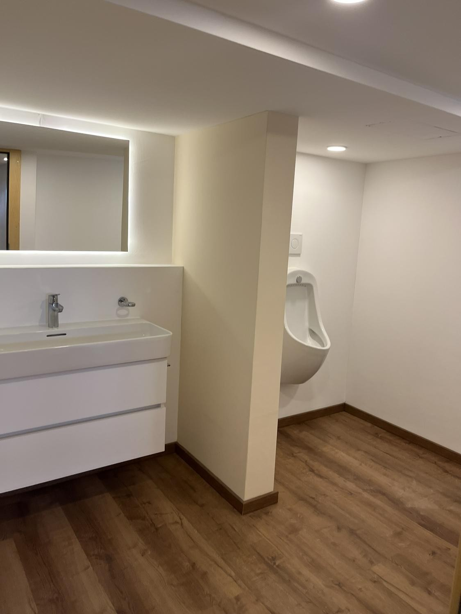
*`04.jpg` — 1125x1500 px — Atelier: Moderner Sanitärbereich direkt auf der Fläche – ideal für die geschäftliche oder private Nutzung*

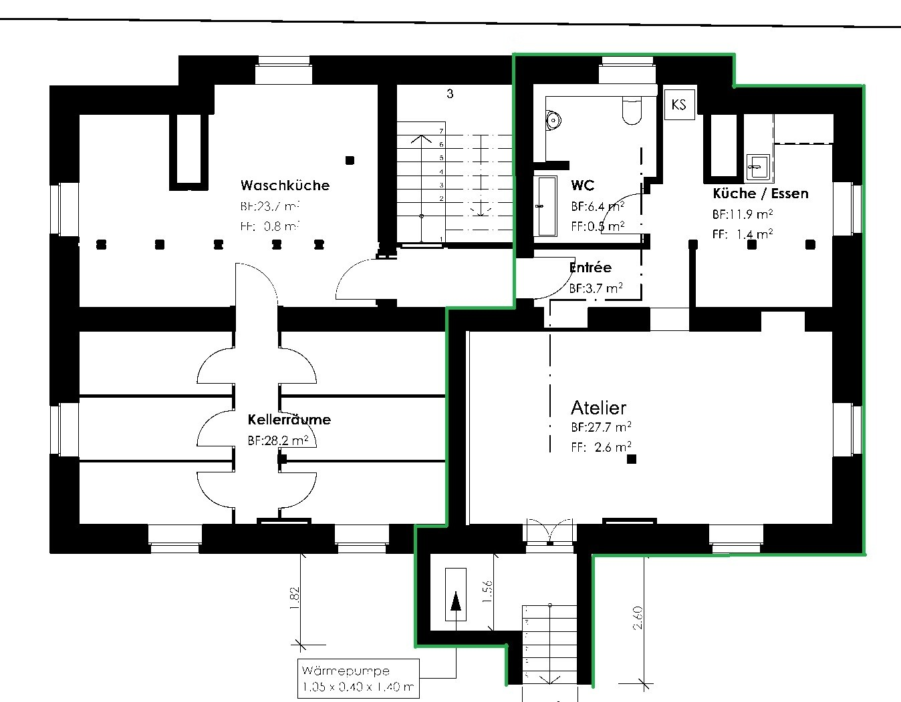
*`05.jpg` — 1348x1052 px — Viel Platz für Ihre Hobbys: Grosszügige Kellerräume, moderne Waschküche und optional zumietbares Atelier mit eigener Infrastruktur.*

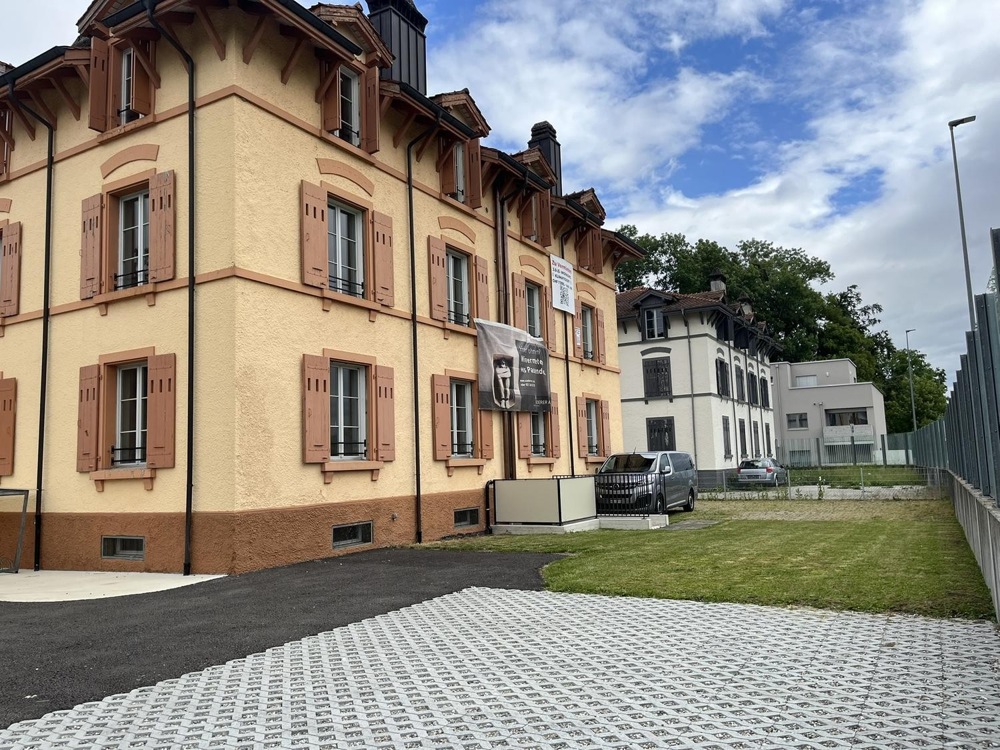
*`06.jpg` — 1500x1125 px — Die gepflegte gemeinschaftliche Gartenanlage lädt zu entspannten Stunden im Freien ein.*

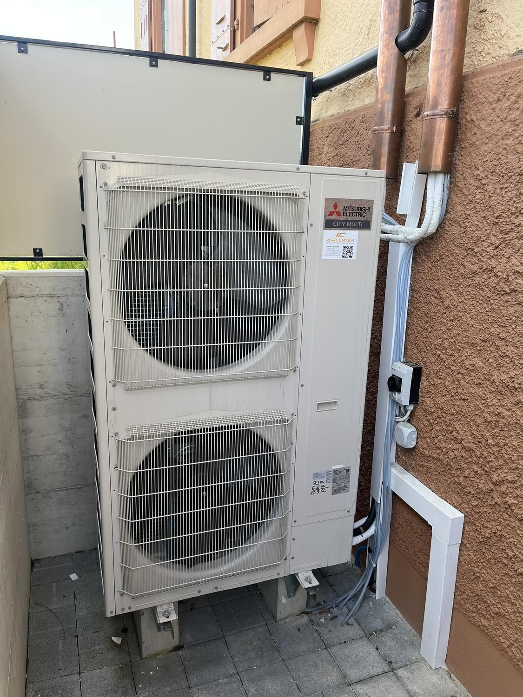
*`07.jpg` — 1125x1500 px — Effiziente Mitsubishi-Wärmepumpe für Heizung und Kühlung*

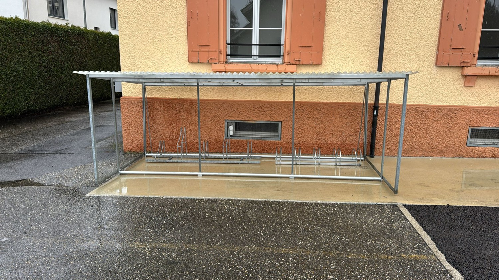
*`08.jpg` — 1500x844 px — Sicher und trocken: Grosszügiger, überdachter Abstellplatz für Velos und E-Bikes direkt bei der Liegenschaft.*

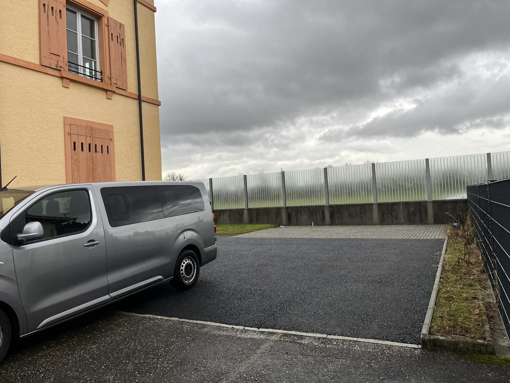
*`09.jpg` — 1500x1125 px — Bequemer geht es nicht: Ihr reservierter Aussenparkplatz direkt vor dem Hauseingang.*

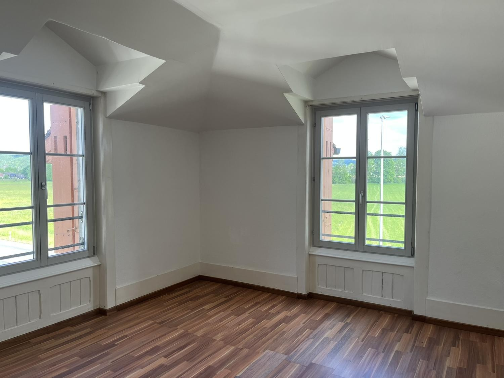
*`10.jpg` — 1500x1125 px — Wohnungen: Lichtdurchflutetes Wohnzimmer mit Weitblick ins Grüne*

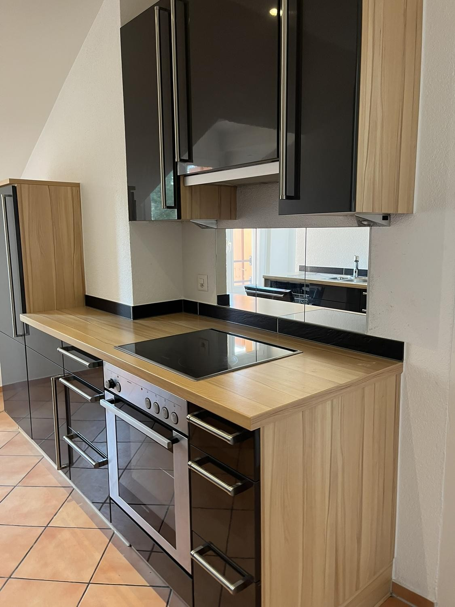
*`11.jpg` — 1125x1500 px — Wohnungen: Moderne Hochwert-Küche mit viel Stauraum und Glaskeramik*

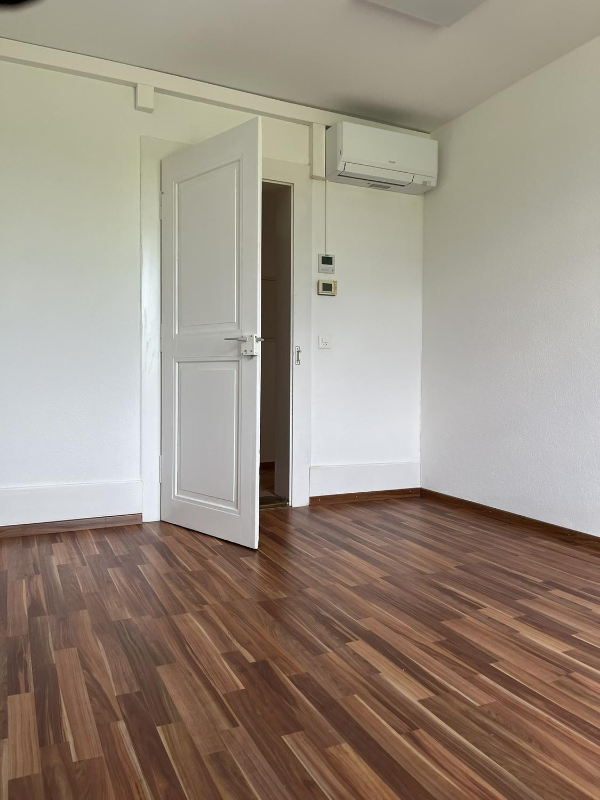
*`12.jpg` — 1125x1500 px — Wohnungen: Immer die perfekte Temperatur – fest installierte Klimatisierung*

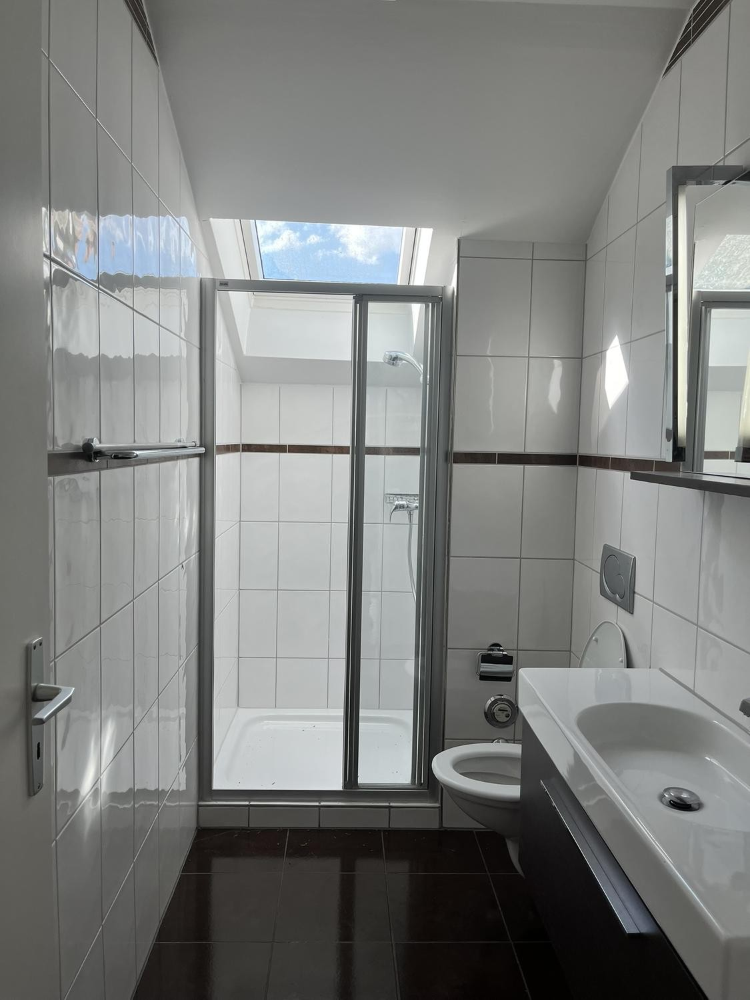
*`13.jpg` — 1125x1500 px — Wohnungen: Frisch saniertes Tageslicht-Bad mit moderner Dusche*

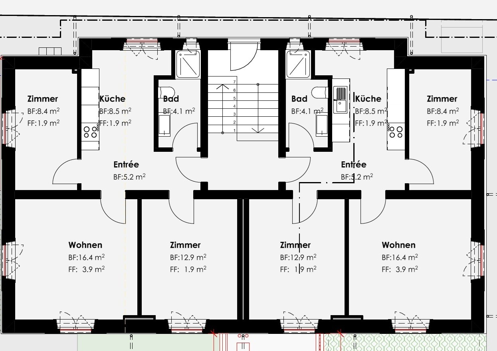
*`14.jpg` — 1245x881 px — Durchdachte 3.5-Zimmer-Raumaufteilung: Helles Wohnen (16.4 m²) mit grosser Fensterfront und zwei separat zugänglichen Zimmern.*
