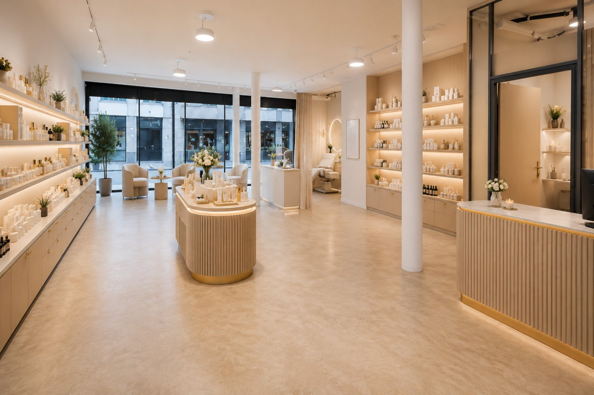
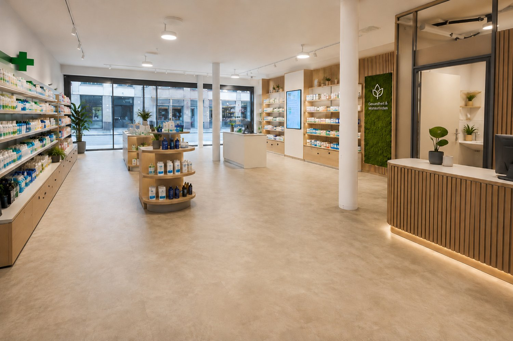
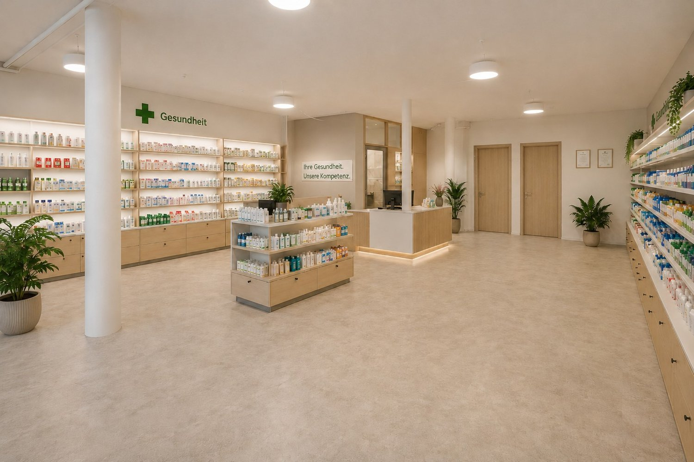
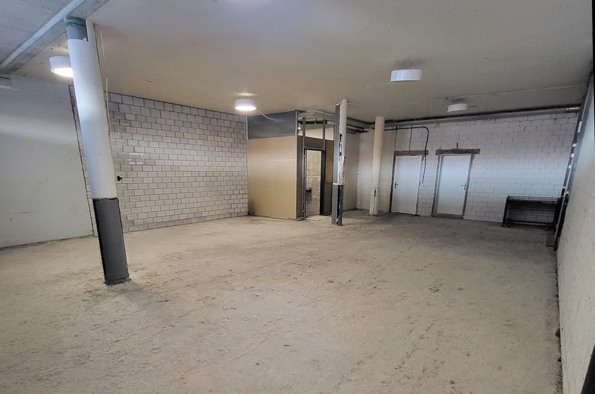
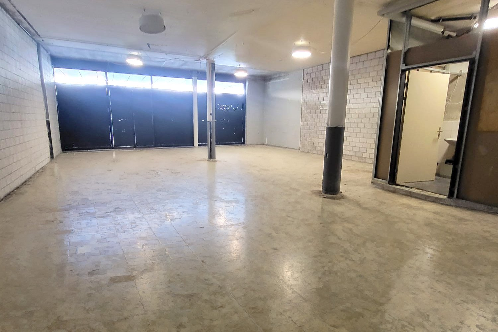
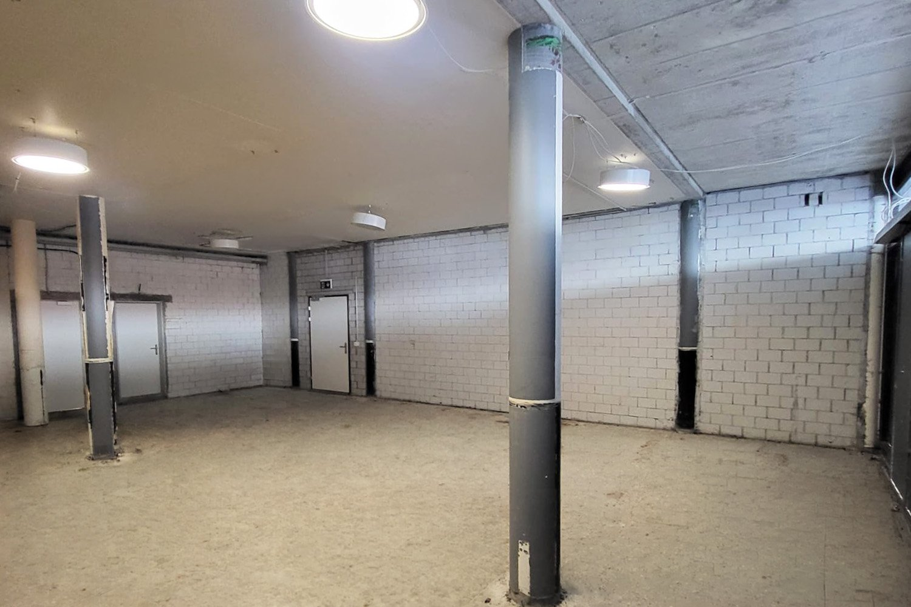
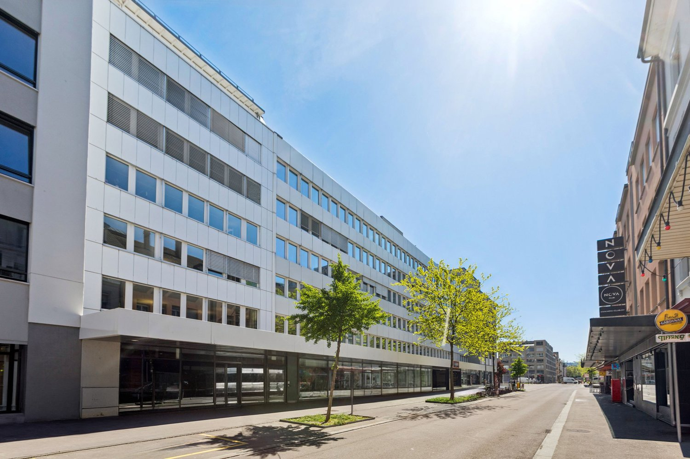
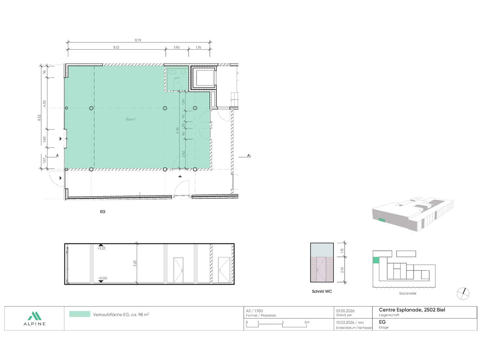

# Zentralstrasse 63 C, 2501 Biel/Bienne - CHF 280

> **Categorie:** `B_buero_gewerbe`  
> **Regiune:** Cantonul Berna  
> **Tip ofertă:** RENT / SHOP  
> **Relevant pentru praxis:** da (praxis)  
> **Sursă:** [flatfox.ch](https://flatfox.ch/de/wohnung/zentralstrasse-63-c-2501-bielbienne/86067475/)  
> **Descărcat:** 2026-08-17 12:27

## Date obiect

| Câmp | Valoare |
|---|---|
| Adresă | Zentralstrasse 63 C, 2501 Biel/Bienne |
| Categorie obiect | INDUSTRY |
| Tip obiect | SHOP |
| Chirie netă | CHF 280 |
| Chirie brută | CHF 280 |
| Preț afișat | CHF 280 |
| Suprafață utilă | 98 m² |
| Etaj | 0 |
| An construcție | 1970 |
| Disponibil de la | imm |
| Referință | 2863.4.1030 |

## Texte originale (germană)

**Titlu public:** Zentralstrasse 63 C, 2501 Biel/Bienne - CHF 280

**Titlu scurt:** 98m² Ladenfläche

**Pitch:** 98m² Ladenfläche in Biel/Bienne mieten

**Titlu descriere:** Sanierte Verkaufsfläche an zentraler Lage im Herzen von Biel

**Titlu chirie:** 98m² Ladenfläche in Biel/Bienne mieten

**Spațiu afișat:** 98

### Descriere completă

An bester Passantenlage, an der Zentralstrasse, direkt beim Kongresshaus Biel, steht diese vielseitig nutzbare Verkaufsfläche zur Vermietung. Die 98m² grosse Fläche wird im Rohbauzustand übergeben. Dank des Rohbauzustandes können Ausstattung und Design optimal für einen individuellen Ausbau und ganz nach Ihren eigenen Bedürfnissen und Geschäftskonzept abgestimmt werden. Eine Toilette ist bereits vollständig ausgebaut vorhanden. Die Räumlichkeiten bieten maximale Flexibilität für unterschiedlichste Nutzungen.   
Nutzen Sie diese einzigartige Chance, Ihre Geschäftsidee an zentraler Lage in Biel zu realisieren und werden Sie Teil einer nachbarschaftlichen Symbiose.   
  
Highlights auf einen Blick:   
-98 m² grosse Verkaufsfläche im Erdgeschoss   
-Individueller Ausbau nach eigenen Wünschen möglich   
-Hervorragende Sichtbarkeit und Frequenz   
-vielseitige Nutzungsmöglichkeiten (Retail, Showroom, Dienstleistung)   
  
Die Liegenschaft befindet sich an einer der bestfrequentierten Lagen in Biel, direkt beim Kongresshaus. Sie ist mit dem ÖV und Individualverkehr sehr gut erreichbar und zahlreiche Geschäfte und Dienstleistungen sind in unmittelbarer Umgebung.   
  
Ihre neuen Nachbarn:   
Aldi Suisse, Adrianos Kaffeeladen, Fressnapf, Intercoiffure Création Kaiser, Ironbodyfit, NA Pilates und viele mehr   
  
Bitte beachten Sie, dass es sich bei den gezeigten, möblierten Bilder um Visualisierungen handelt! Gastronomie- Fitness- sowie Coiffeurbetriebe und Barbershops sind nicht gestattet, da diese Nutzungen bereits in der Überbauung vertreten sind. Die Fläche eignet sich jedoch ideal für zahlreiche andere Konzepte wie Retail, Showroom, Dienstleistung, Praxis oder ähnliche Nutzungen.   
  
Unsere Geschäftsimmobilien verfügen über flexible Grundrisse und lassen sich ganz nach Ihren Bedürfnissen gestalten. Unser erfahrenes Team unterstützt Sie, gemeinsam mit unseren externen Partnern für Planung und Bau, bei der Realisierung Ihrer Vorstellungen.   
  
Alpine ist ein familiengeführtes Immobilienunternehmen mit Sitz in Zürich und Berlin. Als Bestandshalter sind wir spezialisiert auf Büro- und Geschäftshäuser im Umfeld internationaler Flughäfen. Von der Entwicklung über die Vermietung bis zur Bewirtschaftung von Immobilien bietet Alpine alle Dienstleistungen aus einer Hand an.   
  
Kontaktieren Sie uns und überzeugen Sie sich von unserem Angebot.   
*************************   
Située à un emplacement de premier choix avec un fort passage, sur la Rue Centrale, directement à côté du Palais des Congrès de Bienne, cette surface commerciale polyvalente est proposée à la location. La surface de 98 m² est remise à l'état brut. Grâce à cet état brut, l'aménagement et le design peuvent être adaptés de manière optimale pour un aménagement individuel selon vos besoins et votre concept commercial. Une toilette est déjà entièrement aménagée. Le local offre une flexibilité maximale pour différentes utilisations.   
  
Saisissez cette opportunité unique de concrétiser votre idée commerciale dans un emplacement central à Bienne et devenez partie intégrante d'une symbiose de voisinage créatrice de valeur.   
  
Les points forts en un coup d'oeil:   
-Surface commerciale de 98 m² au rez-de-chaussée   
-Aménagement individuel selon vos souhaits possible   
-Excellente visibilité et forte fréquentation   
-Utilisations polyvalentes (retail, showroom, services)   
  
L'immeuble se situe à l'un des emplacements les plus fréquentés de Bienne, directement à côté du Palais des Congrès. L'accessibilité en transports publics et en transport individuel est très bonne et il y a de nombreux commerces et services se trouvent à proximité immédiate.   
  
Vos nouveaux voisins:   
Aldi Suisse, Adrianos Kaffeeladen, Fressnapf, Intercoiffure Création Kaiser, Ironbodyfit, NA Pilates et bien d'autres.   
  
Les utilisations pour la restauration, de fitness ainsi que les salons de coiffure / barber shop de sont pas autorisées.

## Dotări (attributes)

- accessiblewithwheelchair
- parkingspace
- lift
- garage

## Ofertant

- **Nume:** Alpine Immobilien AG
- **Stradă:** Sägereistrasse 25
- **NPA:** 8152
- **Localitate:** Glattbrugg

## Imagini (8)

*`01.jpg` — 1500x1000 px*

*`02.jpg` — 1500x1000 px*

*`03.jpg` — 1500x1000 px*

*`04.jpg` — 1500x995 px*

*`05.jpg` — 1500x1000 px*

*`06.jpg` — 1500x1000 px*

*`07.jpg` — 1500x1000 px*

*`08.jpg` — 1500x1046 px*
