# Oberdorfstrasse 1, 3855 Brienz BE - CHF 3’350

> **Categorie:** `B_buero_gewerbe`  
> **Regiune:** Cantonul Berna  
> **Tip ofertă:** RENT / COMMERCIAL  
> **Relevant pentru praxis:** da (apotheke, praxisräumlichkeiten, zahnarzt)  
> **Sursă:** [flatfox.ch](https://flatfox.ch/de/wohnung/oberdorfstrasse-1-3855-brienz-be/86068287/)  
> **Descărcat:** 2026-08-17 12:27

## Date obiect

| Câmp | Valoare |
|---|---|
| Adresă | Oberdorfstrasse 1, 3855 Brienz BE |
| Categorie obiect | INDUSTRY |
| Tip obiect | COMMERCIAL |
| Chirie netă | CHF 3'000 |
| Nebenkosten | CHF 350 |
| Chirie brută | CHF 3'350 |
| Preț afișat | CHF 3'350 |
| Suprafață utilă | 202 m² |
| Etaj | 0 |
| An construcție | 1778 |
| An renovare | 1996 |
| Disponibil de la | agr |
| Referință | .1754005.a4d762de-5aad-11f1-871a-069ae14c7a06 |

## Texte originale (germană)

**Titlu public:** Oberdorfstrasse 1, 3855 Brienz BE - CHF 3’350

**Titlu scurt:** 202m² Gewerbe

**Pitch:** 202m² Gewerbe in Brienz BE mieten

**Titlu descriere:** vielfach nutzbare Gewerberäumlichkeiten an guter Verkehrslage

**Titlu chirie:** 202m² Gewerbe in Brienz BE mieten

**Spațiu afișat:** 202

### Descriere completă

unser Angebot: zu vermieten an bester Verkehrslage an der Hauptstrasse 105 / Oberdorfstrasse 1 in 3855 Brienz: 

die ehemalige Rothornapotheke mit rund 200 m2 Gewerbefläche an bester Verkehrslage in Brienz nahe Schiffanlagestelle und Bahnstation Brüniglinie der Zentralbahn und Talstation der Brienzer Rothornbahn . 

Ein schönes, helles Ladenlokal mit 133 m2 und diverse Nebenräume inkl. Besprechungszimmer und Personal-WC gehören dazu und können vielfältig genutzt werden. Zum Beispiel als Verkaufsfläche, für Büros oder als Praxisräumlichkeiten für eine Hausärztin oder einen Hausarzt oder für eine Zahnärztin oder einen Zahnarzt, wieder als Apotheke oder als Drogerie. 

Die Räumlichkeiten befinden sich in einem unter Denkmalschutz stehenden Holz-Blockhaus mit einer "Laubsägelifassade", 1778 erstellt und um 1900 erweitert. 

1996 - 1998 wurde das ganze Gebäude kernsaniert. 

Das heutige Wohn- und Geschäftshaus umfasst die ehemalige Rothornapotheke mit 2 Verkaufstheken im Erdgeschoss, eine 3.5-Zimmer-Wohnung im Obergeschoss, eine 4.5-Zimmer-Wohnung im Dachgeschoss sowie eine 1.5-Zimmer-Studiowohnung im Estrichgeschoss. Die Wohnungen sind aktuell alle vermietet. 

Die Gewerberäume umfassen praktisch das ganze Erdgeschoss. Der Zugang erfolgt von der Hauptstrasse 105 her. Alle Räume sind rollstuhlgängig ausgestaltet. 

Speziell zu erwähnen gilt es die beleuchteten Verkaufsgondeln und Regale, die Gilgen-Türautomatik, die Bodenheizung und der Zentralstaubsauger für Reinigungsarbeiten. Neu steht ein Mitsubishi Klimagerät (Einbaukassette zum Kühlen im Sommer und zum Wärmen im Herbst/Winter/Frühling) zur Verfügung. Für Besprechungen und die Ausgabe von Getränken gibt es einen Brunnen und eine Kräuter-Bar mit Kühlschrank. Tee, Kaffee oder ein Glas Wein oder ein Glas Wasser waren bei den Kundinnen und Kunden oftmals äusserst willkommen. 

Vor dem Eingang stehen bis auf Weiteres 2 Autoabstellplätze zur Verfügung. Auf der Westseite des Gebäudes befindet sich ein weiterer, markierter Abstellplatz. Bei Bedarf sollte es möglich sein, weitere Abstellplätze in der Nähe dazu zu mieten.

## Ofertant

- **Nume:** Swiss Quality Immo GmbH
- **Stradă:** Suldhaltenstrasse 31
- **NPA:** 3703
- **Localitate:** Aeschi b. Spiez

## Imagini (12)

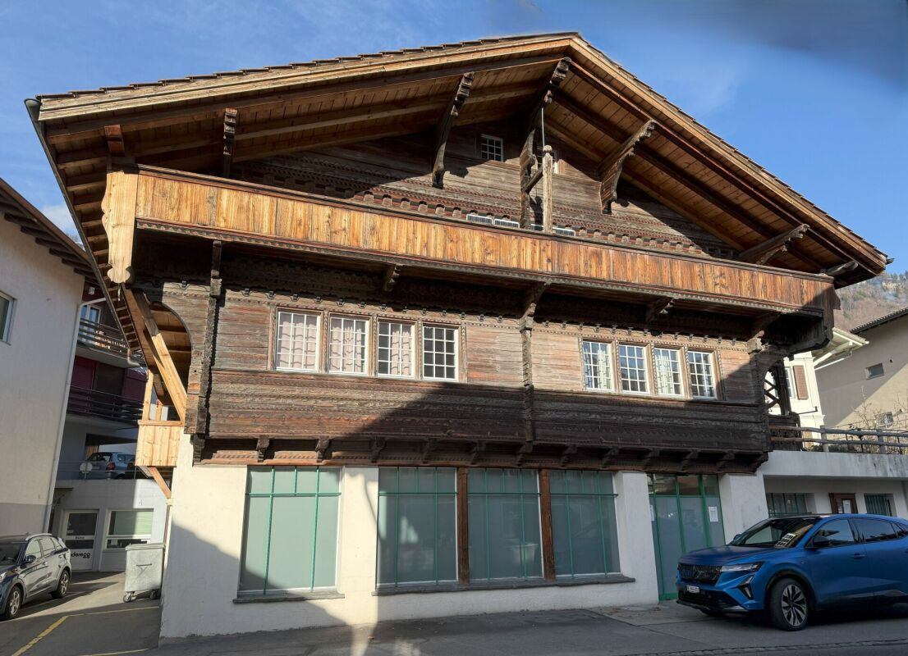
*`01.jpg` — Süd-Fassade*

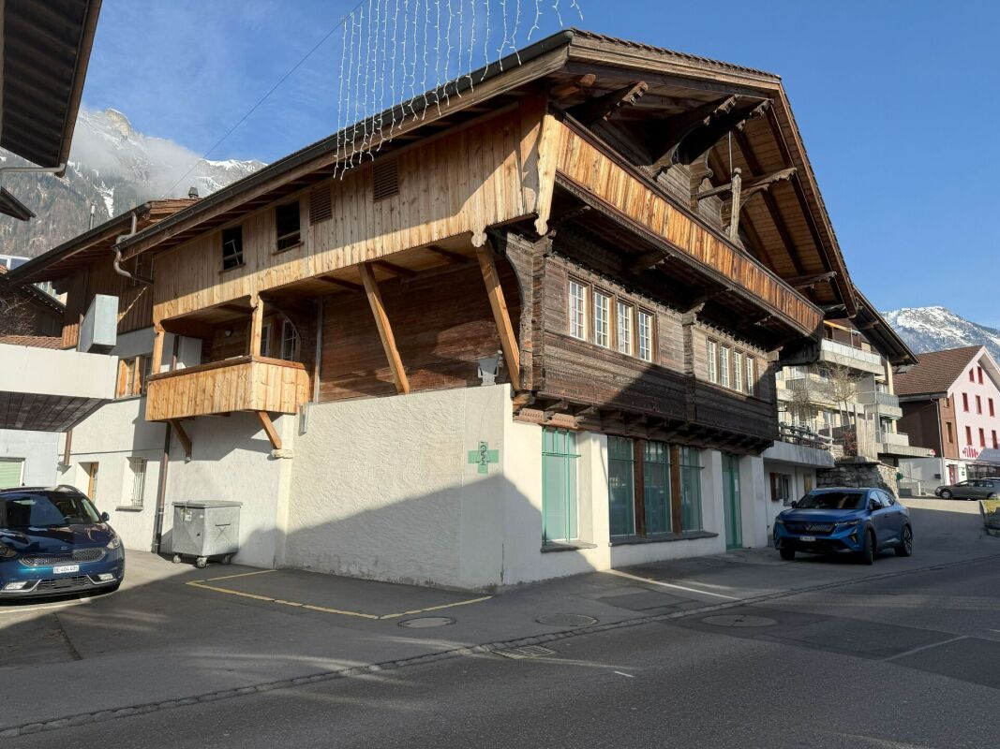
*`02.jpg` — Süd-Ansicht mit Geschäftseingang / Ost-Ansicht*

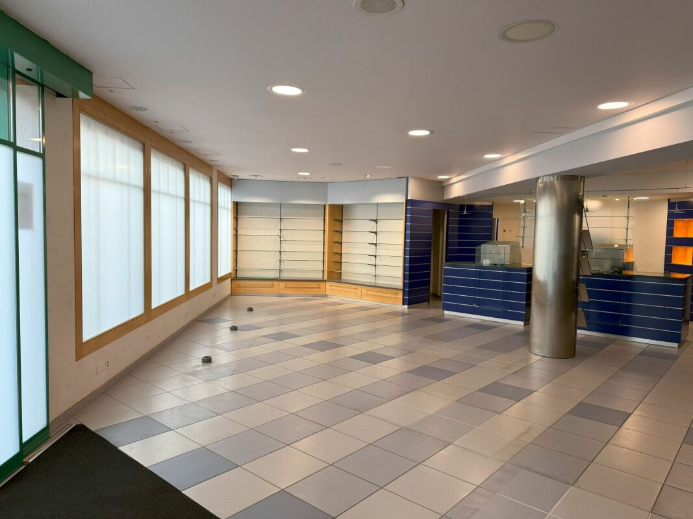
*`03.jpg`*

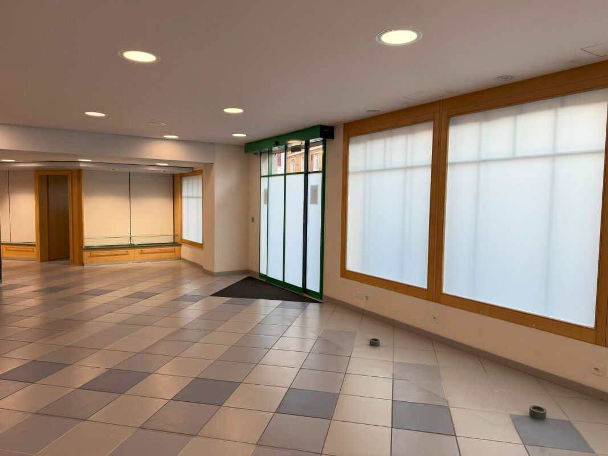
*`04.jpg`*

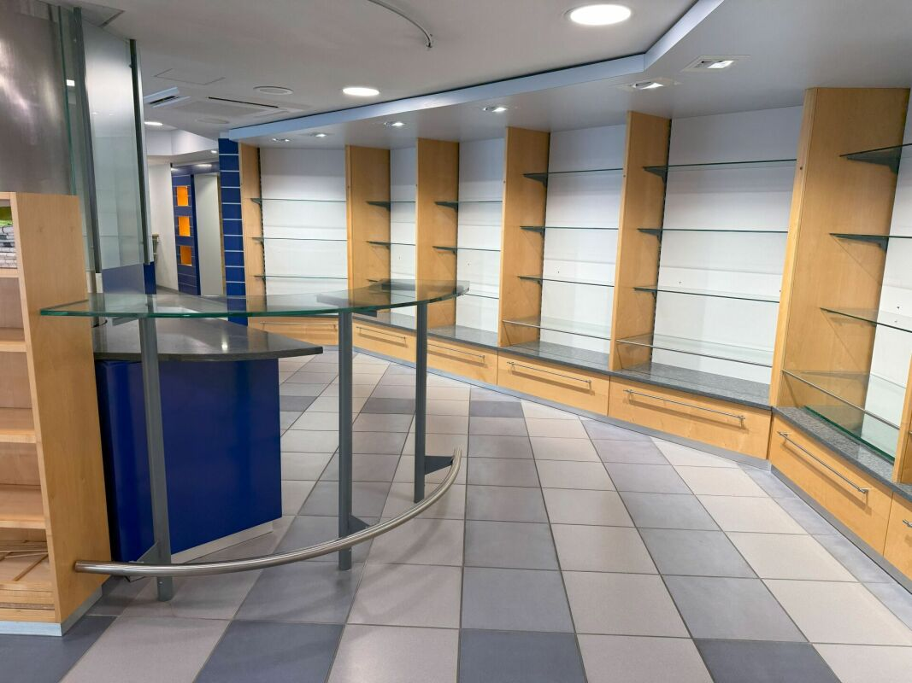
*`05.jpg`*

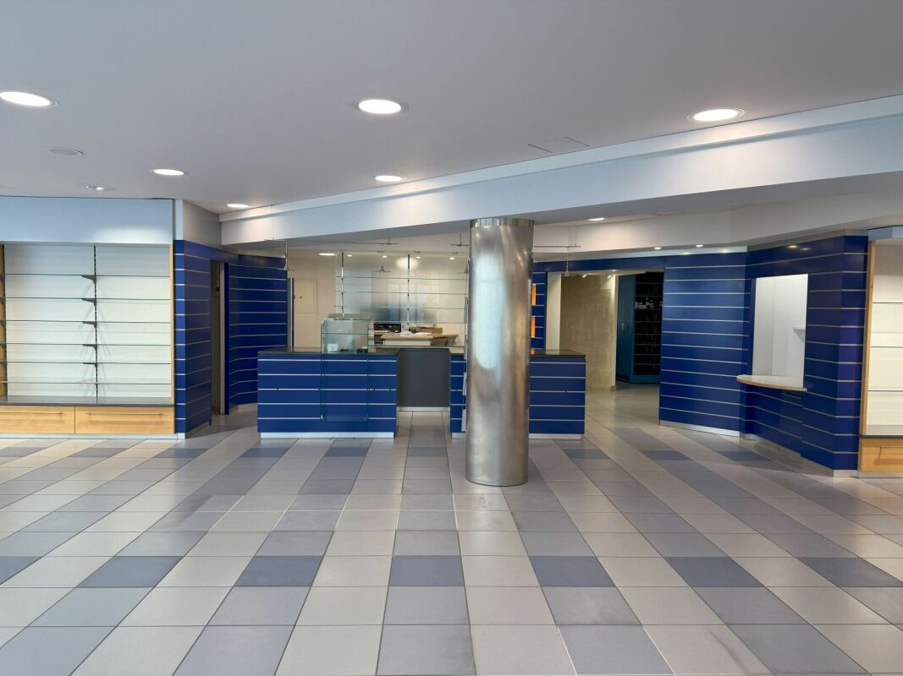
*`06.jpg`*

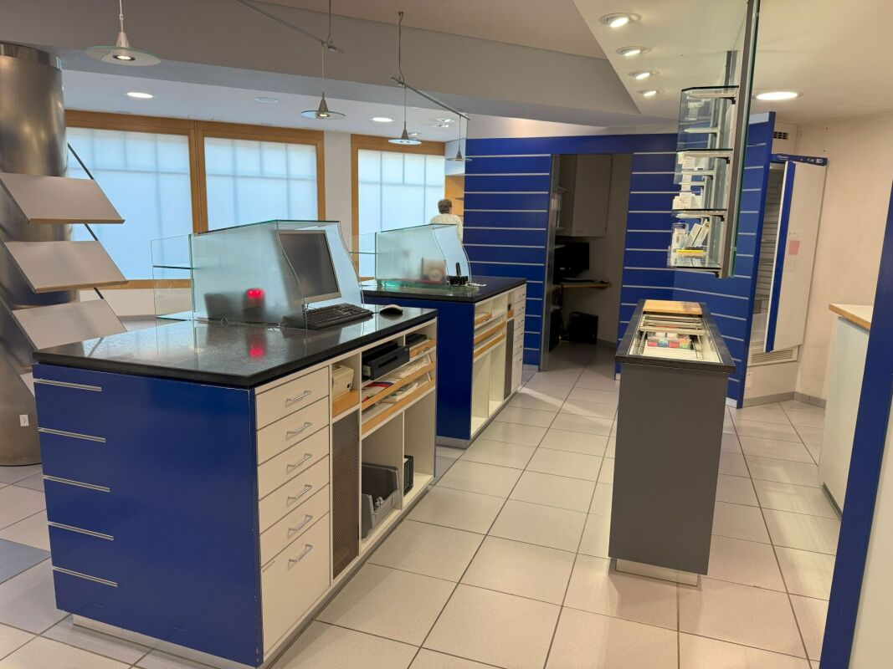
*`07.jpg`*

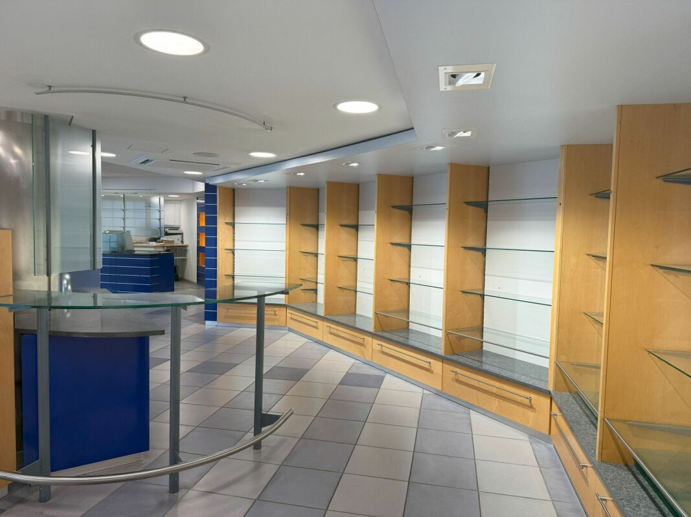
*`08.jpg`*

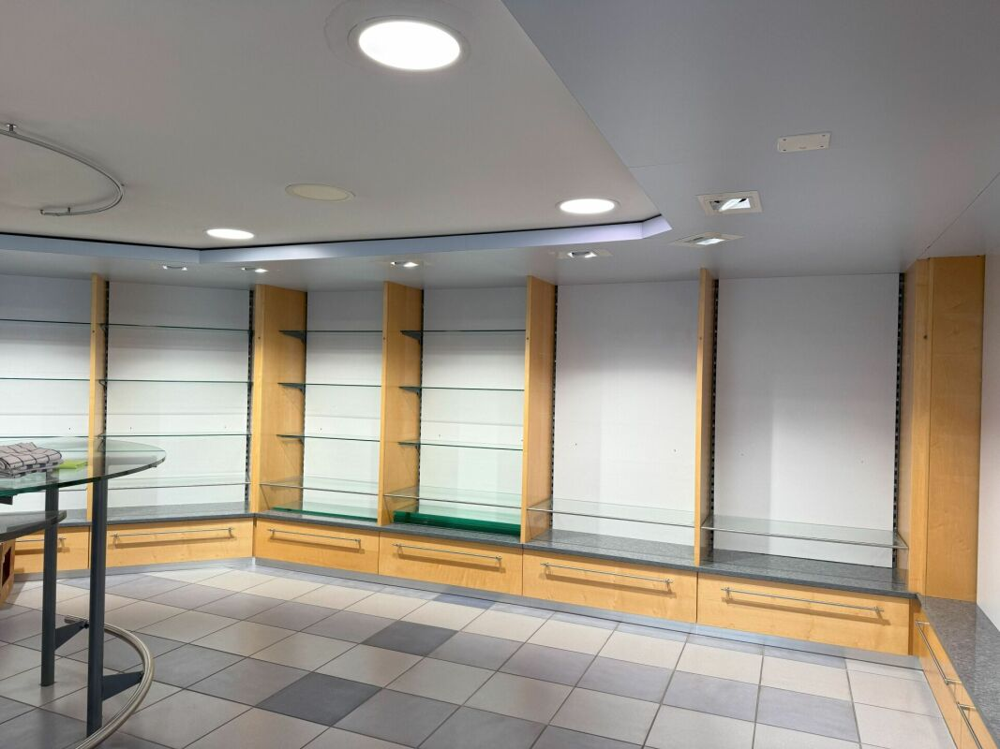
*`09.jpg`*

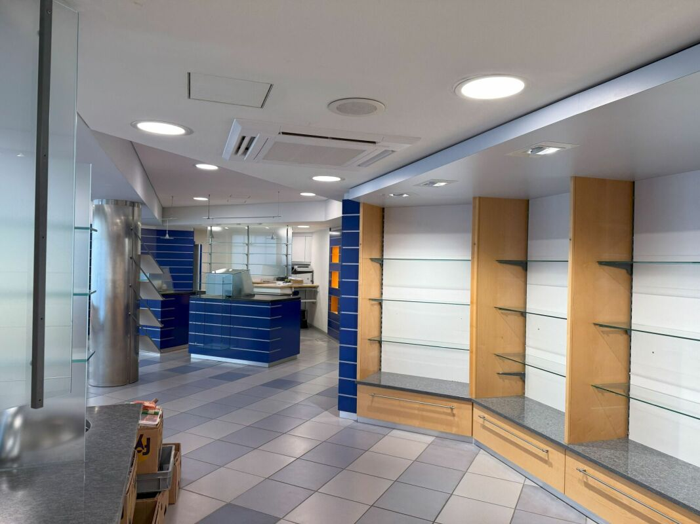
*`10.jpg`*

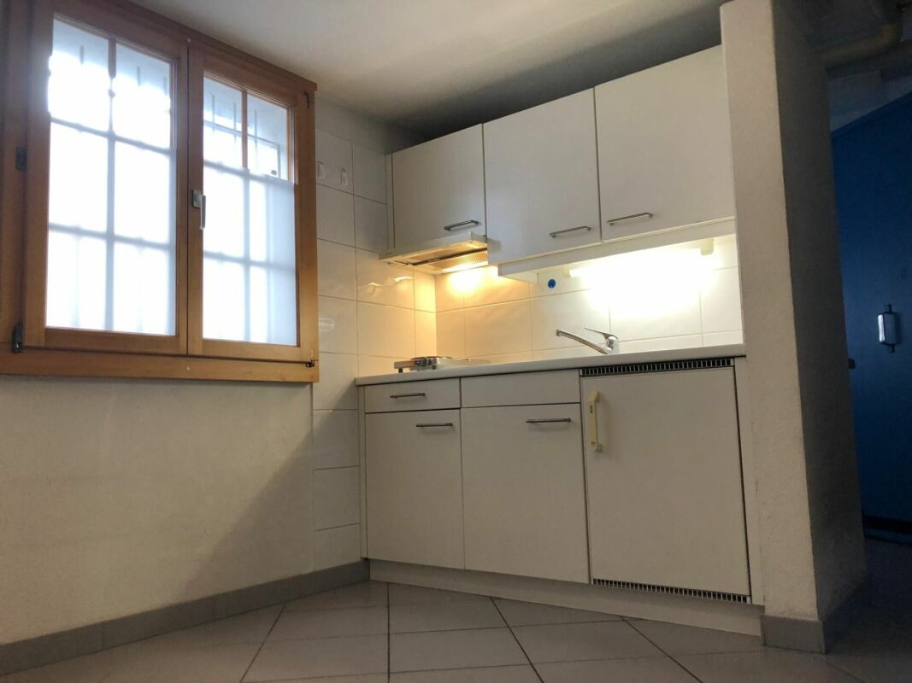
*`11.jpg`*

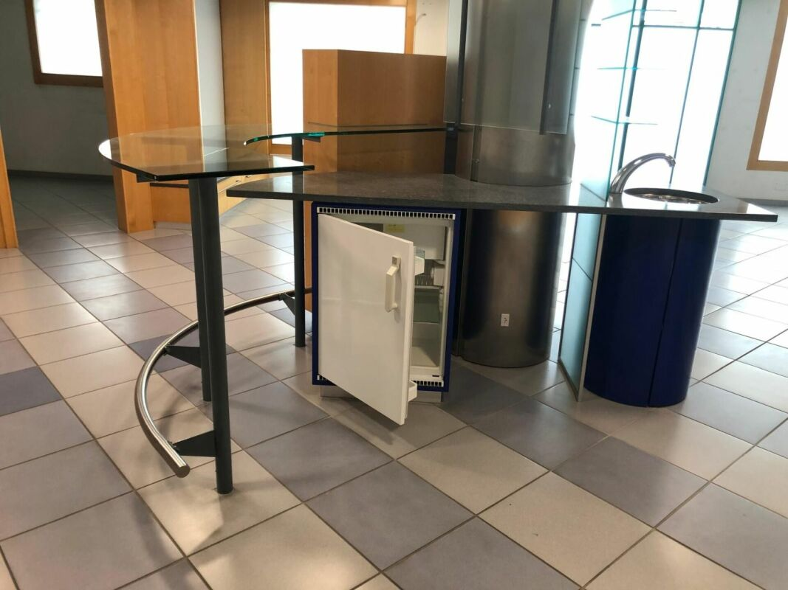
*`12.jpg`*
