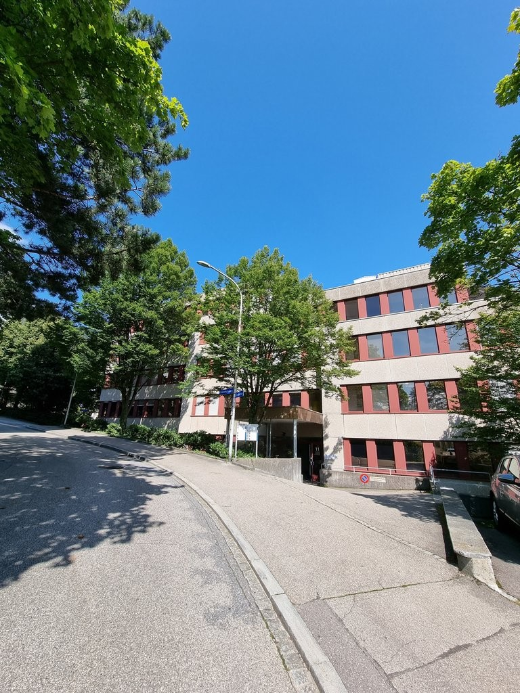
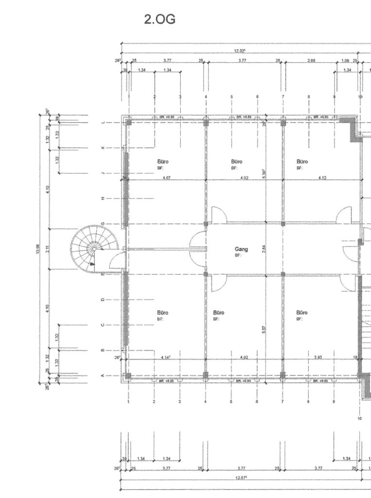
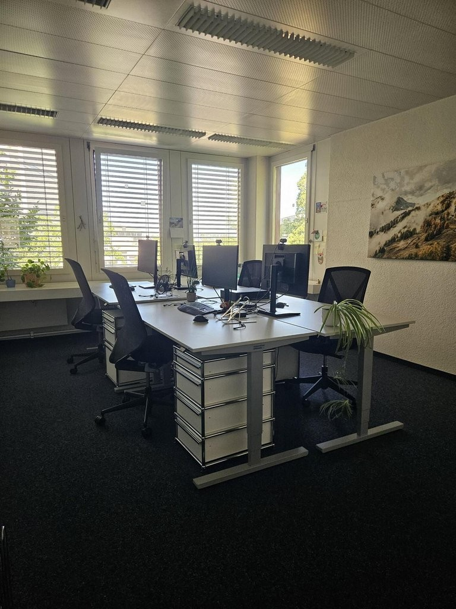
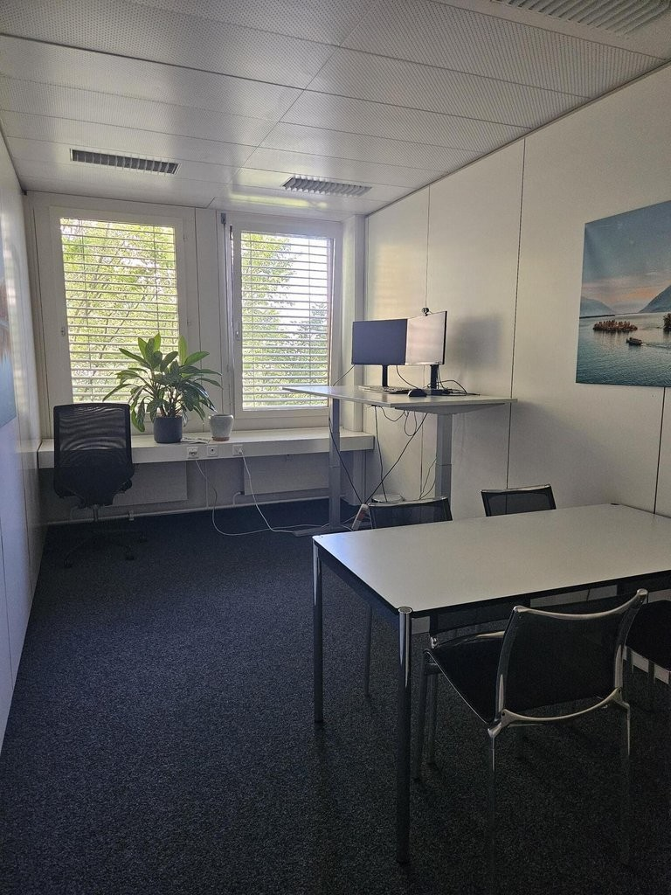
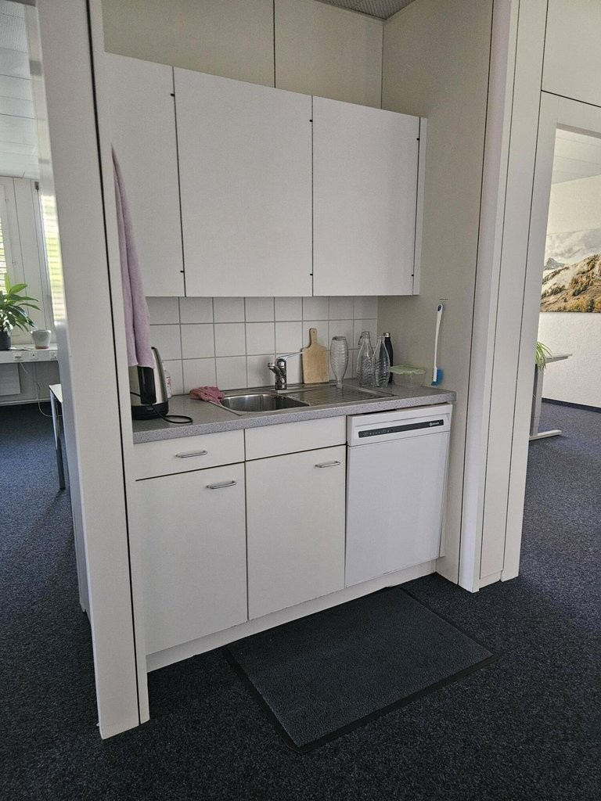
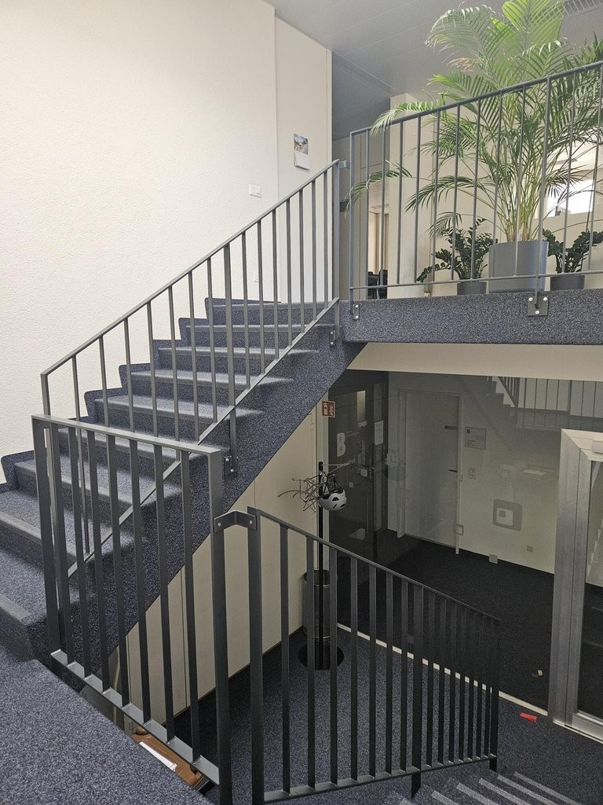

# Finkenhubelweg 11, 3012 Bern - CHF 12’436 inkl. NK pro Monat

> **Categorie:** `B_buero_gewerbe`  
> **Regiune:** Berna (oraș)  
> **Tip ofertă:** RENT / OFFICE  
> **Relevant pentru praxis:** da (praxis)  
> **Sursă:** [flatfox.ch](https://flatfox.ch/de/wohnung/finkenhubelweg-11-3012-bern/86068407/)  
> **Descărcat:** 2026-08-17 12:30

## Date obiect

| Câmp | Valoare |
|---|---|
| Adresă | Finkenhubelweg 11, 3012 Bern |
| Categorie obiect | INDUSTRY |
| Tip obiect | OFFICE |
| Chirie netă | CHF 11'920 |
| Nebenkosten | CHF 516 |
| Chirie brută | CHF 12'436 |
| Preț afișat | CHF 12'436 |
| Suprafață utilă | 516 m² |
| Etaj | 2 |
| An construcție | 1978 |
| An renovare | 2019 |
| Disponibil de la | 2027-08-01 |
| Referință | 19440.01.01021 |

## Texte originale (germană)

**Titlu public:** Finkenhubelweg 11, 3012 Bern - CHF 12’436 inkl. NK pro Monat

**Titlu scurt:** 516m² Büro

**Pitch:** 516m² Büro in Bern mieten

**Titlu descriere:** Zwischenvermietung Gewerbefläche!

**Titlu chirie:** 516m² Büro in Bern mieten

**Spațiu afișat:** 516

### Descriere completă

Zur befristeten Zwischenvermietung steht ab dem 01.08.2027 bis voraussichtlich 2029 eine gepflegte Gewerbefläche zur Verfügung. 

  

Die Räumlichkeiten eignen sich ideal als Büro-, Praxis- oder Atelierfläche und Coworking Space. Sie bieten ein professionelles Arbeitsumfeld mit flexiblen Nutzungsmöglichkeiten. 

  

  * Verfügbarkeit: ab 01.08.2027 
  * Befristete Mietdauer bis 2029 
  * Flexible Nutzungsmöglichkeiten 
  * Gute Erreichbarkeit und Infrastruktur 

  

Im selben Gebäude stehen mehrere Flächen in unterschiedlichen Grössen zur Vermietung frei. 

  

Weitere Informationen stellen wir Ihnen gerne auf Anfrage zur Verfügung. Wir freuen uns auf Ihre Kontaktaufnahme.

## Dotări (attributes)

- garage
- parkingspace

## Ofertant

- **Nume:** Privera AG
- **Stradă:** Worbstrasse 142
- **NPA:** 3073
- **Localitate:** Gümligen

## Imagini (6)

*`01.jpg` — 768x1024 px — Aussenansicht*

*`02.jpg` — 764x1024 px — Grundrissplan*

*`03.jpg` — 768x1024 px — Büro 1*

*`04.jpg` — 768x1024 px — Büro 2*

*`05.jpg` — 768x1024 px — Küche*

*`06.jpg` — 768x1024 px — Treppenhaus*
