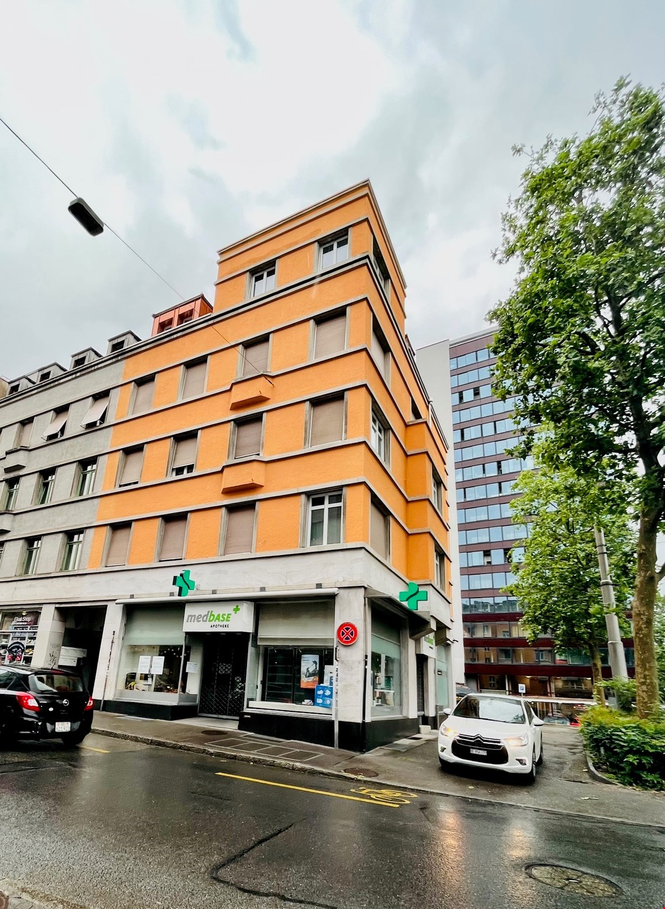
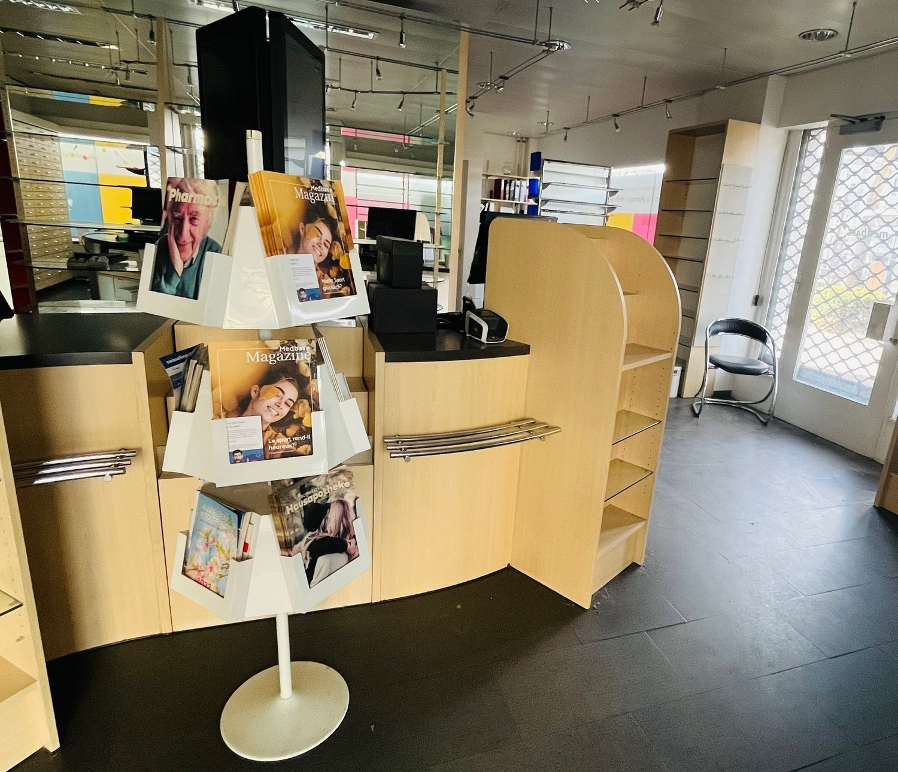
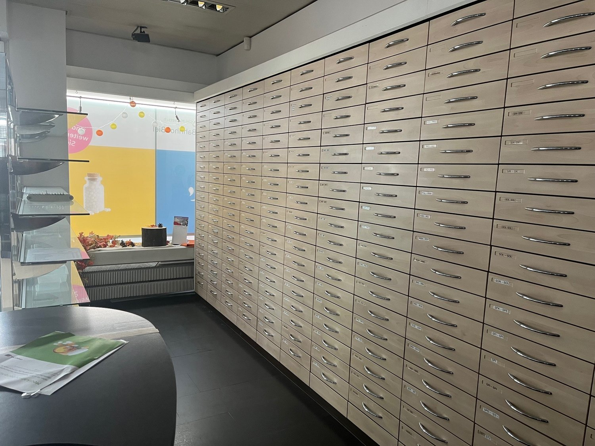
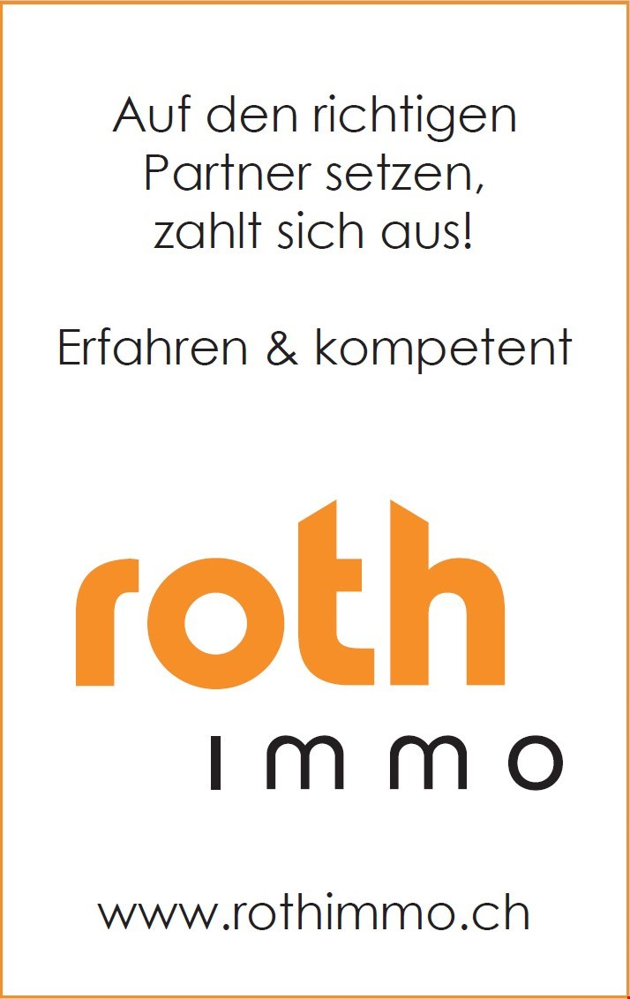
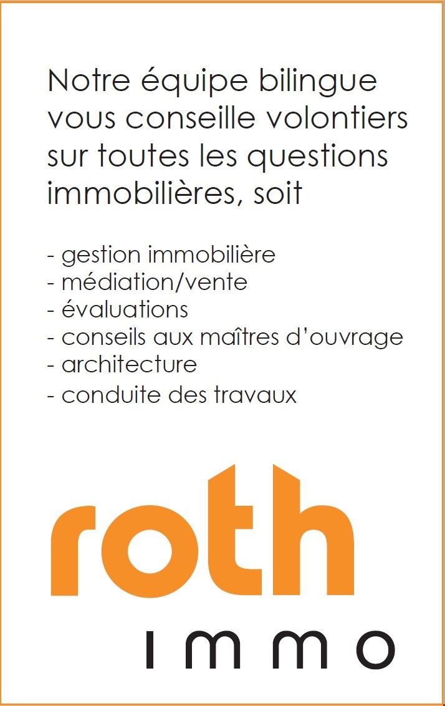
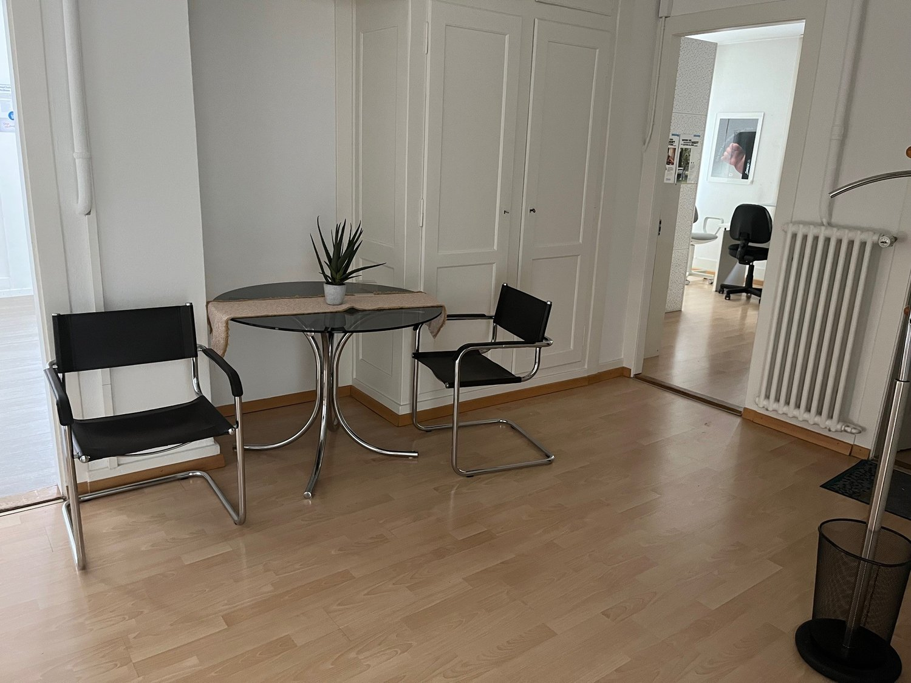
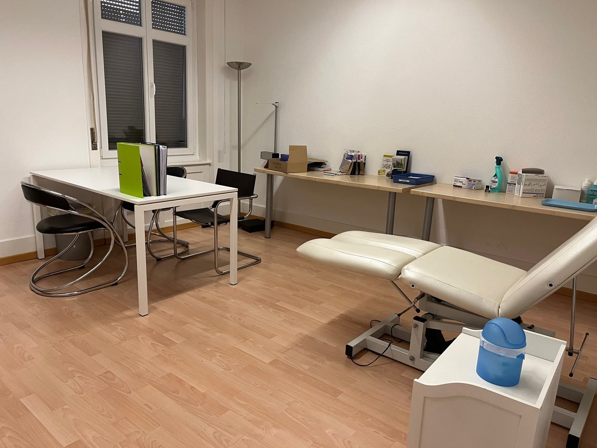
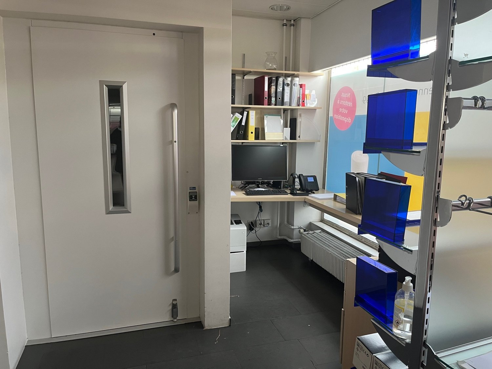
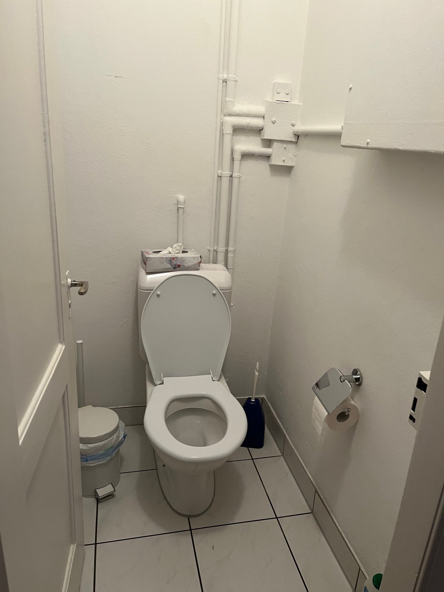

# Brüggstrasse 2, 2503 Biel/Bienne - CHF 6’900

> **Categorie:** `B_buero_gewerbe`  
> **Regiune:** Cantonul Berna  
> **Tip ofertă:** RENT / COMMERCIAL  
> **Relevant pentru praxis:** da (apotheke, praxisräume)  
> **Sursă:** [flatfox.ch](https://flatfox.ch/de/wohnung/bruggstrasse-2-2503-bielbienne/86076998/)  
> **Descărcat:** 2026-08-17 12:33

## Date obiect

| Câmp | Valoare |
|---|---|
| Adresă | Brüggstrasse 2, 2503 Biel/Bienne |
| Categorie obiect | INDUSTRY |
| Tip obiect | COMMERCIAL |
| Chirie netă | CHF 6'000 |
| Nebenkosten | CHF 900 |
| Chirie brută | CHF 6'900 |
| Preț afișat | CHF 6'900 |
| Disponibil de la | imm |
| Referință | ..4tsg5.ycexn |

## Texte originale (germană)

**Titlu public:** Brüggstrasse 2, 2503 Biel/Bienne - CHF 6’900

**Titlu scurt:** Gewerbe

**Pitch:** Gewerbe in Biel/Bienne mieten

**Titlu descriere:** Apothekenräumlichkeiten-Verkaufsfläche und Büros, Brüggstrasse 2 Biel

**Titlu chirie:** Gewerbe in Biel/Bienne mieten

### Descriere completă

Wir vermieten an der Brüggstrasse 2 in Biel Verkaufs- und Bürofläche im EG und 1. OG. Die Mietfläche eignet sich als Verkaufs-, Praxis-, oder Bürofläche. Intern sind diese mit einem eigenen Lift erschlossen. Im Erdgeschoss befindet sich die Verkaufsfläche. Im 1. Obergeschoss Büro- und Praxisräume sowie ein Aufenthaltsraum mit Kochnische. Die Büroräume wurden im 2020 neu gestrichen und ein neuer Boden verlegt. Im Untergeschoss sind Garderoben und Lagerräume eingerichtet. Grundsätzlich wird die Ladenfläche im Rohbau vermietet und ein Bezug kann nach Absprache mit der jetzigen Mieterin, Medbase, erfolgen. Allfällige Übernahme von Inventar und Ausbau kann allenfalls angefragt werden. 

Mietzins für die gesamte Einheit über drei Etagen inkl. Aussenparkplätze auf der Nordseite der Liegenschaft beträgt netto CHF 6'000.-- mtl. + HK/NK CHF 900.--.

## Dotări (attributes)

- lift
- parkingspace
- accessiblewithwheelchair

## Ofertant

- **Nume:** ROTH Immobilien Management AG
- **Stradă:** Florastrasse 30
- **NPA:** 2502
- **Localitate:** Biel/Bienne

## Imagini (10)

*`01.jpg` — 1153x1573 px — image/jpeg*

*`02.jpg` — 1500x1290 px*

*`03.jpg` — 1500x1125 px*

*`04.jpg` — 615x407 px*

*`05.jpg` — 714x1132 px*

*`06.jpg` — 714x1132 px*

*`07.jpg` — 1500x1125 px — The image shows a small office or dining area with a round glass-top table and two black leather chairs. The room has white walls and hardwood floors, and there is a plant and a framed picture on the wall. The room appears to be part of a larger apartment*

*`08.jpg` — 1500x1125 px — A room with a white desk, two black chairs, a white leather chair, a white side table, a floor lamp, and a window with blinds.*

*`09.jpg` — 1500x1125 px — small office room with desk, computer, telephone, shelves, radiator, printer, door*

*`10.jpg` — 1500x2000 px — Small bathroom with white tiled floor, white walls, toilet, toilet paper holder, tissue box, and a trash bin.*
