# Industriestrasse 23, 4922 Bützberg - CHF 100

> **Categorie:** `B_buero_gewerbe`  
> **Regiune:** Cantonul Berna  
> **Tip ofertă:** RENT / COMMERCIAL  
> **Sursă:** [flatfox.ch](https://flatfox.ch/de/wohnung/industriestrasse-23-4922-butzberg/86077675/)  
> **Descărcat:** 2026-08-17 12:37

## Date obiect

| Câmp | Valoare |
|---|---|
| Adresă | Industriestrasse 23, 4922 Bützberg |
| Categorie obiect | INDUSTRY |
| Tip obiect | COMMERCIAL |
| Chirie brută | CHF 100 |
| Preț afișat | CHF 100 |
| Suprafață utilă | 1500 m² |
| Etaj | 3 |
| Disponibil de la | agr |
| Referință | .._5889311.MOI.TF1 |

## Texte originale (germană)

**Titlu public:** Industriestrasse 23, 4922 Bützberg - CHF 100

**Titlu scurt:** 1500m² Gewerbe

**Pitch:** 1500m² Gewerbe in Bützberg mieten

**Titlu descriere:** Günstige Lagerflächen mit idealer Infrastruktur & Anbindung

**Titlu chirie:** 1500m² Gewerbe in Bützberg mieten

**Spațiu afișat:** 1500

### Descriere completă

An der Industriestrasse 23 in Bützberg (Thunstetten) stehen rund 20'000 m² Gewerbe-/Lagerfläche zur Vermietung. Die Flächen sind bezugsbereit und können per 01.01.2028 übernommen werden.   
  
**Teilflächen ab sofort verfügbar:**   

  * Gewerberaum 2. OG - 581.40 m² 
  * Lagerraum 2.OG - 722.15 m² 
  * Lagerraum 3.OG - 1'375.99 m² 
  * Lagerraum 4.OG - 1'383.31 m² 

  
**Flächen verfügbar ab 2028:**   

  * Gewerberaum Erdgeschoss - ca. 5'000 m² 
  * Gewerberaum 1.OG - ca. 3'700 m² 
  * Gewerberaum 3.OG - ca. 115.75 m² 
  * Gewerberaum 1.UG - ca. 4'000 m² 

  
**Highlights:**   

  * Zwei stützenlose Hallen mit grossen Raumhöhen 
  * 21 LKW-Rampen auf beiden Gebäudeseiten (optimale Anlieferung) 
  * 4 Warenlifte 
  * 3 Palettenförderanlagen 
  * Caffeteria im 3.OG 
  * 130 Parkplätze direkt vor Ort 
  * sehr grosse Aussenflächen als LKW-Rangierfläche und Parkplatz 
  * Grosszügige Raumhöhen 
  * Hohe Bodenbelastbarkeit 
  * Bestehender Mieterausbau (sofort nutzbar) 
  * Flexible Nutzungsmöglichkeiten 

  
**Lage:**   

  * Gewerbegebiet Thunstetten / Bützberg 
  * Sehr gute Erschliessung 
  * Autobahn A1 in ca. 20 Minuten erreichbar 
  * Gute Anbindung an regionale und nationale Verkehrsachsen 

  
**Nutzung:**   
Ideal für Logistik, Distribution, Produktion oder Industrie

## Dotări (attributes)

- parkingspace

## Ofertant

- **Nume:** H&B Real Estate AG
- **Stradă:** Lagerstrasse 107
- **NPA:** 8004
- **Localitate:** Zürich

## Imagini (13)

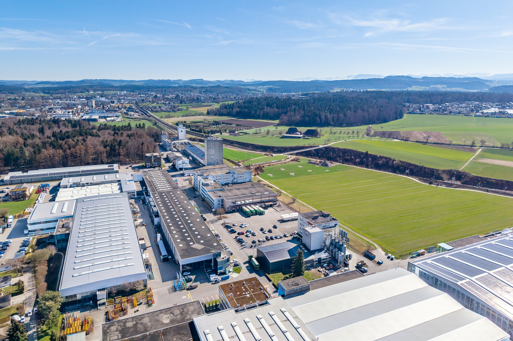
*`01.jpg`*

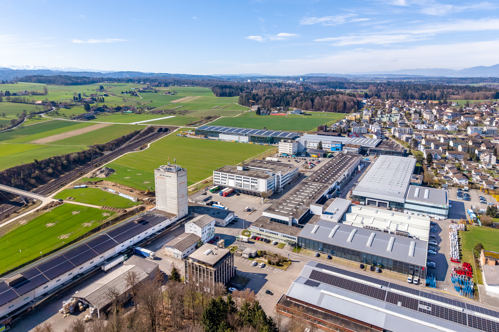
*`02.jpg`*

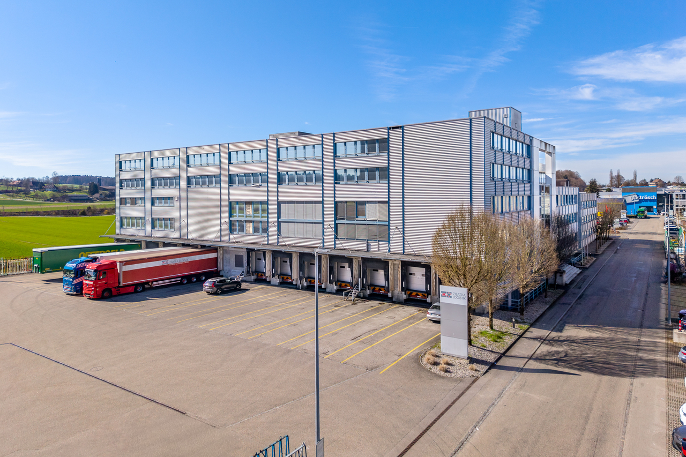
*`03.jpg`*

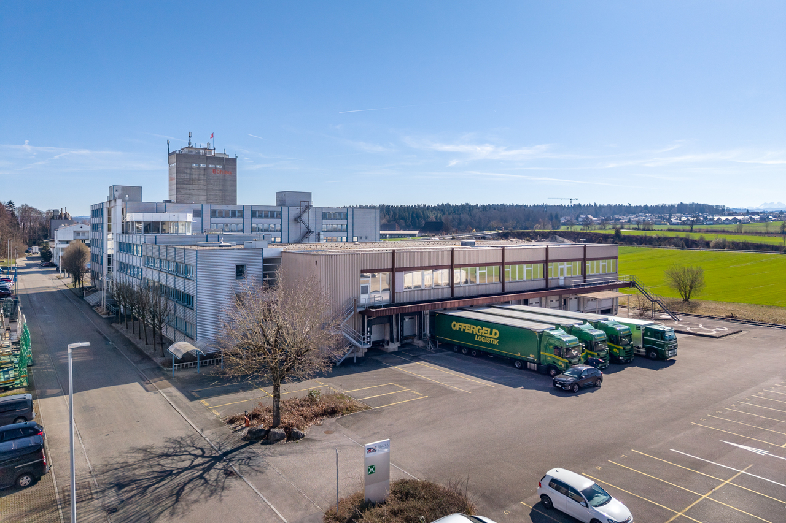
*`04.jpg`*

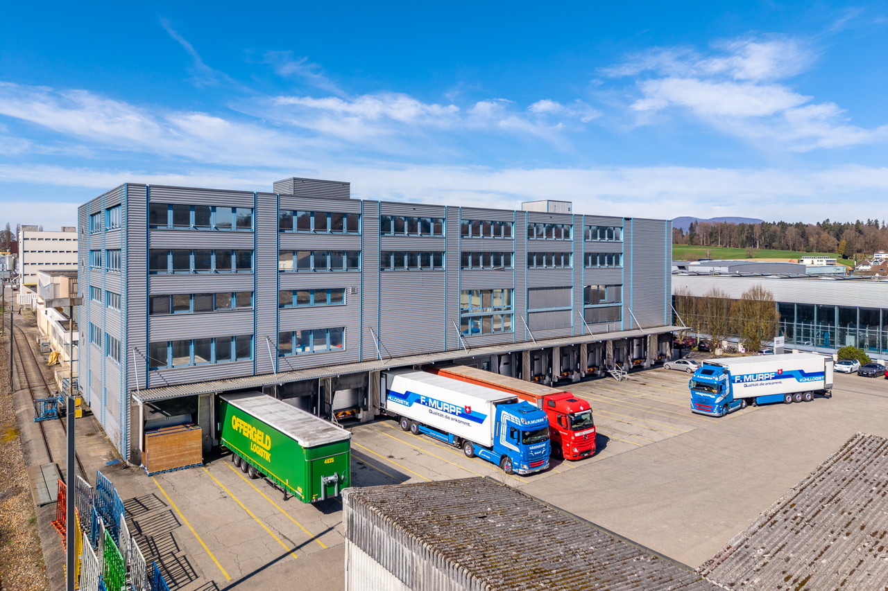
*`05.jpg`*

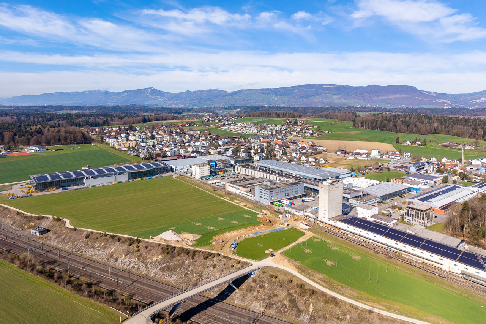
*`06.jpg`*

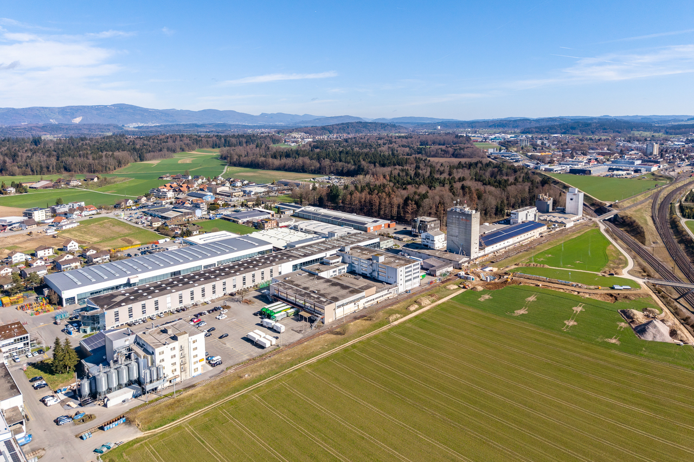
*`07.jpg`*

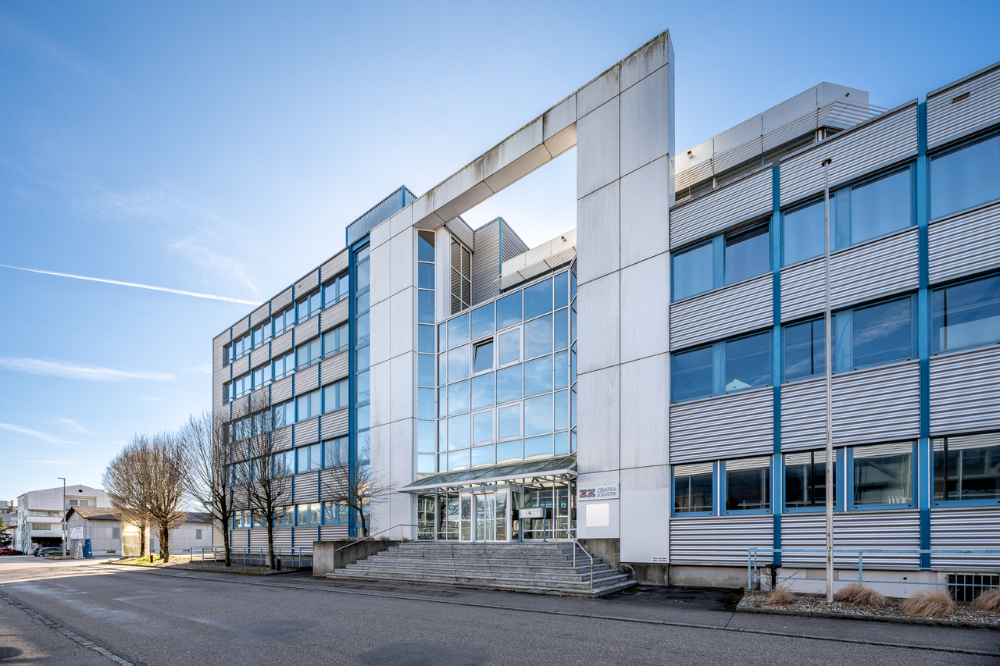
*`08.jpg`*

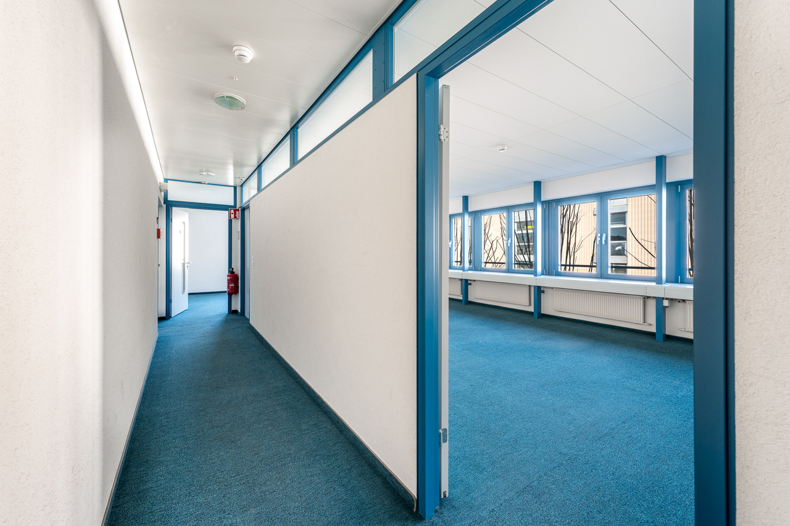
*`09.jpg`*

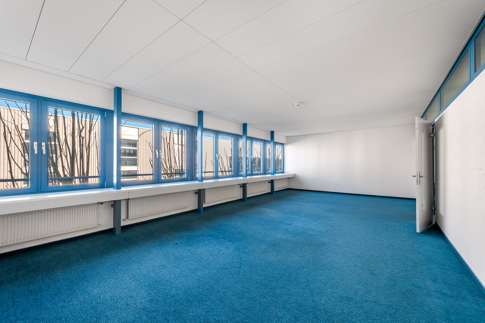
*`10.jpg`*

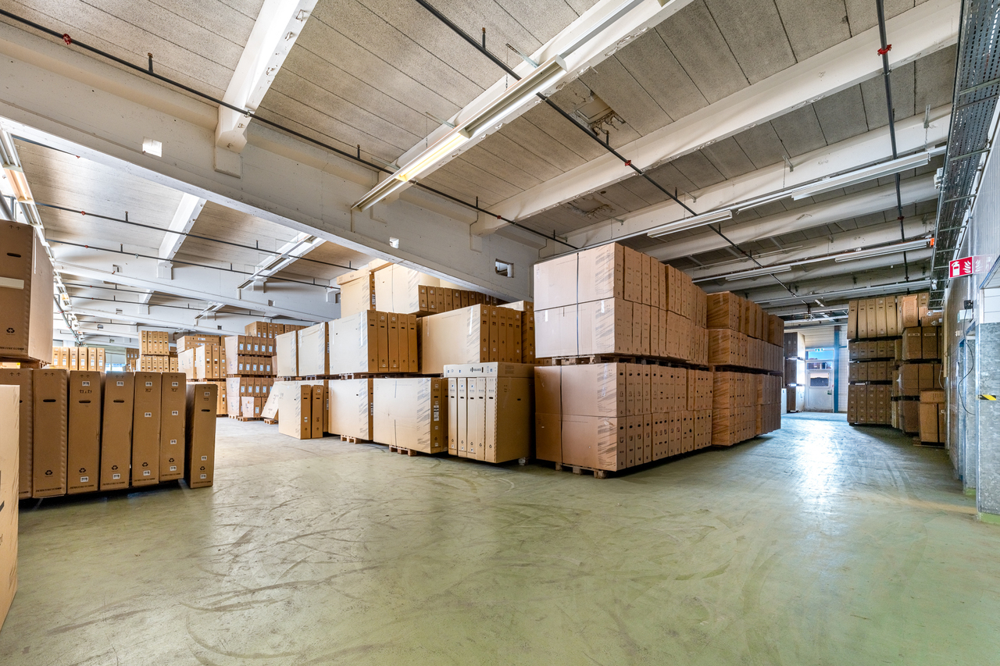
*`11.jpg`*

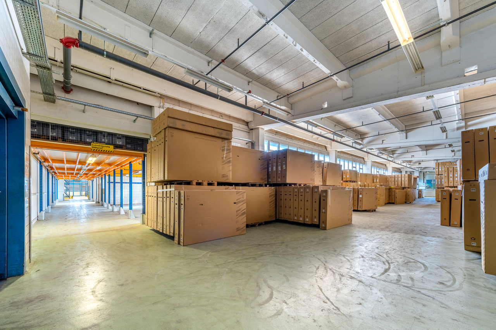
*`12.jpg`*

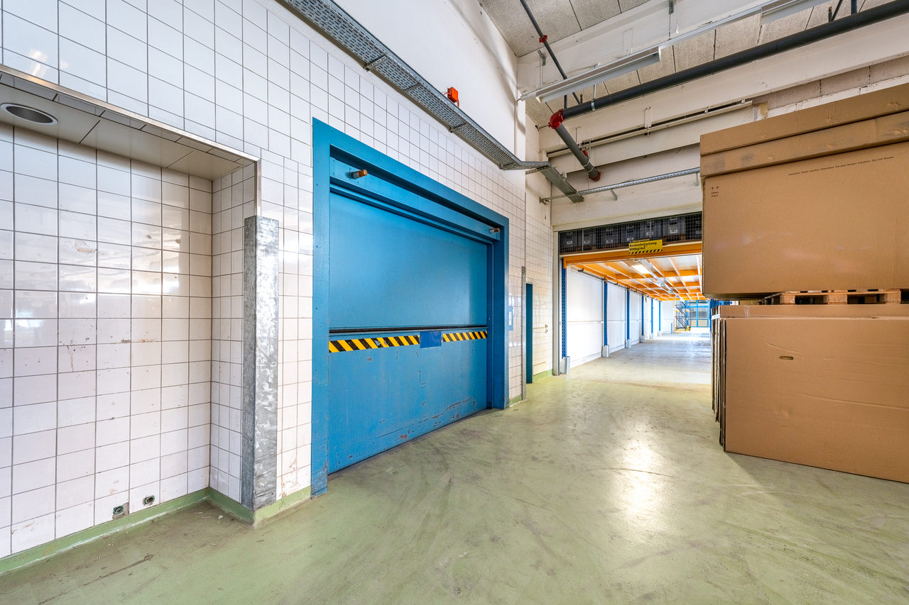
*`13.jpg`*
