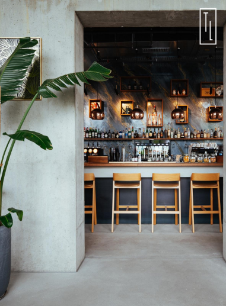
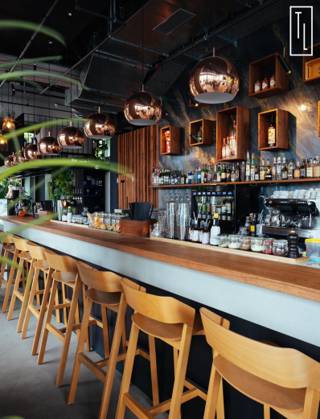
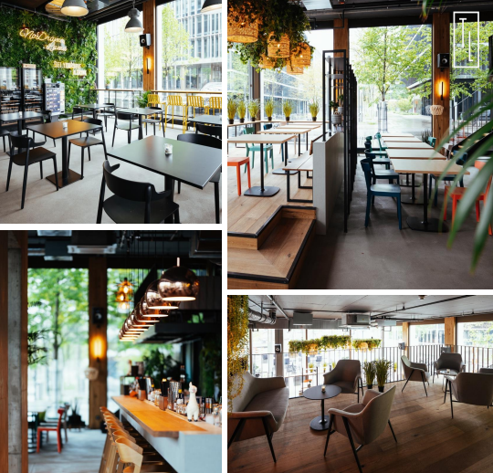
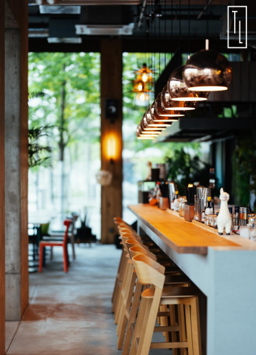
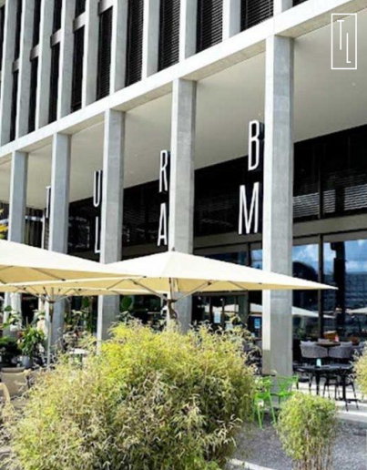
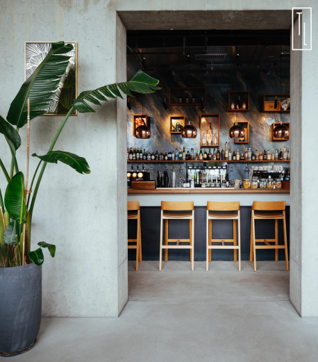

# Hilfikerstrasse 4, 3014 Bern - CHF 8’458

> **Categorie:** `B_buero_gewerbe`  
> **Regiune:** Berna (oraș)  
> **Tip ofertă:** RENT / COMMERCIAL  
> **Sursă:** [flatfox.ch](https://flatfox.ch/de/wohnung/hilfikerstrasse-4-3014-bern/86094910/)  
> **Descărcat:** 2026-08-17 12:28

## Date obiect

| Câmp | Valoare |
|---|---|
| Adresă | Hilfikerstrasse 4, 3014 Bern |
| Categorie obiect | INDUSTRY |
| Tip obiect | COMMERCIAL |
| Chirie netă | CHF 7'633 |
| Nebenkosten | CHF 825 |
| Chirie brută | CHF 8'458 |
| Preț afișat | CHF 8'458 |
| Suprafață utilă | 500 m² |
| An renovare | 2020 |
| Disponibil de la | 2026-09-01 |
| Referință | ..aj0sz.g9913 |

## Texte originale (germană)

**Titlu public:** Hilfikerstrasse 4, 3014 Bern - CHF 8’458

**Titlu scurt:** 500m² Gewerbe

**Pitch:** 500m² Gewerbe in Bern mieten

**Titlu descriere:** Gastronomiebetrieb «Turbo Lama» in Bern-Wankdorf zu übernehmen

**Titlu chirie:** 500m² Gewerbe in Bern mieten

**Spațiu afișat:** 500

### Descriere completă

_An erstklassiger Lage in_ **_Bern-Wankdorf City_ ** _steht der moderne und etablierte Gastronomiebetrieb_ **_«Turbo Lama»_ ** _zur Übernahme. Der Betrieb befindet sich an der_ **_Hilfikerstrasse 4, 3014 Bern_ ** _, in unmittelbarer Nähe zu grossen Unternehmen wie SBB, Post und KPT sowie mit hervorragender Anbindung an den öffentlichen Verkehr._

_Das Turbo Lama verbindet ein lebendiges_ **_Afterwork-Konzept_ ** _mit einem effizienten, qualitativ hochwertigen_ **_Mittagsservice_ ** _und bietet gleichzeitig ideale Voraussetzungen für_ **_Firmenanlässe, private Events und grössere Veranstaltungen_ ** _mit bis zu 300 Personen._

_Die grosszügige Lokalität umfasst einen modernen, lichtdurchfluteten Gastraum von ca._ **_250 m²_ ** _, flexible Nutzungsbereiche sowie eine beeindruckende_ **_Terrasse von rund 450 m²_ ** _, teilweise gedeckt. Damit eignet sich der Betrieb optimal für parallele Nutzungskonzepte, Aussenbestuhlung, Events und individuelle gastronomische Weiterentwicklungen._

_Der Betrieb ist vollständig eingerichtet und technisch auf hohem Niveau ausgestattet. Zur Infrastruktur gehören unter anderem eine imposante zentrale Bar, hochwertige Küchengeräte, Kombisteamer, Kühlzelle, Lagerflächen, Spültechnik, Zapfanlage sowie eigene technische Anlagen. Sämtliche Anlagen wurden 2020 neu erstellt und regelmässig gewartet._

_Das Quartier Wankdorf zählt zu den dynamischsten Entwicklungsgebieten Berns. Mit geplanten Bürogebäuden, dem Projekt_ **_Wankdorf City 3_ ** _sowie einem grossen Wohnquartier mit über 1’000 Wohnungen bietet der Standort zusätzliches Wachstumspotenzial und eine langfristig attraktive Besucherfrequenz._

**_Konditionen:_ ** _Mietzins:_ **_CHF 8’458.– inkl. NK pro Monat_ ** _Verkaufspreis Inventar & Mobiliar: _ **_CHF 550’000.–_ ** _Übernahme:_ **_nach Vereinbarung, idealerweise ab 1. September 2026_ **

_Das Turbo Lama bietet eine einmalige Gelegenheit für Gastronomen, Betreiber oder Investoren, einen etablierten und vollständig ausgestatteten Betrieb an Top-Lage mit grossem Entwicklungspotenzial zu übernehmen._

_Für Fragen und Besichtigungen steht Ihnen_ **_Herr Schmid, 079 203 72 39_ ** _, gerne zur Verfügung._

## Dotări (attributes)

- minergie
- view
- balconygarden
- petsallowed
- parkingspace
- accessiblewithwheelchair
- garage

## Ofertant

- **Nume:** LAYF GmbH
- **Stradă:** Buckhauserstrasse 36
- **NPA:** 8048
- **Localitate:** Zürich

## Imagini (6)

*`01.png` — 381x517 px*

*`02.png` — 398x521 px*

*`03.png` — 540x518 px*

*`04.png` — 373x517 px*

*`05.png` — 403x516 px*

*`06.png` — 458x521 px*
