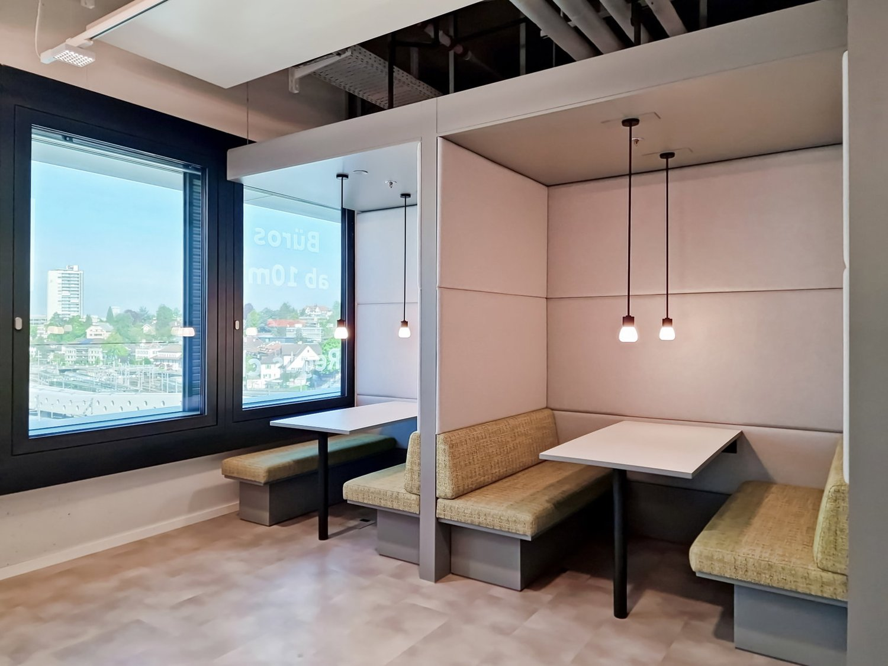
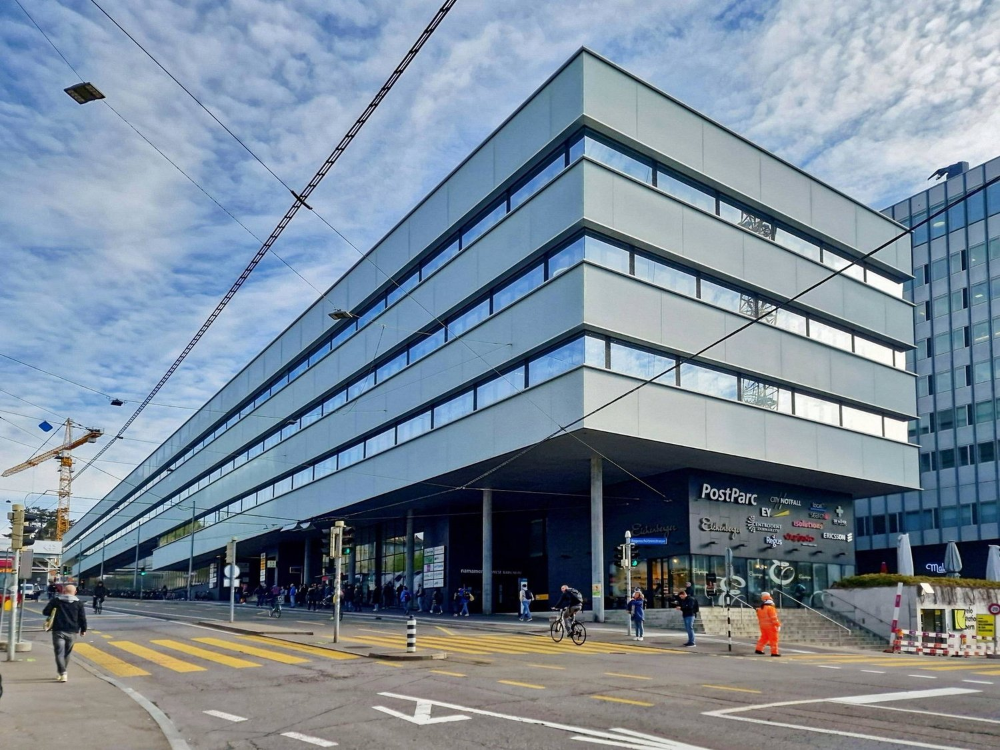
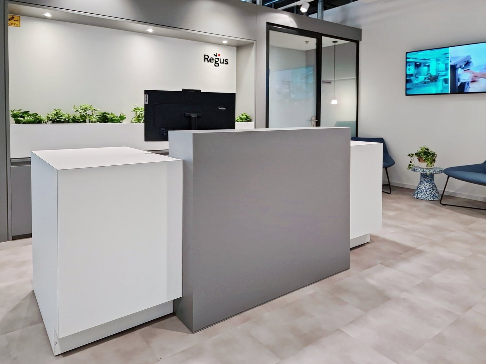
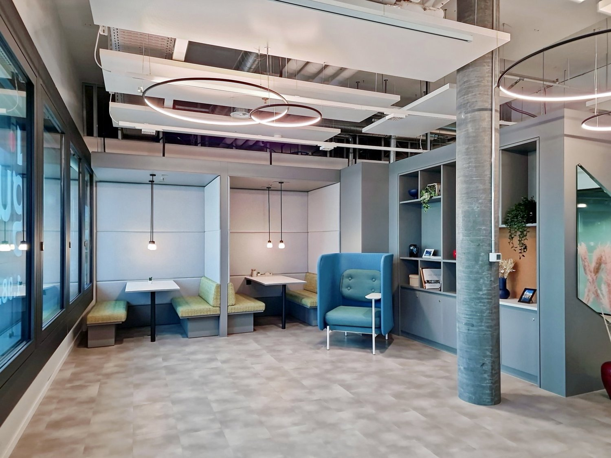
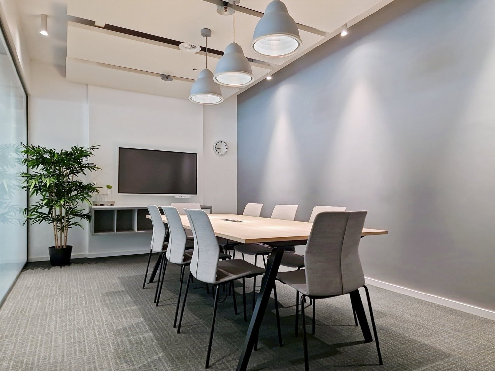
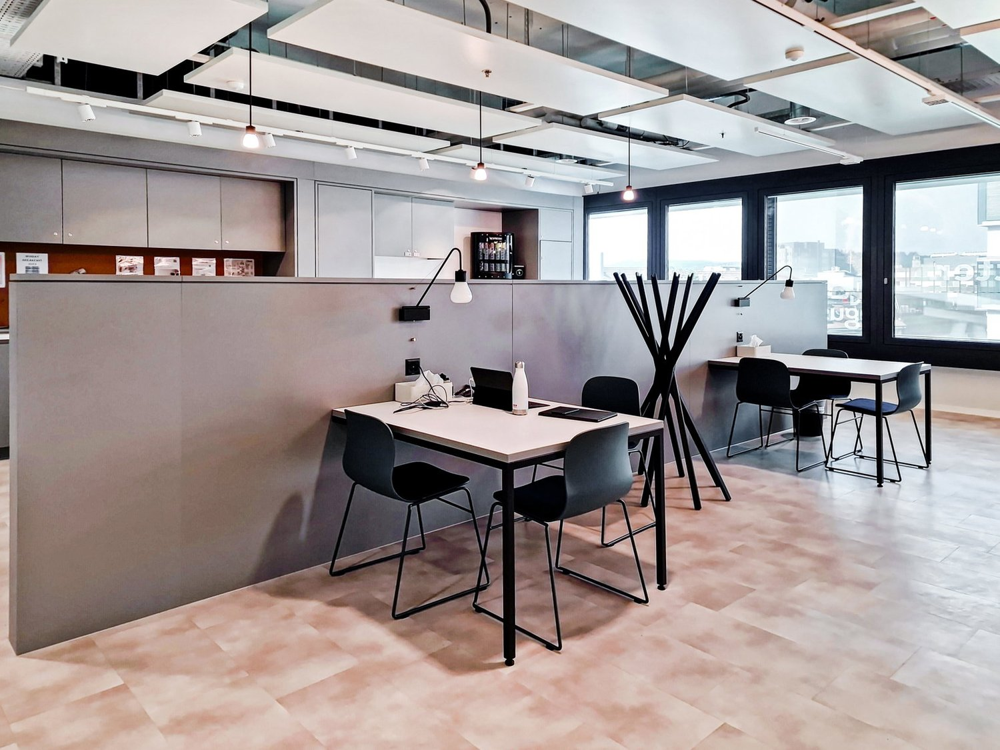
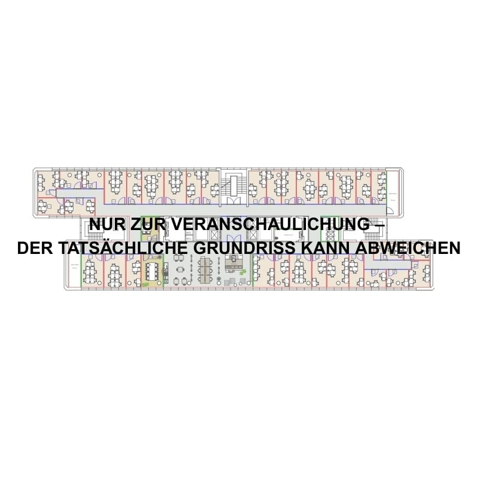

# Schanzenstrasse 4a, 3008 Bern - CHF 429

> **Categorie:** `B_buero_gewerbe`  
> **Regiune:** Berna (oraș)  
> **Tip ofertă:** RENT / OFFICE  
> **Sursă:** [flatfox.ch](https://flatfox.ch/de/wohnung/schanzenstrasse-4a-3008-bern/86096029/)  
> **Descărcat:** 2026-08-17 12:34

## Date obiect

| Câmp | Valoare |
|---|---|
| Adresă | Schanzenstrasse 4a, 3008 Bern |
| Categorie obiect | INDUSTRY |
| Tip obiect | OFFICE |
| Chirie netă | CHF 429 |
| Chirie brută | CHF 429 |
| Preț afișat | CHF 429 |
| Disponibil de la | agr |
| Referință | CHcw5977.. |

## Texte originale (germană)

**Titlu public:** Schanzenstrasse 4a, 3008 Bern - CHF 429

**Titlu scurt:** Büro

**Pitch:** Büro in Bern mieten

**Titlu descriere:** Eigener Schreibtisch in Regus Main Station

**Titlu chirie:** Büro in Bern mieten

### Descriere completă

**Alle angegebenen Preise verstehen sich als ?Start"-Preise und können je nach Auswahl und enthaltenen Dienstleistungen variieren.**   
  
Arbeiten Sie inmitten einer Community gleichgesinnter Unternehmer in unseren geteilten Büros. Unsere Coworking-Bereiche sind auf Zusammenarbeit ausgelegt und wir kümmern uns um alles. Reservieren Sie einen eigenen Schreibtisch oder kommen Sie einfach vorbei und nutzen Sie einen Hot Desk. Sie werden Ihrem Unternehmen völlig neue Möglichkeiten eröffnen.   
  
Finden Sie die perfekte Plattform für Ihr Unternehmen mit flexiblen Arbeitsplätzen an der Schanzenstrasse 4 4 im 5. Stock, einem atemberaubenden Büroraum in Bern, Schweiz, der als eine der lebenswertesten Städte der Welt gilt. Lassen Sie sich von malerischen Landschaften dieser Stadt inspirieren, die von Hügeln und den Berner Alpen umgeben ist. Geniessen Sie eine gute Anbindung an und von der Arbeit, denn der Berner Hauptbahnhof befindet sich günstig direkt unter dem Büro. Pendler können auch die Tramhaltestelle Hirschengraben und die Bushaltestelle Schanzenstrasse nutzen, die beide 2 Gehminuten vom Büro entfernt sind und den Ausgang in Richtung Welle 7 nehmen. Entdecken Sie die Möglichkeiten neuer Partnerschaften und Kooperationen in diesem Wirtschaftszentrum, indem Sie sich mit Unternehmern aus den Bereichen IT, Telekommunikation und Finanzen vernetzen.   
  
Arbeiten Sie mit Kollegen in unserem Coworking-Grossraumbüro an Ihren Projekten. Buchen Sie einen eigenen Schreibtisch oder arbeiten Sie da, wo Sie sich am wohlsten fühlen. Finden Sie Konzentration und Privatsphäre in den hellen, geräumigen Besprechungsräumen, die Sie über unsere nutzerfreundliche App buchen können. Egal, ob Sie einen geeigneten Arbeitsort für Vorstellungsgespräche, Konferenzen, Teambesprechungen oder Pitches suchen: Wir haben eine Reihe von Optionen, die den unterschiedlichsten geschäftlichen Anforderungen gerecht werden. Gönnen Sie sich in unseren Pausenbereichen eine Arbeitsunterbrechung und lernen Sie andere Menschen aus unserer vielfältigen Business-Community kennen. Nach der Arbeit finden Sie direkt vor dem Büro eine Vielzahl von Läden, Restaurants und Hotels, die alle zu Fuss erreichbar sind.   
  
Vorteile von Coworking bei Regus:   
\- Zugang zu unserem globalen Netzwerk mit tausenden Standorten weltweit   
\- Ausgezeichnet geschultes Empfangs- und Support-Team   
\- Businessclass-Technologie und -WLAN mit hohen Sicherheitsstandards   
\- Zugang zu Drucker und administrativer Unterstützung   
\- Reinigung, Betriebsmittel und Sicherheit   
\- Pro Stunde, Tag oder Monat verfügbare Schreibtische   
\- Auswahl zwischen Großraumbüros oder einem geteilten Büro   
\- Möglichkeit, sich einen eigenen Schreibtisch zu reservieren   
\- Regelmäßigen Netzwerk- und Community-Events   
\- Einfache Buchung und Konto-Verwaltung über unsere App   
  
Alle gezeigten Bilder wurden in unseren Räumlichkeiten aufgenommen, entsprechen jedoch nicht zwangsläufig dem jeweiligen Center.   
  
Jetzt anfragen

## Dotări (attributes)

- parkingspace
- lift

## Ofertant

- **Nume:** Regus Switzerland
- **Stradă:** Baarerstrasse 14
- **NPA:** 6300
- **Localitate:** Zug

## Imagini (7)

*`01.jpg` — 1605x1204 px — Image 1*

*`02.jpg` — 1605x1204 px — Image 2*

*`03.jpg` — 1605x1204 px — Image 3*

*`04.jpg` — 1605x1204 px — Image 4*

*`05.jpg` — 1605x1204 px — Image 5*

*`06.jpg` — 1605x1204 px — Image 6*

*`07.jpg` — 800x800 px — Floorplan 7*
