# Wangenstrasse 86a, 3018 Bern - CHF 2’833 inkl. NK pro Monat

> **Categorie:** `B_buero_gewerbe`  
> **Regiune:** Berna (oraș)  
> **Tip ofertă:** RENT / ATELIER  
> **Sursă:** [flatfox.ch](https://flatfox.ch/de/wohnung/wangenstrasse-86a-3018-bern/86098289/)  
> **Descărcat:** 2026-08-17 12:27

## Date obiect

| Câmp | Valoare |
|---|---|
| Adresă | Wangenstrasse 86a, 3018 Bern |
| Categorie obiect | INDUSTRY |
| Tip obiect | ATELIER |
| Nebenkosten | CHF 480 |
| Chirie brută | CHF 2'833 |
| Preț afișat | CHF 2'833 |
| Suprafață utilă | 145 m² |
| Etaj | 0 |
| An renovare | 2026 |
| Disponibil de la | imm |
| Referință | 37360.11.ATELIER |

## Texte originale (germană)

**Titlu public:** Wangenstrasse 86a, 3018 Bern - CHF 2’833 inkl. NK pro Monat

**Titlu scurt:** 145m² Atelier

**Pitch:** 145m² Atelier in Bern mieten

**Titlu descriere:** Inspirierend & voll ausgebaut - Atelier auf zwei Ebenen

**Titlu chirie:** 145m² Atelier in Bern mieten

**Spațiu afișat:** 145

### Descriere completă

Suchen Sie einen aussergewöhnlichen Ort für Ihre kreative oder geschäftliche Tätigkeit? Dieses attraktive Atelier auf zwei Ebenen bietet Ihnen ein inspirierendes Umfeld mit viel Gestaltungsspielraum.  
  
Der gut sichtbare Eingangsbereich im Erdgeschoss sorgt für eine optimale Präsenz und einen professionellen Auftritt gegenüber Kundinnen und Kunden. Im Inneren überzeugt die Fläche durch fixe Einbauelemente mit Küche und Badezimmer. Die Treppe mit integriertem Stauraum führt Sie ins 1. OG. Die zweite Ebene schafft zusätzliche Nutzfläche und eignet sich ideal als Arbeits-, Besprechungs- oder Rückzugsbereich.  
Ein besonderes Highlight ist der private Sitzplatz auf der ruhigen Rückseite der Liegenschaft – perfekt für Pausen, informelle Besprechungen oder kreatives Arbeiten im Freien.  
  
**Ihre Vorteile auf einen Blick:**  
  

*   Atelier auf 2 Ebenen
*   Doppelboden mit Teppichbodenplatten für praktische IT-Verkabelung
*   Repräsentativer, gut sichtbarer Eingangsbereich im Erdgeschoss
*   Küche mit 2 Kochfeldern, Backofen, Geschirrspüler, Kühlschrank
*   Smarter Stauraum im Treppenmodul
*   Privater Sitzplatz ins Grüne
*   Vielseitige Nutzungsmöglichkeiten

Ideal für Kreativschaffende, Freelancer, Agenturen, Beratungsunternehmen, Ateliers, Showrooms oder andere stille Gewerbenutzungen.  
  
Interessiert? Besuchen Sie unsere Projetwebsite unter **https://w86a.ch/** und finden Sie viele weitere Informationen. Bei Fragen oder zur Vereinbarung eines Besichtigungstermins stehen wir sehr gerne zur Verfügung.  
  
_Die Fotos können vom effektiven Mietobjekt abweichen. Alle Angaben sind unverbindlich. Änderungen bleiben bis zur Bauvollendung vorbehalten._  
_Die Ateliers beinhalten diverse Einbauelemente, werden jedoch ansonsten unmöbliert vermietet._

## Dotări (attributes)

- balconygarden
- garage
- lift
- broadbandinternet

## Ofertant

- **Nume:** Privera AG
- **Stradă:** Worbstrasse 142
- **NPA:** 3073
- **Localitate:** Gümligen

## Imagini (16)

*`01.jpg` — 1500x1026 px*

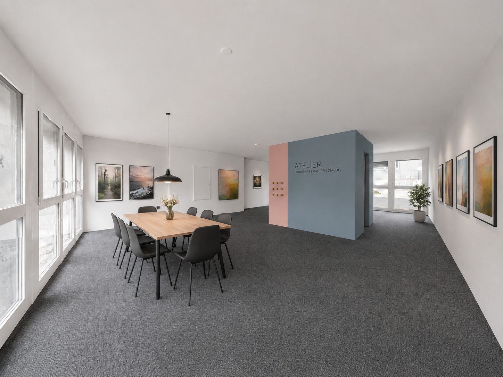
*`02.jpg` — 1448x1086 px*

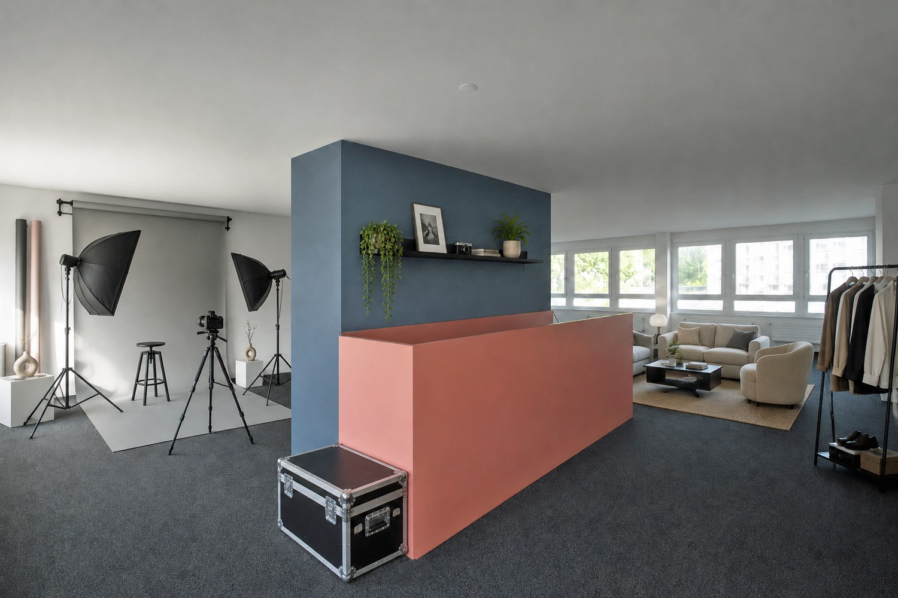
*`03.jpg` — 1500x1000 px*

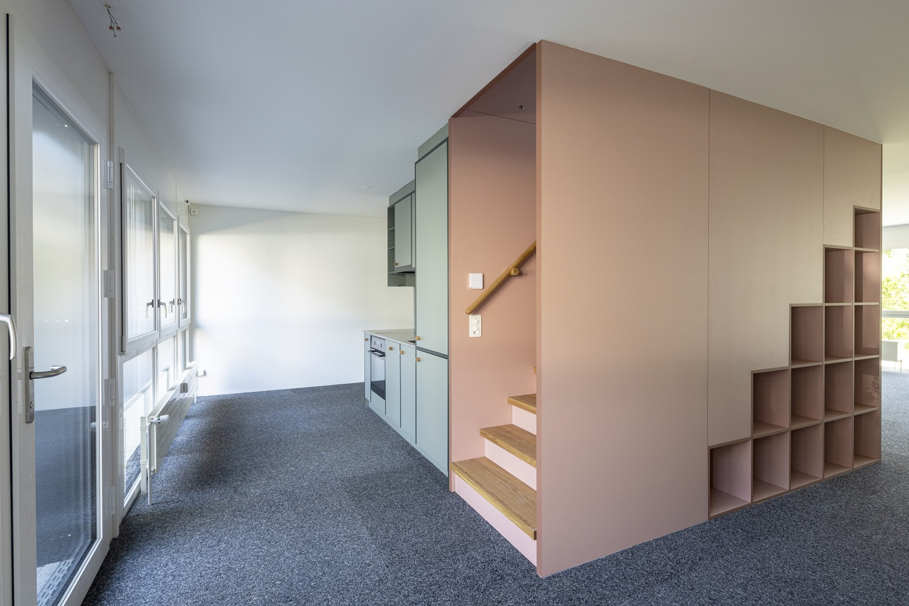
*`04.jpg` — 1500x1001 px*

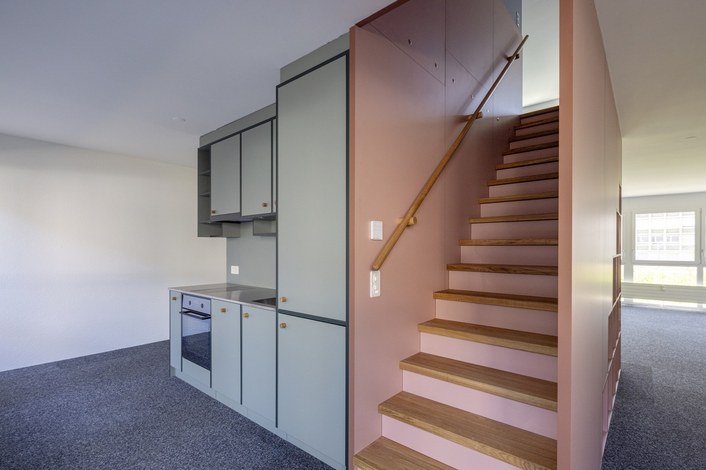
*`05.jpg` — 1500x1001 px*

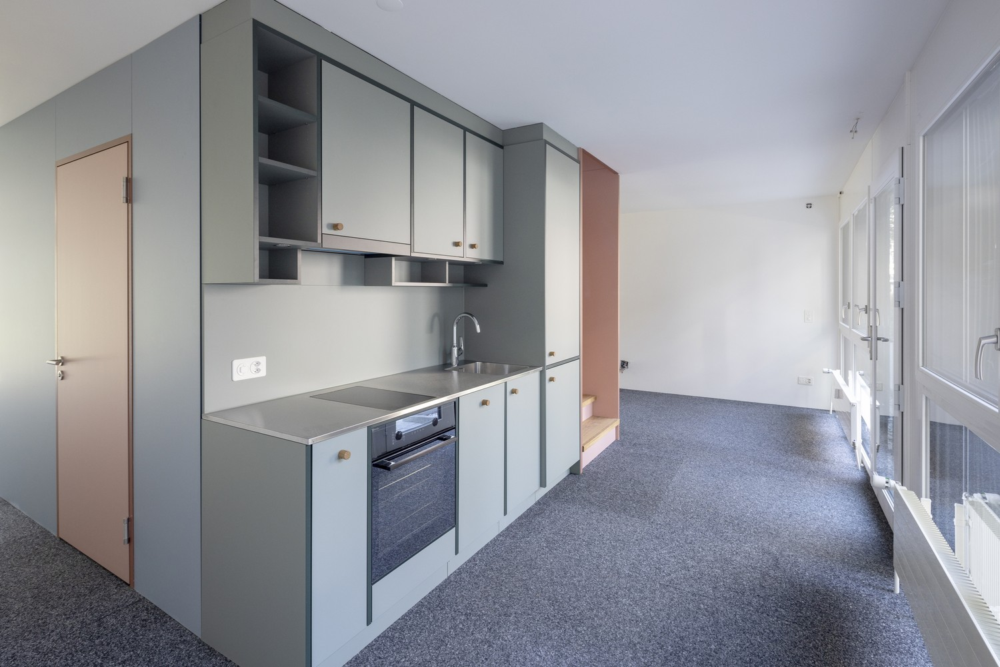
*`06.jpg` — 1500x1001 px*

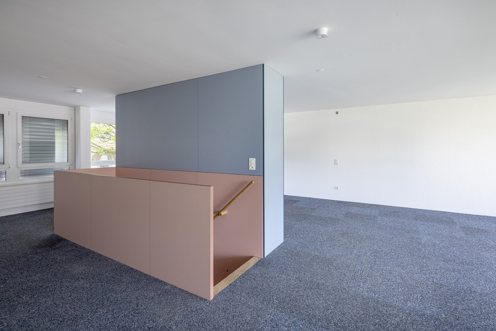
*`07.jpg` — 1500x1001 px*

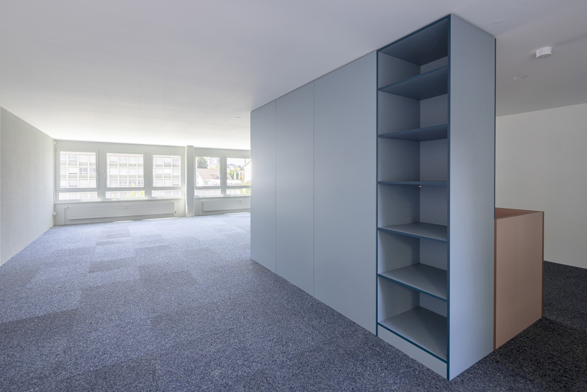
*`08.jpg` — 1500x1001 px*

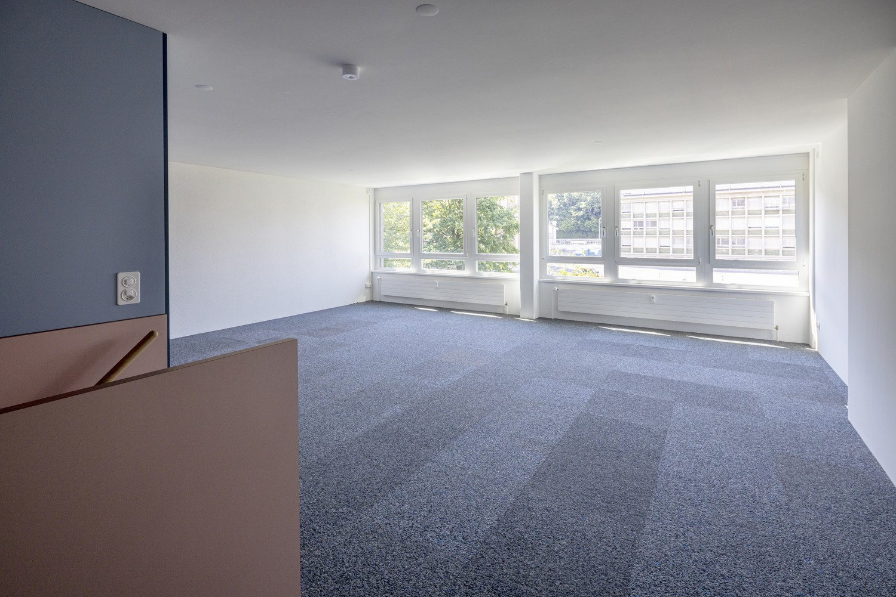
*`09.jpg` — 1500x1001 px*

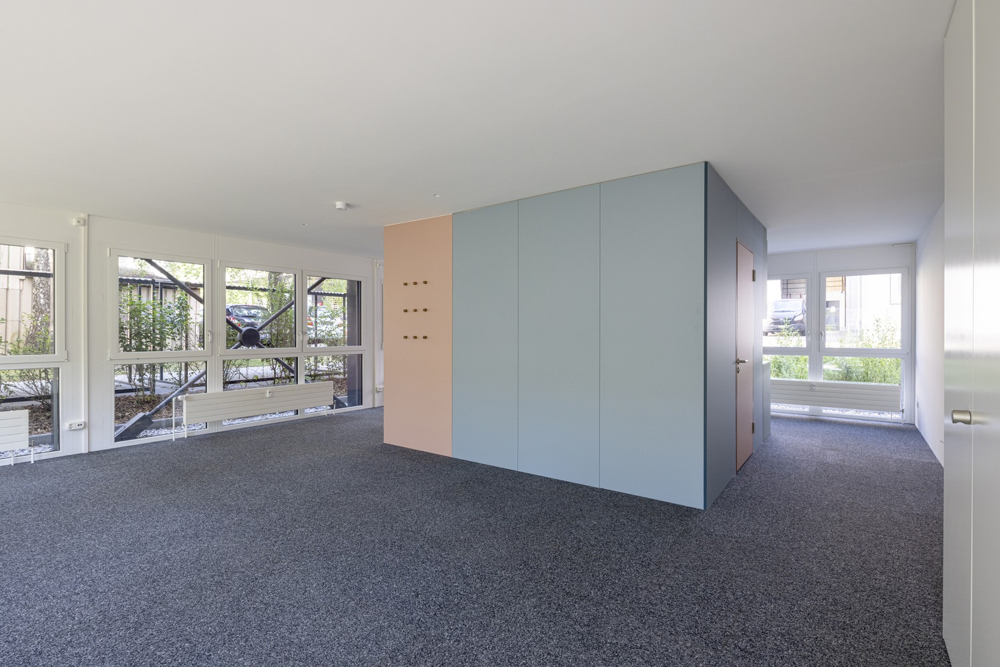
*`10.jpg` — 1500x1001 px*

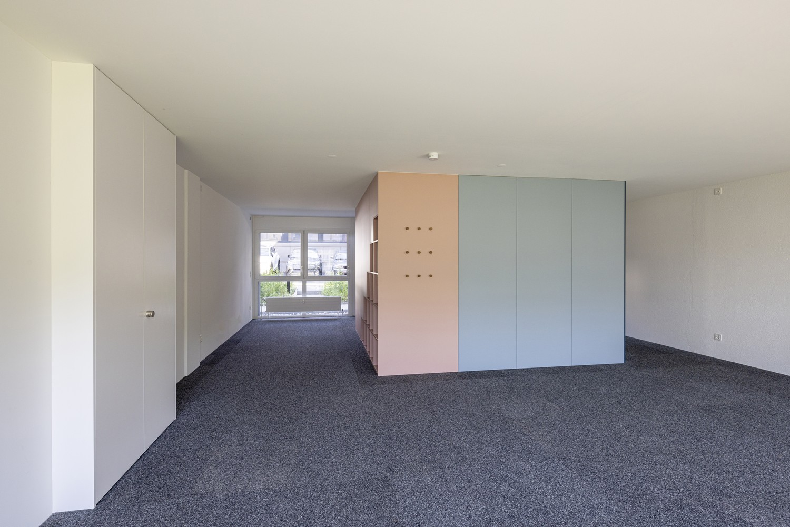
*`11.jpg` — 1500x1001 px*

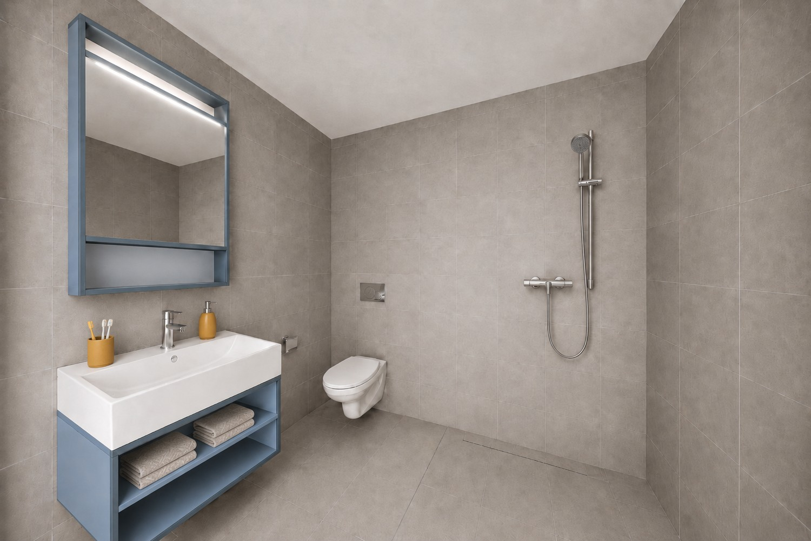
*`12.jpg` — 1500x1001 px*

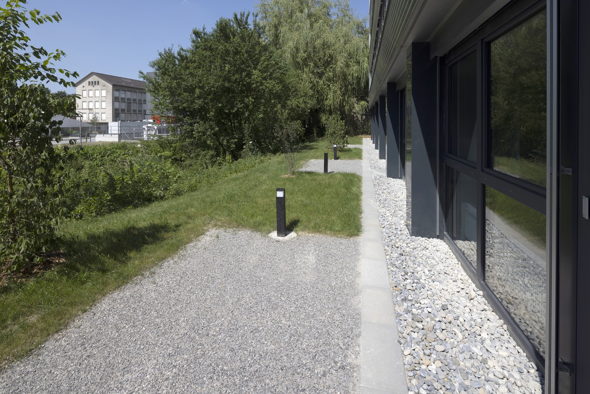
*`13.jpg` — 1500x1001 px*

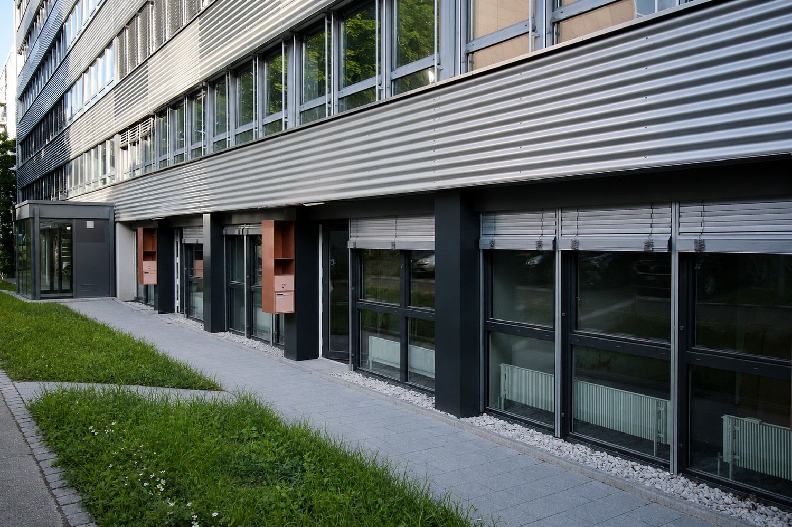
*`14.jpg` — 1500x998 px*

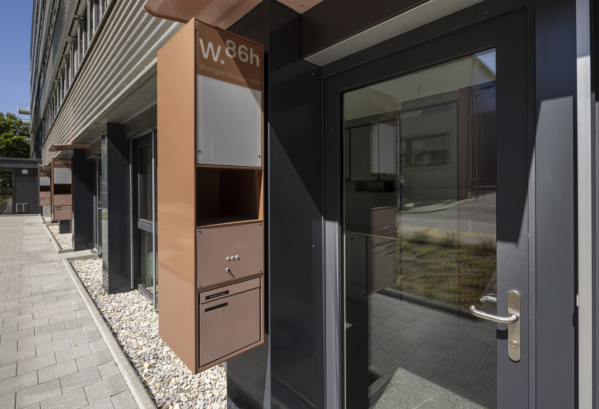
*`15.jpg` — 1500x1026 px*

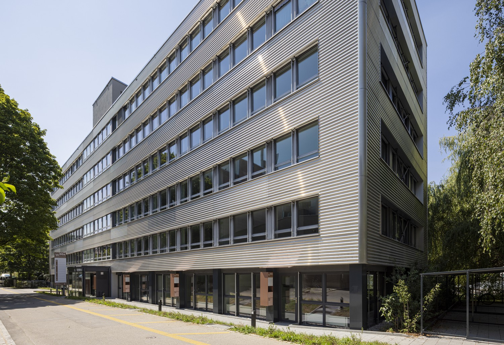
*`16.jpg` — 1500x1026 px*

## Media suplimentară

- **website_url:** https://www.w86a.ch/
