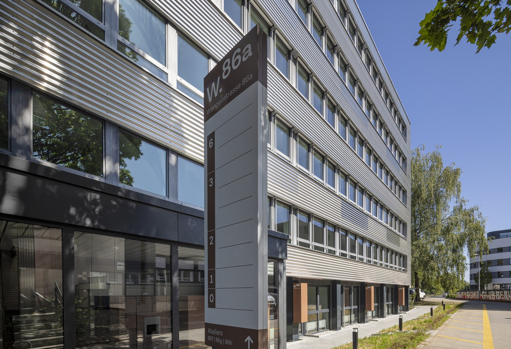
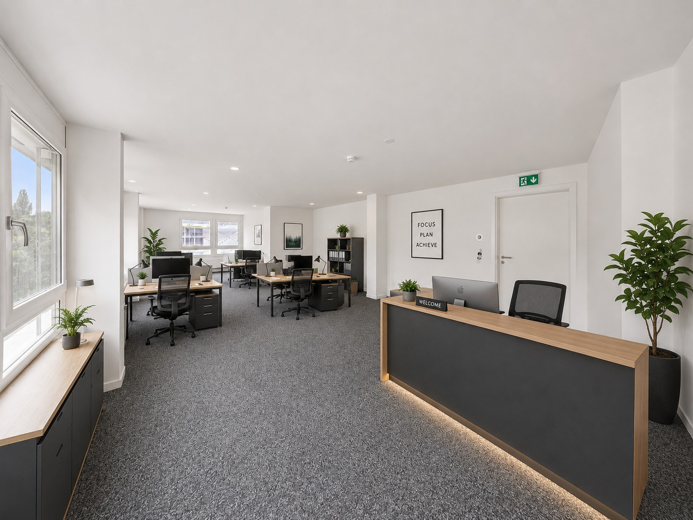
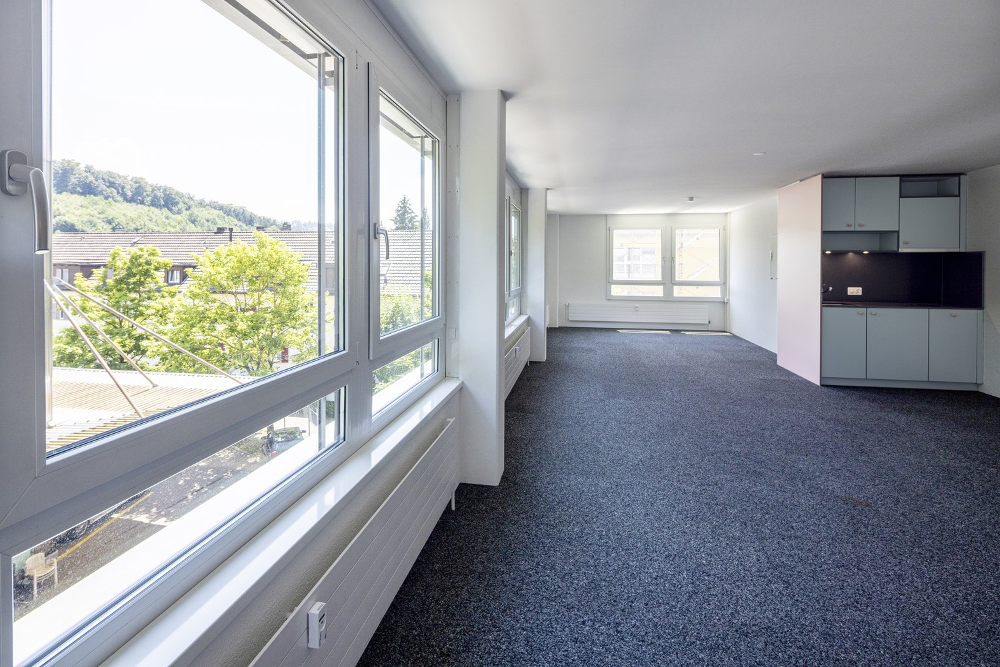
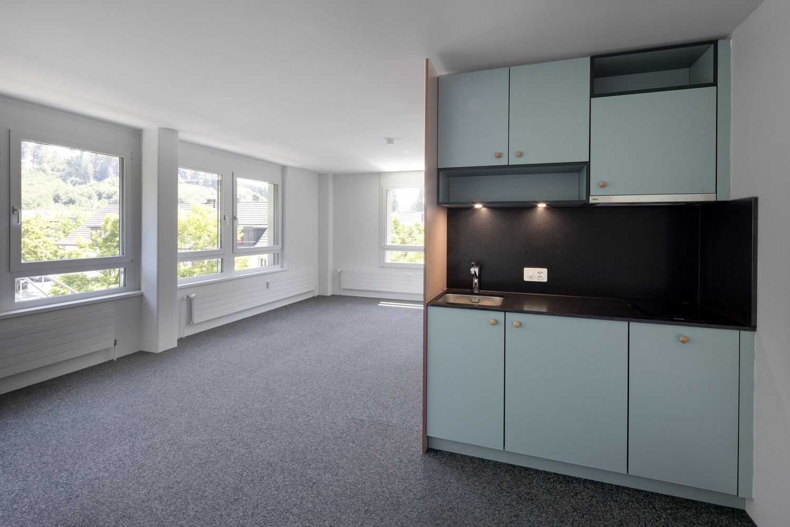
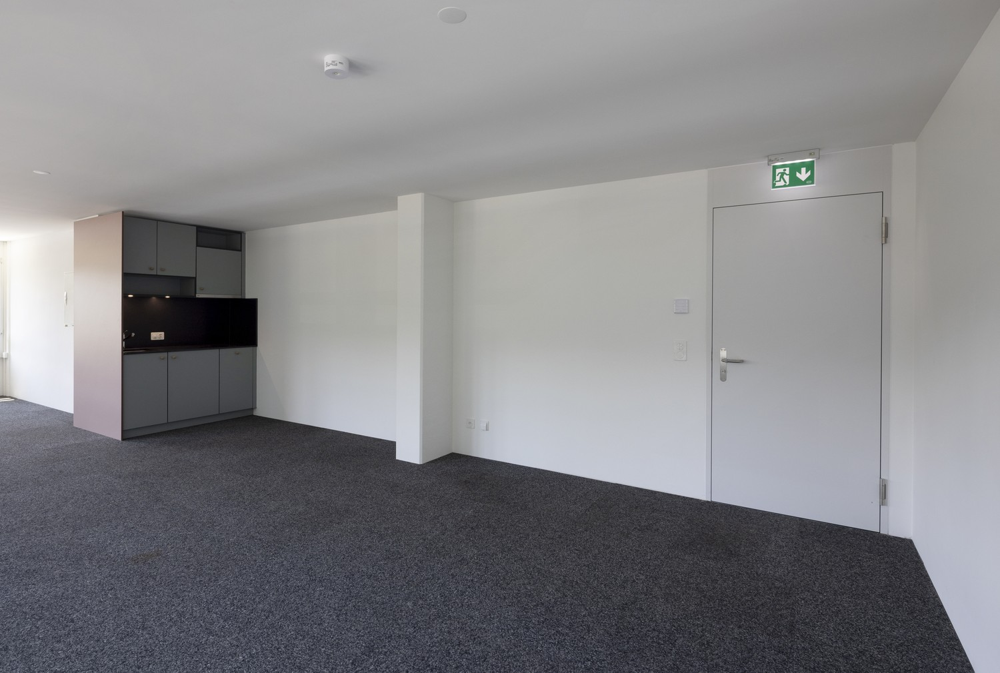
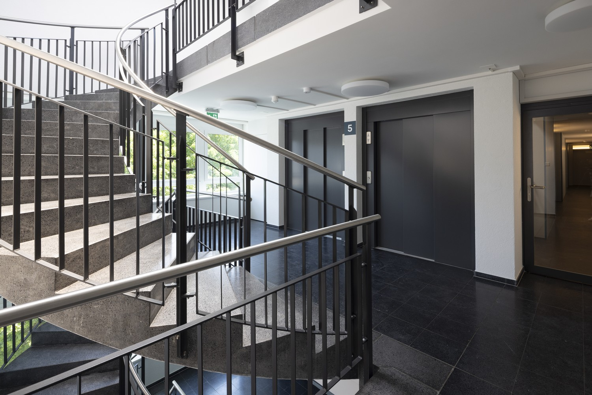
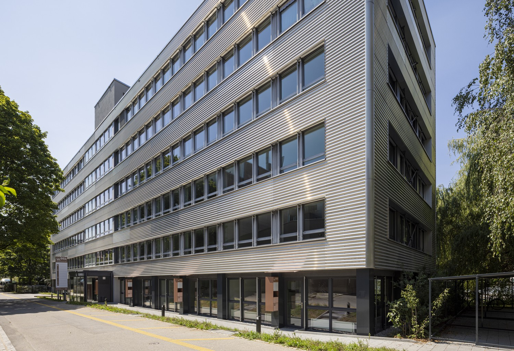

# Wangenstrasse 86a, 3018 Bern - CHF 816 inkl. NK pro Monat

> **Categorie:** `B_buero_gewerbe`  
> **Regiune:** Berna (oraș)  
> **Tip ofertă:** RENT / OFFICE  
> **Sursă:** [flatfox.ch](https://flatfox.ch/de/wohnung/wangenstrasse-86a-3018-bern/86098345/)  
> **Descărcat:** 2026-08-17 12:29

## Date obiect

| Câmp | Valoare |
|---|---|
| Adresă | Wangenstrasse 86a, 3018 Bern |
| Categorie obiect | INDUSTRY |
| Tip obiect | OFFICE |
| Nebenkosten | CHF 160 |
| Chirie brută | CHF 816 |
| Preț afișat | CHF 816 |
| Suprafață utilă | 49 m² |
| Etaj | 3 |
| An renovare | 2026 |
| Disponibil de la | imm |
| Referință | 37360.11.Büro (1) |

## Texte originale (germană)

**Titlu public:** Wangenstrasse 86a, 3018 Bern - CHF 816 inkl. NK pro Monat

**Titlu scurt:** 49m² Büro

**Pitch:** 49m² Büro in Bern mieten

**Titlu descriere:** Kompakt, flexibel und sofort nutzbar - Büro nahe Stadt Bern

**Titlu chirie:** 49m² Büro in Bern mieten

**Spațiu afișat:** 49

### Descriere completă

Sie suchen einen kompakten und modernen Arbeitsort für Ihr Unternehmen? Diese Bürofläche mit rund 49 m² bietet ideale Voraussetzungen für Start-ups, Freelancer, oder Ihr KMU.  
  
Die Fläche überzeugt durch einen funktionalen Grundriss, helle Räume dank grossen Fensterflächen, neue & bereits eingebaute Teppichbodenplatten (Doppelboden für IT-Verkabelung) und bietet vorbereitete Anschlüsse für den Einbau einer Teeküche. Die WC-Anlagen befinden sich auf der Etage und stehen zur Mitbenutzung mit 2 weiteren Büromietern zur Verfügung.  
  
**Highlights:**  

*   Helle, frisch sanierte Arbeitsräume
*   **Bezug:** ab sofort oder nach Vereinbarung
*   **Erreichbarkeit öV:** wenige Gehminuten vom Bahnhof Bümpliz Süd
*   **Erreichbarkeit Auto:** Autobahnanschluss Niederwangen in direkter Nähe
*   Einstellhallenplätze für CHF 140.–/Monat verfügbar

  
Interessiert? Besuchen Sie unsere Projetwebsite unter **https://w86a.ch/** und finden Sie viele weitere Informationen. Bei Fragen oder zur Vereinbarung eines Besichtigungstermins stehen wir sehr gerne zur Verfügung.  
  
_Alle Angaben sind unverbindlich. Änderungen bleiben bis zur Bauvollendung vorbehalten. Die Büros werden unmöbliert vermietet._

## Dotări (attributes)

- garage
- lift
- broadbandinternet

## Ofertant

- **Nume:** Privera AG
- **Stradă:** Worbstrasse 142
- **NPA:** 3073
- **Localitate:** Gümligen

## Imagini (10)

*`01.jpg` — 1500x1026 px*

*`02.jpg` — 1448x1086 px*

*`03.jpg` — 1500x1001 px*

*`04.jpg` — 1500x1001 px*

*`05.jpg` — 1500x1010 px*

*`06.jpg` — 1500x1001 px*

*`07.jpg` — 1500x1001 px*

*`08.jpg` — 1500x1001 px*

*`09.jpg` — 1500x995 px*

*`10.jpg` — 1500x1026 px*

## Media suplimentară

- **website_url:** https://www.w86a.ch/
